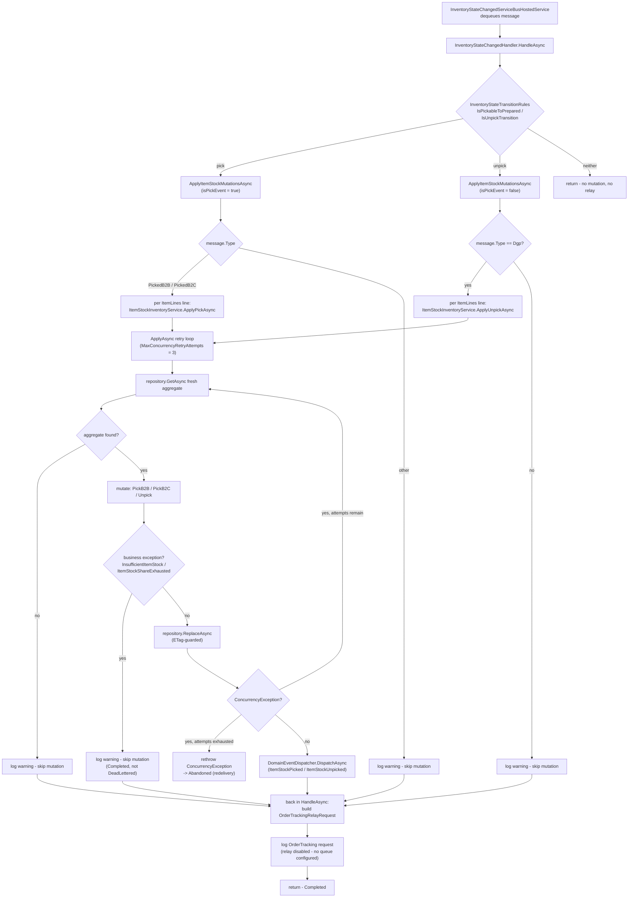

# InventoryStateChanged OrderTracking Relay

## What this is

`InventoryStateChangedHandler` (in
`src/Infrastructure/IIS.WMS.Consumer.Infrastructure/Messaging/ServiceBus/Handlers/`)
detects when an inbound `InventoryStateChangedEvent` represents a pick or an
unpick, and builds an `OrderTrackingRelayRequest` describing it. This is a
port of logic from the upstream Reflex facade's Azure Function trigger:

```
IIS.WMS.Reflex.FunctionApp/Triggers/InventoryStateChanged/InventoryStateChangedQueueTrigger.cs
```

## Flow diagram



## What was ported

- The pick/unpick detection: a state transition from `Available/Pickable` to
  `Available/Prepared` is a **pick**; `Available/Prepared` to either
  `Available/Held` **or** `Available/Pickable` is an **unpick** (widened to
  match Reflex's actual production behavior — see "Unpick rule widening"
  below).
- Building a request describing the transition (reference id, channel,
  fulfilment unit, order id/type/status, item lines) for downstream order
  tracking.
- The actual B2B/B2C allocated/prepared quantity mutation behind each
  transition — see "Pick/unpick inventory mutation" below. This was not
  ported when the relay-detection/request-building logic above was first
  added; it closes that gap.

## What was deliberately excluded

Reflex's trigger also calls `client.StartNewAsyncWithRetry` to kick off a
Durable Functions orchestrator (`InventoryStateChangedOrchestrator`), whose
Activity Triggers make outbound SAP/OMS/segmentation calls. None of that is
ported here — this service has no Durable Task engine, and the user's
instruction was explicit: port the pick/unpick + OrderTracking-request logic,
skip the Orchestrator/ActivityTrigger machinery.

## Why no new orchestration engine was introduced

This service's existing Kafka → Service Bus relay → scoped-handler pipeline
*is* the k8s-native equivalent of what Durable Functions gave Reflex:

| Durable Functions concern | This service's equivalent |
|---|---|
| Orchestrator replay history / durability | Service Bus queue + `MaxDeliveryCount` redelivery |
| Ordering guarantees | Service Bus sessions (`InventoryStateChangedServiceBusHostedService`) |
| Poison message handling | Dead-lettering (`ServiceBusConsumerHostedService<TMessage>`'s outcome mapping) |
| Scaling the work | KEDA `ScaledObject` scaling the Service Bus consumer Deployment on queue depth |

See `docs/ai/kubernetes-deployment-best-practices.instructions.md` for the
target 3-Deployment topology (Api / Kafka consumer / Service Bus consumer)
this pipeline runs under, and `docs/ai/integration-resiliency.instructions.md`
§2 for the exception-to-outcome mapping
(`Completed`/`Abandoned`/`DeadLettered`) that governs how
`InventoryStateChangedHandler.HandleAsync` must behave — no exception means
`Completed`, so the OrderTracking logic here never throws for a business
condition, only logs.

## Enum mapping (Reflex → this service)

| Reflex | This service |
|---|---|
| `State.AVAILABLE` | `InventoryEventStockState.Available` |
| `Status.PICKABLE` | `InventoryEventStockStatus.Pickable` |
| `Status.PREPARED` | `InventoryEventStockStatus.Prepared` |
| `Status.HELD` | `InventoryEventStockStatus.Held` |
| `InventoryChangeType.PICKEDB2C` | `InventoryEventChangeType.PickedB2C` |

The shared transition rule lives in
`src/Infrastructure/IIS.WMS.Consumer.Infrastructure/Messaging/InventoryStateTransitionRules.cs`
and is used both by `InventoryStateChangedHandler` (this relay) and by
`InventoryStateChangedConsumerHostedService.GetOrderArchiveKey` (an unrelated
OrderArchive audit categorization that happens to use the same transition
rule) — the two are different concerns, cross-referenced rather than merged.

## Unpick rule widening

`InventoryStateTransitionRules.IsPreparedToHeld` was renamed to
`IsUnpickTransition` and widened to also match `Available/Prepared` →
`Available/Pickable`, in addition to the original `Available/Prepared` →
`Available/Held`. Reflex's own `InventoryUnpickEventHandler` treats both as
an unpick (a `DGP` reversal can land stock back in either status depending on
the caller), so the original single-transition rule here was a gap relative
to production behavior, not an intentional narrowing. Both call sites
(`InventoryStateChangedHandler` and
`InventoryStateChangedConsumerHostedService.GetOrderArchiveKey`) pick up the
widened rule automatically since they share it.

## Pick/unpick inventory mutation

`InventoryStateChangedHandler.HandleAsync` now applies the actual B2B/B2C
allocated/prepared quantity mutation for each `message.ItemLines` entry,
ported from Reflex's `InventoryPickEventHandler`/`InventoryUnpickEventHandler`
(via its orchestrator's per-item-line loop), before building the
OrderTracking relay request below it:

- **Pick** (`IsPickableToPrepared`): dispatches on `message.Type` —
  `PickedB2B`/`PickedB2C` — to
  `IItemStockInventoryService.ApplyPickAsync(fulfilmentId, itemCode, coo,
  hallmark, channel, quantity, ct)`. Any other `Type` on a pick transition is
  logged and skipped (mirrors Reflex's "unsupported type" reject).
- **Unpick** (`IsUnpickTransition`): only dispatches when `message.Type ==
  InventoryEventChangeType.Dgp` (mirrors Reflex's `InventoryChangeType.DGP`
  guard) to `IItemStockInventoryService.ApplyUnpickAsync(fulfilmentId,
  itemCode, coo, hallmark, quantity, ct)`. Any other `Type` is logged and
  skipped ("Invalid Type" reject in Reflex).

The mutation rules themselves live in the `ItemStockInventory` aggregate
(`src/Domain/IIS.WMS.Consumer.Domain/Aggregates/ItemStockInventory.cs`):

- `PickB2B` moves quantity from allocated to prepared, clamping allocated to
  zero and flagging `WasClamped` on the raised `ItemStockPicked` event rather
  than rejecting — Reflex logs a warning and continues here, this is
  tolerated data drift, not an invariant violation.
- `PickB2C` moves quantity into prepared, then decrements allocated if
  enough is available. A non-extended oversell throws
  `InsufficientItemStockException` (a real invariant violation). An extended
  oversell (`IsExtended == true`) instead borrows the shortfall from
  `B2BUsedShare`, throwing `ItemStockShareExhaustedException` if that would
  also go negative.
- `Unpick` moves quantity out of `B2BPrepared`, rejecting (not clamping) with
  `InsufficientItemStockException` when nothing is prepared — an unpick with
  no prior pick is a genuine invariant violation, not tolerable drift.

`IItemStockInventoryService` (`src/Application/IIS.WMS.Consumer.Application/InventoryEvents/`)
orchestrates persistence around the aggregate using the canonical
re-read-and-reapply retry loop from
`docs/ai/integration-resiliency.instructions.md` §2 (`MaxConcurrencyRetryAttempts
= 3`: re-`GetAsync` fresh state, reapply the mutation, `ReplaceAsync` guarded
by `ETag`, catch `ConcurrencyException` and retry, rethrow once exhausted).
This is the actual fix for the reported "PreCondition failed" (412 ETag
conflict) issue: before this change, nothing wrote to `ItemStockInventory`
data at all, so there was no retry loop to have a bug in — the 412s were
symptomatic of a missing read-modify-write pattern, not a bug in an existing
one. `ItemStockInventoryConcurrencyTests` (integration tests project) proves
this end to end against the real `CosmosRepository`/`InMemoryCosmosContainer`
translation path — not just a mocked repository throwing
`ConcurrencyException` directly, which only the narrower Application-layer
unit tests do — by forcing a real `CosmosException(412)` via
`InMemoryCosmosContainer.ForceNextConflict` and asserting the retry loop
re-reads and reapplies successfully. Domain-level business exceptions
(`InsufficientItemStockException`/`ItemStockShareExhaustedException`) are
caught and logged as warnings by the service, not rethrown, so the Service
Bus outcome mapping treats them as `Completed` rather than `DeadLettered` —
they are expected, tolerable business conditions, mirroring Reflex's own
`ExceptionBypassedAtIIS`-tagged logging. A genuine `ConcurrencyException`
after retries are exhausted is allowed to propagate so the existing
`Abandoned` mapping (redelivery) still applies.

Domain events (`ItemStockPicked`/`ItemStockUnpicked`) are dispatched via the
existing `IDomainEventDispatcher` after a successful `ReplaceAsync`, from the
original mutated aggregate instance (the one that raised them) — not from
`ReplaceAsync`'s return value, which is a freshly rehydrated instance with no
events attached.

### Per-fulfilment-code containers, resolved per call

Reflex's own `ItemStockInventory` persistence uses a per-fulfilment-code
multi-container scheme (`containerNameSuffix`) supporting several legacy
facades sharing one Cosmos account. This service reinstates that scheme:
`ItemStockInventoryRepository` resolves a distinct container per fulfilment
code — `ItemStockInventoryEDC`, `ItemStockInventoryTDC`, `ItemStockInventoryADC`,
`ItemStockInventoryCAECOM`, `ItemStockInventoryBRZ3PL` — rather than one
shared container, so each fulfilment location's stock lives in its own
partition space instead of being commingled by convention alone. `Id` still
doubles as the Cosmos partition key within each container
(`$"{FulfilmentId}:{ItemCode}:{Hallmark}:{CountryOfOrigin}".ToUpperInvariant()`),
per `docs/ai/cosmos-db.instructions.md`, so point reads stay partition-local.

Unlike the other five repositories in this service, which resolve one
container once at construction, `ItemStockInventoryRepository` overrides
`CosmosRepository<TDomain,TDocument>.ResolveContainerName(string? category)`
to resolve a container fresh on every call, deriving the fulfilment code from
`category` (always `ItemStockInventory.Id`, whose first `:`-delimited segment
is the fulfilment code). The allow-list of valid codes is the
`CosmosContainerNames.ItemStockInventorySuffix` enum; an unrecognized code
throws `ArgumentException` from `CosmosContainerNames.GetItemStockInventoryContainerName`,
and a call with no category at all (a cross-partition scan attempt) throws
`NotSupportedException` — this repository has no single container to fall
back to for such a scan. One `ItemStockInventoryRepository` instance
transparently serves all five containers; nothing in
`ItemStockInventoryService`, `IItemStockInventoryRepository`, or
`InventoryStateChangedHandler` needs to know which container backs a given
call. The `AllowedContainers` field from the old (broken) repository code was
dead and has been removed.

### What was deliberately excluded: B2C extension/segmentation recalculation

Reflex's `IsExtended` branch (both pick and unpick) does two things: (1)
arithmetic on the aggregate's own `B2BUsedShare` field to borrow against a
B2C oversell, and (2) a subsequent call to `CalculateB2CExtensionAsync` to
recalculate `B2CExtended`/`B2CAVL` and emit an OMS delta. Only (2) is
excluded here — it depends on `IItemLevelSegmentationRepository`/
`IFulfilmentLevelSegmentationRepository`, neither of which exists in this
repo. (1), the B2BUsedShare borrow arithmetic, is self-contained (no external
dependency) and **is** ported faithfully in `ItemStockInventory.PickB2C`. A
`TODO(ai)` in `InventoryStateChangedHandler.ApplyItemStockMutationsAsync`
marks where the excluded recalculation would be wired in if the missing
segmentation repositories are ever added.

## Current relay behavior: log-only

No OrderTracking Service Bus queue is configured anywhere in this repo today
(no `ServiceBus:*` config entry, no consumer). This mirrors Reflex's own
current state: its send is commented out and replaced with a warning log
("Order Tracking Orchestrator is disabled..."). `InventoryStateChangedHandler`
does the same — it builds the `OrderTrackingRelayRequest` and logs it, but
does not publish anywhere. A `TODO(ai)` marks the exact spot a real publish
would go.

Wiring a real relay later requires:

1. A queue name added to `ServiceBus:*` configuration (following the pattern
   `InventoryStateChangedServiceBusConsumerOptions`/`appsettings.json`
   already use).
2. Serializing `OrderTrackingRelayRequest` to JSON and building a
   `ServiceBusRelayMessage` (`src/Application/IIS.WMS.Consumer.Application/Common/ServiceBusRelayMessage.cs`).
3. Calling `IServiceBusRelayPublisher.PublishAsync` (already available via DI
   - no new dependency needed).

## Fixed: `ServiceBus:QueueName` mismatch

Base `appsettings.json` configured `ServiceBus:QueueName` as
`"test-cust-sync"`, while `InventoryStateChangedKafkaRelay` (the Kafka →
Service Bus relay) actually publishes each `InventoryStateChangedEvent` to
`"inventory-state-changed"`. This meant `InventoryStateChangedServiceBusHostedService`
was consuming from the wrong queue in any environment that inherited the base
setting without an override — pick/unpick messages would never reach
`InventoryStateChangedHandler` at all, silently. This is unrelated to the 412
issue itself but was found while tracing the message path end-to-end for
this work, and was fixed with explicit sign-off (not silently) since it's a
production-affecting config change:

- `appsettings.json` (line 62): `ServiceBus:QueueName` changed from
  `"test-cust-sync"` to `"inventory-state-changed"`.
- `k8s/kafka-consumer/configmap.yaml` (lines 71-77): same value corrected,
  with a comment explaining why it must match the relay's publish target.

## Follow-up gap: no message-level idempotency check

`IItemStockInventoryService`'s retry loop (see "Pick/unpick inventory
mutation" above) protects against *concurrent* writes (ETag conflicts) but
not against the *same* Service Bus message being redelivered and reapplying
its mutation a second time — e.g. after a consumer crash between a
successful `ReplaceAsync` and the message being completed, `MaxDeliveryCount`
redelivery will re-run the full pick/unpick mutation against
already-updated state. Reflex has no equivalent check either (its
Durable Functions orchestrator relies on instance-id-based dedup, which has
no analogue here), so this is a pre-existing gap being carried forward, not
a regression introduced by this work. `InventoryEventPipelineTests.cs`
deliberately does not test redelivery as a correctness guarantee — see its
`TODO(ai)` remarks — because asserting either "double-apply is fine" or "it's
deduped" would lock in behavior the code doesn't actually provide. A real
fix would need a per-message dedup key (e.g. a processed-message-id set or
outbox pattern) and is flagged here as a follow-up, not implemented as part
of this change.

## `InventoryEventPipelineTests.cs` rewrite

The integration test in
`tests/IntegrationTests/IIS.WMS.Consumer.IntegrationTests/InventoryEventPipelineTests.cs`
was rewritten to stop asserting a Create/Reserve round-trip through
`InventoryStateChangedServiceBusHostedService`/`InventoryStateChangedHandler`
— see "Scope decision: dropped `Create`/`Reserve` dispatch" below for why
that dispatch was removed from the handler itself. The rewritten test now
covers exactly what this pipeline actually does: a pick message mutating
`ItemStockInventory` via `IItemStockInventoryService`, an unpick message
doing the same, and a forced Cosmos `412 PreconditionFailed` on the pick's
`ReplaceAsync` proving the re-read-and-reapply retry loop recovers and
completes the message successfully. The old Create/Reserve JSON pipeline has
no Service Bus consumer registered anywhere in this service's DI graph today
— it would need a new, separately-designed consumer if that flow is ever
required, which is a separate open follow-up, not something this test suite
can exercise until that consumer exists.

## Scope decision: dropped `Create`/`Reserve` dispatch

Before this change, `InventoryStateChangedHandler` (broken, pre-refactor)
dispatched to `IInventoryEventService.CreateAsync`/`ReserveStockAsync` based
on an `EventType` field that doesn't exist on `InventoryStateChangedEvent`.
There is no equivalent in the Reflex reference file, and no unambiguous
mapping from this event's fields to `CreateInventoryEventRequest`/
`ReserveStockRequest` (which need `WarehouseId`/`Sku`/`Quantity` — concepts
this state-transition event doesn't carry). Rather than guess a mapping, this
dispatch was removed. Flagged here for review since it's a behavior change
from the code that was on disk (already broken/non-compiling), not something
either reference file confirms one way or the other.
