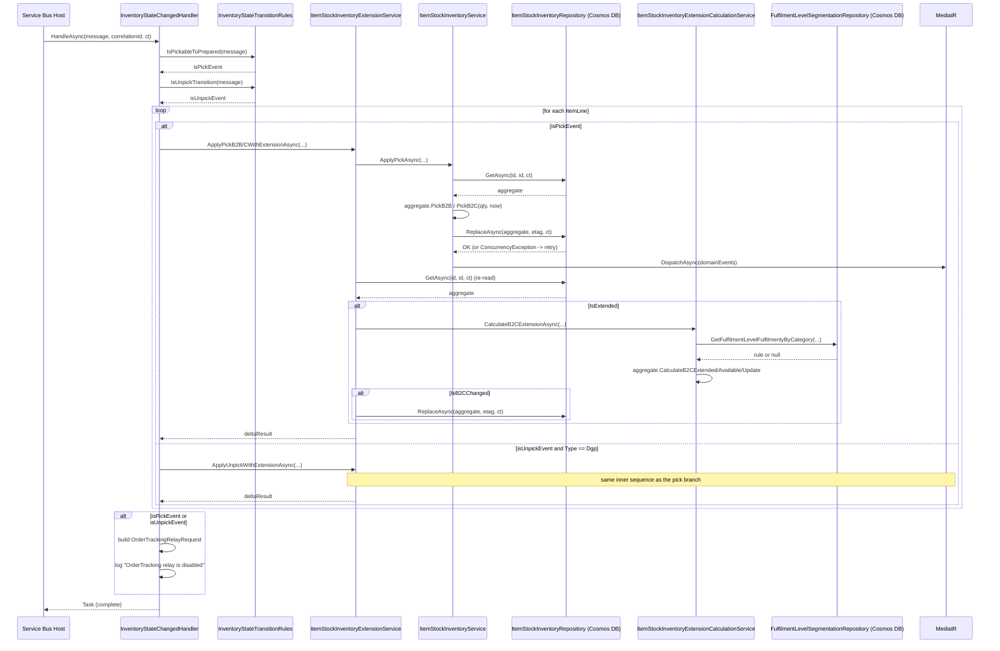
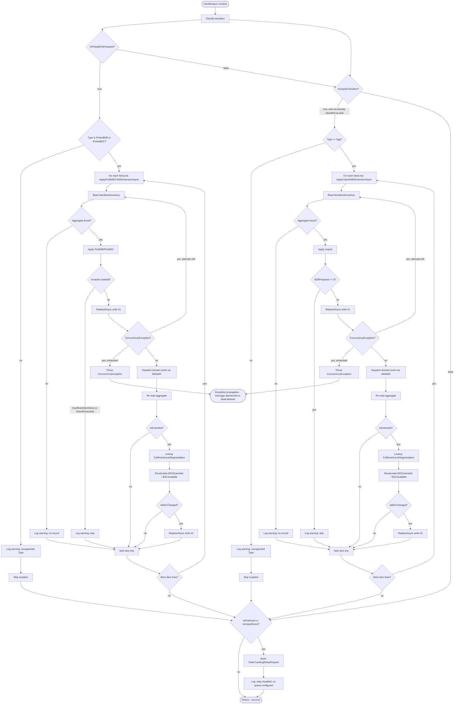

# `InventoryStateChangedHandler` — Technical Documentation

> Scope note: this document describes **only what is implemented in this
> repository today** —
> `src/Infrastructure/IIS.WMS.Consumer.Infrastructure/Messaging/Events/InventoryStateChanged/Handlers/InventoryStateChangedHandler.cs`
> and its direct collaborators. It intentionally does **not** restate
> `docs/InventoryStateChangedFullQueueTrigger.md`, which documents the
> upstream Reflex facade's `InventoryStateChangedQueueTrigger` Azure Function
> (Durable Functions orchestrator, SAP/OMS/Nexus Producer sync, ICR
> snapshots, fulfilment/item-level segmentation dispatch). This service is a
> deliberately narrower port of that trigger's pick/unpick mutation logic —
> every place where behavior was **not** ported is called out explicitly in
> [§17 Assumptions](#17-assumptions) and [§18 Known Limitations](#18-known-limitations)
> rather than invented.

---

## 1. Overview

### Purpose

`InventoryStateChangedHandler` applies one relayed `InventoryStateChanged`
inventory event to this service's `ItemStockInventory` Cosmos DB aggregate.
It:

1. Classifies the event's `FromState`/`ToState` transition as a **pick**, an
   **unpick**, or neither.
2. For a pick/unpick, mutates the B2B/B2C allocated/prepared quantities for
   every item line in the event, via `IItemStockInventoryExtensionService`.
3. Builds an `OrderTrackingRelayRequest` for a pick/unpick transition and
   logs it (the actual Service Bus send is not yet wired — see
   [§18](#18-known-limitations)).

### Business objective

Keep this service's own view of B2B/B2C stock allocation in sync with
warehouse-management state changes (e.g. SAP/WMS pick and un-pick events),
so downstream consumers of `ItemStockInventory` (REST API, future
OrderTracking relay) see current, correct allocation/prepared quantities
without over-allocating stock that has already been picked for a different
channel.

### Scope

In scope:
- Pick/unpick transition classification (`InventoryStateTransitionRules`).
- B2B pick, B2C pick (with B2C-extension borrowing), and unpick mutation of
  `ItemStockInventory`.
- B2C extension quantity recalculation for extension-enabled records.
- Construction and logging (not yet publishing) of an OrderTracking relay
  request.

Out of scope (present in the upstream Reflex trigger, **not** ported here):
SAP synchronization, OMS Producer publish, Nexus Producer publish, ICR
snapshot writes, item/fulfilment-level segmentation *dispatch* (the
segmentation *lookup* used for B2C extension leverage **is** ported — see
[§3](#3-detailed-business-logic)), Durable Functions orchestration/activity
triggers.

### High-level architecture

```
Kafka (Avro, Schema Registry)
  └─ InventoryStateChangedConsumerHostedService   (Kafka:InventoryStateChanged)
       └─ maps Avro → InventoryStateChangedEvent (hand-written mapper)
       └─ validates (InventoryStateChangedEventValidator)
       └─ relays onto Azure Service Bus
            └─ InventoryStateChangedServiceBusHostedService (ServiceBus:InventoryStateChanged)
                 └─ resolves IInventoryStateChangedHandler from a DI scope
                      └─ InventoryStateChangedHandler.HandleAsync   ◄── this document
                           ├─ InventoryStateTransitionRules (pick/unpick classification)
                           ├─ IItemStockInventoryExtensionService (pick/unpick + extension)
                           │    ├─ IItemStockInventoryService (aggregate mutate + retry + dispatch)
                           │    │    └─ IItemStockInventoryRepository (Cosmos DB, ETag concurrency)
                           │    │    └─ IDomainEventDispatcher (MediatR Publish)
                           │    └─ IItemStockInventoryExtensionCalculationService
                           │         └─ IFulfilmentLevelSegmentationRepository (Cosmos DB, read-only)
                           └─ OrderTrackingRelayRequest (built, logged only — not sent)
```

This service's durability/retry mechanism for the Kafka→Service Bus hop is
the relay pipeline itself, running as its own KEDA-scaled AKS Deployment
(`kubernetes-deployment-best-practices.instructions.md`) — there is no
Durable Task engine in this service, unlike the upstream Reflex facade.

### Assumptions

- The Service Bus message this handler ultimately processes has already
  passed `InventoryStateChangedEventValidator` upstream (at the Kafka
  consumer), so `HandleAsync` performs no further business-rule validation
  of its own beyond pick/unpick classification.
- The `ItemStockInventory` record for a given fulfilment/item/hallmark/COO
  combination already exists (bulk-imported) before any pick/unpick event
  arrives; if it doesn't, the mutation is skipped with a warning log (no
  record is created here — see `ItemStockInventoryService.ApplyAsync`).

### Dependencies

| Dependency | Role |
|---|---|
| `IItemStockInventoryExtensionService` | Applies pick/unpick + B2C extension recalculation |
| `ILogger<InventoryStateChangedHandler>` | Structured logging |
| `IItemStockInventoryService` (transitive) | Aggregate mutate/retry/dispatch |
| `IItemStockInventoryRepository` (transitive) | Cosmos DB access |
| `IItemStockInventoryExtensionCalculationService` (transitive) | B2C extension formula |
| `IFulfilmentLevelSegmentationRepository` (transitive) | Store leverage % lookup |
| `IDomainEventDispatcher` / MediatR (transitive) | Domain event publish |
| `TimeProvider` (transitive) | Testable UTC clock for `ModifiedUtc` |

---

## 2. End-to-End Flow

1. **Request initiation** — `InventoryStateChangedServiceBusHostedService`
   (a `ServiceBusSessionProcessor`-based host) receives a Service Bus
   message on the `ServiceBus:InventoryStateChanged` queue, resolves a
   fresh DI scope, gets `IInventoryStateChangedHandler`, and calls
   `HandleAsync(message, correlationId, cancellationToken)`.
2. **Input validation** — Already performed upstream by
   `InventoryStateChangedEventValidator` at the Kafka-consumer stage before
   the message was ever relayed to Service Bus; not repeated in this
   handler.
3. **Service layer execution / business logic**:
   a. `InventoryStateTransitionRules.IsPickableToPrepared(message)` →
      `isPickEvent`.
   b. `InventoryStateTransitionRules.IsUnpickTransition(message)` →
      `isUnpickEvent`.
   c. `ApplyItemStockMutationsAsync(message, isPickEvent, correlationId, ct)`
      is always called (regardless of whether either flag is true — see
      [Decision Tree](#10-decision-tree)).
   d. Inside, for a pick: requires `Type` to be `PickedB2B` or `PickedB2C`
      (else logs a warning and returns without mutating). For each item
      line, calls `ApplyPickB2BWithExtensionAsync` or
      `ApplyPickB2CWithExtensionAsync`.
   e. For an unpick: requires `Type == Dgp` (else logs a warning and
      returns without mutating). For each item line, calls
      `ApplyUnpickWithExtensionAsync`.
   f. If the transition is neither pick nor unpick, `HandleAsync` returns
      immediately after this call — no OrderTracking request is built.
4. **Database interactions** — Each `ApplyXWithExtensionAsync` call:
   - Re-reads the `ItemStockInventory` aggregate (Cosmos DB point read).
   - Applies the domain mutation (`PickB2B`/`PickB2C`/`Unpick`).
   - Writes back via `ReplaceAsync` (ETag-guarded).
   - If `IsExtended`, re-reads the aggregate again, recalculates B2C
     extension, and — only if the recalculated value changed — writes back
     again via a second `ReplaceAsync`.
5. **External API calls** — None directly in this handler; Cosmos DB and
   Service Bus are Azure SDK calls, not external HTTP APIs.
6. **Cache usage** — None. Every read is a live Cosmos DB point read.
7. **Event/message queue interactions** — Domain events
   (`ItemStockPicked`/`ItemStockUnpicked`) are published via MediatR inside
   `ItemStockInventoryService.ApplyAsync`, once per successful mutation.
   The OrderTracking relay request is built but only logged — no queue
   publish occurs (see [§18](#18-known-limitations)).
8. **Response generation** — `HandleAsync` returns `Task` (no response
   payload); the caller (`InventoryStateChangedServiceBusHostedService`)
   treats a normal return as success and completes the Service Bus
   message.
9. **Error handling** — See [§11](#11-error-handling) in detail. Domain
   invariant violations (`InsufficientItemStockException`,
   `ItemStockShareExhaustedException`) are caught and logged as warnings
   inside `ItemStockInventoryService.ApplyAsync` — they do not propagate to
   the handler or the Service Bus host. `ConcurrencyException` triggers an
   internal retry (see next point); if retries are exhausted, it propagates
   up to the Service Bus host, which abandons the message for redelivery.
10. **Retry mechanism** — `ItemStockInventoryService.ApplyAsync` retries up
    to 3 times (`MaxConcurrencyRetryAttempts`), re-reading the aggregate
    fresh on each attempt, only on `ConcurrencyException`.
11. **Logging** — Structured logs at Debug (dispatch counts), Information
    (successful mutation, OMS delta, extension recalculation, OrderTracking
    relay "would have sent"), and Warning (unsupported `Type`, missing
    record, tolerated invariant violation, concurrency conflict retry)
    levels throughout.
12. **Monitoring** — No custom metrics are emitted by this handler; standard
    Service Bus processor and Cosmos DB SDK telemetry apply. Every log line
    includes an inventory record id / `ReferenceId` and the caller-supplied
    `correlationId`.

---

## 3. Detailed Business Logic

### 3.1 Pick classification (`IsPickableToPrepared`)

- **Why it exists**: identifies a WMS event where stock moved from
  "reservable" to "physically picked/staged" — the point at which the
  service must debit the allocated pool and credit the prepared pool.
- **Inputs**: `message.FromState`, `message.ToState` (each a
  `(State, Status)` pair).
- **Processing**: `FromState == (Available, Pickable)` **and**
  `ToState == (Available, Prepared)`.
- **Decision point**: exact match on both sides; any other combination is
  not a pick.
- **Outputs**: `bool`.
- **Edge cases**: a transition where only one side matches (e.g.
  `Blocked/Pickable → Available/Prepared`) is **not** a pick — both `State`
  values must be `Available`.

### 3.2 Unpick classification (`IsUnpickTransition`)

- **Why it exists**: identifies a WMS reversal of a prior pick (e.g. an
  operator un-picks an item back into stock).
- **Inputs**: same as above.
- **Processing**: `FromState == (Available, Prepared)` **and**
  (`ToState == (Available, Held)` **or** `ToState == (Available, Pickable)`).
  This is intentionally wider than a single Held-only target — it mirrors
  the upstream Reflex `InventoryStateChangedOrchestrator`'s actual
  production rule (`Prepared→Held || Prepared→Pickable`), per the code
  comment on `InventoryStateTransitionRules.IsUnpickTransition`.
- **Outputs**: `bool`.
- **Edge cases**: `Available/Prepared → Blocked/Held` is **not** classified
  as an unpick (the `State` side must stay `Available`).

### 3.3 Pick dispatch by `Type` (`ApplyItemStockMutationsAsync`, pick branch)

- **Why it exists**: a pick can originate from either a B2B or a B2C sales
  channel, each with different domain mutation semantics.
- **Inputs**: `message.Type`, `message.ItemLines`.
- **Processing / Decision points**:
  - `Type == PickedB2B` → `IItemStockInventoryExtensionService.ApplyPickB2BWithExtensionAsync` per item line.
  - `Type == PickedB2C` → `IItemStockInventoryExtensionService.ApplyPickB2CWithExtensionAsync` per item line.
  - Any other `Type` on a pick-classified transition → logs a **warning**
    ("unsupported Type — skipping stock mutation") and returns; **no**
    mutation is attempted for any item line.
- **Outputs**: none (side effects only); each call returns an
  `ItemStockInventoryDeltaResult` used only for logging.
- **Failure scenarios**: an unsupported `Type` silently (from the caller's
  perspective — only logged) skips mutation rather than throwing; this
  matches the Reflex "Invalid Type" reject.

### 3.4 Unpick dispatch by `Type` (`ApplyItemStockMutationsAsync`, unpick branch)

- **Processing**: only `Type == Dgp` triggers
  `ApplyUnpickWithExtensionAsync` per item line. Any other `Type` logs a
  warning and skips, same shape as the pick branch's guard.

### 3.5 `PickB2B` (domain method, `ItemStockInventory.PickB2B`)

- **Why it exists**: moves stock from the B2B allocated pool into the B2B
  prepared pool once physically picked.
- **Inputs**: `quantity` (must be > 0, else `ArgumentOutOfRangeException`),
  `nowUtc`.
- **Processing**: `B2BAllocated -= quantity`, clamped to a minimum of 0
  (`wasClamped` flag set if this would have gone negative);
  `B2BPrepared += quantity`; if `IsExtended`, also reduces `B2BUsedShare`
  (clamped to 0).
- **Decision points**: none beyond the clamp — an oversell here is
  *tolerated data drift*, not rejected (mirrors Reflex's own warn-and-continue
  behavior for this branch).
- **Outputs**: raises `ItemStockPicked(Id, FulfilmentId, ItemCode, "B2B", quantity, wasClamped)`.
- **Edge case**: `quantity > B2BAllocated` → clamps to zero rather than
  going negative, and the event carries `WasClamped = true` so a consumer
  of the domain event can detect the drift.

### 3.6 `PickB2C` (domain method, `ItemStockInventory.PickB2C`)

- **Why it exists**: applies a B2C pick, with a genuine oversell-prevention
  invariant unless the record is extension-enabled.
- **Inputs**: `quantity` (> 0), `nowUtc`.
- **Processing / Decision points**:
  1. `B2CPrepared += quantity` unconditionally.
  2. If `B2CAllocated >= quantity`: `B2CAllocated -= quantity`; raise
     `ItemStockPicked(..., "B2C", quantity, WasClamped: false)`; return.
  3. Else, if **not** `IsExtended`: throw `InsufficientItemStockException`
     (id, item code, requested qty, available qty) — a genuine invariant
     violation.
  4. Else (extended): `shortfall = quantity - B2CAllocated`. If
     `shortfall > B2BUsedShare`: throw `ItemStockShareExhaustedException`
     (the B2B share available to borrow against is also insufficient).
     Otherwise: `B2CAllocated = 0`, `B2BUsedShare -= shortfall`, raise
     `ItemStockPicked(..., "B2C", quantity, WasClamped: false)`.
- **Outputs**: `ItemStockPicked` domain event on either success path.
- **Failure scenarios**: `InsufficientItemStockException` /
  `ItemStockShareExhaustedException` — both caught by
  `ItemStockInventoryService.ApplyAsync`, logged as a warning, and treated
  as "skip this mutation" (not re-thrown, not dead-lettered).

### 3.7 `Unpick` (domain method, `ItemStockInventory.Unpick`)

- **Why it exists**: reverses a prior B2B pick (moves prepared back to
  allocated). Only `Dgp`-typed transitions reach this method (see 3.4).
- **Inputs**: `quantity` (> 0), `nowUtc`.
- **Processing**: if `B2BPrepared == 0`, throws
  `InsufficientItemStockException` — an unpick with nothing prepared is a
  genuine invariant violation (not tolerated drift, unlike `PickB2B`'s
  clamp). Otherwise: `B2BPrepared -= quantity`, `B2BAllocated += quantity`.
- **Outputs**: raises `ItemStockUnpicked(Id, FulfilmentId, ItemCode, quantity)`.
- **Edge case**: note the guard only checks `B2BPrepared == 0`, not
  `quantity > B2BPrepared` — a quantity larger than what's prepared but
  with `B2BPrepared != 0` is **not** guarded and can drive `B2BPrepared`
  negative. This is called out as a limitation in [§18](#18-known-limitations).

### 3.8 B2C extension recalculation (`ItemStockInventoryExtensionCalculationService.CalculateB2CExtensionAsync`)

- **Why it exists**: for stores/items configured to allow B2C to borrow
  against unused B2B share ("extension"), the available B2C quantity must
  be recalculated after every pick/unpick that could change B2B
  availability.
- **Inputs**: `prevB2CAvailable` (aggregate's `B2CAvailable` before the
  pick/unpick's own repository re-read), the aggregate itself (already
  re-read post-mutation), a mutable `ItemStockInventoryDeltaResult`.
- **Processing**:
  1. `GetStoreLeverageAsync` looks up a `FulfilmentLevelSegmentation` rule
     by `(FulfilmentId, Hallmark)` via `IFulfilmentLevelSegmentationRepository`.
     Returns `rule.StoreLeveragePercentage ?? 0` if `rule?.IsActive == true`,
     else `0`.
  2. `aggregate.CalculateB2CExtended(storeLeverage)` — see
     [§4 Calculation Logic](#4-calculation-logic).
  3. `newB2CAvailable = aggregate.CalculateB2CAvailable()`.
  4. If `newB2CAvailable != prevB2CAvailable`: sets
     `deltaResult.IsB2CChanged = true`,
     `deltaResult.DeltaTowardsOms = newB2CAvailable - prevB2CAvailable`,
     and calls `aggregate.UpdateB2CAvailable(newB2CAvailable)`.
- **Decision point**: the second Cosmos DB write (in
  `ItemStockInventoryExtensionService`) only happens when
  `deltaResult.IsB2CChanged` is `true` — an unchanged B2C available value
  produces no second write.
- **Failure scenarios**: none thrown by this method itself; a missing or
  inactive segmentation rule silently resolves to 0% leverage (not an
  error).

---

## 4. Calculation Logic

### 4.1 `B2CExtended` (`ItemStockInventory.CalculateB2CExtended`)

**Formula:**

```
IF storeLeveragePercentage <= 0:
    B2CExtended = 0
ELSE:
    b2bActualAvailable = B2BAvailable - B2BUsedShare
    B2CExtended = max(0, floor(b2bActualAvailable * (storeLeveragePercentage / 100)))
```

| Variable | Source | Units |
|---|---|---|
| `storeLeveragePercentage` | `FulfilmentLevelSegmentation.StoreLeveragePercentage` (Cosmos DB, via `IFulfilmentLevelSegmentationRepository`) | percent (0–100 expected), `decimal` |
| `B2BAvailable` | Aggregate field, persisted | integer units (each `ItemStockInventory` doc = one item/hallmark/COO/fulfilment combination) |
| `B2BUsedShare` | Aggregate field, persisted | integer units |
| `B2CExtended` | Aggregate field, persisted | integer units |

- **Rounding/precision**: the multiplication is `decimal` arithmetic; the
  final cast to `int` truncates toward zero (C# `(int)` cast on a
  non-negative `decimal`, equivalent to `floor` since the value is clamped
  ≥ 0 beforehand by the `Math.Max(0, ...)`).
- **Null handling**: `storeLeveragePercentage` is never null by the time it
  reaches this method — the calculation-service caller already defaults a
  missing/inactive rule to `0m`.
- **Boundary conditions**: `storeLeveragePercentage <= 0` short-circuits to
  `B2CExtended = 0` without reading `B2BAvailable`/`B2BUsedShare` at all.
  If `B2BUsedShare > B2BAvailable` (should not normally occur, but not
  independently validated here), `b2bActualAvailable` goes negative and
  `Math.Max(0, ...)` floors the final result at 0.
- **Overflow**: not a practical concern — `int` inventory quantities and a
  ≤100% leverage factor keep the product well within `int` range for any
  realistic stock level.

**Worked example 1** — no leverage:
`storeLeveragePercentage = 0`, `B2BAvailable = 500`, `B2BUsedShare = 100`
→ `B2CExtended = 0` (short-circuit).

**Worked example 2** — 20% leverage:
`storeLeveragePercentage = 20`, `B2BAvailable = 500`, `B2BUsedShare = 100`
→ `b2bActualAvailable = 400` → `B2CExtended = floor(400 * 0.20) = 80`.

**Worked example 3** — fractional truncation:
`storeLeveragePercentage = 33`, `B2BAvailable = 100`, `B2BUsedShare = 0`
→ `b2bActualAvailable = 100` → `100 * 0.33 = 33.00` → `B2CExtended = 33`
(no fractional remainder in this case; e.g. `storeLeveragePercentage = 33.5`
would give `33.5` → truncated to `33`).

### 4.2 `B2CAvailable` (`ItemStockInventory.CalculateB2CAvailable`)

**Formula:**

```
B2CAvailable = B2COriginal + B2CExtended
```

| Variable | Source | Units |
|---|---|---|
| `B2COriginal` | Aggregate field, persisted (original, non-extended B2C allocation) | integer units |
| `B2CExtended` | Result of §4.1, already updated on the aggregate before this call | integer units |

- **Rounding/precision**: pure integer addition, no rounding involved.
- **Null/default handling**: both operands default to `0` on rehydration
  from Cosmos DB if the stored document field is `null` (see
  `ItemStockInventoryMapper.ToDomain`: `document.B2COrg ?? 0`,
  `document.B2CExtended ?? 0`).
- **Boundary conditions**: no upper bound enforced; can exceed
  `B2BAvailable` in absolute terms without error, since it is a computed
  display/allocation figure, not itself a physical stock count.

**Worked example**: `B2COriginal = 50`, `B2CExtended = 80` (from example 2
above) → `B2CAvailable = 130`.

### 4.3 `DeltaTowardsOms` (`ItemStockInventoryExtensionCalculationService.CalculateB2CExtensionAsync`)

**Formula:**

```
DeltaTowardsOms = newB2CAvailable - prevB2CAvailable
IsB2CChanged = (DeltaTowardsOms != 0)
```

| Variable | Source | Units |
|---|---|---|
| `prevB2CAvailable` | Aggregate's `B2CAvailable` value at the point `ApplyXWithExtensionAsync` re-read it (post-pick/unpick, pre-recalculation) | integer units |
| `newB2CAvailable` | §4.2's result after §4.1 recalculation | integer units |

- **Sign**: positive delta = B2C availability increased (more can now be
  sold online); negative = decreased.
- **Null handling**: n/a — both operands are non-nullable `int`s by this
  point.
- **Only used for**: an Information-level log line
  (`ItemStockInventoryExtensionService`) and to gate whether a second
  Cosmos DB write happens. **Not currently published anywhere** — see
  [§18](#18-known-limitations).

**Worked example**: `prevB2CAvailable = 50` (before this pick's extension
recalculation), `newB2CAvailable = 130` (example above) →
`DeltaTowardsOms = 80`, `IsB2CChanged = true` → triggers the second
`ReplaceAsync` write and an Information log.

---

## 5. Database Documentation

All access is against **Azure Cosmos DB** (SQL API), via the generic
`CosmosRepository<TDomain, TDocument>` base class
(`cosmos-db.instructions.md`).

### 5.1 `ItemStockInventory` container

- **Table/container name**: resolved per fulfilment code by
  `CosmosContainerNames.GetItemStockInventoryContainerName(fulfilmentCode)`
  — this repository is split across **one container per fulfilment code**
  (`ItemStockInventoryRepository.ResolveContainerName` overrides), not a
  single shared container.
- **Purpose**: stores the current B2B/B2C allocation state per
  fulfilment/item/hallmark/country-of-origin combination.
- **Partition key**: `Category`, which equals the document `Id` — the
  composite key `"{fulfilmentId}:{itemCode}:{hallmark}:{countryOfOrigin}"`
  (upper-invariant).

**Read operations**:

| Call site | Query | Filter | Result |
|---|---|---|---|
| `ItemStockInventoryService.ApplyAsync` (per retry attempt) | `GetAsync(id, id, ct)` — point read | `id == Category == BuildId(...)` | Full `ItemStockInventory` aggregate, or `null` |
| `ItemStockInventoryExtensionService.ApplyXWithExtensionAsync` (post-mutation re-read) | `GetAsync(id, id, ct)` — point read | Same | Aggregate with fresh `ETag`, used for the extension-recalculation write |

Both are single-partition point reads (`container.ReadItemAsync`) — no
cross-partition scan, no secondary index usage beyond the point-read path
(Cosmos point reads don't consult the query index at all).

**Insert operations**: none — this handler's flow never calls
`CreateAsync`/`UpsertAsync` on `ItemStockInventory`. Records must already
exist (see [§1 Assumptions](#overview)).

**Update operations** (`ReplaceAsync`, ETag-guarded):

| Trigger | Columns modified | Previous → New | Condition | Transaction boundary | Locking |
|---|---|---|---|---|---|
| `PickB2B` applied | `B2BAllocated`, `B2BPrepared`, `B2BUsedShare` (if extended), `ModifiedUtc` | Decrement allocated (clamped ≥0) / increment prepared | Always, once per item line on a `PickedB2B` transition | Single-document `ReplaceItemAsync` call (Cosmos DB single-item transaction) | Optimistic — `IfMatchEtag` request option |
| `PickB2C` applied | `B2CPrepared`, `B2CAllocated` or `B2BUsedShare`, `ModifiedUtc` | See §3.6 | Always, unless an invariant exception is thrown (then no write) | Same | Same |
| `Unpick` applied | `B2BPrepared`, `B2BAllocated`, `ModifiedUtc` | See §3.7 | Always, unless `B2BPrepared == 0` (then no write) | Same | Same |
| Extension recalculation | `B2CExtended`, `B2CAvailable` | See §4.1/§4.2 | Only if `deltaResult.IsB2CChanged` | Separate `ReplaceItemAsync` call, after the mutation's own write | Same |

- **Optimistic concurrency**: every `ReplaceAsync` passes
  `ItemRequestOptions.IfMatchEtag = expectedETag`. A stale ETag produces
  HTTP 412 (`PreconditionFailed`), translated by
  `CosmosRepository.ReplaceAsync` into a thrown `ConcurrencyException`.
- **Triggered events**: `ItemStockPicked` / `ItemStockUnpicked` domain
  events are published (via MediatR) **after** the mutation's own
  `ReplaceAsync` succeeds — see `ItemStockInventoryService.ApplyAsync`.
  The extension-recalculation write does **not** raise its own domain
  event.

**Delete operations**: none in this flow (repository supports
`DeleteAsync`, but nothing here calls it — hard vs. soft delete is
therefore not applicable to this handler).

**Transaction flow / rollback / commit**:
- Each `ReplaceItemAsync` call is a single-document Cosmos DB transaction —
  commit is atomic per call; there is no multi-document transaction
  spanning the mutation write and the extension-recalculation write.
- If the mutation's own `ReplaceAsync` throws `ConcurrencyException`, the
  entire `ApplyAsync` attempt is retried from a fresh read (up to 3 times);
  no partial state is left committed for that attempt (the failed
  `ReplaceItemAsync` call did not commit).
- If the mutation write succeeds but the **domain event dispatch**
  afterward throws (e.g. a MediatR handler failure — not something this
  code explicitly catches), the aggregate mutation itself has already been
  committed to Cosmos DB; the exception is not caught by `ApplyAsync` and
  propagates up, ultimately dead-lettering the Service Bus message (see
  §11) even though the underlying inventory write already happened. This
  is a real inconsistency window, called out in
  [§18](#18-known-limitations).
- If the extension recalculation's `ReplaceAsync` throws
  `ConcurrencyException`, it is **not** retried (the retry loop lives in
  `ItemStockInventoryService.ApplyAsync`, not in
  `ItemStockInventoryExtensionService`) — it propagates directly, causing
  the whole message to be abandoned for redelivery (see §11). On
  redelivery, the underlying pick/unpick mutation from the first attempt
  has already been durably applied (assuming it succeeded), so a retried
  message re-applies the pick/unpick — see [§18](#18-known-limitations)
  for the resulting double-apply risk on this specific path.

### 5.2 `FulfilmentLevelSegmentation` container (read-only from this flow)

- **Purpose**: stores per-fulfilment/hallmark store leverage percentage and
  active flag, used only by §3.8/§4.1.
- **Partition key**: `SEG_FU_{fulfilment}_{hallmarkType}`.
- **Read operation**: `GetFulfilmentLevelFulfilmentyByCategory(fulfilment, hallMarkType, ct)`
  — a selective-column projection query (`QueryOptions.Selector`) returning
  only `IsActive`/`StoreLeveragePercentage`, not a full entity materialize.
- **Insert/Update/Delete**: none — this repository is documented as
  read-only; its `ToDocument`/`ToDomain` overrides both throw
  `NotSupportedException` if ever called (defensive — they are never
  reached by the one supported read path).

---

## 6. State Changes

```
Initial State (ItemStockInventory aggregate as last persisted)
        │
        ▼
Read (Cosmos DB point read by BuildId)
        │
        ▼
Classify transition (pick / unpick / neither) ── neither ──► No mutation, no relay request, HandleAsync returns
        │ pick or unpick
        ▼
Validate Type (PickedB2B/PickedB2C for pick; Dgp for unpick) ── unsupported ──► Warning logged, mutation skipped for this branch
        │ supported
        ▼
Apply domain mutation (PickB2B / PickB2C / Unpick) ── invariant violation ──► Warning logged, mutation skipped (no write)
        │ success
        ▼
ReplaceAsync (ETag-guarded write #1) ── ConcurrencyException ──► retry (≤3 attempts) from a fresh read
        │ success
        ▼
Dispatch ItemStockPicked / ItemStockUnpicked domain event (MediatR)
        │
        ▼
If IsExtended: re-read aggregate, recalculate B2CExtended/B2CAvailable
        │
        ├─ unchanged ──► no second write
        │
        └─ changed ──► ReplaceAsync (write #2) ── ConcurrencyException ──► propagates (no retry at this layer)
        │
        ▼
If original transition was pick/unpick: build OrderTrackingRelayRequest, log it (not sent)
        │
        ▼
Final State: updated ItemStockInventory persisted; ItemStockPicked/Unpicked published; OrderTracking relay logged only
```

---

## 7. API Documentation

This handler has **no HTTP endpoint** — it is a message consumer. Its
"API" is the Service Bus message contract it's invoked with.

| Aspect | Detail |
|---|---|
| Transport | Azure Service Bus queue, `ServiceBus:InventoryStateChanged` section (`InventoryStateChangedServiceBusConsumerOptions`), session-enabled processor |
| Message body | JSON-serialized `InventoryStateChangedEvent` (this consumer's own decoupled wire contract, hand-mapped from the upstream Avro type) |
| Authentication | Managed Identity / Workload Identity to Service Bus (per `engineering-standards.instructions.md`) — not application-level auth; enforced by Azure RBAC on the namespace |
| Headers/metadata | Correlation id resolved by the shared `ServiceBusConsumerHostedService` base pipeline before this handler is invoked |
| Entry method | `Task HandleAsync(InventoryStateChangedEvent message, string correlationId, CancellationToken cancellationToken)` |
| "Response" | None (`Task`); success = normal return → message completed. Failure = thrown exception → message abandoned or dead-lettered (see §11) |
| Validation | Performed upstream (Kafka consumer stage) via `InventoryStateChangedEventValidator`, not inside this handler |

**Sample request** (illustrative `InventoryStateChangedEvent` JSON body):

```json
{
  "Channel": "OwnOnline",
  "Id": "state-12345",
  "ChangeDate": "2026-07-01T12:00:00Z",
  "Location": { "Id": "WH-1", "Type": "Warehouse" },
  "Entity": "ORG-1",
  "Type": "PickedB2C",
  "FromState": { "State": "Available", "Status": "Pickable" },
  "ToState": { "State": "Available", "Status": "Prepared" },
  "ItemLines": [
    {
      "LineNum": "1",
      "ProductId": "SKU-1",
      "Quantity": 2,
      "CountryOfOrigin": "TH",
      "Hallmarking": "925"
    }
  ],
  "ReferenceId": "ORDER-9876"
}
```

**Sample "response"**: none — the only observable outcome is the resulting
Cosmos DB state change and the structured log lines described in §2/§11.
There is no explicit status code scheme; success/failure is communicated
entirely through Service Bus message settlement (Complete / Abandon /
Dead-letter).

---

## 8. Sequence Diagram



---

## 9. Flow Chart



---

## 10. Decision Tree

```
IF FromState/ToState == Available/Pickable → Available/Prepared
    → isPickEvent = true
ELSE IF FromState/ToState == Available/Prepared → Available/Held
      OR FromState/ToState == Available/Prepared → Available/Pickable
    → isUnpickEvent = true
ELSE
    → neither (no mutation attempted for this reason; ApplyItemStockMutationsAsync
      is still called but both isPickEvent and isUnpickEvent are false — see below)

ApplyItemStockMutationsAsync(message, isPickEvent, ...):
  IF isPickEvent:
      IF Type IN (PickedB2B, PickedB2C):
          IF Type == PickedB2B → per item line: ApplyPickB2BWithExtensionAsync
          ELSE (PickedB2C)     → per item line: ApplyPickB2CWithExtensionAsync
      ELSE:
          → log warning, skip mutation entirely
  ELSE (not isPickEvent — covers both isUnpickEvent and neither):
      IF Type == Dgp:
          → per item line: ApplyUnpickWithExtensionAsync
      ELSE:
          → log warning, skip mutation entirely
          (this is also the path taken for a transition that is neither
          pick nor unpick — Type will essentially never be Dgp for such
          a transition, so this branch silently no-ops for "neither" cases too)

Per-item-line pick/unpick mutation:
  IF aggregate not found:
      → log warning, skip (no write, no domain event)
  ELSE:
      TRY apply domain mutation
      IF InsufficientItemStockException OR ItemStockShareExhaustedException:
          → log warning, skip (no write, no domain event)
      ELSE:
          → ReplaceAsync
          IF ConcurrencyException AND attempts remain:
              → retry from a fresh read
          ELSE IF ConcurrencyException AND attempts exhausted:
              → throw (propagates to caller)
          ELSE:
              → DispatchAsync domain events
              IF aggregate.IsExtended:
                  → recalculate B2C extension
                  IF changed:
                      → second ReplaceAsync (no retry loop at this layer)

After all item lines processed:
  IF isPickEvent OR isUnpickEvent:
      → build OrderTrackingRelayRequest, log it (not sent)
  ELSE:
      → return without building a relay request
```

**Important edge case made explicit**: because
`ApplyItemStockMutationsAsync`'s unpick branch is guarded by `!isPickEvent`
(i.e. its parameter is `isPickEvent`, and the `if` falls through to unpick
handling for anything that isn't a pick), a transition that is **neither**
pick nor unpick still enters the "unpick" code path and is evaluated against
`Type == Dgp`. In practice this only produces a stock mutation if such an
unclassified transition happens to carry `Type == Dgp`, which the existing
unit tests do not exercise for a "neither" transition, so whether this can
occur with real event data is an **Assumption of no** based on the observed
enum/transition combinations — see [§18](#18-known-limitations).

---

## 11. Error Handling

| Error source | Handling | Outcome |
|---|---|---|
| Unsupported `Type` on a pick/unpick-classified transition | Logged as Warning inside `ApplyItemStockMutationsAsync` | Mutation skipped for that transition; `HandleAsync` still proceeds to build/log the OrderTracking relay request (transition was still pick/unpick-classified) |
| `ItemStockInventory` record not found | Logged as Warning inside `ItemStockInventoryService.ApplyAsync` | Mutation skipped for that item line; no exception |
| `InsufficientItemStockException` | Caught, logged as Warning inside `ApplyAsync` | Mutation skipped for that item line; no exception propagates |
| `ItemStockShareExhaustedException` | Caught, logged as Warning inside `ApplyAsync` | Mutation skipped for that item line; no exception propagates |
| `ConcurrencyException` on the mutation's own `ReplaceAsync` | Retried up to 3 attempts, re-reading fresh state each time | If still failing after 3 attempts, re-thrown (`throw new ConcurrencyException(id, "unknown")`) |
| `ConcurrencyException` on the extension-recalculation `ReplaceAsync` | **Not** caught/retried at this layer | Propagates directly out of `ApplyXWithExtensionAsync` |
| Any exception propagating out of `HandleAsync` | Not caught by this handler | Propagates to `ServiceBusConsumerHostedService`'s base pipeline |
| Base pipeline: `ConcurrencyException` / `OperationCanceledException` | Mapped to `ServiceBusMessageOutcome.Abandoned` | Message is abandoned — Service Bus redelivers it (subject to the queue's max-delivery-count / dead-letter policy) |
| Base pipeline: any other exception | Mapped to `ServiceBusMessageOutcome.DeadLettered`, with exception detail logged to a blob | Message is dead-lettered — no further automatic redelivery |

**Retry logic**: only the mutation write (`ItemStockInventoryService.ApplyAsync`)
has an in-process retry loop (3 attempts, re-read-and-reapply). Everything
above that — Service Bus message-level retry — is delivery-count-based and
external to this handler's code (governed by the Service Bus queue's own
`MaxDeliveryCount` setting, not shown in this code path).

**Exception propagation**: domain invariant exceptions
(`InsufficientItemStockException`, `ItemStockShareExhaustedException`) are
intentionally swallowed (logged only) at the `ApplyAsync` layer — they
represent tolerated business conditions, not processing failures.
`ConcurrencyException` is the only exception type this vertical slice
explicitly expects to retry/propagate as a redelivery signal.

**Rollback behavior**: Cosmos DB's per-document atomicity means a failed
`ReplaceItemAsync` call never partially applies; there is no explicit
application-level rollback/compensation logic for the *combination* of the
mutation write + extension write (see the two-write inconsistency window
noted in §5.1).

**User-facing errors**: none — this is a backend message consumer with no
direct user-facing surface.

**Internal logs**: see the Warning/Information log call sites tabulated
throughout §2/§3/§11 above.

---

## 12. Performance Considerations

- **Query/point-read optimization**: every Cosmos DB access in this flow is
  a single-partition point read (`ReadItemAsync`) or point write
  (`ReplaceItemAsync`/`CreateItemAsync`), the cheapest and fastest Cosmos DB
  operation shape — no cross-partition query, no index scan.
- **Per-item-line bounded-parallel processing**: `ApplyItemStockMutationsAsync`
  processes each `ItemLine` via a private `ForEachItemLineAsync` helper
  built on `Parallel.ForEachAsync`, bounded by
  `InventoryStateChangedServiceBusConsumerOptions.MaxItemLineParallelism`
  (`ServiceBus:InventoryStateChanged` configuration section, default `8`) —
  see integration-resiliency.instructions.md §6's bounded-fan-out guidance
  and RU-budget sizing formula. Each item line mutates an independent
  Cosmos aggregate (`ItemStockInventory.BuildId`), so there is no
  correctness reason to serialize them; the bound exists only to keep
  concurrent RU consumption within the container's provisioned throughput.
  `ForEachItemLineAsync` catches each item line's exception itself (rather
  than letting `Parallel.ForEachAsync` surface only the first fault and
  silently drop/short-circuit the rest) so that every item line is always
  attempted, then deterministically resurfaces one exception — prioritizing
  `ConcurrencyException`/`OperationCanceledException` — so
  `ServiceBusConsumerHostedService.RunProcessMessageAsync`'s exception→outcome
  mapping (§2) still resolves correctly even when multiple item lines fault
  concurrently.
- **Complexity**: time complexity is still O(n) in the number of item
  lines, each with O(1) Cosmos DB operations (excluding retries), but
  wall-clock latency is now bounded by `⌈n / MaxItemLineParallelism⌉`
  sequential round trips rather than `n`. Space complexity is O(n) for the
  item line collection already held in memory from deserialization, plus
  the small collected-exceptions queue (bounded by faulted item count).
- **Extra round trip for extension**: an extension-enabled record incurs a
  second read + potentially a second write per item line, roughly doubling
  Cosmos DB request-unit (RU) cost for those records relative to a
  non-extended one.
- **Caching**: none used; every value is read fresh, which is
  correctness-safe (always reflects the latest state for the concurrency
  check) at the cost of RU spend on every mutation.
- **Batching**: no batch/bulk Cosmos DB APIs are used; each item line is an
  independent point operation.
- **Bottlenecks**: per-item-line Cosmos DB round trips remain the dominant
  latency contributor for events with multiple lines, now amortized across
  up to `MaxItemLineParallelism` concurrent operations instead of running
  fully sequentially; the concurrency retry loop (up to 3 attempts) can
  further multiply latency under contention on a hot inventory record.
  `MaxItemLineParallelism` must be sized alongside `MaxConcurrentSessions`,
  KEDA `maxReplicaCount`, and the average per-write RU cost per
  integration-resiliency.instructions.md §6's formula, to avoid `429`
  throttling at full scale-out.

---

## 13. Security

- **Authentication**: Cosmos DB and Service Bus access both use Managed
  Identity / Workload Identity in every non-local environment (per
  `engineering-standards.instructions.md`); local development uses
  user-secrets or the Azure emulator. No credentials are embedded in this
  code path.
- **Authorization**: enforced at the Azure resource level (RBAC on the
  Service Bus namespace/queue and the Cosmos DB account/container), not by
  any in-handler logic — this handler performs no authorization checks of
  its own.
- **Encryption**: Cosmos DB and Service Bus both encrypt data at rest and
  in transit by default (Azure platform-level guarantee); this code does
  not implement any additional encryption.
- **Sensitive data handling**: the `InventoryStateChangedEvent` payload
  (item codes, quantities, hallmarking, country of origin) is not
  classified as PII in this flow; no explicit masking/redaction is applied
  in logs (item codes and fulfilment ids are logged in full).
- **SQL/query injection**: not applicable — all Cosmos DB access goes
  through the strongly-typed LINQ-based `CosmosRepository` or direct
  point-read/write APIs; no raw SQL string concatenation occurs anywhere in
  this vertical slice.
- **XSS/CSRF**: not applicable — this is a backend message consumer with no
  HTML rendering or browser-facing surface.
- **Input sanitization**: relies on upstream `InventoryStateChangedEventValidator`
  (Kafka consumer stage) for business-rule validation; this handler assumes
  a validated, well-formed message and does not re-validate field shapes.

---

## 14. Configuration

| Setting | Section | Purpose |
|---|---|---|
| `Kafka:InventoryStateChanged` (`InventoryStateChangedConsumerOptions`) | Kafka consumer bootstrap/schema-registry/Service-Bus-queue-name settings for the upstream Kafka→Service-Bus relay stage (not this handler directly, but the stage that produces the message this handler consumes) |
| `Kafka:InventoryStateChanged:InventoryAdjustedServiceBusQueueName` | Optional override so `InventoryAdjusted` events relay to a different queue than `InventoryStateChanged` — unset means both share the same queue |
| `ServiceBus:InventoryStateChanged` (`InventoryStateChangedServiceBusConsumerOptions`) | Service Bus session-processor settings (`MaxConcurrentSessions`, `MaxConcurrentCallsPerSession`, queue name) for the stage that invokes this handler |
| DI registration | `ApplicationServiceCollectionExtensions.cs` | Registers `IItemStockInventoryService`, `IItemStockInventoryExtensionCalculationService`, `IItemStockInventoryExtensionService` as **Scoped** |
| DI registration | Messaging service collection extensions | Registers `IInventoryStateChangedHandler` → `InventoryStateChangedHandler` as **Scoped** |

No feature flags gate this handler's pick/unpick logic — it always runs
for every relayed `InventoryStateChangedEvent`. No environment-variable
lookups occur directly inside this code path (configuration is bound via
the Options pattern from the sections above).

---

## 15. Complete Data Flow

```
Client (WMS/SAP, via Kafka producer)
    ↓  Avro-encoded InventoryStateChanged event
Kafka topic → InventoryStateChangedConsumerHostedService
    ↓  hand-mapped to InventoryStateChangedEvent (this consumer's own wire contract)
    ↓  validated (InventoryStateChangedEventValidator) — invalid → rejected before relay
Azure Service Bus (ServiceBus:InventoryStateChanged queue)
    ↓  session-based processor
InventoryStateChangedServiceBusHostedService.ProcessMessageAsync
    ↓  resolves IInventoryStateChangedHandler in a fresh DI scope
InventoryStateChangedHandler.HandleAsync   ◄── this document's subject
    ↓  classify pick/unpick
    ↓  per item line → ItemStockInventoryExtensionService
    ↓      → ItemStockInventoryService (mutate + retry + dispatch)
    ↓          → ItemStockInventoryRepository (Cosmos DB read/write)
    ↓      → ItemStockInventoryExtensionCalculationService (conditional)
    ↓          → FulfilmentLevelSegmentationRepository (Cosmos DB read)
    ↓  domain events → DomainEventDispatcher → MediatR → any INotificationHandler<...> subscribers
    ↓  (pick/unpick only) → OrderTrackingRelayRequest built, logged (not published)
Response: none (Task completion signals success to the Service Bus host)
```

**Transformations at each stage**:
1. Avro `SpecificRecord` → `InventoryStateChangedEvent` (hand-written
   mapper, no AutoMapper — see [§17](#17-assumptions)).
2. `InventoryStateChangedEvent` → boolean classification
   (`isPickEvent`/`isUnpickEvent`).
3. Per item line, `InventoryEventItemLine` fields → arguments to
   `ApplyPickB2B/CWithExtensionAsync`/`ApplyUnpickWithExtensionAsync`.
4. Domain aggregate mutation → `ItemStockInventoryDocument` (via
   `ItemStockInventoryMapper.ToDocument`) for the Cosmos DB write.
5. `InventoryStateChangedEvent` + result → `OrderTrackingRelayRequest` (only
   for pick/unpick), currently a dead-end (logged, not transmitted).

---

## 16. Input vs Output Mapping

### 16.1 `InventoryStateChangedEvent` → `ItemStockInventory` mutation inputs

| Input field | Validation | Transformation | Used as |
|---|---|---|---|
| `FromState`, `ToState` | None in this handler (upstream) | `InventoryStateTransitionRules` classification | `isPickEvent` / `isUnpickEvent` |
| `Type` | Must be `PickedB2B`/`PickedB2C` (pick) or `Dgp` (unpick), else skipped | Selects which `ApplyX` method is called | Dispatch branch selector |
| `Location.Id` | None | Passed as `fulfilmentId` | Part of `ItemStockInventory.BuildId` |
| `ItemLines[].ProductId` | None | Passed as `itemCode` | Part of `BuildId` |
| `ItemLines[].CountryOfOrigin` | None | Passed as `countryOfOrigin` | Part of `BuildId` |
| `ItemLines[].Hallmarking` | None | Passed as `hallmark` | Part of `BuildId` |
| `ItemLines[].Quantity` | Must be > 0 (else `ArgumentOutOfRangeException` from the domain method) | Passed as `quantity` | Amount mutated on the aggregate |

### 16.2 `ItemStockInventory` aggregate → Cosmos document → response field

| Domain field | Cosmos column | Response field |
|---|---|---|
| `B2BAllocated` | `B2BAllocated` | None — no response is returned; visible only via a subsequent read (e.g. REST API, out of scope) |
| `B2BPrepared` | `B2BPrepared` | Same |
| `B2CAllocated` | `B2CAllocated` | Same |
| `B2CPrepared` | `B2CPrepared` | Same |
| `B2CExtended` | `B2CExtended` | Same |
| `B2CAvailable` | `B2CAvailable` | Same |
| `B2BUsedShare` | `B2BUsedShare` | Same |
| `ModifiedUtc` | `Timestamp` (ISO 8601 string) | Same |
| `ETag` | `_etag` (Cosmos system property) | Same |

### 16.3 `InventoryStateChangedEvent`/mutation result → `OrderTrackingRelayRequest` (built, logged only)

| Source field | Target field |
|---|---|
| `message.Id` | `ReferenceId` |
| `message.Channel` | `Channel` (stringified) |
| `message.Location.Id` | `FulfilmentUnitId` |
| `message.Location.Type` | `FulfilmentUnitType` (stringified) |
| `nameof(InventoryStateChangedHandler)` | `FunctionName` |
| `message.ReferenceId` | `OrderId` |
| (constant) | `OrderStatus = PICKED` |
| `message.Type == PickedB2C ? SALES : TRANSFER` | `OrderType` (stringified) |
| `message.ItemLines[].ProductId/CountryOfOrigin/Hallmarking/Quantity` | `Lines[].ItemCode/CountryOfOrigin/HallMarkType/Qty` |

---

## 17. Assumptions

- The Service Bus message has already passed upstream validation
  (`InventoryStateChangedEventValidator`) — this handler does not
  re-validate the event shape or business rules beyond pick/unpick
  classification.
- `ItemStockInventory` records are provisioned by a separate bulk-import
  process before any pick/unpick event references them; this handler never
  creates one.
- A transition that is neither pick- nor unpick-classified, but whose
  `Type` happens to be `Dgp`, is assumed **not to occur** in real event
  data (the code does not explicitly guard against it — see §10's edge
  case) — this is an assumption about the shape of real upstream data, not
  a verified invariant in code.
- AutoMapper is intentionally not used anywhere in this mapping chain
  (rejected due to a documented CVE in the version otherwise available);
  all Avro↔wire-contract↔domain mapping in this flow is hand-written.
- `storeLeveragePercentage` values in `FulfilmentLevelSegmentation` are
  assumed to be expressed on a 0–100 scale (not 0–1) based on the division
  by 100 in `CalculateB2CExtended` — this is not independently validated
  by the code.

## 18. Known Limitations

- **Dead duplicate calculation class**: `Handlers/ItemStockInventoryCalculation.cs`
  implements the identical `CalculateB2CExtensionAsync`/`GetStoreLeverageAsync`
  formula as `ItemStockInventoryExtensionCalculationService` (§3.8/§4.1), but
  is never constructed or registered in DI anywhere in this repository
  (confirmed by search — its constructor has no call sites). Its own
  doc-comment self-describes it as "Deprecated in favor of injecting
  `IItemStockInventoryExtensionCalculationService` directly — kept for
  backward compatibility," but since nothing references it, it is inert
  dead code rather than a live alternate path. This documentation describes
  only the live path (`ItemStockInventoryExtensionCalculationService`);
  `ItemStockInventoryCalculation` should be considered for removal.
- **OMS delta relay is not actually published anywhere.**
  `ItemStockInventoryDeltaResult`/`DeltaTowardsOms` is computed and logged
  (Information level) but there is no Service Bus queue or other publish
  target configured for it in this repository today.
- **OrderTracking relay is not actually sent.** `HandleAsync` builds an
  `OrderTrackingRelayRequest` and logs "OrderTracking relay is disabled — no
  target queue configured" — there is a `TODO(ai)` comment in the source
  noting this mirrors the upstream Reflex trigger's own commented-out send,
  and that a real send should use `IServiceBusRelayPublisher.PublishAsync`
  once a queue is defined.
- **No SAP synchronization, OMS/Nexus Producer publish, or ICR snapshot
  logic is ported** from the upstream Reflex `InventoryStateChangedQueueTrigger`
  — this repository's handler is scoped to pick/unpick mutation and the
  (currently inert) OrderTracking relay request only.
- **`Unpick`'s guard is incomplete**: it only rejects when
  `B2BPrepared == 0`, not when `quantity > B2BPrepared`; an unpick quantity
  larger than what's currently prepared (but with a non-zero prepared
  balance) can drive `B2BPrepared` negative without raising
  `InsufficientItemStockException`.
- **Two-write inconsistency window**: the mutation write and the
  extension-recalculation write are two separate, non-transactional Cosmos
  DB `ReplaceAsync` calls. A failure (e.g. a thrown, non-`ConcurrencyException`
  error, or a `ConcurrencyException` on the second write, which is not
  retried at that layer) between them leaves the mutation committed but the
  extension recalculation not applied — a subsequent event for the same
  record will pick this up on its own next recalculation, but in the
  interim `B2CAvailable`/`B2CExtended` can be stale relative to
  `B2BAvailable`/`B2BUsedShare`.
- **Domain event dispatch failure risk**: if `DomainEventDispatcher.DispatchAsync`
  (MediatR `Publish`) throws after the mutation's `ReplaceAsync` already
  succeeded, the inventory write is not rolled back, yet the overall
  message will likely be dead-lettered (unless the failure is itself a
  `ConcurrencyException`/`OperationCanceledException`) — a redelivery would
  then re-apply the same mutation a second time, since there is no
  idempotency key/dedup check on the mutation path itself.
- **No idempotency guard on redelivery**: unlike `CreateAsync`'s
  duplicate-id handling elsewhere in the codebase, the pick/unpick mutation
  path has no equivalent "already applied" detection — a Service Bus
  redelivery of the same message (e.g. after an abandon) re-applies
  `PickB2B`/`PickB2C`/`Unpick` a second time against whatever the current
  aggregate state is.

---

## 19. Summary

**Execution summary**: `InventoryStateChangedHandler.HandleAsync` classifies
an incoming, already-validated `InventoryStateChangedEvent` as a pick,
unpick, or neither, based solely on its `FromState`/`ToState` pair. For a
classified transition with a supported `Type`, it applies a B2B pick, B2C
pick (with oversell/extension-borrowing semantics), or unpick mutation to
the corresponding `ItemStockInventory` Cosmos DB aggregate for every item
line in the event, using an ETag-guarded, retry-on-conflict write. If the
record is extension-enabled, it additionally recalculates and conditionally
persists updated B2C extension/availability figures using a per-fulfilment
leverage percentage looked up from `FulfilmentLevelSegmentation`. For any
pick/unpick-classified transition, it also builds — but, in this
repository's current state, only logs rather than sends — an OrderTracking
relay request.

**Key business logic**: oversell prevention (`PickB2C`'s allocated/extended
share checks), tolerated data drift on `PickB2B` (clamp-to-zero rather than
reject), strict rejection on an `Unpick` with nothing prepared, and
conditional B2C-extension recalculation gated on an actual change in
computed availability.

**Database updates summary**: up to two `ReplaceAsync` writes per item line
against the fulfilment-code-partitioned `ItemStockInventory` container (one
for the pick/unpick mutation, one conditional write for extension
recalculation), plus one read-only selective-column query against
`FulfilmentLevelSegmentation` per extension-enabled item line.

**Calculations summary**: `B2CExtended = max(0, floor((B2BAvailable − B2BUsedShare) × leverage%/100))`;
`B2CAvailable = B2COriginal + B2CExtended`; `DeltaTowardsOms = newB2CAvailable − prevB2CAvailable`.

**Risks**: the two-write non-transactional inconsistency window, the
incomplete `Unpick` guard, the lack of redelivery idempotency, and the two
"built but not sent" relays (OMS delta, OrderTracking) representing
functionality that appears complete in code/logs but has no actual
downstream effect today.

**Recommendations**:
1. Wire an actual Service Bus (or equivalent) publish target for the
   OrderTracking relay and the OMS delta, replacing the current
   log-only stubs, once those queues are defined.
2. Tighten `Unpick`'s guard to compare `quantity` against `B2BPrepared`
   directly, not just check for a zero balance.
3. Consider combining the mutation write and extension-recalculation write
   into a single `ReplaceAsync` call (recalculate before the first write)
   to close the two-write inconsistency window, if extension logic can be
   safely computed against the not-yet-persisted post-mutation aggregate
   state.
4. Add an idempotency/dedup mechanism (e.g. tracking last-applied event id
   per aggregate) if Service Bus redelivery of an already-applied
   pick/unpick is a real operational concern.
