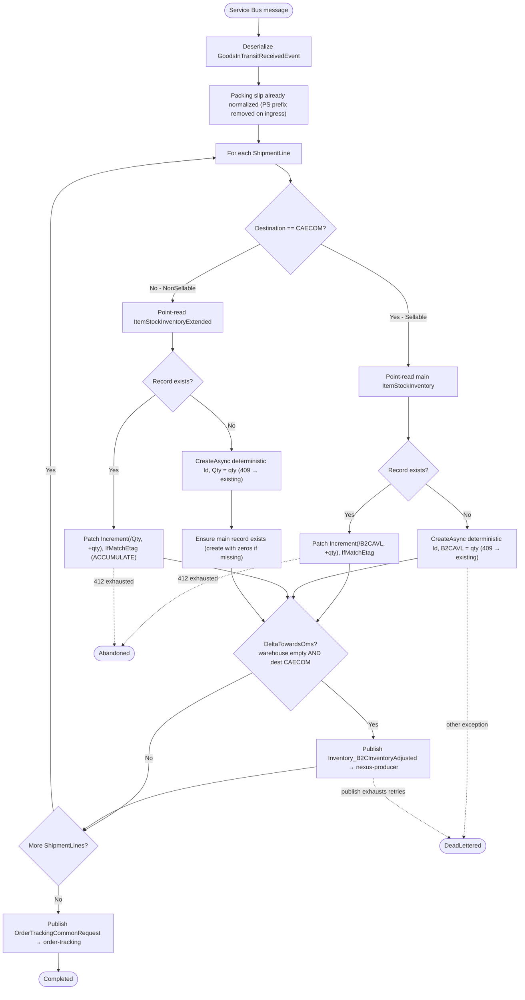

# b2b.purchase.GoodsInTransitReceived - Technical Documentation

## 1. Overview

### Purpose
`b2b.purchase.GoodsInTransitReceived` is a Kafka event that processes incoming
"Advanced Shipping Notice Confirmed" (ASN) receipts. When goods are received in
transit, the pipeline updates inventory in Cosmos DB and publishes downstream
notifications to Order Tracking and OMS (via Nexus).

### Business Objective
- Track goods-in-transit receipts from suppliers/vendors.
- Update inventory availability based on goods receipt.
- Distinguish between sellable (B2C) and non-sellable inventory.
- Notify downstream systems (`order-tracking`, `nexus-producer`) of inventory
  changes.
- Maintain inventory state and status tracking through a state machine.

### Scope
- Consumes `b2b.purchase.GoodsInTransitReceived` from Kafka, deserializes to
  `GoodsInTransitReceivedEvent`, and relays to Azure Service Bus.
- Processes the event on a session-enabled Service Bus consumer.
- Determines sellable vs non-sellable inventory and applies state/status.
- Persists inventory to Cosmos DB via ETag-guarded **Patch** operations.
- Publishes downstream events to the `order-tracking` and `nexus-producer`
  queues.
- Supports multiple fulfilment centers (CAECOM, ADC, TDC (SAP), and AX).

### High-Level Architecture

Matches the platform data flow in
[integration-resiliency.instructions.md](../ai/integration-resiliency.instructions.md):
a Kafka-to-Service-Bus relay hosted service, then a session-enabled Service Bus
consumer that calls the Application layer, which persists through the Cosmos DB
repository and archives through Blob Storage.

```
Kafka topic `b2b.purchase.GoodsInTransitReceived`
                    ↓
   GoodsInTransitReceivedConsumerHostedService (KafkaConsumerHostedServiceBase)
     - correlation id / dedup id / type headers read + logged
     - schema + dynamic validation
     - cold-tier request audit (unconditional)
     - packing-slip normalization ("PS" prefix removed)
                    ↓
   Azure Service Bus queue `goods-in-transit-received`
   (session-enabled: SessionId = {FulfilmentId}:{ItemCode};
    message ID deterministic from the Kafka key — never a fresh GUID)
                    ↓
   GoodsInTransitReceivedServiceBusHostedService
   (ServiceBusConsumerHostedService<GoodsInTransitReceivedEvent>)
     - envelope + payload deserialize, dynamic validation, cold-tier audit
                    ↓
        IGoodsInTransitReceivedHandler.HandleAsync
                    ↓
    ┌──────────────────┬──────────────────┬──────────────────┐
    ↓                  ↓                  ↓                  ↓
Sellability &     Inventory update    OMS Delta          Order Tracking
State/Status      (main / extended)   (nexus-producer)   (order-tracking)
    ↓                  ↓                  ↓                  ↓
IItemStockInventoryService → Cosmos DB (ETag-guarded Patch, re-read-and-reapply
on 412) + MessageArchive (Cosmos, optional Blob cold-tier mirror)
                    ↓
   order-tracking + nexus-producer queues (Service Bus) via cached ServiceBusSender
```

Business logic never touches `CosmosClient`/`Container`/`ServiceBusSender`
directly — it goes through `IItemStockInventoryService` → the Cosmos repository
and through the application-layer publish abstraction (see
[shared/service-bus-publishing.md](shared/service-bus-publishing.md)).

### Key Dependencies
- **`ItemStockInventoryRepository`** — main sellable inventory (Cosmos,
  multi-container EDC/TDC/ADC/CAECOM/BRZ3PL, ETag-guarded; cosmos §5a/§9).
- **`ItemStockInventoryExtendedRepository`** — non-sellable / non-standard state
  tracking (Cosmos).
- **`CountryRepository`** — country/market mapping (Cosmos, read-only).
- **`MessageArchiveRepository`** — snapshot archival (Cosmos + optional Blob).
- **Cached `ServiceBusSender`** — outbound `order-tracking` + `nexus-producer`
  publishing.
- Shared helpers: [delta-towards-oms](shared/delta-towards-oms.md),
  [inventory-formulas](shared/inventory-formulas.md),
  [country-code-lookup](shared/country-code-lookup.md),
  [archive-audit](shared/archive-audit.md),
  [cosmos-idempotent-write](shared/cosmos-idempotent-write.md),
  [service-bus-publishing](shared/service-bus-publishing.md).

### Assumptions
1. Incoming messages are valid `b2b.purchase.GoodsInTransitReceived` objects
   deserialized to `GoodsInTransitReceivedEvent`.
2. Packing-slip IDs may be prefixed with `"PS"`, which is normalized away on
   ingress.
3. Inventory is sellable if the destination is the CAECOM fulfilment center.
4. All shipment lines are processed independently.
5. Warehouse code `TDC-SAP-ID` maps to the TDC fulfilment ID.
6. State/Status enums are consistent across the system.
7. **Processing is idempotent** — a deterministic document `Id` plus ETag-guarded
   Patch make redelivery a no-op, not a duplicate/double-count (see
   [cosmos-idempotent-write](shared/cosmos-idempotent-write.md)).

---

## 2. End-to-End Flow

```
1. MESSAGE RECEPTION (Kafka consumer)
   ├─ GoodsInTransitReceived deserialized → GoodsInTransitReceivedEvent
   ├─ correlation/dedup/type headers logged
   ├─ schema + dynamic validation; cold-tier request audit
   ├─ extract packing slip ID (remove "PS" prefix if present)
   └─ relay to Service Bus queue `goods-in-transit-received`
        · SessionId = {FulfilmentId}:{ItemCode}
        · deterministic message ID from Kafka key (never a fresh GUID)

2. SERVICE BUS CONSUMPTION
   ├─ envelope + payload deserialize, dynamic validation, cold-tier audit
   └─ IGoodsInTransitReceivedHandler.HandleAsync(GoodsInTransitReceivedEvent)

3. SHIPMENT LINE ITERATION
   For each ShipmentLine:
   ├─ determine sellability (destination == CAECOM?)
   ├─ determine State/Status (ReturnReasonCode present?)
   │    · present → State = INSPECTION, Status = HELD
   │    · absent  → State = AVAILABLE,  Status = HELD
   ├─ build SegmentationInputModel + deterministic uniqueIdentifier
   │  (ItemCode, LineNo, PackingSlipId)

   4. INVENTORY UPDATE (see §3.7)
      ├─ Sellable (CAECOM) → main ItemStockInventory
      │    · create-if-missing (deterministic Id, 409-as-applied)
      │    · Patch Increment(/B2CAVL, +qty)  (ACCUMULATE)
      └─ Non-sellable → extended ItemStockInventoryExtended
           · create-if-missing (deterministic Id, 409-as-applied)
           · Patch Increment(/Qty, +qty)  (ACCUMULATE — see §3.7 note)
           · ensure a main record exists (create with zeros if missing)

   5. OMS DELTA (ENABLE_DELTA_TOWARDS_OMS AND eligible) — delta-towards-oms.md
      trigger: WarehouseCode empty/null AND destination == CAECOM
      └─ publish Inventory_B2CInventoryAdjusted → nexus-producer

6. ORDER TRACKING (per message) — delta-towards-oms.md
   ├─ resolve FulfilmentUnitId, CustomerId, DestinationNode
   ├─ Source = SAP (TDC-SAP-ID) else AX; normalize TDC-SAP mapping
   ├─ map shipment lines → OrderTrackingLine[]
   └─ publish OrderTrackingCommonRequest → order-tracking

7. OUTCOME
   └─ no exception → Completed; ConcurrencyException/OperationCanceled → Abandoned;
      any other → DeadLettered (see cosmos-idempotent-write.md)
```

### Data Flow Through Layers
`Kafka → KafkaConsumerHostedServiceBase → Service Bus (goods-in-transit-received)
→ ServiceBusConsumerHostedService → IGoodsInTransitReceivedHandler → helpers →
IItemStockInventoryService → Cosmos repository (Patch/ETag) + archive →
ServiceBusSender (order-tracking, nexus-producer)`.

---

## 3. Detailed Business Logic

### 3.1 Packing Slip ID Extraction
**Why:** Packing-slip IDs may arrive with a `"PS"` prefix from upstream systems
that must be normalized before use as a business key.

```
Input: "PS123456" or "123456"
Output: "123456"
Logic:
  IF StartsWith("PS", OrdinalIgnoreCase)
    THEN return substring from position 2
    ELSE return original value
```

**Validation rules:**
- Empty/null values return an empty string.
- Case-insensitive prefix matching.
- Prefix is assumed to be exactly two characters when present.

### 3.2 Sellability Determination
**Why:** Inventory routing depends on whether items can be sold immediately
(B2C) or are non-sellable (B2B / internal).

| Condition | Result | Destination |
|---|---|---|
| `LocationTo.Id == CAECOM` | Sellable | main inventory (`B2CAVL` field) |
| `LocationTo.Id == ADC` | Non-sellable | extended inventory container |
| `LocationTo == null` or other | Non-sellable | extended inventory container |

```
bool isSellable = shipment?.LocationTo?.Id == ReflexConstants.CAECOMFulfilmentId;
```

### 3.3 Inventory State Determination
**Why:** Tracks inventory readiness — items with a return reason need inspection
before they can be picked.

| Condition | State | Status | Reason |
|---|---|---|---|
| `ReturnReasonCode` present | INSPECTION | HELD | needs quality check |
| `ReturnReasonCode` null/empty | AVAILABLE | HELD | ready but held (buffer) |

```
if (!string.IsNullOrEmpty(itemLine.ReturnReasonCode))
{
    model.State = State.INSPECTION;
    model.Status = Status.HELD;
}
else
{
    model.State = State.AVAILABLE;
    model.Status = Status.HELD;
}
```

### 3.4 Fulfilment Unit Identification
**Why:** Routes the order-tracking request to the correct fulfilment center.

| Warehouse Code | Fulfilment ID |
|---|---|
| `TDC-SAP-ID` | `TDC_FULFILLMENT_ID` |
| any other code | use as-is |

**Special logic for CAECOM/ADC:** if the destination is CAECOM/ADC, look up the
order by `PackingSlipId` to obtain the `FulfilmentUnitId`.

```
IF LocationTo.Id == CAECOM OR LocationTo.Id == ADC
  ├─ read order details by PackingSlipId
  ├─ IF found → use order.FulfilmentUnitId
  └─ ELSE    → return "UNKNOWN"
ELSE IF WarehouseCode == TDC-SAP-ID
  └─ return TDC_FULFILLMENT_ID
ELSE
  └─ return VendorCode
```

### 3.5 Destination Node Determination
**Why:** Identifies the recipient location for inter-warehouse transfers.

```
IF LocationTo exists AND (LocationTo.Id == CAECOM OR LocationTo.Id == ADC)
  ├─ CustomerId      = LocationTo.Id
  └─ DestinationNode = LocationTo.Id
ELSE IF WarehouseCode == TDC-SAP-ID
  ├─ CustomerId      = TDC_FULFILLMENT_ID
  └─ DestinationNode = TDC_FULFILLMENT_ID
ELSE
  ├─ CustomerId      = WarehouseCode
  └─ DestinationNode = WarehouseCode
```

### 3.6 Delta Event Enablement Logic
**Why:** Only certain fulfilment paths require OMS synchronization —
specifically CAECOM receiving directly from suppliers (no warehouse code).

```
bool isEnableDeltaTowardsOms =
    string.IsNullOrWhiteSpace(shipment?.WarehouseCode) &&
    shipment?.LocationTo?.Id == ReflexConstants.CAECOMFulfilmentId;
```

**When TRUE:** builds an `Inventory_B2CInventoryAdjusted` delta for OMS with
`(AVAILABLE, PICKABLE)` inventory (see
[delta-towards-oms.md](shared/delta-towards-oms.md)).
**When FALSE:** skips the OMS delta (B2B internal transfer).

### 3.7 Inventory Update Logic
**Why:** Maintains accurate inventory counts in the main and extended Cosmos
containers based on sellability. All writes go through the shared discipline in
[cosmos-idempotent-write.md](shared/cosmos-idempotent-write.md): deterministic
`Id`, `409 Conflict` treated as already-applied on create, and ETag-guarded
`PatchOperation.Increment` for quantities (never last-write-wins).

#### Sellable inventory (main container)
```
Step 1: point-read main ItemStockInventory by (Id, Category)
        Category = FulfilmentId:ItemCode:Hallmark:CountryOfOrigin

Step 2: IF record does not exist
  └─ CreateAsync deterministic-Id document; B2CAVL seeded from qty,
     all other quantity fields = 0, IsExtended = false
     (409 Conflict on redelivery → return existing, no-op)

Step 3: IF record exists
  └─ Patch Increment(/B2CAVL, +qty) with IfMatchEtag   (ACCUMULATE)
     412 → ConcurrencyException → re-read-and-reapply loop (max 3)
```

#### Non-sellable inventory (extended container)
```
Step 1: point-read ItemStockInventoryExtended by (Id, Category)
        Category = FulfilmentId:ItemCode:Hallmark:CountryOfOrigin:State:Status

Step 2: IF record does not exist
  ├─ CreateAsync deterministic-Id document (State from ReturnReasonCode,
  │  Status = HELD, Qty seeded from qty)  (409 → return existing)
  └─ ensure a main ItemStockInventory record exists — create with all
     quantity fields = 0 if missing (also 409-as-applied)

Step 3: IF record exists
  └─ Patch Increment(/Qty, +qty) with IfMatchEtag      (ACCUMULATE)
     412 → ConcurrencyException → re-read-and-reapply loop (max 3)
```

> **Behavior change — non-sellable inventory ACCUMULATES, it is not REPLACED.**
> The previous (Azure Functions / SQL) version *replaced* the extended
> quantity (`Qty = request.Quantity`) on an existing record. That is exactly the
> **last-write-wins** anti-pattern that loses concurrent updates and drops
> earlier receipts. The correct AKS/Cosmos behavior is to **accumulate via
> `PatchOperation.Increment`** under an ETag guard, identical to the sellable
> path — so two receipts for the same category sum instead of one silently
> overwriting the other. Combined with the deterministic `Id` +
> 409-as-applied create, this is the fix for the production
> **duplicate-entry / doubled-quantity** symptom (see
> [cosmos-idempotent-write.md](shared/cosmos-idempotent-write.md)).

**Key point:** both sellable and non-sellable receipts now accumulate (`+=`)
via Patch Increment; neither uses a read-modify-write replace.

---

## 4. Calculation Logic

Quantity math is centralized in
[inventory-formulas.md](shared/inventory-formulas.md).

### 4.1 Quantity Handling

| Scenario | Operation | Applied as |
|---|---|---|
| Sellable inventory, new record | seed | `B2CAVL = qty` on create |
| Sellable inventory, existing record | accumulate | `Increment(/B2CAVL, +qty)` |
| Non-sellable inventory, new record | seed | `Qty = qty` on create |
| Non-sellable inventory, existing record | accumulate | `Increment(/Qty, +qty)` |

- **Inbound quantity** uses the signed normalization from
  [inventory-formulas.md](shared/inventory-formulas.md):
  `inboundQty = Convert.ToInt32(MoveSign + Quantity)`; goods-in-transit receipts
  are positive magnitudes.
- Increments are applied with `PatchOperation.Increment`, never a
  read-modify-write replace.

### 4.2 Inventory Field Initialization
When creating a **new** main inventory document, quantity fields are seeded as:

| Field | Initial value | Purpose |
|---|---|---|
| B2BAVL | 0 | B2B available inventory |
| B2CAVL | 0 or qty (if sellable) | B2C available inventory |
| B2BAllocated | 0 | B2B allocated quantity |
| B2CAllocated | 0 | B2C allocated quantity |
| B2CExtended | 0 | B2C extended inventory |
| B2CThreshold | 0 | B2C safety threshold |
| B2BUsedShare | 0 | B2B used share |
| B2BPrepared | 0 | B2B prepared quantity |
| B2CPrepared | 0 | B2C prepared quantity |
| PSC | 0 | pre-season collection |
| B2COrg | 0 | B2C organized stock |
| InternalHallmarkAllocated | 0 | internal hallmark allocation |
| InTransit | 0 | in-transit quantity |
| IsExtended | false | extended flag |

A new extended document seeds `Qty` from the receipt, `State` from the
return-reason rule (§3.3), and `Status = HELD`.

### 4.3 Worked Example
```
Two receipts arrive for the same category (CAECOM:ITEM001:NON:INDIA), qty 100 then 60.

Receipt 1: no existing record
  → CreateAsync deterministic Id; B2CAVL = 100

Receipt 2: record exists
  → Patch Increment(/B2CAVL, +60), IfMatchEtag
  → B2CAVL = 160   (ACCUMULATED, not overwritten)

Redelivery of Receipt 1 (same deterministic Id, same message ID):
  → CreateAsync → 409 Conflict → return existing; no double-count
```

---

## 5. Database Documentation

All Cosmos access follows [cosmos-db.instructions.md](../ai/cosmos-db.instructions.md)
and [cosmos-idempotent-write.md](shared/cosmos-idempotent-write.md). This event
performs **no SQL / relational access** — there are no tables, joins, or ad-hoc
queries; every read is a point read within one partition, and every write is a
deterministic create or an ETag-guarded Patch.

### 5.1 ItemStockInventory (Cosmos, multi-container per fulfilment code)
Sellable inventory. Served by `ItemStockInventoryRepository` across
`ItemStockInventoryEDC`/`TDC`/`ADC`/`CAECOM`/`BRZ3PL`, resolved per call from the
`Category`'s fulfilment-code segment (cosmos §5a).

- **Partition key** `Category` = composite
  `FulfilmentId:ItemCode:Hallmark:CountryOfOrigin`.
- **Read:** `GetAsync(id, category)` — point read within one partition.
- **Create (first write):** deterministic `Id`; `409 Conflict` → return existing
  (redelivery no-op).
- **Update:** `PatchAsync` with `IfMatchEtag`, `PatchOperation.Increment("/B2CAVL", qty)`
  and `.Set` for flags (`IsExtended`) and `ModifiedUtc`, **≤10 ops**. `412` →
  `ConcurrencyException` → §2 re-read/reapply loop (max 3).
- **No last-write-wins** on any quantity field.

| Field | How derived |
|---|---|
| B2CAVL | receipt quantity → Patch Increment (or seeded on create) |
| IsExtended | false on create for goods-in-transit |
| ModifiedUtc | caller-supplied UTC → Patch Set |

### 5.2 ItemStockInventoryExtended (Cosmos)
Non-sellable inventory awaiting inspection or otherwise held.

- **Partition key** `Category` = composite
  `FulfilmentId:ItemCode:Hallmark:CountryOfOrigin:State:Status`.
- **Read:** `GetAsync(id, category)` — point read.
- **Create (first write):** deterministic `Id`; `409 Conflict` → return existing.
  On create, ensure a main `ItemStockInventory` record exists (create with zeros
  if missing).
- **Update:** `PatchAsync` `Increment("/Qty", qty)` with `IfMatchEtag`
  (ACCUMULATE). `412` → `ConcurrencyException` → re-read/reapply loop.
- **State** = `INSPECTION` (return reason present) or `AVAILABLE`;
  **Status** = `HELD` on receipt.

### 5.3 Order Tracking (published, not stored here)
This event does **not** write an order-tracking document directly; it publishes
an `OrderTrackingCommonRequest` to the `order-tracking` queue (see §7 and
[delta-towards-oms.md](shared/delta-towards-oms.md)). The order-tracking
consumer owns that container.

### 5.4 Archive
Before/after snapshots and the unconditional request audit go through
[archive-audit.md](shared/archive-audit.md) (best-effort; a failure does not
fail the message).

### 5.5 Transaction Flow & Concurrency
Cosmos has no multi-document transactions here; correctness comes from
per-document deterministic Id + ETag Patch + the §2 retry loop, not distributed
transactions. Each document mutation is independently idempotent under
redelivery.

---

## 6. State Changes & State Machine

### 6.1 Sellable Inventory Path (CAECOM / B2C)
```
GoodsInTransitReceivedEvent (destination == CAECOM)
   ↓  signed inboundQty (inventory-formulas.md)
Point-read main ItemStockInventory (Id, Category)
   ↓
   ├─ NOT FOUND → CreateAsync deterministic Id; B2CAVL = qty (409 → existing)
   └─ FOUND     → Patch Increment(/B2CAVL, +qty), IfMatchEtag
                     ── 412 ─▶ re-read + reapply (≤3)
   ↓
Final: B2CAVL accumulated in main container
```

### 6.2 Non-Sellable Inventory Path (extended)
```
GoodsInTransitReceivedEvent (destination != CAECOM)
   ↓  State = INSPECTION|AVAILABLE (ReturnReasonCode), Status = HELD
Point-read ItemStockInventoryExtended (Id, Category incl. State:Status)
   ↓
   ├─ NOT FOUND → CreateAsync deterministic Id; Qty = qty (409 → existing)
   │              → ensure main record exists (create with zeros if missing)
   └─ FOUND     → Patch Increment(/Qty, +qty), IfMatchEtag   (ACCUMULATE)
                     ── 412 ─▶ re-read + reapply (≤3)
   ↓
Final: extended Qty accumulated; INSPECTION/AVAILABLE + HELD
```

### 6.3 OMS Delta Path (conditional)
```
Check EnableDeltaTowardsOms (WarehouseCode empty/null AND destination == CAECOM)
   ├─ FALSE → skip (B2B transfer)
   └─ TRUE  → build DeltaTowardsOmsEventRequest
                Type = Inventory_B2CInventoryAdjusted
                State = (AVAILABLE, PICKABLE); Quantity = receipt qty
                ReferenceId = deterministic (not a fresh GUID)
              → publish to nexus-producer (after Cosmos commit)
```

**Critical invariants:** no quantity goes negative; a redelivered message
produces no additional mutation (deterministic Id + ETag); downstream publishes
happen only after the Cosmos write is durably applied.

### 6.4 Sequence Diagram
```mermaid
sequenceDiagram
    participant Kafka as Kafka topic
    participant SB as Service Bus (goods-in-transit-received)
    participant Handler as IGoodsInTransitReceivedHandler
    participant Main as ItemStockInventory Repo (Cosmos)
    participant Ext as ItemStockInventoryExtended Repo (Cosmos)
    participant Out as ServiceBusSender (nexus-producer / order-tracking)

    Kafka->>SB: relay (deterministic MsgId, SessionId {FulfilmentId}:{ItemCode})
    SB->>Handler: GoodsInTransitReceivedEvent
    activate Handler

    loop For each ShipmentLine
        Handler->>Handler: determine sellability (dest == CAECOM?)
        Handler->>Handler: determine State/Status (ReturnReasonCode?)

        alt Sellable (CAECOM)
            Handler->>Main: GetAsync(id, category)
            alt exists
                Handler->>Main: PatchAsync Increment(/B2CAVL, +qty), IfMatchEtag
                Main-->>Handler: 412? → ConcurrencyException → re-read/reapply (≤3)
            else not found
                Handler->>Main: CreateAsync (deterministic Id, B2CAVL = qty)
                Main-->>Handler: 409? → return existing (no-op)
            end
        else Non-sellable
            Handler->>Ext: GetAsync(id, category incl. State:Status)
            alt exists
                Handler->>Ext: PatchAsync Increment(/Qty, +qty), IfMatchEtag
            else not found
                Handler->>Ext: CreateAsync (deterministic Id, Qty = qty)
                Handler->>Main: ensure main exists (create with zeros if missing)
            end
        end

        alt DeltaTowardsOms enabled
            Handler->>Out: publish Inventory_B2CInventoryAdjusted → nexus-producer
        end
    end

    Handler->>Out: publish OrderTrackingCommonRequest → order-tracking
    deactivate Handler

    rect rgb(200, 100, 100)
        note over Handler,Out: no exception → Completed;<br/>ConcurrencyException/OperationCanceled → Abandoned;<br/>other → DeadLettered
    end
```

### 6.5 Flow Chart


---

## 7. API Documentation

This is an event-driven consumer, not a REST API; the contract is the event
schema.

### 7.1 Kafka message contract
Topic `b2b.purchase.GoodsInTransitReceived`, mapped to
`GoodsInTransitReceivedEvent`:

```csharp
public class GoodsInTransitReceivedEvent
{
    public Channel Channel { get; set; }         // SAP, AX, B2C, ...
    public ShipmentEvent Shipment { get; set; }
}

public class ShipmentEvent
{
    public string PackingSlipId { get; set; }    // "PS" prefix normalized on ingress
    public string VendorCode { get; set; }       // source fulfilment
    public string WarehouseCode { get; set; }    // source warehouse (null for direct)
    public LocationReference LocationTo { get; set; } // destination
    public DateTime ReceiptDate { get; set; }    // when goods arrived
    public List<ShipmentLineItem> ShipmentLines { get; set; }
}

public class LocationReference
{
    public string Id { get; set; }               // CAECOM, ADC, TDC, ...
}

public class ShipmentLineItem
{
    public string ProductId { get; set; }        // item code
    public string LineNum { get; set; }          // line number
    public int Quantity { get; set; }            // quantity received
    public CountryOfOrigin CountryOfOrigin { get; set; }
    public string ReturnReasonCode { get; set; } // null = direct receipt; value = inspection
}
```

**Sample message:**
```json
{
  "Channel": 1,
  "Shipment": {
    "PackingSlipId": "PS20240730001",
    "VendorCode": "VENDOR123",
    "WarehouseCode": null,
    "LocationTo": { "Id": "CAECOM" },
    "ReceiptDate": "2024-07-30T10:30:00Z",
    "ShipmentLines": [
      {
        "ProductId": "ITEM001",
        "LineNum": "1",
        "Quantity": 100,
        "CountryOfOrigin": 1,
        "ReturnReasonCode": null
      }
    ]
  }
}
```

### 7.2 Service Bus message contract
Queue `goods-in-transit-received`, `ServiceBusRelayEnvelope` wrapping the event;
`SessionId = {FulfilmentId}:{ItemCode}`; deterministic `MessageId` derived from
the Kafka key (never a fresh GUID); correlation headers per
[service-bus-publishing.md](shared/service-bus-publishing.md).

### 7.3 Output events (implemented publishes)
Both sends are **implemented** — published via cached `ServiceBusSender` and the
`service-bus-publish` Polly pipeline, after the Cosmos write is durably applied
(see [service-bus-publishing.md](shared/service-bus-publishing.md)). They replace
the old commented-out `TODO` sends.

#### Output 1: Order Tracking → `order-tracking`
Message: `OrderTrackingCommonRequest` (built in-process; **no Orchestrator** —
see [delta-towards-oms.md](shared/delta-towards-oms.md)).

```csharp
new OrderTrackingCommonRequest
{
    Channel = eventMessage.Channel.ToString(),
    FulfilmentUnitId = sourceInfo,
    SourceNode = sourceInfo,
    FulfilmentUnitType = ReflexConstants.FulFilmentType,
    OrderId = eventMessage.Shipment.PackingSlipId,
    ShipmentId = eventMessage.Shipment.PackingSlipId,
    PackingSlipId = eventMessage.Shipment.PackingSlipId,
    OrderStatus = OrderTrackingStatus.RECEIVED,
    Source = /* SAP if TDC-SAP-ID else AX */,
    CustomerId = destinationCustomerId,
    DestinationNode = destinationNode,
    OrderType = "TRANSFER",
    Type = EventType.B2B_GOODS_IN_TRANSIT_RECEIVED,
    ReceivedDate = eventMessage.Shipment.ReceiptDate,
    Lines = /* mapped OrderTrackingLine[] */
}
```

#### Output 2: OMS Delta → `nexus-producer` (conditional)
Message: `DeltaTowardsOmsEventRequest` (type `Inventory_B2CInventoryAdjusted`),
published only when §3.6 is TRUE. `ReferenceId` is **deterministic** (derived
from the source event), not `Guid.NewGuid()` — this is what makes downstream
dedup work (see [delta-towards-oms.md](shared/delta-towards-oms.md)).

```json
{
  "Type": "Inventory_B2CInventoryAdjusted",
  "Data": {
    "ReferenceId": "CAECOM:ITEM001:20240730001",
    "Market": 1,
    "ProductId": "ITEM001",
    "Location": { "Id": "CAECOM" },
    "AdjustmentDate": "2024-07-30T10:35:00Z",
    "ProductUnits": "N/A",
    "QuantityDetails": [
      {
        "CountryOfOrigin": 1,
        "Hallmarking": 2,
        "Quantity": 100,
        "State": { "State": "AVAILABLE", "Status": "PICKABLE" },
        "ReasonTexts": []
      }
    ]
  }
}
```

### 7.4 Validation
| Field | Rule | Handling |
|---|---|---|
| payload | not null / schema-valid | poison → DeadLettered |
| Quantity | integer | signed parse |
| State/Status | valid enum | reject invalid |
| CountryOfOrigin | resolvable | fallback `CountryCode.UNKNOWN` (country-code-lookup.md) |
| PackingSlipId | not null (may be empty post-normalization) | continue |

---

## 8. Error Handling & Retry

- **Validation / poison payload** → DeadLettered (hot-tier dead-letter container).
- **Cosmos 412 (ETag)** → `ConcurrencyException` → re-read/reapply loop (≤3); if
  exhausted → Abandoned (redelivered up to `MaxDeliveryCount`).
- **Cosmos 409 (duplicate deterministic Id)** → treated as already-applied on the
  create path; not an error (redelivery no-op).
- **Cosmos 429** → Cosmos SDK retry (`MaxRetryAttemptsOnRateLimitedRequests`).
- **Service Bus publish transient** → `service-bus-publish` Polly pipeline
  (exhausted retries → processing failure for the triggering message).
- **`OperationCanceledException`** → Abandoned.
- **Any other exception** → DeadLettered (`Reason` = type name, `Description` =
  `ex.ToString()`).
- **Fulfilment-unit lookup miss** (CAECOM/ADC order not found) → resolves to
  `"UNKNOWN"` with a warning; does not fail the message.

Outcome mapping is the definitive table in
[cosmos-idempotent-write.md](shared/cosmos-idempotent-write.md):

| Result | Service Bus action |
|---|---|
| No exception | `Completed` |
| `ConcurrencyException` | `Abandoned` |
| `OperationCanceledException` | `Abandoned` |
| Any other exception | `DeadLettered` |

---

## 9. Security & Configuration

### Authentication
- Cosmos DB and Service Bus use **connection strings** sourced from Azure Key
  Vault (delivered as a Kubernetes Secret); local dev uses the emulator /
  user-secrets. This is the deliberate documented standard (cosmos §1/§14) — **not
  Managed Identity / Workload Identity**.

### Feature flags
| Flag | Default | Purpose |
|---|---|---|
| ENABLE_DELTA_TOWARDS_OMS | true | OMS B2C delta for CAECOM direct receipts |

> The OMS delta was previously an implicit business check; it remains gated by
> the §3.6 eligibility condition (`WarehouseCode` empty AND destination CAECOM).

### Queue names (kebab-case, config-resolved)
| Queue | Old constant | Direction |
|---|---|---|
| `goods-in-transit-received` | ADVANCED_SHIPPING_NOTICE_CONFIRMED_QUEUE_NAME | inbound (relay) |
| `order-tracking` | ORDER_TRACKING_QUEUE_NAME | outbound |
| `nexus-producer` | NEXUS_PRODUCER_QUEUE_NAME | outbound |

### Default values
- **Hallmark type:** `NON` for goods-in-transit.
- **Inventory status:** `HELD` on receipt.
- **Inventory state:** `INSPECTION` or `AVAILABLE` per return-reason code.

### Data protection
TLS in transit; encryption at rest; no secrets/keys/connection strings logged.

---

## 10. Known Limitations & Future Improvements

### Current Limitations
- Integer quantities only (no fractional units).
- Shipment lines processed sequentially (per-aggregate ordering preserved via
  the session).
- Fulfilment-unit lookup miss resolves to `"UNKNOWN"` with a warning rather than
  reconciling.

### Potential Improvements
- Cache country codes and fulfilment mappings per process to cut Cosmos reads.
- Batch downstream publishes where a line produces multiple events.
- Evaluate bounded parallel line processing within one message, preserving
  per-aggregate ordering via the session.

> The previous version listed "Order Tracking / Nexus Producer sends commented
> out", "no idempotency key → duplicate inventory entries", and "non-sellable
> quantity REPLACED not ACCUMULATED" as gaps. All three are now resolved by
> design: both sends go through the cached `ServiceBusSender` (§7/§9); redelivery
> and concurrency are handled by deterministic Id + 409-as-applied + ETag Patch +
> the re-read/reapply loop; and non-sellable inventory now **accumulates via
> `PatchOperation.Increment`** (§3.7) instead of a last-write-wins replace.

---

## 11. Summary

`b2b.purchase.GoodsInTransitReceived` processes ASN goods receipts on the AKS
pipeline: consumes from Kafka, relays to the `goods-in-transit-received` Service
Bus queue (session-enabled, deterministic message ID), determines sellable vs
non-sellable inventory and its state/status, persists to Cosmos DB, and publishes
downstream notifications to `order-tracking` and `nexus-producer`.

**Key business logic:** sellable = destination CAECOM (main container) else
non-sellable (extended container); `INSPECTION`/`AVAILABLE` + `HELD` per return
reason; OMS delta only when the receipt is a direct CAECOM supplier receipt
(no warehouse code); TDC-SAP-ID → TDC fulfilment mapping for order tracking.

**Database updates:** ETag-guarded **Patch** (`Increment`/`Set`, ≤10 ops) on
`ItemStockInventory` and `ItemStockInventoryExtended`, with deterministic Id +
409-as-applied creates and the 412 re-read/reapply loop (max 3). Both sellable
**and** non-sellable receipts accumulate via `PatchOperation.Increment` — this is
the fix for the duplicate-entry / doubled-quantity problem, and replaces the old
non-sellable "replace" (last-write-wins) behavior.

**Risks & recommendations:** concurrency conflicts should be rare with sessions
in place; monitor dead-letter counts and Cosmos 429 rates; cache rarely-changing
lookups (country codes, fulfilment mappings).

---

**Document Version:** 2.0 (AKS / k8s)
**Status:** Regenerated
