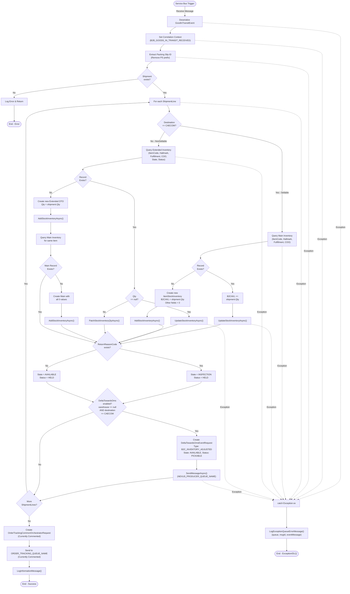

# b2b.purchase.GoodsInTransitReceived - Technical Documentation

## 1. Overview

### Purpose
The `b2b.purchase.GoodsInTransitReceived` is a kafka event that processes incoming "Advanced Shipping Notice Confirmed" (ASN) events. When goods are received in transit, this trigger updates inventory records in the system and orchestrates downstream notifications to Order Tracking and OMS (Order Management System).

### Business Objective
- Track goods in transit receipts from suppliers/vendors
- Update inventory availability based on goods receipt
- Distinguish between sellable (B2C) and non-sellable inventory
- Notify downstream systems (Order Tracking, Nexus Producer) of inventory changes
- Maintain inventory state and status tracking through a state machine

### Scope
- **Input**: `b2b.purchase.GoodsInTransitReceived` from Kakfa via Consumer Group: `$InventoryStateChanged` and deserialized to `GoodInTransitEvent` messages and send to Service Bus Queue
- **Inbound Messages**: GoodInTransitEvent from Service Bus Queue
- **Inventory Management**: Both main inventory table (sellable) and extended inventory table (non-sellable)
- **Event Propagation**: Creating order tracking requests and OMS delta notifications
- **Multi-Fulfillment Support**: CAECOM, ADC, TDC (SAP), and AX fulfillment centers

### High-Level Architecture
```
Kafka (b2b.purchase.GoodsInTransitReceived)
        ↓
Service Bus (GoodInTransitEvent)
        ↓
    ├─→ Extract & Validate Shipment Data
    ├─→ Process Inventory Segmentation
    │   ├─→ Check if Sellable/Non-Sellable
    │   └─→ Update ItemStockInventory (Main or Extended)
    ├─→ Send Order Tracking Event (Commented)
    └─→ Send OMS Delta Event (Commented)
```

### Assumptions
1. Kafka incoming messages are valid `b2b.purchase.GoodsInTransitReceived` kafka object
2. serialize `b2b.purchase.GoodsInTransitReceived`to `GoodInTransitEvent` objects and send to Service Bus Queue
3. Packing slip IDs may be prefixed with "PS" which needs to be extracted
4. Inventory is sellable if destination is CAECOM fulfillment
5. All shipment lines must be processed independently
6. Correlation context propagates through the message pipeline
7. Warehouse code "TDC-SAP-ID" maps to TDC fulfillment ID
8. State/Status enums are consistent across the system
9. Database repositories handle optimistic locking internally

### Dependencies
- **Azure Service Bus**: Message queue infrastructure
- **Entity Repositories**: ItemStockInventoryRepository, ItemStockInventoryExtendedRepository, OrderTrackingRepository
- **Domain Models**: GoodInTransitEvent, ShipmentEvent, OrderTrackingCommonOrchestratorRequest
- **Logging Service**: ILoggerService for observability
- **Correlation Context**: Cross-service request tracing

---

## 2. End-to-End Flow

### Complete Execution Sequence

```
1. Kafka (b2b.purchase.GoodsInTransitReceived)
   ├─ Deserialize Message → GoodInTransitEvent
   ├─ Set Correlation Context (B2B_GOODS_IN_TRANSIT_RECEIVED)
   └─ Extract Packing Slip ID (remove "PS" prefix if present)

2. Advanced Shipment Notice Processing
   ├─ Loop through each ShipmentLine
   │  ├─ Determine Sellability (destination == CAECOM?)
   │  ├─ Determine State/Status
   │  │  ├─ If ReturnReasonCode exists → State: INSPECTION, Status: HELD
   │  │  └─ Else → State: AVAILABLE, Status: HELD
   │  ├─ Create InventorySegmentationAndExtensionRequest
   │  ├─ Update Inventory (Sellable or Non-Sellable)
   │  │  ├─ Check existing inventory record
   │  │  ├─ Create new or update existing
   │  │  └─ Ensure main inventory record exists
   │  └─ If DeltaTowardsOms enabled:
   │     └─ Send DeltaTowardsOmsEventRequest to Nexus Producer
   └─ Return (No return value)

3. Order Tracking Creation (Currently Commented)
   ├─ Get FulfillmentUnitId
   ├─ Get Destination Info (CustomerId, DestinationNode)
   ├─ Create OrderTrackingCommonOrchestratorRequest
   ├─ Map shipment lines to order lines
   └─ Send to ORDER_TRACKING_QUEUE_NAME

4. Exception Handling
   └─ Log error with full context and continue processing
```

### Request Initiation
- **Trigger**: Azure Service Bus message from `ADVANCED_SHIPPING_NOTICE_CONFIRMED_QUEUE_NAME`
- **Input Type**: `ServiceBusReceivedMessage` containing serialized `GoodInTransitEvent`
- **Message Headers**: Service Bus system properties (MessageId, CorrelationId, etc.)

### Input Validation
```csharp
// Implicit validation through deserialization
var eventMessage = await message.GetInputAsync<GoodInTransitEvent>();

// Null-safety checks
if (eventMessage!.Shipment != null)
    eventMessage.Shipment.PackingSlipId = ExtractPackingSlipId(eventMessage.Shipment.PackingSlipId);
```

### Service Layer Execution
1. **Inventory Segmentation Logic**: Determines sellable vs non-sellable inventory
2. **Database Repository Calls**: CRUD operations on inventory tables
3. **Event Creation**: Builds downstream event models for further processing

### Business Logic
1. **Inventory State Machine**: AVAILABLE or INSPECTION based on return reason
2. **Sellability Determination**: Based on destination fulfillment center
3. **Delta Event Trigger**: Only CAECOM fulfillment with no warehouse code triggers OMS delta
4. **Quantity Handling**: Additive for sellable inventory, replacement for non-sellable

### Database Interactions
See section 5 (Database Documentation)

### External API Calls
None directly - uses Azure Service Bus for async communication

### Cache Usage
No caching mechanism

### Event/Message Queue Interactions
- **Input**: Service Bus queue trigger
- **Output**: 
  - ORDER_TRACKING_QUEUE_NAME (commented)
  - NEXUS_PRODUCER_QUEUE_NAME (commented)

### Response Generation
None - Azure Function trigger pattern (void/Task return)

### Error Handling
```csharp
try
{
    // Processing logic
}
catch (Exception ex)
{
    _loggerService.LogExceptionQueueErrorMessage(ex, queueName, messageId, eventMessage);
}
```

### Retry Mechanism
- Service Bus built-in retry policy (Max Delivery Count)
- Dead Letter Queue for permanently failed messages
- No explicit code-level retries

### Logging
```csharp
_loggerService.LogExceptionQueueErrorMessage(ex, queueName, messageId, eventMessage, referenceId);
_loggerService.LogInformationMessage(message, input);
_loggerService.LogExceptionErrorMessage(ex, message, input, orderId);
```

### Monitoring
- Correlation ID for distributed tracing
- Message ID tracking
- Exception details with context

---

## 3. Detailed Business Logic

### 3.1 Packing Slip ID Extraction
**Why**: Packing slip IDs may come with a "PS" prefix from upstream systems that needs to be normalized.

```
Input: "PS123456" or "123456"
Output: "123456"
Logic:
  IF StartsWith("PS", OrdinalIgnoreCase)
    THEN Return substring from position 2 onwards
    ELSE Return original value
```

**Validation Rules**:
- Empty/null values return empty string
- Case-insensitive prefix matching
- Always assumes prefix is exactly 2 characters if present

### 3.2 Sellability Determination
**Why**: Inventory routing depends on whether items can be sold immediately (B2C) or are for internal use (B2B).

| Condition | Result | Destination |
|-----------|--------|-------------|
| LocationTo.Id == CAECOM | Sellable | B2C inventory (B2CAVL field) |
| LocationTo.Id == ADC | Non-sellable | Extended inventory table |
| LocationTo == null or other | Non-sellable | Extended inventory table |

**Implementation**:
```csharp
bool isSellable = input.Shipment?.LocationTo?.Id == ReflexConstants.CAECOMFulfilmentId;
```

### 3.3 Inventory State Determination
**Why**: Tracks inventory readiness for fulfillment - items with return reasons need inspection before picking.

| Condition | State | Status | Reason |
|-----------|-------|--------|--------|
| ReturnReasonCode exists | INSPECTION | HELD | Item needs quality check |
| ReturnReasonCode null/empty | AVAILABLE | HELD | Item ready but held (buffer) |

**Implementation**:
```csharp
if (!string.IsNullOrEmpty(itemLine.ReturnReasonCode))
{
    segmentationInputModel.State = State.INSPECTION;
    segmentationInputModel.Status = Status.HELD;
}
else
{
    segmentationInputModel.State = State.AVAILABLE;
    segmentationInputModel.Status = Status.HELD;
}
```

### 3.4 Fulfillment Unit Identification
**Why**: Routes orders to correct fulfillment center for downstream processing.

| Warehouse Code | Fulfillment ID |
|---|---|
| TDC-SAP-ID | TDC_FULFILLMENT_ID |
| Any other code | Use as-is |

**Special Logic for CAECOM/ADC**:
If destination is CAECOM/ADC, query OrderTrackingRepository to get FulfillmentUnitId from order details.

**Decision Tree**:
```
IF LocationTo.Id == CAECOM OR LocationTo.Id == ADC
  ├─ Query Order Details by PackingSlipId
  ├─ IF order found → use order.FulfillmentUnitId
  └─ ELSE → return "UNKNOWN"
ELSE IF VendorCode == TDC-SAP-ID
  └─ return TDC_FULFILLMENT_ID
ELSE
  └─ return VendorCode
```

### 3.5 Destination Node Determination
**Why**: Determines recipient location for inter-warehouse transfers.

**Logic**:
```csharp
IF LocationTo exists AND (LocationTo.Id == CAECOM OR LocationTo.Id == ADC)
  ├─ CustomerId = LocationTo.Id
  └─ DestinationNode = LocationTo.Id
ELSE IF WarehouseCode == TDC-SAP-ID
  ├─ CustomerId = TDC_FULFILLMENT_ID
  └─ DestinationNode = TDC_FULFILLMENT_ID
ELSE
  ├─ CustomerId = WarehouseCode
  └─ DestinationNode = WarehouseCode
```

### 3.6 Delta Event Enablement Logic
**Why**: Only certain fulfillment paths require OMS synchronization - specifically CAECOM receiving from suppliers (no warehouse code).

**Condition**:
```csharp
bool isEnableDeltaTowardsOms = 
  string.IsNullOrWhiteSpace(shipment?.WarehouseCode) && 
  shipment?.LocationTo?.Id == ReflexConstants.CAECOMFulfilmentId;
```

**When TRUE**: Creates B2C_INVENTORY_ADJUSTED event for OMS with AVAILABLE/PICKABLE inventory.

**Edge Case**: If false, skips OMS delta event (for B2B internal transfers).

### 3.7 Inventory Update Logic
**Why**: Maintains accurate inventory counts in both main and extended tables based on sellability.

#### For Non-Sellable Inventory (Extended Table):
```
Step 1: Query existing record by (ItemCode, Hallmark, FulfilmentCode, COO, State, Status)

Step 2: IF record exists
  ├─ IF Qty is null
  │  └─ Set Qty = request.Quantity
  │     Call UpdateStockInventoryAsync
  └─ ELSE
     └─ Set Qty = request.Quantity (replace, not add)
        Call PatchStockInventoryQtyAsync

Step 3: IF record doesn't exist
  ├─ Create new ItemStockInventoryExtendedDTO
  ├─ Add to extended table
  └─ Ensure main inventory record exists (create with all 0 values if needed)
```

**Limitation**: Non-sellable inventory quantity is REPLACED, not ACCUMULATED.

#### For Sellable Inventory (Main Table):
```
Step 1: Query existing record by (ItemCode, Hallmark, FulfilmentCode, COO)

Step 2: IF record doesn't exist
  ├─ Create new ItemStockInventoryDTO
  ├─ Set B2CAVL = request.Quantity
  ├─ All other fields = 0 or false
  └─ Add to main table

Step 3: IF record exists
  ├─ B2CAVL += request.Quantity (ACCUMULATE)
  └─ Call UpdateStockInventoryAsync
```

**Key Difference**: Sellable inventory is accumulated (+=), non-sellable is replaced (=).

---

## 4. Calculation Logic

### 4.1 Quantity Handling

| Scenario | Operation | Formula |
|----------|-----------|---------|
| Sellable inventory, new record | Assign | B2CAVL = request.Quantity |
| Sellable inventory, existing record | Accumulate | B2CAVL_new = B2CAVL_old + request.Quantity |
| Non-sellable inventory, new/existing | Replace | Qty = request.Quantity |

### 4.2 Inventory Field Initialization
When creating new inventory records, all inventory fields are initialized as follows:

| Field | Initial Value | Purpose |
|-------|---|---|
| B2BAVL | 0 | B2B Available inventory |
| B2CAVL | 0 or request.Quantity | B2C Available inventory |
| B2BAllocated | 0 | B2B Allocated quantity |
| B2CAllocated | 0 | B2C Allocated quantity |
| B2CExtended | 0 | B2C Extended inventory |
| B2CThreshold | 0 | B2C Safety threshold |
| B2BUsedShare | 0 | B2B Used share |
| B2BPrepared | 0 | B2B Prepared quantity |
| B2CPrepared | 0 | B2C Prepared quantity |
| PSC | 0 | Pre-Season Collection |
| B2COrg | 0 | B2C Organized stock |
| InternalHallmarkAllocated | 0 | Internal hallmark allocation |
| InTransit | 0 | In-transit quantity |
| IsExtended | false | Extended flag |

---

## 5. Database Documentation

### 5.1 ItemStockInventory Table (Main Inventory)

#### Purpose
Stores current sellable inventory availability across all fulfillment centers, organized by item, hallmark, and country of origin.

#### Primary Key
Composite: (ItemCode, FulfilmentId, Hallmark, COO)

#### Read Operations

| Query Type | Method | Filters | Purpose |
|---|---|---|---|
| Get by Category | `GetInventoryByCategory(itemCode, hallmark, fulfilmentCode, coo)` | ItemCode, Hallmark, FulfilmentCode, COO | Retrieve existing inventory record before update |

**Expected Result**: Single ItemStockInventoryDTO or null

#### Insert Operations

**Method**: `AddStockInventoryAsync(itemStockInventoryDTO)`

**Columns Populated**:
| Column | Source | Default | Generated |
|---|---|---|---|
| ItemCode | request.ItemCode | N/A | No |
| FulfilmentId | request.FulfilmentCode | N/A | No |
| Hallmark | request.Hallmark.ToString() | N/A | No |
| COO | request.CountryOfOrigin.ToString() | N/A | No |
| B2CAVL | request.Quantity (if sellable) | 0 (if non-sellable) | No |
| All other qty fields | Initialization logic | 0 | No |
| IsExtended | false | false | No |

**Transaction Scope**: Single record insertion, auto-committed by repository.

#### Update Operations

**Methods**: 
- `UpdateStockInventoryAsync(itemStockInventoryDTO)` - Full record update
- `PatchStockInventoryQtyAsync(itemStockInventoryDTO)` - Quantity-only patch

**Columns Modified**:
| Column | Previous Value | New Value | Condition |
|---|---|---|---|
| B2CAVL | Current value | Current + request.Quantity | Sellable inventory receipt |
| (All other fields) | Unchanged | Unchanged | Unless explicitly set |

**Update Condition**: Record exists by composite key

**Optimistic Locking**: Not explicitly implemented in code - assumes repository handles internally

### 5.2 ItemStockInventoryExtended Table (Non-Sellable Inventory)

#### Purpose
Stores non-sellable inventory awaiting inspection or in other non-available states.

#### Primary Key
Composite: (ItemCode, FulfilmentId, Hallmark, COO, State, Status)

#### Read Operations

| Query Type | Method | Filters | Purpose |
|---|---|---|---|
| Get by Category | `GetInventoryByCategory(itemCode, hallmark, fulfilmentCode, coo, state, status)` | ItemCode, Hallmark, FulfilmentCode, COO, State, Status | Retrieve existing extended inventory |

**Expected Result**: Single ItemStockInventoryExtendedDTO or null

#### Insert Operations

**Method**: `AddStockInventoryAsync(itemStockInventoryExtendedDTO)`

**Columns Populated**:
| Column | Source | Default | Generated |
|---|---|---|---|
| ItemCode | request.ItemCode | N/A | No |
| FulfilmentId | request.FulfilmentCode | N/A | No |
| Hallmark | request.Hallmark.ToString() | N/A | No |
| COO | request.CountryOfOrigin.ToString() | N/A | No |
| Qty | request.Quantity | N/A | No |
| State | INSPECTION or AVAILABLE | N/A | Based on ReturnReasonCode |
| Status | HELD | HELD | Always HELD on receipt |

**Transaction Scope**: Single record insertion

#### Update Operations

**Methods**:
- `UpdateStockInventoryAsync(itemStockInventoryExtendedDTO)` - When Qty is null
- `PatchStockInventoryQtyAsync(itemStockInventoryExtendedDTO)` - When Qty exists

**Logic**:
```
IF itemStockInventoryExtendedDto.Qty == null
  └─ Call UpdateStockInventoryAsync (full update)
ELSE
  └─ Call PatchStockInventoryQtyAsync (qty patch)
```

### 5.3 OrderTracking Table (Not Updated by This Trigger)

#### Purpose
Tracks order fulfillment status through the system. This trigger creates a request for order tracking but doesn't directly update (currently commented out).

#### Data Populated by This Trigger
```csharp
new OrderTrackingCommonOrchestratorRequest
{
    Channel = eventMessage.Channel.ToString(),
    FulfilmentUnitId = sourceInfo,
    SourceNode = sourceInfo,
    FulfilmentUnitType = ReflexConstants.FulFilmentType,
    FunctionName = nameof(GoodsInTransitReceivedFullQueueTrigger),
    OrderId = eventMessage.Shipment.PackingSlipId,
    ShipmentId = eventMessage.Shipment.PackingSlipId,
    PackingSlipId = eventMessage.Shipment.PackingSlipId,
    OrderStatus = OrderTrackingStatus.RECEIVED,
    Source = SAP or AX based on WarehouseCode,
    CustomerId = Destination CustomerId,
    DestinationNode = Destination Node,
    OrderType = TRANSFER,
    Type = EventType.B2B_GOODS_IN_TRANSIT_RECEIVED,
    ReceivedDate = eventMessage.Shipment.ReceiptDate,
    Lines = List of OrderTrackingLine objects
}
```

### 5.4 Transaction Flow & Rollback

**Current Implementation**: No explicit transaction management.

**Implicit Behavior**:
- Each database operation is atomic at the repository level
- If an operation fails, subsequent operations are not attempted
- Exception is caught and logged, then rethrown (causing message Dead Letter)

**Rollback Scenarios**:
1. If `UpdateStockInventoryAsync` fails → Exception logged, message moved to DLQ
2. If `AddStockInventoryAsync` fails → Exception logged, message moved to DLQ
3. No compensating transactions to undo partial updates

**Commit Points**:
- Each `await _repository.MethodAsync()` commits on success
- No batch/transactional boundaries across multiple operations

---

## 6. State Changes

### 6.1 Inventory State Transitions

#### Non-Sellable Inventory Path
```
┌─────────────────────────────────────────────────────────────┐
│ Received GoodInTransitEvent (Non-CAECOM destination)        │
└──────────────────────┬──────────────────────────────────────┘
                       ↓
┌─────────────────────────────────────────────────────────────┐
│ Query ItemStockInventoryExtended by (ItemCode, Hallmark,    │
│ FulfilmentCode, COO, State, Status)                         │
└──────────────────────┬──────────────────────────────────────┘
                       ↓
        ┌──────────────┴──────────────┐
        ↓                             ↓
   ┌─FOUND─┐                  ┌─NOT FOUND─┐
   │       │                  │           │
   ↓       ↓                  └─┬─────────┘
 ┌─IF QTY IS NULL┐             ↓
 │    │          │      ┌──────────────────────┐
 │    ↓          │      │ Create new           │
 │ UpdateQty    │      │ Extended Inventory   │
 │    │          │      │ - State: INSPECTION/ │
 │    ↓          │      │   AVAILABLE          │
 │ Record       │      │ - Status: HELD       │
 │ Updated      │      │ - Qty: shipment qty  │
 └─────┬────────┘      └──────────┬───────────┘
       │                          ↓
       │               ┌──────────────────────┐
       │               │ Check main inventory │
       │               │ record exists        │
       │               └──────────┬───────────┘
       │                          ↓
       │               ┌─IF NOT EXISTS─┐
       │               │               │
       │               ↓               ↓
       │          ┌──Create───┐    SKIP
       │          │ Main with │
       │          │ all 0 val │
       │          └─────┬─────┘
       │                │
       ↓                ↓
   ┌────────────────────────────┐
   │ FINAL STATE: Inventory     │
   │ tracked in extended table  │
   │ with INSPECTION or         │
   │ AVAILABLE state, HELD      │
   │ status, holding quantity   │
   └────────────────────────────┘
```

#### Sellable Inventory Path (B2C/CAECOM)
```
┌─────────────────────────────────────────────────────────────┐
│ Received GoodInTransitEvent (CAECOM destination)            │
└──────────────────────┬──────────────────────────────────────┘
                       ↓
┌─────────────────────────────────────────────────────────────┐
│ Query ItemStockInventory by (ItemCode, Hallmark,            │
│ FulfilmentCode, COO)                                        │
└──────────────────────┬──────────────────────────────────────┘
                       ↓
        ┌──────────────┴──────────────┐
        ↓                             ↓
   ┌─FOUND─┐                  ┌─NOT FOUND─┐
   │       │                  │           │
   ↓       ↓                  ↓           ↓
┌────────────────────┐    ┌──Create──┐
│ B2CAVL +=          │    │ new main │
│ shipment.Qty       │    │ inventory│
│                    │    │ B2CAVL = │
│ Update record      │    │ shipment │
│                    │    │ qty      │
└────────┬───────────┘    └────┬─────┘
         │                     │
         │     ┌───────────────┘
         ↓     ↓
   ┌────────────────────────────┐
   │ FINAL STATE: Inventory     │
   │ quantity accumulated in    │
   │ B2CAVL (B2C Available)     │
   │ field in main table        │
   └────────────────────────────┘
```

#### OMS Delta Event Path (Conditional)
```
┌─────────────────────────────────────────────────────────────┐
│ Check: EnableDeltaTowardsOms?                               │
│ (warehouse is null AND destination is CAECOM)               │
└──────────────────────┬──────────────────────────────────────┘
                       ↓
        ┌──────────────┴──────────────┐
        ↓                             ↓
      TRUE                          FALSE
        │                             │
        ↓                             ↓
┌──────────────────┐            (Skip OMS
│ Create           │             notification)
│ DeltaTowardsOms  │
│ Event Request    │
│ - Type: B2C_     │
│   INVENTORY_     │
│   ADJUSTED       │
│ - State: AVAIL   │
│ - Status: PICK   │
│ - Qty: shipment  │
│   qty            │
└────────┬─────────┘
         ↓
┌──────────────────┐
│ Send to Nexus    │
│ Producer Queue   │
│ (commented out)  │
└─────────────────┘
```

---

## 7. API Documentation

This is not a traditional REST API but an Azure Event-driven Function. Documentation follows event contract pattern.

### 7.1 Input Event Contract

**Queue Name**: `ADVANCED_SHIPPING_NOTICE_CONFIRMED_QUEUE_NAME` (configurable)

**Message Type**: `GoodInTransitEvent`

**Headers**:
- Service Bus standard headers (MessageId, CorrelationId, SessionId, etc.)

**Request Body Schema**:
```csharp
public class GoodInTransitEvent
{
    public Channel Channel { get; set; }  // Enum: SAP, AX, B2C, etc.
    public ShipmentEvent Shipment { get; set; }
}

public class ShipmentEvent
{
    public string PackingSlipId { get; set; }           // May have "PS" prefix
    public string VendorCode { get; set; }              // Source fulfillment
    public string WarehouseCode { get; set; }           // Source warehouse (null for direct)
    public LocationReference LocationTo { get; set; }   // Destination
    public DateTime ReceiptDate { get; set; }           // When goods arrived
    public List<ShipmentLineItem> ShipmentLines { get; set; }
}

public class LocationReference
{
    public string Id { get; set; }  // Fulfillment ID (CAECOM, ADC, TDC, etc.)
}

public class ShipmentLineItem
{
    public string ProductId { get; set; }               // Item code
    public string LineNum { get; set; }                 // Line number
    public int Quantity { get; set; }                   // Quantity received
    public CountryOfOrigin CountryOfOrigin { get; set; }
    public string ReturnReasonCode { get; set; }        // Null = direct receipt, value = inspection needed
}
```

**Validation Rules**:
- All shipment lines must have ProductId and Quantity
- Packing slip ID cannot be null (may be empty string post-extraction)
- DateTime values must be valid UTC timestamps
- Country of Origin must be valid enum value

**Sample Request**:
```json
{
  "Channel": 1,
  "Shipment": {
    "PackingSlipId": "PS20240730001",
    "VendorCode": "VENDOR123",
    "WarehouseCode": null,
    "LocationTo": {
      "Id": "CAECOM"
    },
    "ReceiptDate": "2024-07-30T10:30:00Z",
    "ShipmentLines": [
      {
        "ProductId": "ITEM001",
        "LineNum": "1",
        "Quantity": 100,
        "CountryOfOrigin": 1,
        "ReturnReasonCode": null
      }
    ]
  }
}
```

### 7.2 Output Events

#### Output 1: Order Tracking Event (Commented)
**Queue**: `ORDER_TRACKING_QUEUE_NAME`

**Message Type**: `OrderTrackingCommonOrchestratorRequest`

```csharp
public class OrderTrackingCommonOrchestratorRequest
{
    public string Channel { get; set; }
    public string FulfilmentUnitId { get; set; }
    public string SourceNode { get; set; }
    public string FulfilmentUnitType { get; set; }
    public string FunctionName { get; set; }
    public string OrderId { get; set; }
    public string ShipmentId { get; set; }
    public string PackingSlipId { get; set; }
    public OrderTrackingStatus OrderStatus { get; set; }  // RECEIVED
    public string Source { get; set; }  // SAP or AX
    public string CustomerId { get; set; }
    public string DestinationNode { get; set; }
    public string OrderType { get; set; }  // TRANSFER
    public EventType Type { get; set; }  // B2B_GOODS_IN_TRANSIT_RECEIVED
    public DateTime ReceivedDate { get; set; }
    public List<OrderTrackingLine> Lines { get; set; }
}

public class OrderTrackingLine
{
    public string ItemCode { get; set; }
    public string LineNumber { get; set; }
    public string ShipmentLineNumber { get; set; }
    public CountryOfOrigin CountryOfOrigin { get; set; }
    public HallMarkType HallMarkType { get; set; }  // Always NON
    public int Qty { get; set; }
}
```

#### Output 2: OMS Delta Event (Conditional, Commented)
**Queue**: `NEXUS_PRODUCER_QUEUE_NAME`

**Message Type**: `NexusProducerRequest` wrapping `DeltaTowardsOmsEventRequest`

```csharp
public class DeltaTowardsOmsEventRequest
{
    public string ReferenceId { get; set; }  // Guid.NewGuid()
    public CountryCode Market { get; set; }  // CA (Canada)
    public string ProductId { get; set; }
    public LocationReference Location { get; set; }  // LocationTo from input
    public DateTime AdjustmentDate { get; set; }  // DateTime.UtcNow
    public string ProductUnits { get; set; }  // "NA"
    public EventType Type { get; set; }  // B2C_INVENTORY_ADJUSTED
    public ReasonCode Reason { get; set; }  // Default enum
    public List<InventoryQuantityDetail> QuantityDetails { get; set; }
}

public class InventoryQuantityDetail
{
    public CountryOfOrigin CountryOfOrigin { get; set; }
    public HallMarkType Hallmarking { get; set; }  // UNKNOWN
    public int Quantity { get; set; }  // From shipment line
    public InventoryState State { get; set; }  // AVAILABLE, PICKABLE
    public List<string> ReasonTexts { get; set; }
}
```

**Sample OMS Delta Event**:
```json
{
  "Type": 0,  // Inventory_B2CInventoryAdjusted
  "Data": {
    "ReferenceId": "550e8400-e29b-41d4-a716-446655440000",
    "Market": 1,
    "ProductId": "ITEM001",
    "Location": {
      "Id": "CAECOM"
    },
    "AdjustmentDate": "2024-07-30T10:35:00Z",
    "ProductUnits": "NA",
    "Type": 123,  // B2C_INVENTORY_ADJUSTED
    "QuantityDetails": [
      {
        "CountryOfOrigin": 1,
        "Hallmarking": 2,
        "Quantity": 100,
        "State": { "State": "AVAILABLE", "Status": "PICKABLE" },
        "ReasonTexts": ["Receipt"]
      }
    ]
  }
}
```

### 7.3 Error Handling

**HTTP Status Equivalent**: N/A (async event)

**Failure Scenarios**:
1. Message deserialization fails → Exception logged, message to DLQ
2. Database operation fails → Exception logged, message to DLQ
3. Inventory lookup fails (OrderTracking repo) → Logged, but continues with "UNKNOWN"

**Logging Pattern**:
```csharp
_loggerService.LogExceptionQueueErrorMessage(
    exception, 
    queueName: ADVANCED_SHIPPING_NOTICE_CONFIRMED_QUEUE_NAME,
    messageId: message.MessageId,
    eventMessage: eventMessage,
    referenceId: eventMessage.Shipment.PackingSlipId
);
```

---

## 8. Sequence Diagram

```mermaid
sequenceDiagram
    participant Queue as Service Bus Queue
    participant Trigger as GoodsInTransitReceivedFullQueueTrigger
    participant Repo as ItemStockInventory Repository
    participant ExtRepo as ItemStockInventoryExtended Repository
    participant Logger as Logger Service
    participant OutQueue as Nexus Producer Queue

    Queue->>Trigger: ServiceBusReceivedMessage<br/>(GoodInTransitEvent)
    activate Trigger
    
    Trigger->>Trigger: Deserialize message<br/>to GoodInTransitEvent
    Trigger->>Trigger: Set correlation context<br/>(B2B_GOODS_IN_TRANSIT_RECEIVED)
    Trigger->>Trigger: Extract packing slip ID<br/>(remove "PS" prefix)
    
    Trigger->>Trigger: advancedShipmentNoticeConfirmedAsync()
    activate Trigger as AdvFunc
    
    loop For each ShipmentLine
        Trigger->>Trigger: Determine sellability<br/>(destination == CAECOM?)
        Trigger->>Trigger: Determine state/status<br/>(ReturnReasonCode exists?)
        
        alt Sellable Inventory (CAECOM)
            Trigger->>Repo: GetInventoryByCategory(itemCode, hallmark, fulfillment, coo)
            activate Repo
            Repo-->>Trigger: ItemStockInventoryDTO or null
            deactivate Repo
            
            alt Record exists
                Trigger->>Trigger: Increment B2CAVL<br/>+= shipment.Qty
                Trigger->>Repo: UpdateStockInventoryAsync(dto)
            else Record not found
                Trigger->>Trigger: Create new DTO<br/>B2CAVL = shipment.Qty
                Trigger->>Repo: AddStockInventoryAsync(dto)
            end
        else Non-Sellable Inventory
            Trigger->>ExtRepo: GetInventoryByCategory(itemCode,<br/>hallmark, fulfillment, coo,<br/>state, status)
            activate ExtRepo
            ExtRepo-->>Trigger: ItemStockInventoryExtendedDTO or null
            deactivate ExtRepo
            
            alt Record exists
                alt Qty is null
                    Trigger->>ExtRepo: UpdateStockInventoryAsync(dto)
                else Qty exists
                    Trigger->>ExtRepo: PatchStockInventoryQtyAsync(dto)
                end
            else Record not found
                Trigger->>Trigger: Create new extended DTO
                Trigger->>ExtRepo: AddStockInventoryAsync(extDto)
                
                Trigger->>Repo: GetInventoryByCategory(itemCode,<br/>hallmark, fulfillment, coo)
                Repo-->>Trigger: ItemStockInventoryDTO or null
                
                alt Main record not exists
                    Trigger->>Trigger: Create main with all 0s
                    Trigger->>Repo: AddStockInventoryAsync(mainDto)
                end
            end
        end
        
        alt DeltaTowardsOms enabled<br/>(no warehouse code AND<br/>destination CAECOM)
            Trigger->>Trigger: Create DeltaTowardsOmsEventRequest<br/>- Type: B2C_INVENTORY_ADJUSTED<br/>- State: AVAILABLE, Status: PICKABLE
            Trigger->>OutQueue: SendMessageAsync<br/>(NEXUS_PRODUCER_QUEUE_NAME,<br/>message)
            activate OutQueue
            OutQueue-->>Trigger: Acknowledged
            deactivate OutQueue
        end
    end
    
    deactivate AdvFunc
    
    Trigger->>Trigger: Create OrderTrackingCommonOrchestratorRequest<br/>(currently commented)
    
    rect rgb(200, 150, 255)
        note over Trigger,OutQueue: Order Tracking queue send<br/>(currently commented out)
    end
    
    Trigger->>Logger: LogInformationMessage<br/>(on success)
    
    deactivate Trigger
    
    rect rgb(200, 100, 100)
        note over Trigger,Logger: Exception handling:<br/>LogExceptionQueueErrorMessage(),<br/>Message to DLQ
    end
```

---

## 9. Flow Chart



---

## 10. Decision Tree

```
IF Event received on ASN_CONFIRMED queue
├─ Extract and deserialize GoodInTransitEvent
│  └─ IF Packing Slip ID has "PS" prefix
│     └─ Remove prefix
│
├─ FOR each ShipmentLine in event
│  │
│  ├─ DETERMINE SELLABILITY
│  │  └─ IF LocationTo.Id == CAECOM
│  │     ├─ Sellable = true (B2C Inventory)
│  │     └─ Use Main Inventory Table
│  │  ELSE
│  │     ├─ Sellable = false (B2B Inventory)
│  │     └─ Use Extended Inventory Table
│  │
│  ├─ DETERMINE STATE & STATUS
│  │  └─ IF ReturnReasonCode is not empty
│  │     ├─ State = INSPECTION (needs QC)
│  │     └─ Status = HELD (temporarily unavailable)
│  │  ELSE
│  │     ├─ State = AVAILABLE (ready to use)
│  │     └─ Status = HELD (waiting confirmation)
│  │
│  ├─ UPDATE INVENTORY
│  │  └─ IF Sellable (B2C)
│  │     ├─ Query Main Inventory by (ItemCode, Hallmark, Fulfillment, COO)
│  │     └─ IF Record Exists
│  │        ├─ B2CAVL += shipment quantity (ACCUMULATE)
│  │        └─ UpdateStockInventoryAsync()
│  │        ELSE
│  │           ├─ Create new Main record
│  │           ├─ B2CAVL = shipment quantity
│  │           ├─ All other fields = 0
│  │           └─ AddStockInventoryAsync()
│  │  ELSE (Non-Sellable B2B)
│  │     ├─ Query Extended Inventory by (ItemCode, Hallmark, Fulfillment, COO, State, Status)
│  │     └─ IF Record Exists
│  │        └─ IF Qty == null
│  │           └─ UpdateStockInventoryAsync() (full update)
│  │           ELSE
│  │           └─ PatchStockInventoryQtyAsync() (qty only)
│  │        ELSE (New Record)
│  │           ├─ Create Extended DTO with input quantity
│  │           ├─ AddStockInventoryAsync()
│  │           ├─ Ensure Main Inventory record exists
│  │           └─ IF Main doesn't exist
│  │              ├─ Create with all fields = 0
│  │              └─ AddStockInventoryAsync()
│  │
│  ├─ CHECK OMS DELTA ELIGIBILITY
│  │  └─ IF (warehouse code is empty or null)
│  │     AND (LocationTo.Id == CAECOM)
│  │     ├─ Create DeltaTowardsOmsEventRequest
│  │     ├─ Type = B2C_INVENTORY_ADJUSTED
│  │     ├─ State = AVAILABLE, Status = PICKABLE
│  │     ├─ Quantity = shipment line quantity
│  │     └─ SendMessageAsync(NEXUS_PRODUCER_QUEUE_NAME)
│  │     ELSE
│  │     └─ Skip OMS notification (B2B transfer)
│  │
│  └─ Continue to next ShipmentLine
│
├─ CREATE ORDER TRACKING REQUEST
│  ├─ Get FulfillmentUnitId (CAECOM/ADC lookup or warehouse code mapping)
│  ├─ Get DestinationNode (LocationTo.Id or WarehouseCode)
│  ├─ Determine Source (SAP vs AX based on WarehouseCode)
│  ├─ Map all shipment lines to OrderTrackingLine objects
│  └─ SendMessageAsync(ORDER_TRACKING_QUEUE_NAME) [Currently Commented]
│
└─ EXCEPTION HANDLING
   └─ IF any exception occurs
      ├─ LogExceptionQueueErrorMessage()
      └─ Message moves to Dead Letter Queue (Service Bus automatic)
```

---

## 11. Error Handling

### Validation Errors
- Null shipment → Continues (null-safe checks)
- Null/empty packing slip ID → Returns empty string
- Invalid enum conversion → Exception thrown and caught

### Database Errors
- **Constraint Violation**: Record with same key exists
  - Trigger: Try to add duplicate
  - Result: Database exception, message to DLQ
  
- **Connection Failure**: Database unreachable
  - Trigger: Network issue, timeout
  - Result: Exception logged, message to DLQ
  
- **Query Execution**: Malformed query or missing column
  - Trigger: Repository bug or schema change
  - Result: Exception logged, message to DLQ

### Timeout Handling
- Service Bus message receive: 60 seconds default (configurable)
- Database query: Configured at connection level
- If trigger times out → Message redelivered, Max Delivery Count applies

### Retry Logic
**Code-Level**: None explicit

**Service Bus-Level**:
- Max Delivery Count: Default 10
- Lock Duration: 30 seconds
- Auto-dead-lettering after max retries
- Exponential backoff between retries (Service Bus built-in)

### Exception Propagation
```csharp
try {
    // Processing
} catch (Exception ex) {
    _loggerService.LogExceptionQueueErrorMessage(
        ex, 
        ADVANCED_SHIPPING_NOTICE_CONFIRMED_QUEUE_NAME,
        message.MessageId,
        eventMessage,
        referenceId: eventMessage.Shipment.PackingSlipId
    );
    // Exception implicitly rethrown → Service Bus processes as failure
}
```

### Rollback Behavior
- **No explicit transaction**: Each operation commits independently
- **Failed operation**: Subsequent operations skipped, exception stops processing
- **Partial updates**: Not rolled back (could have updated inventory but failed on OMS event)

### User-Facing Errors
- N/A - This is a backend async processor
- Errors logged for operations team monitoring

### Internal Logs
```
[INFO] Calling Orchestration function
[INFO] request towards OMS is sent for productId X
[INFO] Can't find FulfillmentUnitId from order container for PackingSlipId Y
[ERROR] GoodsInTransitReceivedFullQueueTrigger threw error with message
[ERROR] LogExceptionQueueErrorMessage with full context
```

---

## 12. Performance Considerations

### Query Optimization
- **Index Usage**: Composite index on (ItemCode, Hallmark, FulfilmentCode, COO)
- **Query Complexity**: O(1) lookup by primary key
- **N+1 Prevention**: Single query per inventory check (no lazy loading patterns)

### Batch Processing
- **Current**: Processes each shipment line sequentially
- **Opportunity**: Could batch multiple lines into single database transaction
- **Trade-off**: Sequential is simpler, less latency-sensitive

### Parallel Execution
- **Current**: No parallelization (sequential loop)
- **Limitation**: Correlates shipment lines (each builds on state of previous)
- **Opportunity**: Could parallelize if inventory updates were isolated

### Bottlenecks
1. **Database Round Trips**: One query + one write per line = 2N network calls
2. **Service Bus Publishing**: One OMS event per line = N additional calls
3. **Order Tracking Lookup**: One additional query for CAECOM/ADC scenarios

### Complexity Analysis
- **Time**: O(N) where N = number of shipment lines
  - Each line requires: 1 query + 1-2 writes + conditional OMS publish
  - Total: O(N) database operations
  
- **Space**: O(1)
  - Fixed-size DTOs regardless of input size

### Caching
- No caching implemented
- Opportunity: Cache fulfillment mapping (TDC → TDC_ID)
- Cache invalidation: Mapping unlikely to change frequently

---

## 13. Security

### Authentication
- **Managed Identity**: Azure Function runs with managed identity
- **Service Bus**: Authenticated via connection string in ApplicationConfig
- **Database**: Authenticated via connection string from ServiceBusConnectionString pattern

### Authorization
- **Service Bus**: RBAC role assigned to managed identity (Receive, Send)
- **Database**: SQL authentication or AD integrated auth via connection string
- **Scope**: Function only accesses permitted queues and database

### Encryption
- **In Transit**: TLS for Service Bus, SQL Server connections
- **At Rest**: Azure Storage encryption, SQL Server encryption (TDE)
- **Keys**: Managed by Azure Key Vault (configuration references)

### Sensitive Data Handling
- **Logging**: Full event message logged (could contain PII)
  - Mitigation: Ensure logger destination (Application Insights) is secured
  - Mitigation: Set appropriate data classification
  
- **Message Content**: Contains ProductId, PackingSlipId, Quantities
  - Not encrypted at message level (relies on Service Bus encryption)

### SQL Injection Prevention
- **ORM Usage**: Repository pattern abstracts SQL
- **Parameterized Queries**: Assumed in Entity Framework / Dapper implementations
- **Direct SQL**: None in this code

### XSS Prevention
- **N/A**: No HTML generation or web endpoints

### CSRF Protection
- **N/A**: No state-changing HTTP requests

### Input Sanitization
- **Packing Slip ID**: Extraction logic assumes "PS" prefix
- **String Inputs**: No special character handling or escaping
- **Enum Parsing**: `Enum.Parse()` could throw on invalid values
  - Could add try-catch for enum conversions

### Recommendations
1. Add validation for enum conversions:
   ```csharp
   if (!Enum.TryParse(shipmentLine.CountryOfOrigin.ToString(), 
        out Domain.Enums.Common.CountryOfOrigin coo))
   {
       // Handle invalid enum
   }
   ```

2. Implement structured logging filtering:
   ```csharp
   // Remove sensitive fields from logged events
   var sanitizedEvent = new { /* non-sensitive fields */ };
   _loggerService.LogInformationMessage("Processing", sanitizedEvent);
   ```

3. Add rate limiting/throttling:
   - Prevent message flooding attacks
   - Implement exponential backoff for retries

---

## 14. Configuration

### Environment Variables
Configured via `ApplicationConfig`:

| Setting | Purpose | Example Value |
|---------|---------|---|
| `ADVANCED_SHIPPING_NOTICE_CONFIRMED_QUEUE_NAME` | Input queue name | `advanced-shipping-notice-confirmed` |
| `ORDER_TRACKING_QUEUE_NAME` | Output queue for order tracking | `order-tracking-requests` |
| `NEXUS_PRODUCER_QUEUE_NAME` | Output queue for OMS events | `nexus-producer` |
| `ServiceBusConnectionString` | Service Bus connection | `Endpoint=sb://...` |

### Feature Flags
- **Implicit**: OMS delta event sending controlled by business logic (warehouse code check)
- **Opportunity**: Extract to explicit feature flag

### Config Files
- `appsettings.json` - Development
- `appsettings.{Environment}.json` - Environment-specific
- `local.settings.json` - Azure Functions local runtime

### Default Values
- **Country of Origin**: Based on shipment line input
- **Hallmark Type**: Always `NON` for goods-in-transit
- **Inventory Status**: Always `HELD` on receipt
- **Inventory State**: `INSPECTION` or `AVAILABLE` based on return reason code

---

## 15. Complete Data Flow

### Data Transformation Pipeline

```
INPUT: ServiceBusReceivedMessage
    ↓ [Deserialize]
GoodInTransitEvent
    ↓ [Extract Packing Slip, Normalize IDs]
Normalized GoodInTransitEvent
    ↓ [Loop per ShipmentLine]
InventorySegmentationAndExtensionRequest
    ↓ [Determine Sellability]
    ├─→ (Sellable) ItemStockInventoryDTO
    │       ↓ [Query → Update/Insert]
    │   Database: ItemStockInventory table
    │
    └─→ (Non-Sellable) ItemStockInventoryExtendedDTO
            ↓ [Query → Update/Insert]
        Database: ItemStockInventoryExtended table

OUTPUT EVENTS:
├─ OrderTrackingCommonOrchestratorRequest
│   ↓ [Serialize, Publish]
│   Service Bus: ORDER_TRACKING_QUEUE_NAME
│
└─ DeltaTowardsOmsEventRequest (wrapped in NexusProducerRequest)
    ↓ [Serialize, Publish]
    Service Bus: NEXUS_PRODUCER_QUEUE_NAME
```

### Database Interaction Sequence
```
For each ShipmentLine:
1. GetInventoryByCategory() → Check if record exists
2. IF sellable AND record exists:
   UpdateStockInventoryAsync() → Increment B2CAVL
3. IF sellable AND record not exists:
   AddStockInventoryAsync() → Insert new record
4. IF non-sellable AND record exists:
   UpdateStockInventoryAsync() OR PatchStockInventoryQtyAsync()
5. IF non-sellable AND record not exists:
   AddStockInventoryAsync() → Insert extended
   GetInventoryByCategory() → Check main inventory
   IF main not exists:
      AddStockInventoryAsync() → Insert main with zeros
```

---

## 16. Input vs Output Mapping

### Input Field → Database Column Mapping

| Input Field | Source | Target Table | Target Column | Transformation |
|---|---|---|---|---|
| Shipment.PackingSlipId | Message body | OrderTracking | OrderId | ExtractPackingSlipId() |
| ShipmentLine.ProductId | Message body | ItemStockInventory | ItemCode | Direct |
| ShipmentLine.Quantity | Message body | ItemStockInventory | B2CAVL/Qty | += (sellable) or = (non-sellable) |
| ShipmentLine.CountryOfOrigin | Message body | ItemStockInventory | COO | Enum.ToString() |
| ShipmentLine.ReturnReasonCode | Message body | ItemStockInventoryExtended | State | IF empty→AVAILABLE; ELSE→INSPECTION |
| Shipment.LocationTo.Id | Message body | OrderTracking | DestinationNode | Direct |
| Shipment.WarehouseCode | Message body | OrderTracking | Source | IF TDC→SAP; ELSE→AX |

### Database Column → Output Event Mapping

| Database Field | Read From | Output Event | Output Field |
|---|---|---|---|
| ItemCode | ItemStockInventory | OrderTrackingLine | ItemCode |
| COO | ItemStockInventory | DeltaTowardsOmsEvent | InventoryQuantityDetail.CountryOfOrigin |
| Qty | ItemStockInventory/Extended | OrderTrackingLine / DeltaTowards | Qty |
| State/Status | ItemStockInventoryExtended | DeltaTowardsOmsEvent | State/Status |

---

## 17. Assumptions

1. **Message Format**: All received messages are valid, well-formed `GoodInTransitEvent`
2. **Idempotency**: Function can safely process duplicate messages (database updates are idempotent)
3. **Ordering**: No explicit ordering requirement for shipment lines
4. **Enum Stability**: Domain enums (CountryOfOrigin, HallMarkType) won't change during processing
5. **Repository Consistency**: Repositories handle concurrent updates and data integrity
6. **Connection Resilience**: Service Bus client handles transient failures internally
7. **Packing Slip Uniqueness**: PackingSlipId is globally unique identifier for shipments
8. **Fulfillment Center Mapping**: TDC-SAP-ID always maps to TDC_FULFILLMENT_ID
9. **Quantity Accuracy**: Input quantities are always valid positive integers
10. **DateTime Validity**: ReceiptDate is always valid UTC timestamp
11. **Null Handling**: Null checks are performed before accessing properties
12. **No Side Effects**: Function does not rely on external state beyond database

---

## 18. Known Limitations

### Current Implementation Gaps
1. **Order Tracking Queue**: Message send is commented out
   - Fix: Uncomment the await statement and handle exceptions
   
2. **Nexus Producer Queue**: Message send is commented out
   - Fix: Uncomment the await statement and handle exceptions

3. **Duplicate Message Handling**: No idempotency key
   - Risk: Duplicate messages could cause duplicate inventory entries
   - Fix: Implement distributed cache to track processed MessageIds
   
4. **Transaction Boundaries**: No explicit transaction management
   - Risk: Partial updates if failure occurs mid-operation
   - Fix: Wrap operation in TransactionScope or EF DbTransaction

5. **Partial Failure Recovery**: No compensation mechanism
   - Risk: If OMS event fails after DB update, state becomes inconsistent
   - Fix: Implement saga pattern or event sourcing

6. **Enum Conversion Error Handling**: Uses Enum.Parse without try-catch
   - Risk: InvalidOperationException if enum value invalid
   - Fix: Use Enum.TryParse with validation

7. **Fulfillment Unit Lookup Failure**: Returns "UNKNOWN" without alerting
   - Risk: Orders routed incorrectly with ambiguous fulfillment ID
   - Fix: Throw exception and dead-letter message for manual review

### Edge Cases Not Handled
1. **Zero Quantity**: No validation that quantity > 0
2. **Missing Fulfillment Code**: GetFulfilmentCode returns null without validation
3. **Multiple Receipts**: No deduplication of quantity if message replayed
4. **Concurrent Updates**: Race condition if two triggers update same inventory simultaneously

### Unsupported Scenarios
1. **Partial Shipment Updates**: Each trigger processes complete shipment (no partial receipts)
2. **Inventory Adjustment (Negative Quantity)**: Always adds/sets, never subtracts
3. **Multi-Currency Pricing**: No pricing calculations
4. **Supplier Quality Tracking**: Return reason logged but not analyzed
5. **Shortage Notifications**: No alerting if expected quantity not received

### Performance Limitations
1. **Sequential Processing**: Each line processed one-by-one (no batching)
2. **No Caching**: Fulfillment mapping queried every time
3. **Database Round Trips**: N+1 queries for N shipment lines
4. **No Indexing Hints**: Assumes database has optimal indexes

### Technical Debt
1. **Hardcoded Strings**: Magic strings for fulfillment IDs (CAECOM, ADC, TDC)
   - Fix: Move to Constants class
   
2. **Mixed Concerns**: Event processing, inventory management, order tracking in one class
   - Fix: Separate into OrderTrackingService, InventorySegmentationService
   
3. **Null-Conditional Abuse**: Multiple ?? null checks
   - Fix: Validate inputs upfront
   
4. **Logging Verbosity**: Logs entire event object including sensitive data
   - Fix: Implement sanitized logging
   
5. **No Unit Tests Visible**: Testability concerns with tight coupling to repositories
   - Fix: Dependency injection, interface-based design

---

## 19. Summary

### Complete Execution Summary
The `GoodsInTransitReceivedFullQueueTrigger` processes incoming goods shipment notifications through the following flow:

1. **Message Reception**: Receives `GoodInTransitEvent` from Service Bus queue
2. **Data Normalization**: Extracts packing slip ID, removes "PS" prefix
3. **Inventory Segmentation**: For each shipment line, determines if inventory is sellable (B2C) or non-sellable (B2B) based on destination
4. **State Determination**: Sets inventory state (AVAILABLE/INSPECTION) based on presence of return reason code
5. **Database Update**: Updates or inserts inventory records in appropriate table (main or extended)
6. **OMS Notification**: Conditionally sends B2C inventory delta events for CAECOM fulfillment with no warehouse code
7. **Order Tracking**: Creates order tracking request (currently commented out for further processing)
8. **Error Handling**: Catches and logs all exceptions, allowing Service Bus to move failed messages to Dead Letter Queue

### Key Business Logic Summary
- **Sellability Rule**: Inventory destined for CAECOM is sellable (B2C); all others are non-sellable (B2B)
- **State Machine**: Items with return reason codes require inspection before fulfillment; otherwise available
- **Quantity Handling**: Sellable inventory accumulates (+=); non-sellable inventory replaces (=)
- **OMS Integration**: Only suppliers shipping directly to CAECOM trigger OMS inventory updates

### Database Updates Summary
- **Reads**: 1-2 inventory lookups per shipment line (main and/or extended table)
- **Writes**: 1-2 inventory inserts/updates per shipment line (main and/or extended table)
- **Atomicity**: Each operation commits independently; no transaction boundaries

### Calculations Summary
- **Quantity Math**: Addition for B2C inventory, replacement for B2B
- **Field Initialization**: All inventory quantities default to 0 except destination quantity
- **No Complex Formulas**: Straightforward field mapping and aggregation

### Risks
1. **Duplicate Message Risk**: No idempotency protection; retries could double-count inventory
2. **Partial Failure**: If OMS event fails after DB update, state becomes inconsistent
3. **Concurrent Update Risk**: No locking mechanism for simultaneous shipments to same inventory
4. **Data Loss**: Commented-out code paths could be silently ignored if not uncommented
5. **Error Suppression**: Inventory lookup failures return "UNKNOWN" without alerting

### Recommendations
1. **Implement Idempotency**:
   - Track processed MessageIds in Redis/Cache
   - Skip reprocessing duplicate messages

2. **Add Transaction Boundaries**:
   - Wrap database operations in TransactionScope
   - Atomically update inventory + order tracking together

3. **Implement Saga Pattern**:
   - Separate write operations into compensatable steps
   - Handle partial failure scenarios with rollback

4. **Uncomment and Complete Code**:
   - Re-enable ORDER_TRACKING_QUEUE_NAME publish
   - Re-enable NEXUS_PRODUCER_QUEUE_NAME publish
   - Add error handling for publish failures

5. **Improve Error Handling**:
   - Use Enum.TryParse instead of Enum.Parse
   - Throw exception for UNKNOWN fulfillment unit instead of returning string
   - Implement circuit breaker for external service calls

6. **Refactor for Maintainability**:
   - Extract fulfillment mapping to separate service
   - Move business logic to separate domain service
   - Improve testability with dependency injection

---

## Version Information
- **Document Version**: 1.0
- **Last Updated**: 2024-07-30
- **Code Version**: Current in repository
- **Author**: Generated using document-prompt.md template
