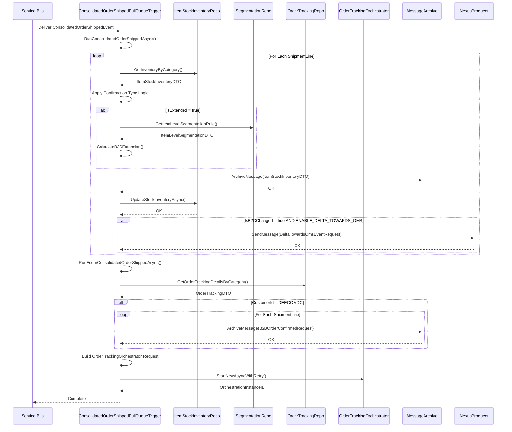

# b2b.sales.ConsolidatedOrderShipped - Technical Documentation

## 1. Overview

### Purpose
The `b2b.sales.ConsolidatedOrderShipped` is a kafka event that processes consolidated order shipment events. It orchestrates a multi-layer workflow to update inventory, manage order tracking, and handle e-commerce specific operations when orders are shipped from warehouses.

### Business Objective
- **Primary**: Update inventory availability (B2B and B2C buckets) based on shipment confirmations
- **Secondary**: Maintain order tracking and delivery status
- **Tertiary**: Generate inventory comparison reports for auditing
- **Quaternary**: Handle e-commerce specific engraving order workflows

### Scope
1. `b2b.sales.ConsolidatedOrderShipped` from Kakfa via Consumer Group: `$Default` and deserialized to `ConsolidatedOrderShippedEvent` messages and send to Service Bus Queue
2. Consolidated orders shipped across multiple warehouse types (TDC, ADC, 3PL)
3. Both PRELIMINARY and STANDARD confirmation types
4. B2B and B2C inventory domain management
5. Export and domestic order scenarios
6. Extended inventory calculations for store leverage scenarios
7. E-commerce engraving order processing

### High-Level Architecture

```
Kafka (b2b.sales.ConsolidatedOrderShipped)
    ↓
Service Bus Queue (ConsolidatedOrderShippedEvent)
    ├─→ RunConsolidatedOrderShippedAsync()
    │   ├─→ consolidatedOrderShippedL1B2BConfirm() [For each shipment line]
    │   │   ├─→ Update ItemStockInventory
    │   │   ├─→ Calculate B2C Extension (if applicable)
    │   │   └─→ Send Delta to OMS (if B2C changed)
    │   ├─→ updateItemLevelSegmentationHandlerAsync() [For each item]
    │   └─→ inventoryComparisonReportEventHandlerAsync() [If ENABLE_SNAPSHOT_FOR_ICR]
    │
    ├─→ RunEcomConsolidatedOrderShippedAsync()
    │   ├─→ Validate Customer Details
    │   └─→ b2bEngravingOrdersEventHandlerAsync() [If customer is DEECOMDC]
    │
    └─→ Order Tracking Orchestration
        ├─→ Determine OrderTrackingStatus (SHIPPED or INVOICED)
        ├─→ Group shipment lines by OrderId or PickingRouteId
        └─→ StartNewAsyncWithRetry(OrderTrackingOrchestrator) [If USE_ORDER_TRACKING_ORCHESTRATOR]
```

### Assumptions
1. **Service Bus Message Format**: Messages contain valid `ConsolidatedOrderShippedEvent` objects
2. **Database Consistency**: Item stock inventory records pre-exist in database
3. **Configuration Settings**: All feature flags and queue names are properly configured
4. **Correlation Context**: Messages carry proper correlation context for tracking
5. **Idempotency**: The trigger implementation expects potential reprocessing
6. **Order Grouping Logic**: Lines are grouped by OrderId for TDC/ADC, by PickingRouteId for other warehouses
7. **Warehouse Classification**: Three categories - TDC, ADC, and other 3PL providers

### Dependencies
- **Azure Service Bus**: Message queue trigger
- **Azure Durable Task**: Order tracking orchestrator execution
- **Database Repositories**:
  - `IOrderTrackingRepository`: Order tracking details
  - `IItemStockInventoryRepository`: Item-level inventory
  - `IItemLevelSegmentationRepository`: Item-level segmentation rules
  - `IItemStockWarehouseInventoryRepository`: Warehouse-level inventory
  - `IFulfilmentLevelSegmentationRepository`: Fulfillment-level segmentation rules
  - `IMessageArchiveRepository`: Message archival for audit trail
- **External Services**: Order tracking orchestrator
- **Mappers**: AutoMapper for request transformations
- **Helpers**: FormulaHelper for inventory calculations

---

## 2. End-to-End Flow

### Complete Execution Flow from Entry Point to Completion

```
ENTRY POINT: ServiceBus Trigger fires
    ↓
1. DESERIALIZATION
   - Extract ConsolidatedOrderShippedEvent from ServiceBusReceivedMessage
   - Input: Raw message bytes
   - Output: Strongly-typed ConsolidatedOrderShippedEvent object
   - Error: Return early if deserialization fails (implicit in GetInputAsync)
   ↓

2. PARALLEL EXECUTION START
   ├─→ BRANCH A: RunConsolidatedOrderShippedAsync()
   │   ├─→ 2A.1 NULL CHECK
   │   │   - Input: ConsolidatedOrderShippedEvent
   │   │   - If null → return early
   │   │   - Else → continue
   │   │   ↓
   │   ├─→ 2A.2 BUILD B2B CONFIRMATION REQUESTS
   │   │   - Input: Shipment.ShipmentLines
   │   │   - Process: Map each line to B2BOrderConfirmedRequest
   │   │   - Extract: ProductId, CountryOfOrigin, Hallmarking, Quantity, etc.
   │   │   - Store: Create Dictionary<string, string> with ItemCode, LineNo, OrderId
   │   │   - Output: List<B2BOrderConfirmedRequest> (one per shipment line)
   │   │   ↓
   │   ├─→ 2A.3 PROCESS B2B CONFIRMATIONS (ForEach in parallel)
   │   │   └─→ For each B2BOrderConfirmedRequest:
   │   │       - Call consolidatedOrderShippedL1B2BConfirm(request)
   │   │       - See Section 3.1 for detailed business logic
   │   │       ↓
   │   │       A. Call consolidatedOrderShippedEventHandlerAsync()
   │   │          - Fetch ItemStockInventory from database
   │   │          - Apply inventory calculations based on ConfirmationType
   │   │          - Calculate B2C extension (if IsExtended = true)
   │   │          - Update database with new quantities
   │   │       ↓
   │   │       B. Check if IsB2CChanged
   │   │          - If yes AND ENABLE_DELTA_TOWARDS_OMS:
   │   │            - Build DeltaTowardsOmsEventRequest
   │   │            - Send to NEXUS_PRODUCER_QUEUE_NAME
   │   │          - Log the result
   │   │       ↓
   │   ├─→ 2A.4 LOG CONFIRMATION COUNT
   │   │   - Message: "Sent {count} messages to B2B Confirmed queue"
   │   │   ↓
   │   ├─→ 2A.5 MAP TO ITEM STOCK ORCHESTRATOR REQUESTS
   │   │   - Input: List<B2BOrderConfirmedRequest>
   │   │   - Process: AutoMapper transforms to ItemStockOrchestratorRequest
   │   │   - Output: List<ItemStockOrchestratorRequest>
   │   │   ↓
   │   ├─→ 2A.6 UPDATE ITEM LEVEL SEGMENTATION (ForEach in parallel)
   │   │   └─→ For each ItemStockOrchestratorRequest:
   │   │       - Fetch ItemStockInventory from database
   │   │       - Call updateItemLevelSegmentationHandlerAsync()
   │   │       - Update item-level fulfillment rules
   │   │       - Return success/failure boolean
   │   │       ↓
   │   ├─→ 2A.7 LOG SEGMENTATION COUNT
   │   │   - Message: "Sent {count} messages to Item Segmentation queue"
   │   │   ↓
   │   ├─→ 2A.8 CHECK SNAPSHOT FLAG
   │   │   - If ENABLE_SNAPSHOT_FOR_ICR = true:
   │   │     └─→ 2A.8a. GENERATE INVENTORY COMPARISON REPORTS (ForEach in parallel)
   │   │         - For each ItemStockOrchestratorRequest:
   │   │           - Fetch ItemStockInventory
   │   │           - Build OmniInventoryAvailabilityReported event
   │   │           - Include B2B AVL, B2C AVL, B2B Prepared, B2C Prepared
   │   │           - Include inventory state (AVAILABLE, PREPARED)
   │   │           - Send to NEXUS_PRODUCER_QUEUE_NAME
   │   │         - Return empty string
   │   │     - Else:
   │   │       └─→ 2A.8b. LOG SNAPSHOT DISABLED
   │   │           - Message: "ENABLE_SNAPSHOT_FOR_ICR is {value}"
   │   │
   │
   ├─→ BRANCH B: RunEcomConsolidatedOrderShippedAsync()
   │   ├─→ 2B.1 NULL CHECK
   │   │   - Input: ConsolidatedOrderShippedEvent
   │   │   - If null → return early
   │   │   ↓
   │   ├─→ 2B.2 BUILD VALIDATION REQUEST
   │   │   - OrderId: ParentOrderId
   │   │   - FulfilmentId: Shipment.WarehouseCode
   │   │   - FulfilmentType: LocationType.WAREHOUSE
   │   │   ↓
   │   ├─→ 2B.3 VALIDATE CUSTOMER DETAILS
   │   │   - Call validateCustomerDetailsEventHandlerAsync(request)
   │   │   - Fetch OrderTracking record
   │   │   - Check if CustomerId in ECOMDCLIST or equals TDCCustomerId
   │   │   - Archive message for audit
   │   │   - Output: CustomerId string
   │   │   ↓
   │   ├─→ 2B.4 CHECK CUSTOMER ID
   │   │   - If customerId is empty:
   │   │     └─→ Log: "Customer Id is empty"
   │   │     └─→ Return
   │   │   ↓
   │   ├─→ 2B.5 CHECK IF DEECOMDC
   │   │   - If customerId == ReflexConstants.DEECOMDC:
   │   │     └─→ 2B.5a. BUILD SHIPMENT LINES FOR ENGRAVING
   │   │         - Map ShipmentLines to B2BOrderConfirmedRequest
   │   │         - Create request with same properties as B2B confirmation
   │   │         ↓
   │   │     └─→ 2B.5b. PROCESS ENGRAVING ORDERS (ForEach in parallel)
   │   │         - For each request:
   │   │           - Call b2bEngravingOrdersEventHandlerAsync()
   │   │           - Archive the message
   │   │           - Fetch ItemStockWarehouseInventory
   │   │           - If not found → Create new record
   │   │           - If exists → Add to existing quantity
   │   │           - Update warehouse inventory
   │   │         ↓
   │   │     └─→ 2B.5c. LOG ENGRAVING COUNT
   │   │         - Message: "Sent {count} messages to Ecom Engraving queue"
   │   │   ↓
   │   │   - Else:
   │   │     └─→ Log: "Customer Id {id} is not match with DEECOMDC"
   │
   │
   └─→ BRANCH C: Order Tracking Orchestration
       ├─→ 2C.1 DETERMINE ORDER STATUS
       │   - Default: OrderTrackingStatus.SHIPPED
       │   - If ConfirmationType = PRELIMINARY AND IsExport = true:
       │     └─→ Set: OrderTrackingStatus.INVOICED
       │   ↓
       ├─→ 2C.2 CHECK TRACKING ELIGIBILITY
       │   - Condition: ConfirmationType != PRELIMINARY OR
       │               (ConfirmationType = PRELIMINARY AND IsExport = true)
       │   - If false → Skip order tracking
       │   - If true → Continue
       │   ↓
       ├─→ 2C.3 CLASSIFY WAREHOUSE TYPE
       │   - Input: Shipment.WarehouseCode
       │   - isTDCorADC = (code != TdcSapId AND code != TDCFulfilmentId AND code != ADCFulfilmentId)
       │   ↓
       ├─→ 2C.4 GROUP SHIPMENT LINES
       │   - If isTDCorADC = true:
       │     └─→ Group by OrderId
       │   - Else (TDC or ADC):
       │     └─→ Group by PickingRouteId
       │   ↓
       ├─→ 2C.5 BUILD ORCHESTRATOR REQUEST (ForEach group)
       │   - ReferenceId: ParentOrderId
       │   - Channel: Channel.ToString()
       │   - FulfilmentUnitId: WarehouseCode
       │   - FunctionName: "ConsolidatedOrderShippedFullQueueTrigger"
       │   - OrderId: group.Key (OrderId or PickingRouteId)
       │   - OrderStatus: Determined in 2C.1
       │   - Type: EventType.B2B_CONSOLIDATED_ORDER_SHIPPED
       │   - OrderType: OrderType.TRANSFER
       │   - PackingSlipId: Warehouse-specific logic (see 3.2)
       │   - ShipmentId: Shipment.Id
       │   - ShipDate: Shipment.ShipDate
       │   - Market: Market.ToString()
       │   - IsExport: IsExport flag
       │   ↓
       ├─→ 2C.6 BUILD TRACKING LINES
       │   - Filter: Only include lines with Quantity > 0
       │   - For each line:
       │     - ItemCode: ProductId
       │     - CountryOfOrigin: CountryOfOrigin
       │     - HallMarkType: Hallmarking
       │     - ShipmentLineNumber: LotId
       │     - Qty: Quantity
       │   ↓
       ├─→ 2C.7 CHECK ORCHESTRATOR FLAG
       │   - If USE_ORDER_TRACKING_ORCHESTRATOR = true:
       │     └─→ Start DurableTask: client.StartNewAsyncWithRetry()
       │         - Input: OrderTrackingCommonOrchestratorRequest
       │         - Return from function
       │   - Else:
       │     └─→ TODO: Send to ORDER_TRACKING_QUEUE_NAME
       │         - Currently commented out
       │
       └─→ 2C.8 ERROR HANDLING
           - Catch all exceptions in order tracking block
           - Call: _loggerService.LogExceptionQueueErrorMessage()
           - Continue processing (do not throw)

   ↓

3. COMPLETION
   - All branches complete asynchronously
   - Function returns success
   - Message is marked as processed by Service Bus
```

---

## 3. Detailed Business Logic

### 3.1 B2B Order Confirmation Processing - consolidatedOrderShippedL1B2BConfirm

**Purpose**: Process a single B2B order line confirmation and update inventory levels

**Input**: 
- `B2BOrderConfirmedRequest` containing:
  - FulfilmentCode (Warehouse ID)
  - ItemCode (Product ID)
  - CountryOfOrigin
  - Hallmark (Hallmarking type)
  - ShippedQuantity (units shipped)
  - ConfirmationType (PRELIMINARY, STANDARD_FOLLOWING_PRELIMINARY, or other)
  - AllocatedFromB2BBucketQuantity (B2B bucket allocation)

**Processing Steps**:

#### Step 1: Fetch Inventory Record
- **Query**: Get ItemStockInventory by ItemCode, Hallmark, FulfilmentCode, CountryOfOrigin
- **If Not Found**:
  - Log warning: "Stock inventory record not found"
  - Set DeltaTowardsOMS = 0, DeltaTowardsReflex = 0, IsB2CChanged = false
  - Return early with zero impact

#### Step 2: Validate Shipped Quantity
- **Check**: ShippedQuantity > 0
- **If Not**: Log warning "Shipped quantity is zero or negative"
- **Action**: Continue processing anyway (bypass, not critical error)

#### Step 3: Validate B2B Bucket Allocation
- **Check**: AllocatedFromB2BBucketQuantity >= ShippedQuantity
- **If Not**: Log warning "Invalid request with AllocatedFromB2BBucketQuantity less than ShippedQuantity"
- **Action**: Continue processing anyway (bypass, not critical error)

#### Step 4: Apply Confirmation Type Logic

**If ConfirmationType = PRELIMINARY**:
```
PSC += ShippedQuantity
(Pre-Shipment Confirmation - placeholder for pending shipment)
```

**If ConfirmationType = STANDARD_FOLLOWING_PRELIMINARY**:
```
B2BAVL -= ShippedQuantity                    (B2B Available reduced)
PSC -= ShippedQuantity                       (Pre-Shipment reduced)
B2BPrepared -= ShippedQuantity               (B2B Prepared reduced)

Boundary Checks:
  IF B2BAVL < 0 → Set B2BAVL = 0 (log warning)
  IF B2BPrepared < 0 → Set B2BPrepared = 0 (log warning)
```

**If ConfirmationType = OTHER** (Direct confirmation without preliminary):
```
B2BPrepared -= ShippedQuantity               (B2B Prepared reduced)
B2BAVL -= ShippedQuantity                    (B2B Available reduced)

Boundary Checks:
  IF B2BPrepared < 0 → Set B2BPrepared = 0 (log warning)
  IF B2BAVL < 0 → Set B2BAVL = 0 (log warning)
```

#### Step 5: Calculate B2C Extension (if applicable)
- **Check**: ItemStockInventoryDto.IsExtended = true
- **If Yes**:
  - Call `extensionEventHelperCalculateB2CExtensionAsync()`
  - Recalculate B2C Available using store leverage
  - Calculate delta towards OMS
  - Update ItemStockInventoryDto.B2CAVL
- **If No**: Skip extension calculation

#### Step 6: Persist Changes
- Archive inventory DTO for audit trail
- Update database with new quantities
- Return ConsolidatedOrderShippedResponse with:
  - FulfilmentCode
  - ItemCode
  - CountryOfOrigin
  - Hallmark
  - DeltaTowardsOMS (change in B2C availability)
  - DeltaTowardsReflex (change in internal metric)
  - IsB2CChanged (boolean flag)

#### Step 7: Send Delta to OMS (conditional)
- **Check**: ENABLE_DELTA_TOWARDS_OMS feature flag = true AND IsB2CChanged = true
- **If Yes**:
  - Build DeltaTowardsOmsEventRequest
  - Set AdjustmentDate = DateTime.UtcNow
  - Set ReferenceId = New GUID
  - Set Location = Warehouse
  - Set Reason = ADJUSTMENT
  - Add InventoryQuantityDetail:
    - CountryOfOrigin
    - Hallmarking
    - Quantity = DeltaTowardsOMS
    - State = AVAILABLE, PICKABLE
  - Create NexusProducerRequest
  - Send to NEXUS_PRODUCER_QUEUE_NAME (currently TODO)
  - Log: "Sent delta towards OMS"
- **If No**: Log feature flag/change status

**Output**: None (async void), but triggers downstream events

---

### 3.2 Order Tracking Request Building

**Purpose**: Create structured requests for order tracking orchestration

**Key Decision Point - PackingSlipId Assignment**:
```
IF WarehouseCode = TDCFulfilmentId:
  PackingSlipId = ParentOrderId
ELSE:
  PackingSlipId = Shipment.PackingSlipId
```

**Grouping Logic**:
```
IF WarehouseCode NOT IN [TdcSapId, TDCFulfilmentId, ADCFulfilmentId]:
  # 3PL warehouse
  GroupBy = OrderId
ELSE:
  # TDC or ADC warehouse
  GroupBy = PickingRouteId
```

**Order Status Determination**:
```
Default Status = SHIPPED

IF ConfirmationType = PRELIMINARY AND IsExport = true:
  Status = INVOICED
```

**Lines Filter**:
```
Only include lines where Quantity > 0
```

---

### 3.3 E-Commerce Engraving Order Processing

**Purpose**: Process e-commerce engraving orders for DEECOMDC customer

**Flow**:

1. **Validate Customer**: Fetch OrderTracking record
2. **Check Customer List**: Is customer in ECOMDCLIST or TDCCustomerId?
3. **If DEECOMDC**:
   - Build B2BOrderConfirmedRequest for each shipment line
   - For each request:
     - Archive the request message
     - Fetch ItemStockWarehouseInventory
     - If not found → Create new record (Qnty = ShippedQuantity)
     - If found → Add to existing quantity
     - Update warehouse inventory
4. **If Other Customer**: Log mismatch, do not process

---

## 4. Calculation Logic

### 4.1 Inventory Quantity Adjustments

#### B2B Available (B2BAVL) Calculation
```
Formula: B2BAVL = Total B2B Inventory - (B2BPrepared + PSC)

When B2B order shipped:
  B2BAVL_new = B2BAVL_old - ShippedQuantity

Lower Bound: Cannot go below 0
If B2BAVL_new < 0:
  B2BAVL_new = 0  (log warning)
```

**Variables**:
- ShippedQuantity: Units being shipped (from request)
- B2BAVL: Total available to B2B domain
- B2BPrepared: B2B units in prepared state

**Data Source**: ItemStockInventory table

**Units**: Count (discrete units of inventory item)

**Precision**: Integer (no decimals)

**Null Handling**: Treat as 0

---

#### B2B Prepared (B2BPrepared) Calculation
```
For PRELIMINARY Confirmation:
  No change to B2BPrepared
  
For STANDARD_FOLLOWING_PRELIMINARY:
  B2BPrepared_new = B2BPrepared_old - ShippedQuantity
  
For DIRECT Confirmation:
  B2BPrepared_new = B2BPrepared_old - ShippedQuantity

Lower Bound: Cannot go below 0
If B2BPrepared_new < 0:
  B2BPrepared_new = 0  (log warning)
```

---

#### Pre-Shipment Confirmation (PSC) Calculation
```
For PRELIMINARY Confirmation:
  PSC_new = PSC_old + ShippedQuantity
  (Accumulate pre-shipment confirmations)
  
For STANDARD_FOLLOWING_PRELIMINARY:
  PSC_new = PSC_old - ShippedQuantity
  (Release from pre-shipment to actual shipment)
  
For DIRECT Confirmation:
  No change to PSC
```

---

### 4.2 B2C Extension Calculation

**Purpose**: Calculate B2C availability considering store leverage percentage

**When Triggered**:
- ItemStockInventoryDto.IsExtended = true
- Only on PRELIMINARY and STANDARD_FOLLOWING_PRELIMINARY confirmations

**Calculation Process**:

#### Step 1: Fetch Item-Level Segmentation Rule
```
Rule Source: ItemLevelSegmentationRepository

Query Parameters:
  - FulfilmentCode (Warehouse)
  - Hallmark
  - ItemCode
  - CountryOfOrigin

Output: ItemLevelSegmentationDTO with:
  - StoreLeveragePercentage
  - IsActive
```

#### Step 2: If No Item-Level Rule or Not Active
```
Fallback to Fulfillment-Level Rule

Query Parameters: Same as above
  
Output: FulfilmentLevelSegmentationDTO with:
  - StoreLeveragePercentage
```

#### Step 3: Calculate B2C Available
```
Formula: B2CAVL_new = FormulaHelper.CalculateB2CAvl(ItemStockInventoryDto)

Internal Logic (based on IsExtended):
  IF IsExtended = true:
    B2CAVL = (Total Inventory - B2BAVL - B2BPrepared) * StoreLeveragePercentage
  ELSE:
    B2CAVL = Direct allocation
    
Units: Integer (item count)
Boundary: Cannot go below 0
Null Handling: If StoreLeveragePercentage is null, use 0%
```

#### Step 4: Calculate Delta Towards OMS
```
Formula: DeltaTowardsOMS = B2CAVL_new - B2CAVL_old

Meaning:
  Positive value = B2C availability increased (benefit to e-commerce)
  Negative value = B2C availability decreased (constraint on e-commerce)
  Zero = No change in B2C availability

Action:
  IF DeltaTowardsOMS != 0:
    Set IsB2CChanged = true
    Send adjustment event to OMS
```

---

### 4.3 B2C Extended Calculation
```
Formula: B2CExtended = FormulaHelper.CalculateActualB2BAvailable(ItemStockInventoryDto)

Purpose: Recalculate effective B2B available when items are extended to B2C
```

---

## 5. Database Documentation

### 5.1 ItemStockInventory - Core Inventory Table

**Purpose**: Maintains real-time inventory levels by item, warehouse, hallmark, and country of origin

**Read Operations**:

```
Query: GetInventoryByCategory()

Filters:
  - ItemCode (Product identifier)
  - Hallmark (Hallmarking type)
  - FulfilmentCode (Warehouse code)
  - CountryOfOrigin (Origin country)

Expected Result: Single ItemStockInventoryDTO or null

Indexes Used: Composite index on (ItemCode, Hallmark, FulfilmentCode, CountryOfOrigin)
```

**Update Operations**:

```
Operation: UpdateStockInventoryAsync()

Columns Modified:
  - B2BAVL: B2B Available quantity
  - B2BPrepared: B2B units in prepared state
  - PSC: Pre-shipment confirmation count
  - B2CAVL: B2C available quantity (if extended)
  - B2CExtended: Extended B2C calculation (if applicable)
  - IsExtended: Flag indicating extension rules apply

Update Condition:
  WHERE ItemCode = @ItemCode 
    AND Hallmark = @Hallmark 
    AND FulfilmentCode = @FulfilmentCode 
    AND CountryOfOrigin = @CountryOfOrigin

Transaction Boundary:
  - Individual item updates are atomic
  - No cross-item transactions in this trigger
  - Optimistic concurrency (version field assumed)

Triggered Events:
  - Inventory availability change event (implicit)
  - Downstream segmentation updates
```

---

### 5.2 OrderTracking - Order Tracking Details Table

**Purpose**: Tracks shipment and delivery status of orders

**Read Operations**:

```
Query: GetOrderTrackingDetailsByCategory()

Filters:
  - OrderId (Parent order ID)
  - FulfilmentType (WAREHOUSE type)
  - FulfilmentId (Warehouse code)

Expected Result: Single OrderTrackingDTO or null

Fields Retrieved:
  - CustomerId (for e-commerce validation)
  - OrderId
  - ShipmentId
  - Status
  - DeliveryDate
```

**No Direct Updates in This Trigger**:
- Order tracking is updated via Order Tracking Orchestrator
- This trigger initiates the orchestrator, not the database update

---

### 5.3 ItemLevelSegmentation - Item-Level Business Rules

**Purpose**: Defines store leverage percentage and segmentation rules at item level

**Read Operations**:

```
Query: GetItemLevelFulfilmentyByCategory()

Filters:
  - FulfilmentCode
  - Hallmark
  - ItemCode
  - CountryOfOrigin

Expected Result: ItemLevelSegmentationDTO or null

Fields Retrieved:
  - StoreLeveragePercentage (B2C allocation percentage)
  - IsActive (rule active/inactive flag)
```

**Usage in Trigger**:
- Determine B2C extension calculation method
- Fallback to fulfillment-level rule if inactive

---

### 5.4 FulfilmentLevelSegmentation - Warehouse-Level Business Rules

**Purpose**: Default store leverage percentage when item-level rules don't apply

**Read Operations**:

```
Query: GetFulfilmentLevelFulfilmentyByCategory()

Filters:
  - FulfilmentCode
  - Hallmark
  - ItemCode
  - CountryOfOrigin

Expected Result: FulfilmentLevelSegmentationDTO or null

Fields Retrieved:
  - StoreLeveragePercentage (default B2C allocation)
```

**Fallback Logic**: Used when ItemLevelSegmentation is null or inactive

---

### 5.5 ItemStockWarehouseInventory - E-Commerce Engraving Inventory

**Purpose**: Tracks warehouse-specific inventory for e-commerce engraving orders

**Read Operations**:

```
Query: GetWarehouseInventoryByCategory()

Filters:
  - ItemCode
  - FulfilmentId (Warehouse ID)

Expected Result: ItemStockWarehouseInventoryDTO or null
```

**Insert Operations**:

```
When Record Not Found:
  Create new record with:
    - ItemCode = ItemCode
    - FulfilmentId = FulfilmentCode
    - Qnty = ShippedQuantity

Result: New warehouse-specific inventory created
```

**Update Operations**:

```
When Record Found:
  Qnty += ShippedQuantity

Operation: UpdateWarehouseStockInventoryAsync()
```

---

### 5.6 MessageArchive - Audit Trail Table

**Purpose**: Archive all processed messages for compliance and debugging

**Insert Operations**:

```
Records Archived:
  1. B2BOrderConfirmedRequest (one per shipment line)
  2. ItemStockInventoryDTO (before and after updates)
  3. ValidateCustomerIdRequest
  4. B2BOrderConfirmedRequest (e-commerce engraving)

Insertion: Asynchronous, non-blocking
Purpose: Create immutable audit trail
```

---

## 6. State Changes

### 6.1 ItemStockInventory State Transitions

```
Initial State: Loaded from database
  ├─ B2BAVL = X
  ├─ B2BPrepared = Y
  ├─ PSC = Z
  ├─ B2CAVL = W
  └─ IsExtended = true/false

        ↓

Confirmation Type Check
  ├─ If PRELIMINARY:
  │   └─ PSC += ShippedQuantity
  ├─ If STANDARD_FOLLOWING_PRELIMINARY:
  │   ├─ B2BAVL -= ShippedQuantity
  │   ├─ PSC -= ShippedQuantity
  │   └─ B2BPrepared -= ShippedQuantity
  └─ If DIRECT:
      ├─ B2BAVL -= ShippedQuantity
      └─ B2BPrepared -= ShippedQuantity

        ↓

Boundary Checks
  ├─ If B2BAVL < 0 → B2BAVL = 0
  └─ If B2BPrepared < 0 → B2BPrepared = 0

        ↓

Extension Check
  └─ If IsExtended = true:
      ├─ B2CExtended = CalculateActualB2BAvailable()
      ├─ B2CAVL_new = CalculateB2CAvl()
      └─ If B2CAVL_new != B2CAVL_old:
          └─ IsB2CChanged = true
              └─ DeltaTowardsOMS = B2CAVL_new - B2CAVL_old

        ↓

Final State: Persisted to database
  ├─ B2BAVL = X - ShippedQuantity (or 0 if negative)
  ├─ B2BPrepared = Y - ShippedQuantity (or 0 if negative)
  ├─ PSC = Updated per confirmation type
  ├─ B2CAVL = Calculated if extended
  └─ B2CExtended = Recalculated
```

---

### 6.2 OrderTracking State Transition

```
Initial State: Order exists in OrderTracking table
  └─ Status = Previous status

        ↓

Orchestrator Invocation
  ├─ ReferenceId = ParentOrderId
  ├─ OrderStatus = SHIPPED or INVOICED (per confirmation type)
  ├─ Type = B2B_CONSOLIDATED_ORDER_SHIPPED
  └─ Lines = Mapped from shipment lines (Quantity > 0)

        ↓

Order Tracking Orchestrator (async)
  └─ Updates OrderTracking record
      └─ Status = SHIPPED or INVOICED
```

---

## 7. Sequence Diagram



---

## 8. Flow Chart

```mermaid
flowchart TD
    Start([ServiceBus Trigger Fired]) --> Deser[Deserialize ConsolidatedOrderShippedEvent]
    Deser --> RunB2B[RunConsolidatedOrderShippedAsync]
    
    RunB2B --> B2BNull{Event is null?}
    B2BNull -->|Yes| B2BReturn[Return]
    B2BNull -->|No| BuildReqs[Build B2BOrderConfirmedRequests]
    
    BuildReqs --> ForEachLine{For each ShipmentLine}
    ForEachLine -->|Next Line| ConfirmB2B[consolidatedOrderShippedL1B2BConfirm]
    
    ConfirmB2B --> FetchInv[GetInventoryByCategory]
    FetchInv --> InvNull{Record Found?}
    InvNull -->|No| LogMissing["Log Warning: Stock inventory not found"]
    LogMissing --> ReturnZero[Return with DeltaTowardsOMS=0]
    
    InvNull -->|Yes| ArchiveInv[Archive ItemStockInventoryDTO]
    ArchiveInv --> ValidateQty{ShippedQuantity > 0?}
    ValidateQty -->|No| LogQtyWarn["Log Warning: Zero/negative quantity"]
    ValidateQty -->|Yes| CheckAlloc{AllocatedFromB2B >= ShippedQty?}
    
    CheckAlloc -->|No| LogAllocWarn["Log Warning: Allocation invalid"]
    CheckAlloc -->|Yes| CheckConfType{ConfirmationType?}
    
    LogQtyWarn --> CheckConfType
    LogAllocWarn --> CheckConfType
    
    CheckConfType -->|PRELIMINARY| AddPSC["PSC += ShippedQuantity"]
    CheckConfType -->|STANDARD_FOLLOWING| SubB2B["B2BAVL -= ShippedQuantity<br/>PSC -= ShippedQuantity<br/>B2BPrepared -= ShippedQuantity"]
    CheckConfType -->|DIRECT| SubDirect["B2BPrepared -= ShippedQuantity<br/>B2BAVL -= ShippedQuantity"]
    
    AddPSC --> BoundaryCheck{IsExtended?}
    SubB2B --> BoundaryCheck
    SubDirect --> BoundaryCheck
    
    BoundaryCheck -->|Yes| GetItemSeg[GetItemLevelSegmentationRule]
    BoundaryCheck -->|No| UpdateDB[UpdateStockInventoryAsync]
    
    GetItemSeg --> CalcB2C["CalculateB2CExtension<br/>B2CAVL_new = CalculateB2CAvl()"]
    CalcB2C --> CompareB2C{B2CAVL_new != B2CAVL_old?}
    
    CompareB2C -->|Yes| CalcDelta["DeltaTowardsOMS = B2CAVL_new - B2CAVL_old<br/>IsB2CChanged = true"]
    CompareB2C -->|No| NoChange["DeltaTowardsOMS = 0<br/>IsB2CChanged = false"]
    
    CalcDelta --> UpdateDB
    NoChange --> UpdateDB
    
    UpdateDB --> CheckDeltaFlag{ENABLE_DELTA_TOWARDS_OMS<br/>AND IsB2CChanged?}
    CheckDeltaFlag -->|Yes| BuildDelta[Build DeltaTowardsOmsEventRequest]
    CheckDeltaFlag -->|No| LogDelta["Log feature flag status"]
    
    BuildDelta --> SendNexus["SendMessage to NEXUS_PRODUCER_QUEUE"]
    SendNexus --> LogDelta
    LogDelta --> ForEachLine
    ForEachLine -->|Done| MapSegmentation[Map to ItemStockOrchestratorRequests]
    
    MapSegmentation --> ForEachSeg{For each ItemStockOrchestratorRequest}
    ForEachSeg -->|Next| UpdateSegmentation[updateItemLevelSegmentationHandlerAsync]
    UpdateSegmentation --> ForEachSeg
    ForEachSeg -->|Done| CheckSnapshot{ENABLE_SNAPSHOT_FOR_ICR?}
    
    CheckSnapshot -->|Yes| ForEachComp{For each request}
    CheckSnapshot -->|No| LogSnapshot["Log: ENABLE_SNAPSHOT_FOR_ICR disabled"]
    
    ForEachComp -->|Next| GenReport[inventoryComparisonReportEventHandlerAsync]
    GenReport --> BuildOmni[Build OmniInventoryAvailabilityReported]
    BuildOmni --> SendSnapshot["SendMessage to NEXUS_PRODUCER_QUEUE"]
    SendSnapshot --> ForEachComp
    ForEachComp -->|Done| LogSnapshot
    
    LogSnapshot --> RunEcom[RunEcomConsolidatedOrderShippedAsync]
    RunEcom --> EcomNull{Event is null?}
    EcomNull -->|Yes| EcomReturn[Return]
    EcomNull -->|No| ValidateCustomer[validateCustomerDetailsEventHandlerAsync]
    
    ValidateCustomer --> FetchOrder[GetOrderTrackingDetailsByCategory]
    FetchOrder --> CheckCustomer{CustomerId in ECOMDCLIST<br/>or is TDCCustomerId?}
    
    CheckCustomer -->|No| ArchiveVal[Archive ValidateCustomerIdRequest]
    ArchiveVal --> ReturnEmpty["Return empty customerId"]
    CheckCustomer -->|Yes| ReturnId["Return CustomerId"]
    
    ReturnEmpty --> CheckEmpty{CustomerId empty?}
    ReturnId --> CheckEmpty
    
    CheckEmpty -->|Yes| LogEmpty["Log: Customer Id is empty"]
    CheckEmpty -->|No| CheckDEECOM{CustomerId = DEECOMDC?}
    
    CheckDEECOM -->|No| LogMismatch["Log: Customer Id does not match DEECOMDC"]
    CheckDEECOM -->|Yes| BuildEngrave[Build B2BOrderConfirmedRequest for each line]
    
    BuildEngrave --> ForEachEngrave{For each request}
    ForEachEngrave -->|Next| EngravAsync[b2bEngravingOrdersEventHandlerAsync]
    
    EngravAsync --> ArchiveEngrave[Archive request]
    ArchiveEngrave --> GetWarehouse[GetWarehouseInventoryByCategory]
    GetWarehouse --> WarehouseNull{Record Found?}
    
    WarehouseNull -->|No| CreateWarehouse[Create new warehouse inventory record]
    WarehouseNull -->|Yes| AddQnty["Qnty += ShippedQuantity"]
    
    CreateWarehouse --> UpdateWarehouse[UpdateWarehouseStockInventoryAsync]
    AddQnty --> UpdateWarehouse
    UpdateWarehouse --> ForEachEngrave
    ForEachEngrave -->|Done| LogEngrave["Log: Sent {count} messages to Ecom Engraving queue"]
    
    LogEmpty --> OrderTracking[Order Tracking Orchestration]
    LogMismatch --> OrderTracking
    LogEngrave --> OrderTracking
    EcomReturn --> OrderTracking
    B2BReturn --> OrderTracking
    
    OrderTracking --> SetStatus["Default OrderStatus = SHIPPED"]
    SetStatus --> CheckPrelim{ConfirmationType = PRELIMINARY<br/>AND IsExport?}
    
    CheckPrelim -->|Yes| SetInvoiced["OrderStatus = INVOICED"]
    CheckPrelim -->|No| CheckEligible{ConfirmationType != PRELIMINARY<br/>OR<br/>PRELIMINARY AND IsExport?}
    
    SetInvoiced --> CheckEligible
    CheckEligible -->|No| SkipTracking["Skip order tracking"]
    CheckEligible -->|Yes| ClassifyWH[ClassifyWarehouseType]
    
    ClassifyWH --> GroupLines{Group by OrderId<br/>or PickingRouteId?}
    GroupLines -->|3PL| GroupOrderId["Group by OrderId"]
    GroupLines -->|TDC/ADC| GroupPickRoute["Group by PickingRouteId"]
    
    GroupOrderId --> ForEachGroup{For each group}
    GroupPickRoute --> ForEachGroup
    
    ForEachGroup -->|Next| BuildTrack[Build OrderTrackingCommonOrchestratorRequest]
    BuildTrack --> FilterLines["Filter lines where Quantity > 0"]
    FilterLines --> MapLines[Map to OrderTrackingLine]
    MapLines --> CheckOrch{USE_ORDER_TRACKING_ORCHESTRATOR?}
    
    CheckOrch -->|Yes| StartOrch["StartNewAsyncWithRetry(OrderTrackingOrchestrator)"]
    CheckOrch -->|No| TodoTrack["TODO: Send to ORDER_TRACKING_QUEUE"]
    
    StartOrch --> OrchReturn[Return from function]
    TodoTrack --> ForEachGroup
    OrchReturn --> ForEachGroup
    ForEachGroup -->|Done| TryCatch{Exception caught?}
    
    SkipTracking --> TryCatch
    TryCatch -->|Yes| LogError["LogExceptionQueueErrorMessage"]
    TryCatch -->|No| Success[Continue]
    
    LogError --> End([Function Complete])
    Success --> End
```



---

## 9. Decision Tree

```
ConsolidatedOrderShippedEvent Received
│
├─ RunConsolidatedOrderShippedAsync()
│  │
│  └─ Event is null?
│     ├─ YES → Return
│     └─ NO → Continue
│        │
│        ├─ For each ShipmentLine
│        │  │
│        │  ├─ consolidatedOrderShippedL1B2BConfirm()
│        │  │  │
│        │  │  ├─ Inventory record found?
│        │  │  │  ├─ NO → Log warning, return zero impact
│        │  │  │  └─ YES → Continue
│        │  │  │
│        │  │  ├─ ConfirmationType?
│        │  │  │  ├─ PRELIMINARY → PSC += Qty
│        │  │  │  ├─ STANDARD_FOLLOWING_PRELIMINARY → B2BAVL -= Qty, PSC -= Qty, B2BPrepared -= Qty
│        │  │  │  └─ OTHER → B2BPrepared -= Qty, B2BAVL -= Qty
│        │  │  │
│        │  │  ├─ IsExtended?
│        │  │  │  ├─ YES → Calculate B2C extension
│        │  │  │  │  └─ IsB2CChanged?
│        │  │  │  │     ├─ YES → Calculate DeltaTowardsOMS
│        │  │  │  │     └─ NO → DeltaTowardsOMS = 0
│        │  │  │  └─ NO → Skip extension calculation
│        │  │  │
│        │  │  └─ Update inventory, check ENABLE_DELTA_TOWARDS_OMS
│        │  │     └─ YES AND IsB2CChanged → Send to NexusProducer
│        │  │
│        │  ├─ updateItemLevelSegmentationHandlerAsync()
│        │  │  └─ Update item-level fulfillment rules
│        │  │
│        │  └─ ENABLE_SNAPSHOT_FOR_ICR?
│        │     ├─ YES → inventoryComparisonReportEventHandlerAsync()
│        │     │  └─ Build OmniInventoryAvailabilityReported
│        │     │  └─ Send to NexusProducer
│        │     └─ NO → Log disabled flag
│        │
├─ RunEcomConsolidatedOrderShippedAsync()
│  │
│  └─ Event is null?
│     ├─ YES → Return
│     └─ NO → Continue
│        │
│        ├─ validateCustomerDetailsEventHandlerAsync()
│        │  │
│        │  ├─ Fetch OrderTracking record
│        │  └─ CustomerId in ECOMDCLIST or TDCCustomerId?
│        │     ├─ YES → Return CustomerId
│        │     └─ NO → Return empty
│        │
│        └─ CustomerId empty?
│           ├─ YES → Log and return
│           └─ NO → Continue
│              │
│              └─ CustomerId = DEECOMDC?
│                 ├─ YES → For each shipment line
│                 │        └─ b2bEngravingOrdersEventHandlerAsync()
│                 │           ├─ Archive message
│                 │           ├─ Warehouse inventory found?
│                 │           │  ├─ NO → Create new record
│                 │           │  └─ YES → Add to quantity
│                 │           └─ Update warehouse inventory
│                 └─ NO → Log mismatch
│
└─ Order Tracking Orchestration
   │
   ├─ Determine OrderStatus
   │  └─ ConfirmationType = PRELIMINARY AND IsExport?
   │     ├─ YES → Status = INVOICED
   │     └─ NO → Status = SHIPPED
   │
   ├─ Check Tracking Eligibility
   │  └─ ConfirmationType != PRELIMINARY OR (PRELIMINARY AND IsExport)?
   │     ├─ YES → Continue
   │     └─ NO → Skip order tracking
   │
   ├─ Classify Warehouse Type
   │  └─ WarehouseCode in [TdcSapId, TDCFulfilmentId, ADCFulfilmentId]?
   │     ├─ YES → Group by PickingRouteId
   │     └─ NO → Group by OrderId
   │
   ├─ For each group
   │  │
   │  ├─ Build OrderTrackingCommonOrchestratorRequest
   │  ├─ Filter lines: Quantity > 0
   │  ├─ Assign PackingSlipId
   │  │  └─ WarehouseCode = TDCFulfilmentId?
   │  │     ├─ YES → Use ParentOrderId
   │  │     └─ NO → Use Shipment.PackingSlipId
   │  │
   │  └─ USE_ORDER_TRACKING_ORCHESTRATOR?
   │     ├─ YES → StartNewAsyncWithRetry(OrderTrackingOrchestrator)
   │     └─ NO → TODO: Send to ORDER_TRACKING_QUEUE_NAME
   │
   └─ Error Handling
      └─ Exception in order tracking?
         └─ YES → LogExceptionQueueErrorMessage, continue
```

---

## 10. Error Handling

### 10.1 Validation Errors

| Error | Condition | Handling | Recovery |
|-------|-----------|----------|----------|
| Missing Inventory | ItemStockInventory not found | Log warning (bypass) | Return zero impact |
| Zero Quantity | ShippedQuantity <= 0 | Log warning (bypass) | Continue processing |
| Invalid Allocation | AllocatedFromB2BBucketQuantity < ShippedQuantity | Log warning (bypass) | Continue processing |
| Negative B2BAVL | Calculation results in negative | Log warning, set to 0 | Prevent data corruption |
| Negative B2BPrepared | Calculation results in negative | Log warning, set to 0 | Prevent data corruption |

### 10.2 Database Errors

| Error | Handling | Recovery |
|-------|----------|----------|
| Query failure | Database connection exception | Caught at trigger level, logged |
| Update failure | Concurrency conflict | Depends on optimistic locking strategy |
| Archive failure | Message archival exception | Non-blocking, logged |

### 10.3 Order Tracking Errors

| Error | Condition | Handling | Recovery |
|-------|-----------|----------|----------|
| Orchestrator start fails | DurableTask exception | Caught in try-catch block | Log and continue |
| Invalid grouping | Empty groups | Skip group, log |

### 10.4 Exception Propagation

```
Try-Catch Block: Order Tracking section only
├─ Catches: All exceptions in order tracking logic
├─ Logging: LogExceptionQueueErrorMessage with:
│   ├─ Exception object
│   ├─ Queue name
│   ├─ Message ID
│   └─ Event data
└─ Action: Continue processing (do not re-throw)

Other Sections: No explicit error handling
├─ Exceptions bubble up to Azure Functions runtime
├─ Service Bus message handling depends on function outcome
└─ Recommendation: Add try-catch around B2B and Ecom sections
```

---

## 11. Performance Considerations

### 11.1 Query Optimization

| Operation | Index Required | Filter Criteria |
|-----------|-----------------|-----------------|
| GetInventoryByCategory | Composite index | ItemCode, Hallmark, FulfilmentCode, CountryOfOrigin |
| GetOrderTrackingDetailsByCategory | Index on OrderId, FulfilmentType, FulfilmentId | Subset of tracking records |
| GetItemLevelSegmentationRule | Index on FulfilmentCode, Hallmark, ItemCode, CountryOfOrigin | Specific item rules |
| GetWarehouseInventoryByCategory | Index on ItemCode, FulfilmentId | Subset of warehouse records |

### 11.2 Complexity Analysis

**Time Complexity**:
- **Best Case**: O(n) where n = number of shipment lines
- **Average Case**: O(n × m) where n = lines, m = segmentation lookups
- **Worst Case**: O(n × m × p) where p = fallback segmentation lookups

**Space Complexity**:
- O(n) for in-memory request lists
- O(m) for orchestrator requests

### 11.3 Bottlenecks

1. **Database Queries**: Sequential per-line queries
   - **Mitigation**: Batch queries if possible
   - **Impact**: ~10-100ms per line depending on database latency

2. **Parallel Async Operations**: ForEach with async/await
   - **Current**: Uses fire-and-forget pattern (no await)
   - **Risk**: Exceptions in parallel tasks not awaited
   - **Recommendation**: Use Task.WhenAll() instead

3. **Message Archival**: Synchronous archival per message
   - **Impact**: ~5-20ms per archive
   - **Mitigation**: Batch archive or async queue

### 11.4 Caching Opportunities

| Data | Cache Duration | Key | Benefit |
|------|-----------------|-----|---------|
| Segmentation Rules | 1 hour | FulfilmentCode + Hallmark + ItemCode | Reduce database queries for extended items |
| Warehouse Classification | Permanent | WarehouseCode | Avoid re-checking warehouse type |
| ECOM DC List | 24 hours | None | Cache split-by-comma list |

---

## 12. Security

### 12.1 Authentication & Authorization

- **Service Bus**: Connection string authentication (Azure Managed Identity recommended)
- **Database**: SQL authentication or Managed Identity
- **Function App**: Run under service principal with least-privilege role

### 12.2 Data Sensitivity

| Data | Sensitivity | Handling |
|------|-------------|----------|
| OrderId | Medium | Logged, archived in messages |
| ItemCode | Low | Used in queries, logged |
| WarehouseCode | Low | Used for routing |
| Quantity | Medium | Tracked in inventory |
| CustomerID | High | Validated before use, not exposed in logs |

### 12.3 SQL Injection Prevention

- **Status**: Safe - uses parameterized queries through repository pattern
- **Repositories**: Assumed to use safe query builders (EF Core, Dapper, etc.)
- **Input**: Enum values and database-sourced IDs, no user input

### 12.4 Message Validation

```
Validation Points:
1. Event deserialization (implicit in GetInputAsync)
2. Enum validation (ConfirmationType, Channel)
3. Null checks before processing
4. Quantity validation (>= 0)
```

### 12.5 Logging Security

- ⚠️ **Risk**: Exception logs may contain sensitive data
- **Mitigation**: Use structured logging with masked fields
- **Recommendation**: Exclude OrderId and ItemCode from error logs

---

## 13. Configuration

### 13.1 Environment Variables / Configuration Settings

| Setting | Type | Purpose | Impact |
|---------|------|---------|--------|
| `CONSOLIDATED_ORDER_SHIPPED_REFLEX_QUEUE_NAME` | String | Service Bus queue name | Trigger routing |
| `ServiceBusConnectionString` | String | Service Bus connection | Authentication |
| `USE_ORDER_TRACKING_ORCHESTRATOR` | Boolean | Durable task vs queue | Orchestration method |
| `ENABLE_DELTA_TOWARDS_OMS` | Boolean | OMS integration | Inventory synchronization |
| `ENABLE_SNAPSHOT_FOR_ICR` | Boolean | Inventory comparison reports | Audit trail generation |
| `ORDER_TRACKING_QUEUE_NAME` | String | Order tracking queue (TODO) | Fallback routing |
| `NEXUS_PRODUCER_QUEUE_NAME` | String | Nexus queue | External system sync |
| `PRODUCT_UNITS` | String | Product unit measurement | Inventory reporting |

### 13.2 Feature Flags

```csharp
// Current flags in ApplicationConfig:
USE_ORDER_TRACKING_ORCHESTRATOR  // Default: likely true
ENABLE_DELTA_TOWARDS_OMS         // Default: likely true
ENABLE_SNAPSHOT_FOR_ICR          // Default: likely true
```

### 13.3 Default Values

```csharp
OrderTrackingStatus         = SHIPPED (unless PRELIMINARY+EXPORT)
IsExtended                  = false (unless item configuration)
StoreLeveragePercentage     = 0 (if no rule found)
```

---

## 14. Complete Data Flow

### 14.1 Data Transformation Journey

```
Service Bus Message (Binary)
    ↓
GetInputAsync<ConsolidatedOrderShippedEvent>()
    ↓ [Deserialization]
ConsolidatedOrderShippedEvent
    ├─ ShipmentLines array
    ├─ Shipment object
    │  ├─ WarehouseCode
    │  ├─ ConfirmationType
    │  └─ ShipmentLines
    ├─ ParentOrderId
    ├─ Channel
    ├─ IsExport
    └─ Market

    ↓ [Transformation 1: B2B Confirmation]

B2BOrderConfirmedRequest (per line)
    ├─ FulfilmentCode
    ├─ ItemCode
    ├─ CountryOfOrigin
    ├─ Hallmark
    ├─ ShippedQuantity
    ├─ ConfirmationType
    ├─ AllocatedFromB2BBucketQuantity
    └─ UniqueIdentifiers

    ↓ [Database Lookup]

ItemStockInventoryDTO
    ├─ B2BAVL
    ├─ B2BPrepared
    ├─ PSC
    ├─ B2CAVL
    ├─ IsExtended
    └─ B2COrg (if extended)

    ↓ [Calculation 1: Inventory Update]

ItemStockInventoryDTO (Updated)
    ├─ B2BAVL (decremented)
    ├─ B2BPrepared (adjusted)
    ├─ PSC (adjusted)
    ├─ B2CAVL (recalculated if extended)
    └─ B2CExtended (recalculated)

    ↓ [Transformation 2: Delta Event]

DeltaTowardsOmsEventRequest
    ├─ AdjustmentDate
    ├─ ReferenceId
    ├─ ProductId
    ├─ ProductUnits
    ├─ Location
    ├─ Reason
    └─ QuantityDetails (with DeltaTowardsOMS)

    ↓ [Wrapping]

NexusProducerRequest(Inventory_B2CInventoryAdjusted, DeltaTowardsOmsEventRequest)

    ↓ [Service Bus Serialization]

Service Bus Message → NEXUS_PRODUCER_QUEUE_NAME

---

[Parallel Path: Ecom Engraving]

ConsolidatedOrderShippedEvent
    ↓ [Validation]
OrderTrackingDTO (for customer check)
    ↓ [Customer ID Extraction & Validation]
B2BOrderConfirmedRequest (for e-com lines)
    ↓ [Database Lookup]
ItemStockWarehouseInventoryDTO
    ↓ [Quantity Update]
ItemStockWarehouseInventoryDTO (Updated)

---

[Parallel Path: Order Tracking]

ConsolidatedOrderShippedEvent
    ↓ [Status Determination]
OrderTrackingStatus (SHIPPED or INVOICED)
    ↓ [Grouping]
Grouped ShipmentLines
    ↓ [Transformation 3: Orchestrator Request]
OrderTrackingCommonOrchestratorRequest
    ├─ ReferenceId
    ├─ Channel
    ├─ FulfilmentUnitId
    ├─ OrderStatus
    ├─ Lines (OrderTrackingLine array)
    └─ ...other fields

    ↓ [Durable Task Submission]

OrderTrackingOrchestrator Instance
```

---

### 14.2 Database Layer

```
Layer 1: Repositories (Abstraction)
    ├─ IItemStockInventoryRepository
    ├─ IOrderTrackingRepository
    ├─ IItemLevelSegmentationRepository
    ├─ IItemStockWarehouseInventoryRepository
    ├─ IFulfilmentLevelSegmentationRepository
    └─ IMessageArchiveRepository

    ↓

Layer 2: Entity Models
    ├─ ItemStockInventory table
    ├─ OrderTracking table
    ├─ ItemLevelSegmentation table
    ├─ ItemStockWarehouseInventory table
    ├─ FulfilmentLevelSegmentation table
    └─ MessageArchive table

    ↓

Layer 3: Data Access (EF Core / SQL)
    └─ Parameterized queries, transaction handling
```

---

### 14.3 External System Integration

```
Trigger
├─ Outbound: NEXUS_PRODUCER_QUEUE_NAME
│  ├─ Message Type: DeltaTowardsOmsEventRequest
│  ├─ Consumer: Nexus Producer Service
│  ├─ Purpose: Sync B2C inventory changes to OMS
│  └─ Condition: ENABLE_DELTA_TOWARDS_OMS AND IsB2CChanged
│
├─ Outbound: NEXUS_PRODUCER_QUEUE_NAME
│  ├─ Message Type: OmniInventoryAvailabilityReported
│  ├─ Consumer: Inventory Comparison Service
│  ├─ Purpose: Audit trail, inventory validation
│  └─ Condition: ENABLE_SNAPSHOT_FOR_ICR
│
├─ Outbound: OrderTrackingOrchestrator (Durable Task)
│  ├─ Input: OrderTrackingCommonOrchestratorRequest
│  ├─ Purpose: Update order tracking status
│  └─ Condition: USE_ORDER_TRACKING_ORCHESTRATOR
│
└─ Inbound: Service Bus (Trigger)
   ├─ Message Type: ConsolidatedOrderShippedEvent
   ├─ Source: OMS or WMS upstream system
   └─ Frequency: Per shipment event
```

---

## 15. Input vs Output Mapping

### 15.1 Complete Transformation Map

| Input Field | Validation | Transformation | Database Impact | Output Field(s) |
|-------------|------------|-----------------|-----------------|-----------------|
| **ConsolidatedOrderShippedEvent** | | | | |
| ParentOrderId | Not null | String (pass-through) | OrderTracking update | OrderTrackingCommonOrchestratorRequest.ReferenceId |
| Channel | Enum validate | ToString() | Log only | OrderTrackingCommonOrchestratorRequest.Channel |
| Market | Nullable enum | ToString() | Log only | OrderTrackingCommonOrchestratorRequest.Market |
| IsExport | Boolean | Direct | OrderTrackingStatus determination | OrderTrackingCommonOrchestratorRequest.IsExport |
| **Shipment** | | | | |
| WarehouseCode | Not null | String (validate against constants) | Lookup table | ItemStockInventory filter key |
| ConfirmationType | Enum validate | Direct | B2B inventory calculation logic | OrderTrackingCommonOrchestratorRequest.OrderStatus |
| **ShipmentLine (per line)** | | | | |
| ProductId | Not null | String (pass-through) | ItemStockInventory filter key | B2BOrderConfirmedRequest.ItemCode |
| Quantity | Integer > 0 | Direct | B2BAVL, B2BPrepared calculation | Shipment line filter |
| CountryOfOrigin | Enum | ToString() | ItemStockInventory filter key | ConsolidatedOrderShippedResponse.CountryOfOrigin |
| Hallmarking | Enum | ToString() | ItemStockInventory filter key | ConsolidatedOrderShippedResponse.Hallmark |
| OrderId | Not null | String (pass-through) | Grouping key for 3PL | OrderTrackingLine.ShipmentLineNumber |
| LotId | String | Direct | Grouping/tracking | OrderTrackingLine.ShipmentLineNumber |
| LineNum | String | Direct | UniqueIdentifier | B2BOrderConfirmedRequest.UniqueIdentifiers["LineNo"] |
| AllocatedFromB2BBucketQuantity | Integer >= Quantity | Direct | Validation check | B2BOrderConfirmedRequest.AllocatedFromB2BBucketQuantity |

### 15.2 Output Mapping

| Output Type | Fields | Consumer | Purpose |
|------------|--------|----------|---------|
| **ConsolidatedOrderShippedResponse** | FulfilmentCode, ItemCode, CountryOfOrigin, Hallmark, DeltaTowardsOMS, IsB2CChanged | DeltaTowardsOmsEventRequest builder | Determine OMS impact |
| **DeltaTowardsOmsEventRequest** | AdjustmentDate, ReferenceId, ProductId, Location, QuantityDetails (with DeltaTowardsOMS) | NEXUS_PRODUCER_QUEUE | Sync inventory to OMS |
| **OmniInventoryAvailabilityReported** | ProductId, CountryOfOrigin, Hallmarking, Location, QuantityDetails (B2BAVL, B2CAVL, B2BPrepared, B2CPrepared) | NEXUS_PRODUCER_QUEUE | Audit trail for inventory |
| **OrderTrackingCommonOrchestratorRequest** | ReferenceId, Channel, FulfilmentUnitId, OrderStatus, Lines (OrderTrackingLine array), ShipDate, Market, IsExport | OrderTrackingOrchestrator | Update order tracking |

---

## 16. Assumptions

1. **Event Structure**: ConsolidatedOrderShippedEvent always contains valid Shipment object with ShipmentLines
2. **Database Consistency**: Item stock inventory records are pre-created before first shipment
3. **Repository Implementations**: All repository methods use safe parameterized queries
4. **Confirmation Type Logic**: Business rules for quantity deductions are frozen and match three confirmation type scenarios exactly
5. **Idempotency**: Trigger can be retried; inventory updates are idempotent or handled by saga pattern externally
6. **Warehouse Constants**: ReflexConstants contains accurate TDC/ADC fulfillment identifiers
7. **Queue Names**: All queue names in ApplicationConfig are correctly provisioned
8. **Durable Client**: DurableClient is properly injected for orchestrator invocation
9. **Mapper Configuration**: AutoMapper is correctly configured to map B2BOrderConfirmedRequest to ItemStockOrchestratorRequest
10. **No Cross-Region Transactions**: All operations target a single region database
11. **Message Archival**: MessageArchive is available and functional for audit trail
12. **ForEach Async Behavior**: Current implementation uses fire-and-forget; exceptions in parallel tasks are not awaited

---

## 17. Known Limitations

### 17.1 Edge Cases Not Fully Handled

1. **Partial Shipments**: If a line quantity is split across multiple confirmations, no deduplication logic exists
2. **Negative Inventory Recovery**: Once B2BAVL hits 0, no logic to restore from other sources
3. **Concurrent Updates**: No pessimistic locking; optimistic concurrency conflicts not explicitly handled
4. **Large Shipments**: No batch processing for 1000+ line orders; sequential per-line processing

### 17.2 Technical Debt

1. **Order Tracking TODO**: Line 131 shows commented code for sending to queue; feature currently relies on Durable Task only
2. **Nexus Producer TODO**: Lines 322, 557 show commented code for sending to Nexus queue
3. **ForEach Async**: Lines 170, 177, 186, 236 use `.ForEach(async ...)` without awaiting; exceptions are silently dropped
4. **Error Handling**: B2B and Ecom sections lack try-catch; only order tracking section has error handling
5. **Duplicate Code**: validateCustomerDetailsEventHandler and b2bEngravingOrdersEventHandlerAsync perform similar archival

### 17.3 Scalability Concerns

1. **N+1 Queries**: One database query per shipment line; no batch queries
2. **Segmentation Lookups**: For extended items, may require up to two database queries per line
3. **Parallel Async**: Fire-and-forget pattern prevents graceful degradation under load
4. **Message Size**: Large shipments (1000+ lines) may hit Service Bus message size limits (256 MB max)

### 17.4 Future Improvements

1. **Implement Batch Queries**: Fetch multiple inventory records in one query
2. **Add Compensation Logic**: Handle failures and compensating transactions
3. **Cache Segmentation Rules**: Store leverage percentages in-memory for performance
4. **Use Task.WhenAll()**: Replace ForEach with proper async/await patterns
5. **Complete TODOs**: Implement queue fallback and Nexus message sending
6. **Add Metrics**: Track inventory changes, delta calculations, exception rates
7. **Implement Circuit Breaker**: Gracefully handle downstream queue failures

---

## 18. Summary

### 18.1 Complete Execution Summary

The **ConsolidatedOrderShippedFullQueueTrigger** orchestrates a complex multi-layer workflow:

1. **B2B Inventory Management**: Processes each shipment line to update B2B inventory buckets (B2BAVL, B2BPrepared, PSC) based on confirmation type
2. **B2C Extension Calculation**: For items with store leverage rules, recalculates B2C availability and sends delta to OMS if changed
3. **Item Segmentation**: Updates item-level fulfillment segmentation rules for each product
4. **Inventory Audit**: Generates snapshot reports of inventory availability across B2B/B2C domains (if enabled)
5. **E-Commerce Integration**: Processes special e-commerce engraving orders for DEECOMDC customer
6. **Order Tracking**: Initiates order tracking orchestrator to update shipment status (SHIPPED or INVOICED)

### 18.2 Key Business Logic Summary

| Business Logic | Purpose | Impact |
|---|---|---|
| **Confirmation Type Routing** | Determines how inventory is decremented | Affects B2BAVL, B2BPrepared, PSC values |
| **B2C Extension** | Calculate e-commerce available inventory | Determines whether delta is sent to OMS |
| **Warehouse Classification** | Determine grouping logic for order tracking | Affects which order IDs are grouped |
| **Export Order Status** | Set status to INVOICED for preliminary export orders | Changes order tracking status |
| **E-Commerce Customer Validation** | Only process engraving for specific customer | Prevents incorrect warehouse inventory updates |

### 18.3 Database Updates Summary

| Table | Operation | Frequency | Impact |
|-------|-----------|-----------|--------|
| ItemStockInventory | UPDATE | Per shipment line | Core inventory levels |
| ItemLevelSegmentation | READ | Per extended item | B2C calculation logic |
| FulfilmentLevelSegmentation | READ | Fallback for non-extended | B2C calculation logic |
| ItemStockWarehouseInventory | INSERT/UPDATE | Per e-commerce line | Engraving warehouse inventory |
| OrderTracking | READ | Once per event | Customer validation |
| MessageArchive | INSERT | Multiple per event | Audit trail |

### 18.4 Calculations Summary

| Calculation | Formula | When Used |
|---|---|---|
| **B2BAVL Adjustment** | B2BAVL -= ShippedQuantity | All confirmation types (min 0) |
| **B2BPrepared Adjustment** | B2BPrepared -= ShippedQuantity | STANDARD_FOLLOWING_PRELIMINARY, DIRECT (min 0) |
| **PSC Adjustment** | PSC += ShippedQuantity (PRELIMINARY) or -= (STANDARD_FOLLOWING) | Per confirmation type |
| **B2C Extension** | B2CAVL = (Total - B2BAVL - B2BPrepared) × StoreLeveragePercentage | Only if IsExtended |
| **Delta to OMS** | DeltaTowardsOMS = B2CAVL_new - B2CAVL_old | If B2C changed |

### 18.5 Key Risks

| Risk | Severity | Mitigation |
|---|---|---|
| **Lost Exceptions**: ForEach async without await | HIGH | Replace with Task.WhenAll() |
| **Missing Error Handling**: B2B and Ecom sections | MEDIUM | Add try-catch, structured error logging |
| **N+1 Queries**: One query per line | MEDIUM | Implement batch queries |
| **Idempotency Unknown**: No deduplication | HIGH | Verify saga pattern or add idempotency key |
| **TODO Items**: Nexus and queue fallbacks not implemented | LOW | Complete implementation based on requirements |

### 18.6 Recommendations

1. **Priority 1**: Replace `.ForEach(async ...)` with `Task.WhenAll()` to properly handle exceptions
2. **Priority 2**: Add comprehensive try-catch error handling in B2B and Ecom sections
3. **Priority 3**: Implement batch queries for inventory lookups
4. **Priority 4**: Complete TODO implementations for queue fallback and Nexus messaging
5. **Priority 5**: Add distributed tracing with correlation IDs for end-to-end visibility
6. **Priority 6**: Document idempotency expectations and implement duplicate detection if needed

---

## Appendix: Constants and Enums

### A.1 Confirmation Types
```csharp
PRELIMINARY                    // Pre-shipment confirmation
STANDARD_FOLLOWING_PRELIMINARY // Post-preliminary actual shipment
OTHER                         // Direct confirmation without preliminary
```

### A.2 Order Status
```csharp
SHIPPED    // Normal shipment completion
INVOICED   // For preliminary export orders
```

### A.3 Warehouse Types
```csharp
TdcSapId           // TDC SAP identifier
TDCFulfilmentId    // TDC Fulfillment identifier
ADCFulfilmentId    // ADC Fulfillment identifier
```

### A.4 Inventory Domains
```csharp
B2BAVL        // B2B Available quantity
B2BPrepared   // B2B units prepared for shipment
PSC           // Pre-Shipment Confirmation count
B2CAVL        // B2C Available quantity
B2CPrepared   // B2C units prepared for shipment
B2CExtended   // B2C extended calculation result
B2COrg        // B2C original allocation
```
