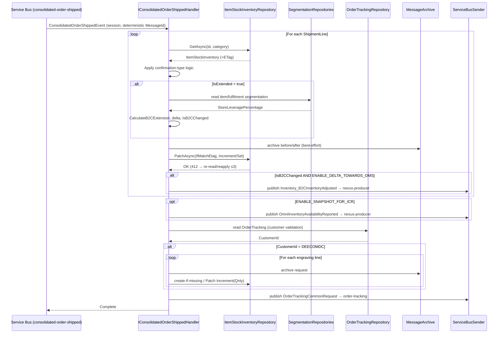
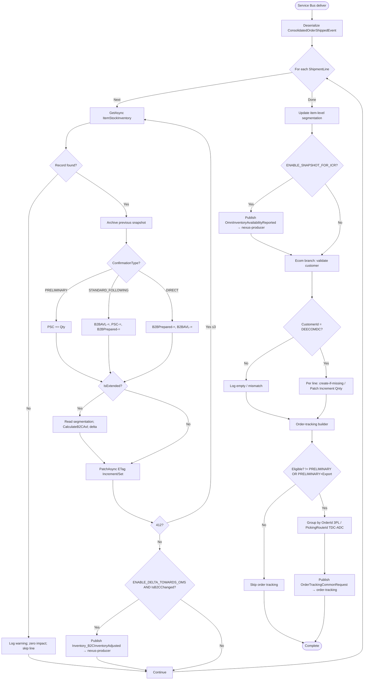

# b2b.sales.ConsolidatedOrderShipped - Technical Documentation

## 1. Overview

### Purpose
`b2b.sales.ConsolidatedOrderShipped` is a Kafka event that processes
consolidated order shipment confirmations. It updates B2B/B2C inventory buckets
when orders ship from warehouses, recalculates B2C availability for extended
items, publishes deltas to OMS, generates ICR audit snapshots, handles the
e-commerce engraving workflow, and emits an order-tracking update — all on the
AKS hosted-service pipeline.

### Business Objective
- **Primary:** update inventory availability (B2B and B2C buckets) based on
  shipment confirmations.
- **Secondary:** maintain order-tracking / delivery status via the
  `order-tracking` queue.
- **Tertiary:** generate inventory comparison (ICR) snapshots for auditing.
- **Quaternary:** handle the e-commerce engraving order workflow (DEECOMDC).

### Scope
- Consumes `b2b.sales.ConsolidatedOrderShipped` from Kafka, relays it to Azure
  Service Bus, and processes it on a session-enabled Service Bus consumer.
- Consolidated orders shipped across warehouse types (TDC, ADC, 3PL).
- Both PRELIMINARY and STANDARD confirmation types.
- B2B and B2C inventory domain management, including extended store-leverage
  scenarios.
- Export and domestic order scenarios.
- E-commerce engraving order processing.
- Persists inventory to Cosmos DB via ETag-guarded **Patch** operations.
- Publishes downstream events to the `nexus-producer` and `order-tracking`
  queues.

### High-Level Architecture

Matches the platform data flow in
[integration-resiliency.instructions.md](../ai/integration-resiliency.instructions.md):
a Kafka-to-Service-Bus relay hosted service, then a session-enabled Service Bus
consumer that calls the Application layer, which persists through the Cosmos DB
repository and archives through Blob Storage.

```
Kafka topic (Type header: ConsolidatedOrderShipped)
                    ↓
   ConsolidatedOrderShippedConsumerHostedService (KafkaConsumerHostedServiceBase)
     - correlation id / dedup id / type headers read + logged
     - Nexus dedup check (IDeduplicationService, fail-open)
     - schema + dynamic validation
     - cold-tier request audit (unconditional)
                    ↓
   Azure Service Bus queue `consolidated-order-shipped`
   (session-enabled: SessionId = {FulfilmentId}:{ItemCode};
    message ID deterministic from the Kafka key — never a fresh GUID)
                    ↓
   ConsolidatedOrderShippedServiceBusHostedService
     (ServiceBusConsumerHostedService<ConsolidatedOrderShippedEvent>)
     - envelope + payload deserialize, dynamic validation, cold-tier audit
                    ↓
          IConsolidatedOrderShippedHandler.HandleAsync
                    ↓
    ┌───────────────┬──────────────────┬────────────────┬─────────────────┐
    ↓               ↓                  ↓                ↓                 ↓
B2B Confirm     Item-level         ICR Snapshot     Ecom Engraving   Order Tracking
(inventory)     Segmentation       (reporting)      (DEECOMDC)       (request builder)
    ↓               ↓                  ↓                ↓                 ↓
IItemStockInventoryService → Cosmos DB (ETag-guarded Patch, re-read-and-reapply
on 412) + MessageArchive (Cosmos, optional Blob cold-tier mirror)
                    ↓
   nexus-producer + order-tracking queues (Service Bus) via cached ServiceBusSender
```

Business logic never touches `CosmosClient`/`Container`/`ServiceBusSender`
directly — it goes through `IItemStockInventoryService` → the Cosmos repository
and through the application-layer publish abstraction (see
[shared/service-bus-publishing.md](shared/service-bus-publishing.md)). The
order-tracking work that a previous version routed through an Orchestrator is
now a plain in-process request builder published to the `order-tracking` queue
(see [shared/delta-towards-oms.md](shared/delta-towards-oms.md)).

### Key Dependencies
- **`ItemStockInventoryRepository`** — core inventory (Cosmos, multi-container
  EDC/TDC/ADC/CAECOM/BRZ3PL, ETag-guarded; cosmos §5a/§9).
- **`ItemLevelSegmentationRepository`** / **`FulfilmentLevelSegmentationRepository`**
  — segmentation rules (Cosmos, read-only).
- **`ItemStockWarehouseInventoryRepository`** — e-commerce engraving warehouse
  inventory (Cosmos, ETag-guarded).
- **`OrderTrackingRepository`** — order-tracking record read for customer
  validation (Cosmos, read-only in this event).
- **`MessageArchiveRepository`** — snapshot archival (Cosmos + optional Blob).
- **Cached `ServiceBusSender`** — outbound publishing to `nexus-producer` and
  `order-tracking`.
- Shared helpers: [delta-towards-oms](shared/delta-towards-oms.md),
  [inventory-formulas](shared/inventory-formulas.md),
  [country-code-lookup](shared/country-code-lookup.md),
  [archive-audit](shared/archive-audit.md),
  [cosmos-idempotent-write](shared/cosmos-idempotent-write.md),
  [service-bus-publishing](shared/service-bus-publishing.md).

### Assumptions
1. Incoming messages are valid `ConsolidatedOrderShippedEvent` objects.
2. Fulfilment location IDs map to known centers (TDC, ADC, 3PL).
3. All feature flags and queue names are resolved from configuration.
4. Messages carry proper correlation context for tracking.
5. **Processing is idempotent** — a deterministic document `Id` plus
   ETag-guarded Patch make redelivery a no-op, not a duplicate/double-count
   (see [cosmos-idempotent-write](shared/cosmos-idempotent-write.md)).
6. Lines are grouped by `OrderId` for 3PL, by `PickingRouteId` for TDC/ADC.
7. Warehouse classification: TDC, ADC, and other 3PL providers.

---

## 2. End-to-End Flow

```
1. MESSAGE RECEPTION (Kafka consumer)
   ├─ ConsolidatedOrderShipped deserialized → ConsolidatedOrderShippedEvent
   ├─ correlation/dedup/type headers logged; IDeduplicationService check (fail-open)
   ├─ schema + dynamic validation; cold-tier request audit
   └─ relay to Service Bus queue `consolidated-order-shipped`
        · SessionId = {FulfilmentId}:{ItemCode}
        · deterministic message ID from Kafka key (never a fresh GUID)

2. SERVICE BUS CONSUMPTION
   ├─ envelope + payload deserialize, dynamic validation, cold-tier audit
   └─ IConsolidatedOrderShippedHandler.HandleAsync(ConsolidatedOrderShippedEvent)

3. B2B CONFIRMATION (per shipment line) — §3.1
   ├─ build B2BOrderConfirmedRequest (ProductId, CountryOfOrigin, Hallmark,
   │  ShippedQuantity, ConfirmationType, AllocatedFromB2BBucketQuantity) +
   │  deterministic uniqueIdentifier (ItemCode, LineNo, OrderId)
   ├─ fetch ItemStockInventory (point read); missing → zero-impact, skip line
   ├─ apply confirmation-type logic (PRELIMINARY / STANDARD_FOLLOWING / DIRECT)
   ├─ IsExtended → recalculate B2C available; compute DeltaTowardsOMS, IsB2CChanged
   ├─ archive before/after (archive-audit.md)
   └─ PERSIST via ETag-guarded Patch (Increment/Set), 412 re-read/reapply loop

   3b. OMS DELTA (ENABLE_DELTA_TOWARDS_OMS AND IsB2CChanged) — delta-towards-oms.md
       └─ publish Inventory_B2CInventoryAdjusted → nexus-producer

4. ITEM-LEVEL SEGMENTATION (per item)
   └─ update item-level fulfilment rules via IItemStockInventoryService

5. ICR SNAPSHOT (ENABLE_SNAPSHOT_FOR_ICR)
   └─ build OmniInventoryAvailabilityReported (B2B AVL, B2C AVL, B2B Prepared,
      B2C Prepared, state) → publish to nexus-producer

6. ECOM CONSOLIDATED ORDER SHIPPED — §3.3
   ├─ build ValidateCustomerId request (ParentOrderId, WarehouseCode, WAREHOUSE)
   ├─ read OrderTracking; resolve CustomerId (ECOMDCLIST / TDCCustomerId); archive
   ├─ empty → log and stop this branch
   └─ CustomerId == DEECOMDC → per engraving line:
        · archive request
        · fetch ItemStockWarehouseInventory
        · missing → create (deterministic Id, 409-as-applied)
        · present → Patch Increment(+ShippedQuantity)

7. ORDER TRACKING (in-process request builder → order-tracking queue) — §3.2
   ├─ OrderStatus default SHIPPED; PRELIMINARY + IsExport → INVOICED
   ├─ eligibility: ConfirmationType != PRELIMINARY OR (PRELIMINARY AND IsExport)
   ├─ classify warehouse; group by OrderId (3PL) or PickingRouteId (TDC/ADC)
   ├─ build OrderTrackingCommonRequest per group; lines filtered Quantity > 0
   └─ publish to `order-tracking` via cached ServiceBusSender (delta-towards-oms.md)

8. OUTCOME
   └─ no exception → Completed; ConcurrencyException/OperationCanceled → Abandoned;
      any other → DeadLettered (see cosmos-idempotent-write.md)
```

### Data Flow Through Layers
`Kafka → KafkaConsumerHostedServiceBase → Service Bus (consolidated-order-shipped)
→ ServiceBusConsumerHostedService → IConsolidatedOrderShippedHandler → helpers →
IItemStockInventoryService → Cosmos repository (Patch/ETag) + archive →
ServiceBusSender (nexus-producer, order-tracking)`.

---

## 3. Detailed Business Logic

### 3.1 B2B Order Confirmation Processing

**Purpose:** process a single B2B order line confirmation and update inventory
levels.

**Input — `B2BOrderConfirmedRequest`:** FulfilmentCode, ItemCode,
CountryOfOrigin, Hallmark, ShippedQuantity, ConfirmationType (PRELIMINARY,
STANDARD_FOLLOWING_PRELIMINARY, or DIRECT/other), AllocatedFromB2BBucketQuantity.

**Processing:**

1. **Fetch inventory** — point read `ItemStockInventory` by category
   (`FulfilmentId:ItemCode:Hallmark:CountryOfOrigin`). If not found: log warning
   "Stock inventory record not found", set `DeltaTowardsOMS = 0`,
   `DeltaTowardsReflex = 0`, `IsB2CChanged = false`, skip the line with zero
   impact.
2. **Validate shipped quantity** — `ShippedQuantity > 0`; otherwise log warning
   and continue (non-critical bypass).
3. **Validate B2B allocation** — `AllocatedFromB2BBucketQuantity >=
   ShippedQuantity`; otherwise log warning and continue (non-critical bypass).
4. **Apply confirmation-type logic** (see §4.1 for the arithmetic and boundary
   checks).
5. **Calculate B2C extension** — when `IsExtended = true`, recalculate B2C
   available using store leverage, compute `DeltaTowardsOMS`, update `B2CAVL`
   (see §4.2). Otherwise skip.
6. **Archive before/after** snapshots (archive-audit.md), then **persist** via
   ETag-guarded Patch (§5.1).
7. **Publish OMS delta** — when `ENABLE_DELTA_TOWARDS_OMS` AND `IsB2CChanged`,
   build and publish `DeltaTowardsOmsEventRequest` to `nexus-producer` (see
   [delta-towards-oms.md](shared/delta-towards-oms.md); `ReferenceId` is a
   deterministic id derived from the event, never a fresh GUID). Otherwise log
   flag/change status.

### 3.2 Order-Tracking Request Building (in-process)

**Purpose:** build a structured `OrderTrackingCommonRequest` in-process and
publish it to the `order-tracking` queue via the cached `ServiceBusSender`.
There is no Durable Task or orchestrator; the builder mechanics live in
[delta-towards-oms.md](shared/delta-towards-oms.md).

**PackingSlipId assignment:**
```
IF WarehouseCode = TDCFulfilmentId:  PackingSlipId = ParentOrderId
ELSE:                                PackingSlipId = Shipment.PackingSlipId
```

**Grouping logic:**
```
IF WarehouseCode NOT IN [TdcSapId, TDCFulfilmentId, ADCFulfilmentId]:  # 3PL
    GroupBy = OrderId
ELSE:                                                                  # TDC/ADC
    GroupBy = PickingRouteId
```

**Order-status determination:**
```
Default = SHIPPED
IF ConfirmationType = PRELIMINARY AND IsExport = true:  Status = INVOICED
```

**Eligibility:** build+publish only when `ConfirmationType != PRELIMINARY OR
(ConfirmationType = PRELIMINARY AND IsExport = true)`.

**Lines filter:** include only lines where `Quantity > 0`, mapped to
`OrderTrackingLine` (ItemCode, CountryOfOrigin, HallMarkType, ShipmentLineNumber
= LotId, Qty).

**Request fields:** ReferenceId = ParentOrderId, Channel, FulfilmentUnitId =
WarehouseCode, OrderId = group key, OrderStatus, Type =
`B2B_CONSOLIDATED_ORDER_SHIPPED`, OrderType = TRANSFER, PackingSlipId,
ShipmentId, ShipDate, Market, IsExport.

### 3.3 E-Commerce Engraving Order Processing

**Purpose:** process e-commerce engraving orders for the DEECOMDC customer.

1. **Validate customer** — read the `OrderTracking` record; resolve `CustomerId`
   when it is in `ECOMDCLIST` or equals `TDCCustomerId`; archive the
   `ValidateCustomerId` request.
2. **Empty CustomerId** → log "Customer Id is empty" and stop this branch.
3. **CustomerId == DEECOMDC** → for each shipment line build a
   `B2BOrderConfirmedRequest`, then per request:
   - archive the request,
   - fetch `ItemStockWarehouseInventory`,
   - **not found** → create a new record (deterministic Id, `Qnty =
     ShippedQuantity`; 409-as-applied per cosmos-idempotent-write.md),
   - **found** → Patch `Increment(+ShippedQuantity)` under `IfMatchEtag`.
4. **Other customer** → log "Customer Id {id} is not match with DEECOMDC".

---

## 4. Calculation Logic

All quantity math is centralized in
[inventory-formulas.md](shared/inventory-formulas.md); the extension arithmetic
is applied through it and persisted via `PatchOperation.Increment`, never a
read-modify-write replace.

### 4.1 Confirmation-type inventory adjustments

**PRELIMINARY** (pre-shipment confirmation placeholder):
```
PSC += ShippedQuantity
```

**STANDARD_FOLLOWING_PRELIMINARY** (actual shipment after preliminary):
```
B2BAVL      -= ShippedQuantity
PSC         -= ShippedQuantity
B2BPrepared -= ShippedQuantity
Boundary: B2BAVL < 0 → 0 (warn); B2BPrepared < 0 → 0 (warn)
```

**DIRECT** (confirmation without preliminary):
```
B2BPrepared -= ShippedQuantity
B2BAVL      -= ShippedQuantity
Boundary: B2BPrepared < 0 → 0 (warn); B2BAVL < 0 → 0 (warn)
```

**Field notes:** integer units (no decimals); null treated as `0`; negative
results clamped to `0` — a clamp is a business rule, not a Cosmos error. These
adjustments become `PatchOperation.Increment` operations (signed) plus `.Set`
for any recomputed scalar.

### 4.2 B2C extension calculation

Triggered when `IsExtended = true` (PRELIMINARY and STANDARD_FOLLOWING
confirmations).

1. **Item-level segmentation rule** — read `ItemLevelSegmentation` by category;
   yields `StoreLeveragePercentage`, `IsActive`.
2. **Fallback** — if no active item-level rule, read `FulfilmentLevelSegmentation`
   for `StoreLeveragePercentage`.
3. **B2C available** — `CalculateB2CAvl(inventory)` per
   [inventory-formulas.md](shared/inventory-formulas.md):
   ```
   IsExtended: B2CAVL = (Total - B2BAVL - B2BPrepared) × StoreLeveragePercentage
   Missing StoreLeveragePercentage → 0%; cannot go below 0.
   ```
4. **Delta towards OMS** —
   ```
   DeltaTowardsOMS = B2CAVL_new − B2CAVL_old
   != 0 → IsB2CChanged = true (send OMS adjustment)
   ```

| Previous B2CAVL | Current B2CAVL | Delta | IsB2CChanged |
|---|---|---|---|
| 100 | 150 | +50 | true |
| 100 | 75 | −25 | true |
| 100 | 100 | 0 | false |

### 4.3 B2C extended (actual B2B available)
```
B2CExtended = CalculateActualB2BAvailable(inventory) = B2BAVL - B2BAllocated - B2BUsedShare
```
Recomputes effective, unencumbered B2B available — the ceiling for any extension
into B2C.

---

## 5. Database Documentation

All Cosmos access follows [cosmos-db.instructions.md](../ai/cosmos-db.instructions.md)
and [cosmos-idempotent-write.md](shared/cosmos-idempotent-write.md).

### 5.1 ItemStockInventory (Cosmos, multi-container per fulfilment code)
- **Partition key** `Category` = composite
  `FulfilmentId:ItemCode:Hallmark:CountryOfOrigin`.
- **Read:** `GetAsync(id, category)` — point read within one partition
  (replaces the old `GetInventoryByCategory` SQL query).
- **Create (first write):** deterministic `Id`; `409 Conflict` → return existing
  (redelivery no-op).
- **Update — `UpdateStockInventoryAsync` is now `PatchAsync`** with
  `IfMatchEtag`: `PatchOperation.Increment` for B2BAVL / B2BPrepared / PSC /
  B2CAVL, and `.Set` for scalars (`B2CExtended`, `IsExtended`, `ModifiedUtc`),
  **≤10 ops**. `412` → `ConcurrencyException` → §8 re-read/reapply loop (max 3
  attempts). **No last-write-wins** on any quantity field — this is the fix for
  the duplicate-entry / doubled-quantity symptom.

| Field | How derived |
|---|---|
| B2BAVL / B2BPrepared / PSC / B2CAVL | §4 confirmation logic + extension → Patch Increment |
| B2CExtended | `CalculateActualB2BAvailable` → Patch Set |
| IsExtended | item-level rule active → Patch Set |
| ModifiedUtc | caller-supplied UTC → Patch Set |

### 5.2 ItemLevelSegmentation / FulfilmentLevelSegmentation (Cosmos, read-only)
Point reads by category; supply `StoreLeveragePercentage`, `IsActive`. Item-level
first; fulfilment-level fallback when the item-level rule is absent or inactive.

### 5.3 ItemStockWarehouseInventory (Cosmos) — engraving
- **Read:** point read by category (`ItemCode` + `FulfilmentId`).
- **Create-if-missing:** deterministic `Id`, `Qnty = ShippedQuantity`,
  409-as-applied.
- **Update — `UpdateWarehouseStockInventoryAsync` is now `PatchAsync`**:
  `PatchOperation.Increment("/Qnty", ShippedQuantity)` under `IfMatchEtag`; `412`
  → §8 loop.

### 5.4 OrderTracking (Cosmos, read-only here)
Point read for customer validation (`CustomerId`, `OrderId`, `ShipmentId`,
`Status`). The tracking status update itself is emitted by publishing an
`OrderTrackingCommonRequest` to the `order-tracking` queue (§3.2); a downstream
consumer owns the write — this event performs no OrderTracking write.

### 5.5 Archive
Before/after snapshots via [archive-audit.md](shared/archive-audit.md)
(best-effort; failure does not fail the message).

### 5.6 Transaction Flow & Concurrency
Cosmos has no multi-document transactions here; correctness comes from
per-document ETag Patch + the §8 retry loop, not distributed transactions. Each
line's inventory update is atomic at the document level.

---

## 6. State Changes & State Machine

### 6.1 ItemStockInventory transitions

```
Fetch ItemStockInventory (deterministic Id; 409 → existing)
   ↓  archive previous
Confirmation-type logic
   ├─ PRELIMINARY:              PSC += ShippedQuantity
   ├─ STANDARD_FOLLOWING:       B2BAVL -=, PSC -=, B2BPrepared -= ShippedQuantity
   └─ DIRECT:                   B2BAVL -=, B2BPrepared -= ShippedQuantity
   ↓  boundary clamps (B2BAVL, B2BPrepared ≥ 0)
IsExtended?
   └─ yes: B2CExtended = CalculateActualB2BAvailable()
           B2CAVL_new  = CalculateB2CAvl()
           B2CAVL_new != B2CAVL_old → IsB2CChanged, DeltaTowardsOMS
   ↓
Patch (ETag, Increment/Set) ── 412 ─▶ re-read + reapply (≤3)
   ↓  archive new
Publish downstream (nexus-producer / order-tracking) after durable commit
   ↓
Final: inventory updated exactly once
```

### 6.2 OrderTracking transition
```
OrderTracking exists (Status = previous)
   ↓
Build OrderTrackingCommonRequest (OrderStatus = SHIPPED | INVOICED,
   Type = B2B_CONSOLIDATED_ORDER_SHIPPED, lines Quantity > 0)
   ↓  publish to order-tracking queue (cached ServiceBusSender)
Downstream consumer updates OrderTracking → Status = SHIPPED | INVOICED
```

**Critical invariants:** no quantity goes negative; a redelivered message
produces no additional mutation (deterministic Id + ETag Patch); downstream
publishes occur only after the Cosmos write is durably applied.

### 6.3 Sequence diagram



### 6.4 Flow chart



---

## 7. API Documentation

### Kafka message contract
Topic carries `Type` header `ConsolidatedOrderShipped`, payload mapped to
`ConsolidatedOrderShippedEvent`:

```json
{
  "ParentOrderId": "PO-123456",
  "Channel": "B2B|B2C",
  "Market": "GB",
  "IsExport": false,
  "Shipment": {
    "Id": "SHP-001",
    "WarehouseCode": "TDC_WH_1",
    "ConfirmationType": "PRELIMINARY|STANDARD_FOLLOWING_PRELIMINARY|DIRECT",
    "PackingSlipId": "PS-99",
    "ShipDate": "2026-07-30T10:00:00Z",
    "ShipmentLines": [
      { "ProductId": "SKU-001", "LineNum": "1", "OrderId": "ORD-1",
        "PickingRouteId": "PR-1", "LotId": "LOT-1", "Quantity": 10,
        "CountryOfOrigin": "INDIA", "Hallmarking": "916",
        "AllocatedFromB2BBucketQuantity": 10 }
    ]
  }
}
```

### Service Bus message contract
Queue `consolidated-order-shipped`, `ServiceBusRelayEnvelope` wrapping the event;
`SessionId = {FulfilmentId}:{ItemCode}`; deterministic `MessageId` from the Kafka
key; correlation headers per
[service-bus-publishing.md](shared/service-bus-publishing.md).

### Validation
| Field | Rule | Handling |
|---|---|---|
| payload | not null / schema-valid | poison → DeadLettered |
| ConfirmationType | valid enum | reject invalid |
| ShippedQuantity | integer > 0 | zero/negative → warn, bypass |
| AllocatedFromB2BBucketQuantity | ≥ ShippedQuantity | invalid → warn, bypass |
| CountryOfOrigin / Hallmarking | enum → string | ItemStockInventory key |
| WarehouseCode | resolvable | classify TDC/ADC/3PL |

### Outbound messages
| Type | Queue | Condition |
|---|---|---|
| `Inventory_B2CInventoryAdjusted` (DeltaTowardsOmsEventRequest) | `nexus-producer` | ENABLE_DELTA_TOWARDS_OMS AND IsB2CChanged |
| `OmniInventoryAvailabilityReported` | `nexus-producer` | ENABLE_SNAPSHOT_FOR_ICR |
| `OrderTrackingCommonRequest` | `order-tracking` | eligible (§3.2) |

---

## 8. Error Handling & Retry Mechanisms

- **Validation / poison payload** → DeadLettered (hot-tier dead-letter
  container).
- **Missing inventory** → log warning, zero-impact skip of that line (business
  bypass, not a failure).
- **Zero/negative quantity, invalid allocation** → log warning, continue.
- **Negative B2BAVL / B2BPrepared** → clamp to 0 with a warning (prevents data
  corruption).
- **Cosmos 412 (ETag)** → `ConcurrencyException` → re-read/reapply loop (≤3); if
  exhausted → Abandoned (redelivered up to `MaxDeliveryCount`).
- **Cosmos 429** → Cosmos SDK retry
  (`MaxRetryAttemptsOnRateLimitedRequests`).
- **Service Bus publish transient** → `service-bus-publish` Polly pipeline.
- **`OperationCanceledException`** → Abandoned.
- **Any other exception** → DeadLettered (`Reason` = type, `Description` =
  `ex.ToString()`).
- **Archive failure** → best-effort, logged, does not fail the message.

Message-outcome mapping is the definitive table in
[cosmos-idempotent-write.md](shared/cosmos-idempotent-write.md):

| Result | Service Bus action |
|---|---|
| No exception | Completed |
| ConcurrencyException | Abandoned |
| OperationCanceledException | Abandoned |
| Any other exception | DeadLettered |

---

## 9. Security & Configuration

### Authentication
- Cosmos DB and Service Bus use **connection strings** sourced from Azure Key
  Vault, delivered as a **Kubernetes Secret**; local dev uses the emulator /
  user-secrets. This is the deliberate documented standard (cosmos §1) — **not**
  Managed Identity / Workload Identity.

### Feature flags
| Flag | Default | Purpose |
|---|---|---|
| ENABLE_DELTA_TOWARDS_OMS | true | OMS B2C delta notifications |
| ENABLE_SNAPSHOT_FOR_ICR | true | ICR inventory comparison snapshots |

### Queue names (kebab-case, config-resolved)
| Queue | Old constant | Direction |
|---|---|---|
| `consolidated-order-shipped` | CONSOLIDATED_ORDER_SHIPPED_REFLEX_QUEUE_NAME | inbound (relay) |
| `nexus-producer` | NEXUS_PRODUCER_QUEUE_NAME | outbound |
| `order-tracking` | ORDER_TRACKING_QUEUE_NAME | outbound |

### Default values
| Setting | Default |
|---|---|
| OrderTrackingStatus | SHIPPED (unless PRELIMINARY + IsExport → INVOICED) |
| IsExtended | false (unless item configuration) |
| StoreLeveragePercentage | 0 (if no rule found) |

### Data protection
TLS in transit; encryption at rest; no secrets/keys logged. CustomerId is
validated before use and not exposed in logs. Structured logging with masked
fields for sensitive identifiers.

---

## 10. Known Limitations & Future Improvements

### Current limitations
- Integer quantities only (no fractional units).
- Segmentation rules read per line; may be cached (below).
- Once a bucket clamps to 0, no automatic restore from another source.
- Large shipments processed per line; no batch reads.

### Potential improvements
- Cache country codes and segmentation rules per process to cut Cosmos reads.
- Batch downstream publishes where a line produces multiple events.
- Evaluate bounded parallel line processing within one message, preserving
  per-aggregate ordering via the session.

> The previous version listed a `USE_ORDER_TRACKING_ORCHESTRATOR` Durable-Task
> path, `TODO`/commented sends to the order-tracking and Nexus queues, and "no
> idempotency / concurrent-update handling" as gaps. All are now resolved by
> design: order tracking is an in-process request builder published to the
> `order-tracking` queue, downstream sends go through the cached
> `ServiceBusSender` (§9), and redelivery/concurrency are handled by
> deterministic Id + ETag Patch + the §8 re-read/reapply loop.

---

## 11. Summary

`b2b.sales.ConsolidatedOrderShipped` processes consolidated shipment
confirmations on the AKS pipeline: it consumes from Kafka, relays to the
`consolidated-order-shipped` Service Bus queue, updates B2B/B2C inventory buckets
per confirmation type, recalculates B2C availability for extended items, handles
the DEECOMDC engraving workflow, and publishes deltas/snapshots to
`nexus-producer` and an order-tracking request to `order-tracking`.

**Key business logic:** confirmation-type routing (PRELIMINARY / STANDARD_
FOLLOWING / DIRECT) for B2BAVL / B2BPrepared / PSC; B2C extension via store
leverage with signed OMS delta; warehouse classification driving OrderId vs
PickingRouteId grouping; PRELIMINARY+export → INVOICED; DEECOMDC-only engraving
inventory.

**Database updates:** ETag-guarded **Patch** (`Increment`/`Set`, ≤10 ops) on
`ItemStockInventory` and `ItemStockWarehouseInventory`, with deterministic Id +
409-as-applied and the §8 412 re-read/reapply loop — this is the fix for the
duplicate-entry / doubled-quantity problem. No last-write-wins.

**Risks & recommendations:** concurrency conflicts should be rare once sessions
are in place; monitor dead-letter counts and Cosmos 429 rates; cache
rarely-changing lookups; publish downstream only after the Cosmos write is
durably committed.

---

**Document Version:** 2.0 (AKS / k8s)
**Status:** Regenerated
