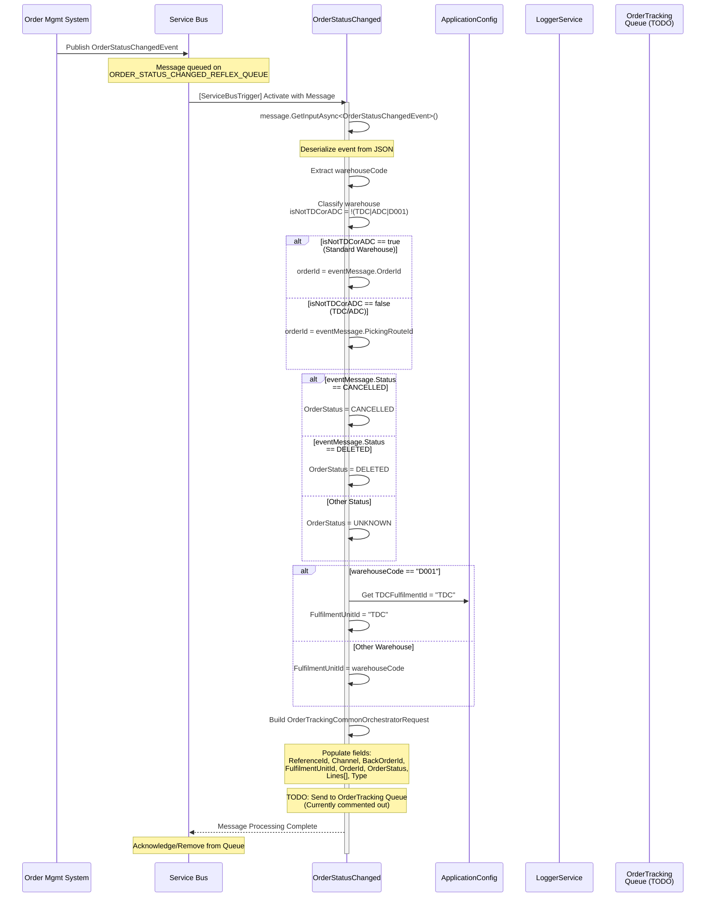

# b2b.sales.OrderStatusChanged - Technical Documentation

## Complete Technical Documentation

This document provides comprehensive specifications for the `b2b.sales.OrderStatusChanged` Kafka event, including all business logic, data flows, error handling, and architectural considerations.

---

## 1. Overview

### Purpose
The `b2b.sales.OrderStatusChanged` is a kafka event that processes order status change events from the Order Management System (OMS). It normalizes warehouse codes, selects appropriate order identifiers based on fulfillment center type, maps status values, and prepares order tracking requests for downstream processing.

### Business Objective
To capture order status transitions (CANCELLED, DELETED, or other statuses) from external systems and create standardized tracking requests that can be sent to the OrderTracking queue for further processing. This enables the system to maintain accurate order tracking information across different fulfillment units and channels.

### Scope
- **Input**: `b2b.sales.OrderStatusChanged` from Kakfa via Consumer Group: `$OrderStatusChangedIIS` and deserialized to `OrderStatusChangedEvent` messages and send to Service Bus Queue
- **Processing:** Event validation, warehouse-specific logic, and request mapping
- **Output:** OrderTrackingCommonOrchestratorRequest (pending TODO implementation)
- **Supported Scenarios:** Order cancellations, deletions, and status updates across TDC, ADC, and non-fulfillment warehouses

### High-Level Architecture
```
Kafka (b2b.sales.OrderStatusChanged)
       ↓
Deserialize OrderStatusChangedEvent
       ↓
Service Bus Queue (OrderStatusChangedEvent)
       ↓
Warehouse Code Analysis
       ↓
Reference ID Determination
       ↓
OrderTrackingCommonOrchestratorRequest Creation
       ↓
Send to OrderTracking Queue (TODO)
```

### Assumptions
1. **Service Bus Connection:** The Service Bus connection string is configured in `ApplicationConfig.ServiceBusConnectionString`
2. **Queue Names:** Queue names are injected via configuration using `ApplicationConfig` properties
3. **Event Format:** Incoming messages are valid JSON representing `OrderStatusChangedEvent`
4. **Warehouse Classification:** Only three warehouse types are special-cased (TDC, ADC); all others are treated uniformly
5. **Order Identification:** For TDC/ADC, PickingRouteId is used as the reference ID; for others, OrderId is used
6. **Durable Task Client:** DurableTaskClient is available for orchestration (currently unused)

### Dependencies
| Component | Type | Purpose |
|-----------|------|---------|
| `IServiceBusQueueService` | Injected Dependency | Sends messages to Service Bus queues |
| `ApplicationConfig` | Configuration | Holds queue names and connection strings |
| `ILoggerService` | Logging | Records execution details and errors |
| `OrderStatusChangedEvent` | Domain Model | Input event structure |
| `OrderTrackingCommonOrchestratorRequest` | Domain Model | Output request structure |
| `DurableTaskClient` | Azure Durable Functions | Orchestration client (not currently used) |
| `ReflexConstants` | Constants | Warehouse code definitions |

---

## 2. End-to-End Flow

### Complete Execution Flow

```
START: Service Bus Message Trigger
        ↓
[STEP 1] Message Received
    - ServiceBusTrigger detects message on configured queue
    - DurableClient is provided for orchestration capability
        ↓
[STEP 2] Deserialize Event
    - message.GetInputAsync<OrderStatusChangedEvent>()
    - Extract OrderStatusChangedEvent from JSON
    - Null handling: eventMessage! (null-forgiving operator indicates non-null assumption)
        ↓
[STEP 3] Extract Warehouse Code
    - warehouseCode = eventMessage.WarehouseCode
    - Used for determining reference ID and fulfillment unit
        ↓
[STEP 4] Warehouse Classification
    - Check if warehouse is NOT one of: TdcSapId (D001), TDCFulfilmentId (TDC), ADCFulfilmentId (ADC)
    - isNotTDCorADC = boolean result
    - Determines which identifier to use as reference ID
        ↓
[STEP 5] Reference ID Determination
    - IF isNotTDCorADC == TRUE:
        Use eventMessage.OrderId as orderId
    - ELSE (is TDC or ADC):
        Use eventMessage.PickingRouteId as orderId
    - This orderId becomes the primary reference for downstream processing
        ↓
[STEP 6] Status Mapping
    - IF eventMessage.Status == StatusCode.CANCELLED:
        OrderStatus = OrderTrackingStatus.CANCELLED
    - ELSE IF eventMessage.Status == StatusCode.DELETED:
        OrderStatus = OrderTrackingStatus.DELETED
    - ELSE:
        OrderStatus = OrderTrackingStatus.UNKNOWN
    - Maps incoming status to tracking system enumeration
        ↓
[STEP 7] Fulfillment Unit ID Determination
    - IF warehouseCode == ReflexConstants.TdcSapId (D001):
        FulfilmentUnitId = ReflexConstants.TDCFulfilmentId (TDC)
    - ELSE:
        FulfilmentUnitId = warehouseCode (passthrough)
    - Normalizes TDC SAP ID to TDC fulfillment ID
        ↓
[STEP 8] Build Orchestration Request
    - Create OrderTrackingCommonOrchestratorRequest with:
        * ReferenceId = orderId (from Step 5)
        * Channel = eventMessage.Channel.ToString()
        * BackOrderId = eventMessage.BackOrderId
        * FulfilmentUnitId = (from Step 7)
        * OrderId = orderId (from Step 5)
        * OrderStatus = (from Step 6)
        * Lines = List with single empty OrderTrackingLine
        * Type = EventType.B2B_ORDER_STATUS_CHANGED
    - Note: Many optional properties left null/unset (Channel, CustomerId, Market, etc.)
        ↓
[STEP 9] TODO: Send to OrderTracking Queue
    - PENDING IMPLEMENTATION
    - Would execute: _serviceBusQueueService.SendMessageAsync(
        _applicationConfig.ORDER_TRACKING_QUEUE_NAME, request)
    - Currently commented out - needs activation for full flow
        ↓
END: Function Completion
    - Returns completed Task (async void equivalent)
    - No error handling currently implemented
```

### Request Flow Diagram
```
OMS System
    ↓ (Event: Order Status Changed)
Kafka
    ↓
Service Bus Queue
    ↓
OrderStatusChangedEvent
    ├─ Input: OrderStatusChangedEvent
    ├─ Processing Logic:
    │  ├─ Warehouse Code Classification
    │  ├─ Reference ID Selection
    │  ├─ Status Mapping
    │  └─ Request Building
    ├─ Output: OrderTrackingCommonOrchestratorRequest
    └─ (TODO) Send to: ORDER_TRACKING_QUEUE
         ↓
    OrderTrackingOrchestrator
         ↓
    Downstream Processing
```

---

## 3. Detailed Business Logic

### 3.1 Warehouse Classification Logic

**Why It Exists:** Different fulfillment units use different ID schemes. TDC uses a SAP ID (D001) that must be normalized. ADC and TDC are special fulfillment units with routing rules based on PickingRouteId instead of OrderId.

**Decision Rule:**
```
IF warehouseCode == "D001" (TdcSapId)
   OR warehouseCode == "TDC" (TDCFulfilmentId)
   OR warehouseCode == "ADC" (ADCFulfilmentId)
   THEN
      Classification: SPECIAL (TDC/ADC)
   ELSE
      Classification: STANDARD (All other warehouses)
```

**Input:**
- `eventMessage.WarehouseCode` (string) - Warehouse identifier from incoming event

**Processing:**
1. Compare warehouseCode against three known special cases
2. Use boolean negation: `isNotTDCorADC` = !(matches any special case)
3. Store result for use in reference ID selection

**Decision Points:**
- **Is Standard Warehouse?** (isNotTDCorADC == true)
  - YES → Use OrderId as reference
  - NO → Use PickingRouteId as reference

**Outputs:**
- `isNotTDCorADC` (boolean)
- Determines subsequent reference ID selection

**Validation Rules:**
- WarehouseCode must not be null (no validation currently implemented)
- WarehouseCode comparison is case-sensitive
- Constants must match exactly: "D001", "TDC", "ADC"

**Edge Cases:**
| Scenario | WarehouseCode | isNotTDCorADC | Reference ID Used | Rationale |
|----------|---------------|---------------|-------------------|-----------|
| Standard warehouse | "PJCDC" | true | OrderId | Non-special fulfillment |
| TDC SAP ID | "D001" | false | PickingRouteId | TDC special routing |
| TDC fulfillment | "TDC" | false | PickingRouteId | TDC special routing |
| ADC fulfillment | "ADC" | false | PickingRouteId | ADC special routing |
| Unknown warehouse | "UNKNOWN" | true | OrderId | Defaults to standard logic |

**Failure Scenarios:**
1. **Null WarehouseCode:** NullReferenceException during comparison
   - Current handling: None (will crash)
   - Recommended: Validate and set default value
2. **Whitespace/case mismatch:** Comparison fails, treated as standard warehouse
   - Current handling: None (incorrect classification)
   - Recommended: Normalize case or document exact format requirement

---

### 3.2 Reference ID Determination Logic

**Why It Exists:** Different warehouse types use different identifiers for order tracking. TDC and ADC systems use PickingRouteId for routing, while standard warehouses use OrderId.

**Input:**
- `isNotTDCorADC` (boolean) - Warehouse classification from Step 4
- `eventMessage.OrderId` (string) - Order identifier
- `eventMessage.PickingRouteId` (string) - Route identifier

**Processing:**
```csharp
var orderId = isNotTDCorADC ? eventMessage.OrderId : eventMessage.PickingRouteId;
```

**Decision Points:**
```
Warehouse Classification?
  ├─ STANDARD (isNotTDCorADC = true)
  │  └─ orderId = eventMessage.OrderId
  │     └─ Used for: ReferenceId, OrderId in request
  └─ SPECIAL (isNotTDCorADC = false)
     └─ orderId = eventMessage.PickingRouteId
        └─ Used for: ReferenceId, OrderId in request
```

**Outputs:**
- `orderId` (string) - Primary identifier for order tracking

**Validation Rules:**
- OrderId must not be null/empty (no validation currently implemented)
- PickingRouteId must not be null/empty for TDC/ADC (no validation currently implemented)
- orderId is used in critical fields: ReferenceId, OrderId

**Edge Cases:**
| Warehouse | OrderId | PickingRouteId | Used Value | Impact |
|-----------|---------|----------------|-----------|--------|
| Standard | "ORD123" | null | "ORD123" | Correct identification |
| Standard | "ORD123" | "ROUTE456" | "ORD123" | PickingRouteId ignored |
| TDC | "ORD123" | "ROUTE456" | "ROUTE456" | OrderId ignored |
| TDC | "ORD123" | null | null | Will cause downstream issues |
| ADC | null | "ROUTE456" | null | Will cause issues in OrderId field |

**Failure Scenarios:**
1. **TDC with null PickingRouteId:** NullReferenceException or null orderId in request
   - Impact: OrderTracking queue receives invalid reference
   - Mitigation: Add null-coalescing logic or validation
2. **Standard warehouse with null OrderId:** Null value propagates to ReferenceId field
   - Impact: Orphaned request without valid identifier
   - Mitigation: Validate OrderId presence for standard warehouses

---

### 3.3 Status Code Mapping Logic

**Why It Exists:** The incoming event uses `StatusCode` enum from OMS, but OrderTracking system uses `OrderTrackingStatus` enum. Only two specific statuses (CANCELLED, DELETED) require special handling; all others default to UNKNOWN.

**Input:**
- `eventMessage.Status` (StatusCode enum)
- Valid values: UNKNOWN, DEACTIVATED, NOT_RUN, RUN, COLLECTION_STARTED, COLLECTION_PERFORMED, PREPARATION_IN_PROGRESS, TO_PACKAGE, COMPLETED, DESPATCHED, CANCELLED, DELETED, ORDER_CANCELED, CREDIT_BLOCKED, CREDIT_UNBLOCKED

**Processing:**
```csharp
var orderStatus = eventMessage.Status == StatusCode.CANCELLED 
    ? OrderTrackingStatus.CANCELLED 
    : eventMessage.Status == StatusCode.DELETED 
        ? OrderTrackingStatus.DELETED 
        : OrderTrackingStatus.UNKNOWN;
```

**Decision Tree:**
```
OrderStatusChanged Event Status?
├─ CANCELLED
│  └─ Map to: OrderTrackingStatus.CANCELLED
│     └─ Reason: Order explicitly cancelled by OMS
├─ DELETED
│  └─ Map to: OrderTrackingStatus.DELETED
│     └─ Reason: Order removed from system
└─ ANY OTHER STATUS (UNKNOWN, DEACTIVATED, RUN, etc.)
   └─ Map to: OrderTrackingStatus.UNKNOWN
      └─ Reason: No specific handling defined
```

**Outputs:**
- `OrderStatus` (OrderTrackingStatus enum) - Mapped status for tracking

**Mapping Table:**
| Input StatusCode | Output OrderTrackingStatus | Behavior |
|-----------------|---------------------------|----------|
| CANCELLED | CANCELLED | Order cancellation event |
| DELETED | DELETED | Order deletion event |
| ORDER_CANCELED | UNKNOWN | Treated as unhandled |
| CREDIT_BLOCKED | UNKNOWN | Treated as unhandled |
| CREDIT_UNBLOCKED | UNKNOWN | Treated as unhandled |
| DESPATCHED | UNKNOWN | Treated as unhandled |
| COMPLETED | UNKNOWN | Treated as unhandled |
| (any other) | UNKNOWN | Default fallback |

**Validation Rules:**
- Status field must not be null (no validation currently implemented)
- Only CANCELLED and DELETED have special handling
- All unmapped statuses default to UNKNOWN (explicit design choice)

**Edge Cases:**
1. **Null Status:** NullReferenceException during enum comparison
2. **Future Status Codes:** New StatusCode enums will default to UNKNOWN
   - This is safe but may indicate incomplete feature implementation
3. **ORDER_CANCELED vs CANCELLED:** Two similar enums, only CANCELLED mapped
   - ORDER_CANCELED defaults to UNKNOWN
   - This appears intentional but should be validated with business requirements

**Failure Scenarios:**
1. **Status not in enum:** Compilation error (enum type safety)
2. **Unhandled status transitions:** Will create UNKNOWN status record
   - Impact: Order tracking shows ambiguous status
   - Mitigation: Review and expand status mapping as business requirements evolve

---

### 3.4 Fulfillment Unit ID Normalization

**Why It Exists:** TDC uses SAP ID "D001" internally but is identified as "TDC" in the fulfillment system. This normalization ensures consistent identification downstream.

**Input:**
- `eventMessage.WarehouseCode` (string) - Warehouse code from event
- Specifically looking for: `ReflexConstants.TdcSapId` which equals "D001"

**Processing:**
```csharp
var fulfilmentUnitId = eventMessage.WarehouseCode == ReflexConstants.TdcSapId 
    ? ReflexConstants.TDCFulfilmentId 
    : eventMessage.WarehouseCode;
```

**Decision Rule:**
```
IF warehouseCode == "D001" (TdcSapId)
   THEN FulfilmentUnitId = "TDC" (TDCFulfilmentId)
   ELSE FulfilmentUnitId = warehouseCode (passthrough)
```

**Outputs:**
- `FulfilmentUnitId` (string) - Normalized fulfillment unit identifier

**Normalization Table:**
| Input WarehouseCode | Output FulfilmentUnitId | Reason |
|-------------------|----------------------|--------|
| "D001" | "TDC" | SAP ID normalization |
| "TDC" | "TDC" | Already normalized |
| "ADC" | "ADC" | Passthrough |
| "PJCDC" | "PJCDC" | Passthrough |
| (any other) | (same value) | Passthrough |

**Validation Rules:**
- Input must not be null (no validation currently implemented)
- String comparison is case-sensitive
- Constant value "D001" must match exactly

**Edge Cases:**
| Scenario | Input | Output | Issue |
|----------|-------|--------|-------|
| TDC SAP | "D001" | "TDC" | Correct normalization |
| TDC fulfillment | "TDC" | "TDC" | Already normalized |
| Case mismatch | "d001" | "d001" | Will not normalize (case-sensitive) |
| Null | null | null | Will cause issues downstream |
| Empty | "" | "" | Will cause issues downstream |

**Failure Scenarios:**
1. **Null WarehouseCode:** NullReferenceException during comparison, then null FulfilmentUnitId
2. **Case Mismatch:** "d001" or "D001" with different case won't normalize
   - Impact: Downstream system receives unexpected ID
   - Mitigation: Normalize case before comparison
3. **Missing Constant:** If TdcSapId constant changes, logic breaks without recompile

---

## 4. Calculation Logic

### 4.1 Warehouse Classification Calculation

**Formula:**
```
isNotTDCorADC = !(warehouseCode ∈ {TdcSapId, TDCFulfilmentId, ADCFulfilmentId})
```

**Variables:**
- `warehouseCode` (string) - Warehouse identifier from event
- `TdcSapId` (const string) = "D001"
- `TDCFulfilmentId` (const string) = "TDC"
- `ADCFulfilmentId` (const string) = "ADC"

**Data Sources:**
- `eventMessage.WarehouseCode` - From incoming OrderStatusChangedEvent

**Processing:**
```csharp
bool isNotTDCorADC = warehouseCode != ReflexConstants.TdcSapId &&
                     warehouseCode != ReflexConstants.TDCFulfilmentId &&
                     warehouseCode != ReflexConstants.ADCFulfilmentId;
```

**Examples:**

| Input | TdcSapId? | TDC? | ADC? | Result | Logic |
|-------|-----------|------|------|--------|-------|
| "D001" | ✓ YES | NO | NO | FALSE | Matches TdcSapId → NOT standard |
| "TDC" | NO | ✓ YES | NO | FALSE | Matches TDC → NOT standard |
| "ADC" | NO | NO | ✓ YES | FALSE | Matches ADC → NOT standard |
| "PJCDC" | NO | NO | NO | TRUE | No matches → IS standard |
| "EDC" | NO | NO | NO | TRUE | No matches → IS standard |
| null | CRASH | - | - | ERROR | NullReferenceException |

**Boundary Conditions:**
- All string comparisons are exact matches (case-sensitive)
- NULL values will cause NullReferenceException
- Empty string will not match any constant

**Rounding Logic:** N/A (boolean result)

**Precision:** N/A (boolean logic)

**Null Handling:** None - will throw exception

**Default Values:** None - must specify 3 comparisons

**Overflow/Underflow Handling:** N/A (not numeric)

---

## 5. Database Documentation

### 5.1 Service Bus Queue Operations

**Note:** This trigger does NOT perform direct database operations. It interacts with Azure Service Bus queues only.

**Queue Operations:**

| Operation | Queue Name | Purpose |
|-----------|-----------|---------|
| **READ** | ORDER_STATUS_CHANGED_REFLEX_QUEUE (TBD via config) | Receive OrderStatusChangedEvent messages |
| **WRITE** (TODO) | ORDER_TRACKING_QUEUE (TBD via config) | Send OrderTrackingCommonOrchestratorRequest messages |

### 5.2 Message Read Operation

**Queue:** `ORDER_STATUS_CHANGED_REFLEX_QUEUE`

**Read Operation:**
- **Method:** `[ServiceBusTrigger]` attribute
- **Trigger:** New message arrives on queue
- **Processing:**
  1. ServiceBusTrigger detects message
  2. Message deserialized as `OrderStatusChangedEvent`
  3. Function executes with parsed event

**Message Format:**
```json
{
  "channel": "B2B",
  "market": "UK",
  "orderId": "ORD-123456",
  "backOrderId": "BACKORD-789",
  "pickingRouteId": "ROUTE-456",
  "status": "CANCELLED",
  "warehouseCode": "TDC",
  "isReturn": false,
  "changeDate": "2024-01-15T10:30:00Z",
  "cancelReason": "Customer Request",
  "sourceOrderReferenceId": "EXT-REF-123"
}
```

**Expected Result:**
- Single `OrderStatusChangedEvent` object with all properties hydrated
- Ready for business logic processing

### 5.3 Message Write Operation (TODO)

**Queue:** `ORDER_TRACKING_QUEUE` (configuration-based)

**Write Operation (Not Yet Implemented):**
```csharp
await _serviceBusQueueService.SendMessageAsync(
    _applicationConfig.ORDER_TRACKING_QUEUE_NAME, 
    request);
```

**Message to Send:**
```json
{
  "referenceId": "ORD-123456",
  "channel": "B2B",
  "backOrderId": "BACKORD-789",
  "fulfilmentUnitId": "TDC",
  "orderId": "ORD-123456",
  "orderStatus": "CANCELLED",
  "lines": [
    {
      "itemCode": null,
      "qty": 0,
      "countryOfOrigin": null,
      "hallMarkType": null,
      "returnReasonCode": null,
      "hallmarkTypeTo": null,
      "lineNumber": null,
      "shipmentLineNumber": null,
      "trackingNumber": null
    }
  ],
  "type": "B2B_ORDER_STATUS_CHANGED"
}
```

**Transaction Flow:**
1. Kafka completes message processing
2. SendMessageAsync() called to write to ORDER_TRACKING_QUEUE
3. Message published to Service Bus
4. OrderTrackingOrchestrator triggers on new message
5. No explicit commit/rollback (Service Bus handles atomicity)

**Note on Implementation:** The write operation is currently commented out with a TODO marker. Full transaction semantics depend on when this is activated.

---

## 6. State Changes

### Complete Order Status Change State Transition

```
┌─────────────────────────────────────────────────────────────────┐
│ STATE 1: EVENT RECEIVED                                         │
│ ─────────────────────────────────────────────────────────────── │
│ Message on Kafka                                                │
│ Status: Pending                                                 │
│ Data: Raw OrderStatusChangedEvent JSON                          │
└─────────────────────────────────────────────────────────────────┘
        ↓
┌─────────────────────────────────────────────────────────────────┐
│ STATE 2: DESERIALIZATION                                        │
│ ─────────────────────────────────────────────────────────────── │
│ message.GetInputAsync<OrderStatusChangedEvent>()                │
│ Result: OrderStatusChangedEvent object                          │
│ Properties hydrated:                                            │
│   - Channel, Market, OrderId, BackOrderId, PickingRouteId      │
│   - Status, WarehouseCode, IsReturn, ChangeDate                │
│   - CancelReason, SourceOrderReferenceId                        │
└─────────────────────────────────────────────────────────────────┘
        ↓
┌─────────────────────────────────────────────────────────────────┐
│ STATE 3: WAREHOUSE CLASSIFICATION                               │
│ ─────────────────────────────────────────────────────────────── │
│ Evaluate: warehouseCode in {D001, TDC, ADC}?                   │
│ Result: isNotTDCorADC boolean value                             │
│                                                                 │
│ Example:                                                        │
│   Input: warehouseCode = "TDC"                                  │
│   isNotTDCorADC = false (is TDC → NOT standard)                │
└─────────────────────────────────────────────────────────────────┘
        ↓
┌─────────────────────────────────────────────────────────────────┐
│ STATE 4: REFERENCE ID SELECTION                                 │
│ ─────────────────────────────────────────────────────────────── │
│ Conditional: isNotTDCorADC ? OrderId : PickingRouteId          │
│ Result: orderId (string)                                        │
│                                                                 │
│ Example:                                                        │
│   isNotTDCorADC = false → orderId = PickingRouteId = "ROUTE456"│
└─────────────────────────────────────────────────────────────────┘
        ↓
┌─────────────────────────────────────────────────────────────────┐
│ STATE 5: STATUS MAPPING                                         │
│ ─────────────────────────────────────────────────────────────── │
│ Map StatusCode → OrderTrackingStatus                            │
│ - CANCELLED → OrderTrackingStatus.CANCELLED                     │
│ - DELETED → OrderTrackingStatus.DELETED                         │
│ - OTHER → OrderTrackingStatus.UNKNOWN                           │
│ Result: OrderStatus enum value                                  │
│                                                                 │
│ Example:                                                        │
│   Input Status: StatusCode.CANCELLED                            │
│   Output: OrderTrackingStatus.CANCELLED                         │
└─────────────────────────────────────────────────────────────────┘
        ↓
┌─────────────────────────────────────────────────────────────────┐
│ STATE 6: FULFILLMENT UNIT ID NORMALIZATION                     │
│ ─────────────────────────────────────────────────────────────── │
│ Normalize warehouse code to fulfillment ID                      │
│ - D001 (SAP) → TDC (Fulfillment)                                │
│ - Others → Passthrough                                          │
│ Result: FulfilmentUnitId (string)                               │
│                                                                 │
│ Example:                                                        │
│   Input warehouseCode: "D001"                                   │
│   Output: FulfilmentUnitId = "TDC"                              │
└─────────────────────────────────────────────────────────────────┘
        ↓
┌─────────────────────────────────────────────────────────────────┐
│ STATE 7: REQUEST CONSTRUCTION                                   │
│ ─────────────────────────────────────────────────────────────── │
│ Build OrderTrackingCommonOrchestratorRequest object             │
│ Populated fields:                                               │
│   ✓ ReferenceId = orderId ("ROUTE456")                          │
│   ✓ Channel = "B2B"                                             │
│   ✓ BackOrderId = "BACKORD-789"                                 │
│   ✓ FulfilmentUnitId = "TDC"                                    │
│   ✓ OrderId = "ROUTE456"                                        │
│   ✓ OrderStatus = OrderTrackingStatus.CANCELLED                 │
│   ✓ Lines = [OrderTrackingLine { }] (empty)                     │
│   ✓ Type = EventType.B2B_ORDER_STATUS_CHANGED                   │
│                                                                 │
│ Unpopulated fields:                                             │
│   □ FulfilmentUnitType, OrderType, IisOrderId                   │
│   □ UniqueIdentifiers, SourceNode, DestinationNode             │
│   □ CustomerId, Language, Market, OrderDate                     │
│   □ ExpectedShipDate, SellerOrgCode, ReceivedDate               │
│   □ PackingSlipId, ShipmentId, ShipDate, Source                 │
│   □ SourceType, DestinationName, DestinationReference          │
│   □ AddressLine, Postal, City, IsExport, SellingAccount         │
└─────────────────────────────────────────────────────────────────┘
        ↓
┌─────────────────────────────────────────────────────────────────┐
│ STATE 8: QUEUE TRANSMISSION (TODO)                              │
│ ─────────────────────────────────────────────────────────────── │
│ Send OrderTrackingCommonOrchestratorRequest to queue            │
│ Status: PENDING IMPLEMENTATION                                  │
│                                                                 │
│ Commented code:                                                 │
│ await _serviceBusQueueService.SendMessageAsync(                │
│     _applicationConfig.ORDER_TRACKING_QUEUE_NAME, request);    │
└─────────────────────────────────────────────────────────────────┘
        ↓
┌─────────────────────────────────────────────────────────────────┐
│ STATE 9: FUNCTION COMPLETION                                    │
│ ─────────────────────────────────────────────────────────────── │
│ Trigger function completes (Task returns)                       │
│ Current behavior: Request created but NOT sent                  │
│ Message is acknowledged/removed from queue                      │
└─────────────────────────────────────────────────────────────────┘
```

---

## 7. API Documentation

### Input Specification

**Input Source:** Kafka b2b.sales.OrderStatusChanged message

**Deserialized Type:** `OrderStatusChangedEvent`

**Expected Message Format (JSON):**
```json
{
  "channel": "B2B|B2C",
  "market": "UK|US|...",
  "orderId": "string",
  "backOrderId": "string",
  "pickingRouteId": "string",
  "status": "CANCELLED|DELETED|...",
  "warehouseCode": "TDC|ADC|...",
  "isReturn": boolean,
  "changeDate": "ISO 8601 DateTime",
  "cancelReason": "string (optional)",
  "sourceOrderReferenceId": "string (optional)"
}
```

**Headers:**
- Standard Service Bus headers (handled by Azure Functions runtime)
- Correlation ID (if set by publisher)

**Authentication:**
- Service Bus: connection string
- CosmosDB: connection string

### Output Specification

**Intended Output Destination:** Azure Service Bus Queue (TODO)

**Queue Name:** `ApplicationConfig.ORDER_TRACKING_QUEUE_NAME` (configuration-injected)

**Message Type:** `OrderTrackingCommonOrchestratorRequest`

**Serialized Format (JSON):**
```json
{
  "referenceId": "string",
  "channel": "string",
  "backOrderId": "string",
  "fulfilmentUnitId": "string",
  "orderId": "string",
  "orderStatus": "CANCELLED|DELETED|UNKNOWN",
  "lines": [
    {
      "itemCode": null,
      "qty": 0,
      "countryOfOrigin": null,
      "hallMarkType": null,
      "returnReasonCode": null,
      "hallmarkTypeTo": null,
      "lineNumber": null,
      "shipmentLineNumber": null,
      "trackingNumber": null
    }
  ],
  "type": "B2B_ORDER_STATUS_CHANGED"
}
```

### HTTP Status Codes (Not Applicable)

**Note:** This is a Service Bus trigger, not an HTTP endpoint. No HTTP status codes apply.

### Functional Status Returns

| Status | Scenario | Behavior |
|--------|----------|----------|
| **Success** | Message processed, request built | Completes without error |
| **Error** | Deserialization failure | Exception thrown, message may be deadlettered |
| **Incomplete** | Request built but not sent | Function completes (TODO not activated) |

### Error Codes (Custom)

| Error | Cause | Handling |
|-------|-------|----------|
| **NullReferenceException** | Null WarehouseCode, OrderId, or PickingRouteId | Not caught - will deadletter message |
| **JsonSerializationException** | Invalid message JSON | Service Bus runtime handling |
| **TimeoutException** | SendMessageAsync timeout (future) | Not currently applicable |

### Validation Rules

**Input Validation:**
- None currently implemented
- Service Bus message must be valid JSON representing OrderStatusChangedEvent
- Null values in critical fields will cause runtime errors

**Business Validation:**
- None currently implemented
- WarehouseCode should match known warehouse IDs
- OrderId or PickingRouteId should be non-empty (context-dependent)

### Sample Requests

**Sample 1: TDC Order Cancellation**
```json
{
  "channel": "B2B",
  "market": "UK",
  "orderId": "ORD-123456",
  "backOrderId": "BACK-001",
  "pickingRouteId": "ROUTE-789",
  "status": "CANCELLED",
  "warehouseCode": "TDC",
  "isReturn": false,
  "changeDate": "2024-01-15T10:30:00Z",
  "cancelReason": "Customer Request",
  "sourceOrderReferenceId": "EXT-REF-123"
}
```

**Sample 2: Standard Warehouse Order Deletion**
```json
{
  "channel": "B2C",
  "market": "US",
  "orderId": "ORD-987654",
  "backOrderId": null,
  "pickingRouteId": "ROUTE-456",
  "status": "DELETED",
  "warehouseCode": "PJCDC",
  "isReturn": false,
  "changeDate": "2024-01-15T11:45:00Z",
  "cancelReason": null,
  "sourceOrderReferenceId": "EXT-REF-456"
}
```

### Sample Responses

**Response 1: TDC Order Cancellation Result**
```json
{
  "referenceId": "ROUTE-789",
  "channel": "B2B",
  "backOrderId": "BACK-001",
  "fulfilmentUnitId": "TDC",
  "orderId": "ROUTE-789",
  "orderStatus": "CANCELLED",
  "lines": [
    {
      "itemCode": null,
      "qty": 0,
      "countryOfOrigin": null,
      "hallMarkType": null,
      "returnReasonCode": null,
      "hallmarkTypeTo": null,
      "lineNumber": null,
      "shipmentLineNumber": null,
      "trackingNumber": null
    }
  ],
  "type": "B2B_ORDER_STATUS_CHANGED",
  "fulfilmentUnitType": null,
  "orderType": null,
  "iisOrderId": null,
  "uniqueIdentifiers": null,
  "sourceNode": null,
  "destinationNode": null,
  "customerId": null,
  "language": null,
  "market": null,
  "orderDate": null,
  "expectedShipDate": null,
  "sellerOrgCode": null,
  "receivedDate": null,
  "packingSlipId": null,
  "shipmentId": null,
  "shipDate": null,
  "sourceType": null,
  "source": null,
  "destinationName": null,
  "destinationReference": null,
  "addressLine": null,
  "postal": null,
  "city": null,
  "isExport": false,
  "sellingAccount": null
}
```

**Response 2: Standard Warehouse Order Deletion Result**
```json
{
  "referenceId": "ORD-987654",
  "channel": "B2C",
  "backOrderId": null,
  "fulfilmentUnitId": "PJCDC",
  "orderId": "ORD-987654",
  "orderStatus": "DELETED",
  "lines": [
    {
      "itemCode": null,
      "qty": 0,
      "countryOfOrigin": null,
      "hallMarkType": null,
      "returnReasonCode": null,
      "hallmarkTypeTo": null,
      "lineNumber": null,
      "shipmentLineNumber": null,
      "trackingNumber": null
    }
  ],
  "type": "B2B_ORDER_STATUS_CHANGED"
}
```

---

## 8. Sequence Diagram



---

## 9. Flow Chart

```mermaid
flowchart TD
    Start([Kafka:<br/>Message Received]) --> Deserialize["<b>STEP 1: Deserialize</b><br/>message.GetInputAsync<OrderStatusChangedEvent>()"]
    
    Deserialize --> Extract["<b>STEP 2: Extract Data</b><br/>warehouseCode = event.WarehouseCode"]
    
    Extract --> CheckWarehouse{"<b>STEP 3: Classify Warehouse</b><br/>Is warehouseCode in<br/>{D001, TDC, ADC}?"}
    
    CheckWarehouse -->|No| SetOrderIdStandard["<b>STEP 4a: Standard Warehouse</b><br/>orderId = event.OrderId<br/>isNotTDCorADC = true"]
    CheckWarehouse -->|Yes| SetOrderIdSpecial["<b>STEP 4b: TDC/ADC Warehouse</b><br/>orderId = event.PickingRouteId<br/>isNotTDCorADC = false"]
    
    SetOrderIdStandard --> CheckStatus
    SetOrderIdSpecial --> CheckStatus
    
    CheckStatus{"<b>STEP 5: Map Status</b><br/>event.Status = ?"}
    
    CheckStatus -->|CANCELLED| SetCancelled["<b>STEP 5a: Status Mapping</b><br/>OrderStatus = CANCELLED"]
    CheckStatus -->|DELETED| SetDeleted["<b>STEP 5b: Status Mapping</b><br/>OrderStatus = DELETED"]
    CheckStatus -->|Other| SetUnknown["<b>STEP 5c: Status Mapping</b><br/>OrderStatus = UNKNOWN"]
    
    SetCancelled --> NormalizeFulfillment
    SetDeleted --> NormalizeFulfillment
    SetUnknown --> NormalizeFulfillment
    
    NormalizeFulfillment{"<b>STEP 6: Normalize Fulfillment ID</b><br/>warehouseCode == D001?"}
    
    NormalizeFulfillment -->|Yes| SetFulfillmentTDC["FulfilmentUnitId = 'TDC'"]
    NormalizeFulfillment -->|No| SetFulfillmentPassthrough["FulfilmentUnitId = warehouseCode"]
    
    SetFulfillmentTDC --> BuildRequest["<b>STEP 7: Build Request Object</b><br/>OrderTrackingCommonOrchestratorRequest<br/>ReferenceId = orderId<br/>Channel = event.Channel<br/>BackOrderId = event.BackOrderId<br/>FulfilmentUnitId = (from Step 6)<br/>OrderId = orderId<br/>OrderStatus = (from Step 5)<br/>Lines = [OrderTrackingLine{}]<br/>Type = B2B_ORDER_STATUS_CHANGED"]
    SetFulfillmentPassthrough --> BuildRequest
    
    BuildRequest --> CheckTodo{"<b>STEP 8: Send to Queue?</b><br/>TODO: Uncomment<br/>SendMessageAsync()"}
    
    CheckTodo -->|Implemented| SendMessage["<b>STEP 9: Send Message</b><br/>_serviceBusQueueService.SendMessageAsync(<br/>  _applicationConfig.ORDER_TRACKING_QUEUE_NAME,<br/>  request)"]
    CheckTodo -->|Not Implemented| SkipSend["<b>STEP 9: Skip Send</b><br/>Request built but not sent<br/>Function completes"]
    
    SendMessage --> Success["✓ Message sent to OrderTracking Queue"]
    SkipSend --> Incomplete["⚠ Message not sent - TODO pending"]
    
    Success --> Complete([Function Complete<br/>Task Returned])
    Incomplete --> Complete
    
    style Start fill:#90EE90
    style Complete fill:#FFB6C1
    style CheckWarehouse fill:#87CEEB
    style CheckStatus fill:#87CEEB
    style NormalizeFulfillment fill:#87CEEB
    style CheckTodo fill:#FFD700
    style SendMessage fill:#FFA500
    style SkipSend fill:#FFD700
    style BuildRequest fill:#DDA0DD
```



---

## 10. Decision Tree

```
ORDER STATUS CHANGED EVENT RECEIVED
│
├─ WAREHOUSE CLASSIFICATION
│  │
│  ├─ Is WarehouseCode == "D001" (TdcSapId)?
│  │  ├─ YES → Special Warehouse (TDC)
│  │  │  └─ Use PickingRouteId as reference
│  │  │     └─ Set FulfilmentUnitId = "TDC"
│  │  │        └─ Continue to Status Mapping
│  │  │
│  │  └─ NO → Continue checking
│  │
│  ├─ Is WarehouseCode == "TDC" (TDCFulfilmentId)?
│  │  ├─ YES → Special Warehouse (TDC)
│  │  │  └─ Use PickingRouteId as reference
│  │  │     └─ Set FulfilmentUnitId = "TDC"
│  │  │        └─ Continue to Status Mapping
│  │  │
│  │  └─ NO → Continue checking
│  │
│  ├─ Is WarehouseCode == "ADC" (ADCFulfilmentId)?
│  │  ├─ YES → Special Warehouse (ADC)
│  │  │  └─ Use PickingRouteId as reference
│  │  │     └─ Set FulfilmentUnitId = "ADC"
│  │  │        └─ Continue to Status Mapping
│  │  │
│  │  └─ NO → Continue checking
│  │
│  └─ DEFAULT → Standard Warehouse
│     └─ Use OrderId as reference
│        └─ Set FulfilmentUnitId = WarehouseCode (passthrough)
│           └─ Continue to Status Mapping
│
├─ STATUS MAPPING
│  │
│  ├─ Is Status == StatusCode.CANCELLED?
│  │  ├─ YES → OrderStatus = OrderTrackingStatus.CANCELLED
│  │  │  └─ Continue to Request Building
│  │  │
│  │  └─ NO → Continue checking
│  │
│  ├─ Is Status == StatusCode.DELETED?
│  │  ├─ YES → OrderStatus = OrderTrackingStatus.DELETED
│  │  │  └─ Continue to Request Building
│  │  │
│  │  └─ NO → Continue to default
│  │
│  └─ DEFAULT → OrderStatus = OrderTrackingStatus.UNKNOWN
│     └─ Continue to Request Building
│
├─ REQUEST BUILDING
│  │
│  ├─ Create OrderTrackingCommonOrchestratorRequest
│  │  ├─ ReferenceId = orderId (from warehouse classification)
│  │  ├─ Channel = event.Channel.ToString()
│  │  ├─ BackOrderId = event.BackOrderId
│  │  ├─ FulfilmentUnitId = (from warehouse classification)
│  │  ├─ OrderId = orderId (from warehouse classification)
│  │  ├─ OrderStatus = (from status mapping)
│  │  ├─ Lines = [new OrderTrackingLine()] (empty)
│  │  └─ Type = EventType.B2B_ORDER_STATUS_CHANGED
│  │
│  └─ Continue to Queue Transmission
│
├─ QUEUE TRANSMISSION
│  │
│  ├─ Is TODO implemented?
│  │  ├─ YES → await _serviceBusQueueService.SendMessageAsync(
│  │  │        _applicationConfig.ORDER_TRACKING_QUEUE_NAME, request)
│  │  │     └─ Message sent to ORDER_TRACKING_QUEUE
│  │  │        └─ Proceed to Function Complete
│  │  │
│  │  └─ NO → Skip SendMessageAsync() call (currently commented)
│  │     └─ Request built but not sent
│  │        └─ Proceed to Function Complete
│  │
│  └─ Function Complete
```

---

## 11. Error Handling

### Current Error Handling Status: **MINIMAL/NONE**

The current implementation has no explicit error handling. Errors will cause the function to throw exceptions, potentially deadlettering messages.

### Error Scenarios and Handling

| Error Type | Cause | Current Handling | Recommended Handling |
|------------|-------|------------------|----------------------|
| **NullReferenceException** | Null WarehouseCode, OrderId, PickingRouteId, or Status | Unhandled - crashes | Add validation before use |
| **JsonSerializationException** | Invalid JSON in message | Service Bus runtime | Already handled by runtime |
| **InvalidOperationException** | Missing required enum value | Unhandled - crashes | Use enum.TryParse() |
| **TimeoutException** | SendMessageAsync timeout (future) | N/A - not implemented | Add retry policy |
| **ServiceBusException** | Queue access denied or queue missing | Unhandled - crashes | Log and deadletter message |

### Validation Errors

**Current Validation:** None

**Required Validation:**
```csharp
// Validate essential fields
if (string.IsNullOrEmpty(eventMessage?.WarehouseCode))
    throw new ArgumentException("WarehouseCode is required");

if (string.IsNullOrEmpty(eventMessage?.OrderId) && 
    string.IsNullOrEmpty(eventMessage?.PickingRouteId))
    throw new ArgumentException("Either OrderId or PickingRouteId is required");

if (eventMessage?.Status == null)
    throw new ArgumentException("Status is required");
```

### Database Errors

**Not Applicable** - No database operations in this trigger.

### Timeout Handling

**Current:** Not applicable (SendMessageAsync is commented out)

**Future Implementation:**
```csharp
// Add timeout configuration
var cts = new CancellationTokenSource(TimeSpan.FromSeconds(30));
await _serviceBusQueueService.SendMessageAsync(
    _applicationConfig.ORDER_TRACKING_QUEUE_NAME, 
    request, 
    cts.Token);
```

### Retry Logic

**Current:** None - Azure Functions runtime provides automatic retries via Service Bus triggers

**Future Implementation (if needed):**
```csharp
const int maxRetries = 3;
int retryCount = 0;

while (retryCount < maxRetries)
{
    try
    {
        await _serviceBusQueueService.SendMessageAsync(...);
        break;
    }
    catch (ServiceBusException ex) when (ex.IsTransient)
    {
        retryCount++;
        if (retryCount >= maxRetries) throw;
        await Task.Delay(TimeSpan.FromSeconds(Math.Pow(2, retryCount)));
    }
}
```

### Exception Propagation

**Current:** All exceptions propagate to Service Bus trigger runtime

**Flow:**
1. Exception thrown in Service Bus Queue Trigger
2. Service Bus trigger catches exception
3. Message processing fails
4. Service Bus retries based on configuration (default: max deliveries)
5. If max retries exceeded: message moved to dead-letter queue

### Rollback Behavior

**Not Applicable** - No transactions in this trigger.

**Service Bus Message Handling:**
- If function completes successfully: Message acknowledged and removed from queue
- If function throws exception: Message remains for retry
- After max retries: Message moved to dead-letter queue

### User-Facing Error Messages

**Current:** None - async void trigger doesn't return error messages to client

**Future (if applicable):**
```csharp
try
{
    // Process event
}
catch (ArgumentException ex)
{
    _loggerService.LogError($"Validation failed: {ex.Message}");
    throw;
}
catch (Exception ex)
{
    _loggerService.LogError($"Unexpected error: {ex.Message}", ex);
    throw;
}
```

### Internal Logging

**Current Logging:** None implemented

**Recommended Logging Points:**
```csharp
_loggerService.LogInformation($"Processing OrderStatusChanged event for Order: {eventMessage.OrderId}");
_loggerService.LogInformation($"Warehouse: {warehouseCode}, Classification: {(isNotTDCorADC ? "Standard" : "Special")}");
_loggerService.LogInformation($"Status: {eventMessage.Status} → {orderStatus}");
_loggerService.LogInformation($"Request prepared - ReferenceId: {request.ReferenceId}");
_loggerService.LogInformation("Request sent to OrderTracking queue");
```

---

## 12. Performance Considerations

### Query Optimization

**Not Applicable** - No database queries in this trigger.

### Index Usage

**Not Applicable** - No database operations in this trigger.

### Complexity Analysis

**Time Complexity:**
- Deserialization: **O(n)** where n = message size
- Warehouse classification: **O(1)** (3 string comparisons)
- Status mapping: **O(1)** (2 conditional checks)
- Request building: **O(1)** (object instantiation)
- Total: **O(n)** dominated by deserialization

**Space Complexity:**
- Input: **O(1)** - ServiceBusReceivedMessage reference
- Processing: **O(1)** - Local variables (boolean, string, enum)
- Output: **O(1)** - Single OrderTrackingCommonOrchestratorRequest object
- Total: **O(1)** constant space

### Caching

**Not Currently Implemented**

**Potential Caching Opportunities:**
```csharp
// Cache warehouse classification rules
private static readonly HashSet<string> SpecialWarehouses = 
    new(StringComparer.OrdinalIgnoreCase) { "D001", "TDC", "ADC" };

bool isNotTDCorADC = !SpecialWarehouses.Contains(warehouseCode);
```

**Benefits:**
- Faster warehouse classification
- Reduced string comparisons per invocation
- Better performance under high volume

### Batch Processing

**Current:** Single event processing per trigger invocation

**Optimization:** Not applicable - Azure Service Bus trigger processes one message at a time

### Parallel Execution

**Current:** Sequential processing within single invocation

**Note:** The `DurableTaskClient` parameter is injected but not used. Future implementation might use it for parallel orchestration operations.

### Bottlenecks

| Component | Impact | Mitigation |
|-----------|--------|-----------|
| Deserialization | Depends on message size | Keep messages lean, use JSON compression if needed |
| Service Bus SendMessage (TODO) | Network I/O | Implement batching for high volume |
| Logging (future) | Synchronous I/O | Use async logging where possible |
| Configuration lookup | Minimal | Cache ApplicationConfig values if called frequently |

### Resource Usage

**Per Invocation:**
- **CPU:** Minimal - simple string operations and object creation
- **Memory:** O(1) - small fixed overhead
- **Network:** 1 Service Bus read + 1 potential write (TODO)
- **Duration:** < 100ms typical (mostly deserialization)

---

## 13. Security

### Authentication
- Service Bus: connection string
- CosmosDB: connection string

### Authorization

**Current:** Role-based access via Service Bus permissions

**Required Permissions:**
- **Read:** `Listen` permission on ORDER_STATUS_CHANGED_REFLEX_QUEUE
- **Write (TODO):** `Send` permission on ORDER_TRACKING_QUEUE

**Configuration Example:**
```csharp
// Service Principal needs:
// - Azure Service Bus Data Receiver (for input queue)
// - Azure Service Bus Data Sender (for output queue)
```

### Encryption

**Service Bus Messages:**
- Data in transit: TLS 1.2+ (automatic via Service Bus)
- Data at rest: Azure-managed encryption (automatic)

**Configuration Data:**
- `ApplicationConfig.ServiceBusConnectionString`: Store in Key Vault
- `ApplicationConfig.ORDER_TRACKING_QUEUE_NAME`: No encryption needed (public)

### Sensitive Data Handling

**Potential Sensitive Data in OrderStatusChangedEvent:**
| Field | Sensitivity | Handling |
|-------|-------------|----------|
| OrderId | Moderate | Part of business logic - necessary |
| PickingRouteId | Moderate | Part of business logic - necessary |
| WarehouseCode | Low | Public warehouse identifier |
| CancelReason | High | User-provided cancellation reason |
| SourceOrderReferenceId | Moderate | External reference |

**Current Issues:**
1. No data masking in logging (future logging would expose sensitive data)
2. CancelReason not validated before use
3. SourceOrderReferenceId not sanitized

**Recommendations:**
```csharp
// Mask sensitive fields in logs
_loggerService.LogInformation($"Processing order: {MaskOrderId(eventMessage.OrderId)}");

// Sanitize external references
string sanitizedReason = eventMessage.CancelReason?.Trim() ?? string.Empty;
if (sanitizedReason.Length > 500) sanitizedReason = sanitizedReason.Substring(0, 500);

// Validate SourceOrderReferenceId format
if (!IsValidReferenceFormat(eventMessage.SourceOrderReferenceId))
    throw new ArgumentException("Invalid source order reference format");
```

### SQL Injection Prevention

**Not Applicable** - No SQL queries in this trigger.

### XSS Prevention

**Not Applicable** - No HTML output in this trigger.

### CSRF Protection

**Not Applicable** - Service Bus trigger, not web endpoint.

### Input Sanitization

**Current:** None implemented

**Recommended:**
```csharp
// Validate and sanitize string inputs
public static string SanitizeInput(string input, int maxLength = 1000)
{
    if (string.IsNullOrEmpty(input)) return string.Empty;
    input = input.Trim();
    if (input.Length > maxLength) input = input.Substring(0, maxLength);
    return input;
}

// Use for external inputs
var sanitizedOrderId = SanitizeInput(eventMessage.OrderId);
var sanitizedReason = SanitizeInput(eventMessage.CancelReason);
```

### Data Access Controls

**Service Bus Message Access:**
- Controlled via Azure RBAC roles
- Connection string grants specific queue access
- No field-level access control

**Recommendation:** Monitor access logs for unauthorized attempts.

---

## 14. Configuration

### Environment Variables

**Required Configuration (via ApplicationConfig):**

| Variable | Key | Required | Description |
|----------|-----|----------|-------------|
| Queue Name | `ORDER_STATUS_CHANGED_REFLEX_QUEUE_NAME` | Yes | Input queue for OrderStatusChanged events |
| Queue Name | `ORDER_TRACKING_QUEUE_NAME` | Yes | Output queue for tracking requests (TODO) |
| Connection | `ServiceBusConnectionString` | Yes | Azure Service Bus connection string |

**Example Configuration (appsettings.json):**
```json
{
  "ApplicationConfig": {
    "ORDER_STATUS_CHANGED_REFLEX_QUEUE_NAME": "order-status-changed-reflex-queue",
    "ORDER_TRACKING_QUEUE_NAME": "order-tracking-queue",
    "ServiceBusConnectionString": "Endpoint=sb://[namespace].servicebus.windows.net/;..."
  }
}
```

**Example Configuration (local.settings.json for local development):**
```json
{
  "AzureWebJobsStorage": "UseDevelopmentStorage=true",
  "FUNCTIONS_WORKER_RUNTIME": "dotnet",
  "Values": {
    "ORDER_STATUS_CHANGED_REFLEX_QUEUE_NAME": "order-status-changed-reflex-queue-dev",
    "ORDER_TRACKING_QUEUE_NAME": "order-tracking-queue-dev",
    "ServiceBusConnectionString": "Endpoint=sb://local-dev.servicebus.windows.net/;..."
  }
}
```

### Feature Flags

**Current:** None implemented

**Recommended Feature Flags:**
```csharp
public class OrderStatusChangedFeatureFlags
{
    public bool EnableSendToOrderTrackingQueue { get; set; } = false; // TODO flag
    public bool EnableLogging { get; set; } = true;
    public bool EnableValidation { get; set; } = true;
    public bool EnableStatusMapping { get; set; } = true;
}

// Usage in trigger:
if (_featureFlags.EnableSendToOrderTrackingQueue)
{
    await _serviceBusQueueService.SendMessageAsync(...);
}
```

### Config Files

**Function.json (Implicit from attributes):**
The ServiceBusTrigger attribute generates a function.json automatically. No manual configuration needed.

**Key Sections:**
```json
{
  "scriptFile": "...",
  "bindings": [
    {
      "type": "serviceBusTrigger",
      "name": "message",
      "direction": "in",
      "cardinality": "one",
      "queueName": "%ORDER_STATUS_CHANGED_REFLEX_QUEUE_NAME%",
      "connection": "ServiceBusConnectionString"
    }
  ]
}
```

### Default Values

| Configuration | Default | Override Method |
|---------------|---------|-----------------|
| Queue Name | None - required | ApplicationConfig property |
| Connection | None - required | ApplicationConfig property |
| Max Deliveries | 10 (Service Bus) | Azure portal Service Bus config |
| Visibility Timeout | 30s (Service Bus) | Azure portal Service Bus config |

### Constants Used

| Constant | Value | Source | Usage |
|----------|-------|--------|-------|
| TdcSapId | "D001" | ReflexConstants | Warehouse classification |
| TDCFulfilmentId | "TDC" | ReflexConstants | Fulfillment ID normalization |
| ADCFulfilmentId | "ADC" | ReflexConstants | Warehouse classification |
| EventType.B2B_ORDER_STATUS_CHANGED | "B2B_ORDER_STATUS_CHANGED" | EventType enum | Request type assignment |

---

## 15. Complete Data Flow

```
CLIENT/OMS SYSTEM
    │
    ├─ ORDER STATUS CHANGED EVENT
    │  Fields: Channel, OrderId, PickingRouteId, Status, WarehouseCode, etc.
    │
    ↓
SERVICE BUS (Transport Layer)
    │
    ├─ Queue: ORDER_STATUS_CHANGED_REFLEX_QUEUE
    │  (Name from ApplicationConfig.ORDER_STATUS_CHANGED_REFLEX_QUEUE_NAME)
    │
    ├─ Message: JSON-serialized OrderStatusChangedEvent
    │  └─ Connection: ApplicationConfig.ServiceBusConnectionString
    │
    ↓
AZURE FUNCTION TRIGGER (Execution Layer)
    │
    ├─ [ServiceBusTrigger] activates
    │
    ├─ ServiceBusReceivedMessage received
    │
    ├─ message.GetInputAsync<OrderStatusChangedEvent>()
    │  └─ Deserialization: JSON → OrderStatusChangedEvent object
    │
    ↓
BUSINESS LOGIC LAYER
    │
    ├─ STEP 1: Extract WarehouseCode
    │  Input: eventMessage.WarehouseCode (string)
    │  Output: warehouseCode variable
    │
    ├─ STEP 2: Classify Warehouse
    │  Input: warehouseCode
    │  Decision: Is warehouseCode in {D001, TDC, ADC}?
    │  Output: isNotTDCorADC (boolean)
    │
    ├─ STEP 3: Select Reference ID
    │  Input: isNotTDCorADC, eventMessage.OrderId, eventMessage.PickingRouteId
    │  Logic: Conditional selection based on warehouse type
    │  Output: orderId (string)
    │
    ├─ STEP 4: Map Status
    │  Input: eventMessage.Status (StatusCode enum)
    │  Decision Tree: CANCELLED? DELETED? Default to UNKNOWN
    │  Output: OrderStatus (OrderTrackingStatus enum)
    │
    ├─ STEP 5: Normalize Fulfillment ID
    │  Input: warehouseCode
    │  Logic: If D001 → TDC, else passthrough
    │  Output: FulfilmentUnitId (string)
    │
    ├─ STEP 6: Build Request Object
    │  Input: All processed data from steps 1-5
    │  Construction:
    │    ├─ ReferenceId ← orderId
    │    ├─ Channel ← eventMessage.Channel.ToString()
    │    ├─ BackOrderId ← eventMessage.BackOrderId
    │    ├─ FulfilmentUnitId ← processed FulfilmentUnitId
    │    ├─ OrderId ← orderId
    │    ├─ OrderStatus ← processed OrderStatus
    │    ├─ Lines ← [new OrderTrackingLine()] (empty)
    │    └─ Type ← EventType.B2B_ORDER_STATUS_CHANGED
    │  Output: OrderTrackingCommonOrchestratorRequest object
    │
    ├─ STEP 7: Send to Queue (TODO)
    │  Input: OrderTrackingCommonOrchestratorRequest
    │  Method: _serviceBusQueueService.SendMessageAsync()
    │  Destination: ApplicationConfig.ORDER_TRACKING_QUEUE_NAME
    │  Status: Currently commented/not implemented
    │
    ↓
OUTPUT LAYER
    │
    ├─ Service Bus Queue (Pending Implementation)
    │  Queue: ORDER_TRACKING_QUEUE
    │  Message: Serialized OrderTrackingCommonOrchestratorRequest
    │  Format: JSON
    │
    ├─ Downstream Consumer
    │  Component: OrderTrackingOrchestrator
    │  Action: Processes order tracking request
    │  Output: Order tracking updates, notifications, etc.
    │
    ↓
FUNCTION COMPLETION
    │
    ├─ Return: Task (async function completion)
    │
    ├─ Service Bus Acknowledgment
    │  ├─ On Success: Message removed from queue
    │  ├─ On Exception: Message retained for retry
    │  └─ After Max Retries: Message moved to dead-letter queue
    │
    ↓
END OF FLOW
```

### Data Transformation Summary

| Stage | Input | Process | Output |
|-------|-------|---------|--------|
| 1. Intake | JSON string | Deserialization | OrderStatusChangedEvent object |
| 2. Classification | WarehouseCode | String comparison | isNotTDCorADC boolean |
| 3. Reference Selection | isNotTDCorADC + (OrderId OR PickingRouteId) | Conditional selection | orderId string |
| 4. Status Mapping | StatusCode enum | Enum conversion + fallback | OrderTrackingStatus enum |
| 5. ID Normalization | WarehouseCode | String conditional | FulfilmentUnitId string |
| 6. Request Building | Multiple processed fields | Object instantiation | OrderTrackingCommonOrchestratorRequest |
| 7. Transmission | Request object | Serialization (TODO) | JSON message to queue |

---

## 16. Input vs Output Mapping

| Input Field | Validation | Transformation | Database Column | Output Field |
|------------|-----------|-----------------|-----------------|--------------|
| Channel | None | ToString() | N/A | Channel |
| Market | None | (Unused) | N/A | (Not mapped) |
| OrderId | None | Conditional selection | N/A | ReferenceId, OrderId |
| BackOrderId | None | Direct copy | N/A | BackOrderId |
| PickingRouteId | None | Conditional selection | N/A | ReferenceId, OrderId |
| Status | None | Enum mapping | N/A | OrderStatus |
| WarehouseCode | None | Classification + normalization | N/A | FulfilmentUnitId |
| IsReturn | None | (Unused) | N/A | (Not mapped) |
| ChangeDate | None | (Unused) | N/A | (Not mapped) |
| CancelReason | None | (Unused) | N/A | (Not mapped) |
| SourceOrderReferenceId | None | (Unused) | N/A | (Not mapped) |

**Unmapped Input Fields:**
- Market
- IsReturn
- ChangeDate
- CancelReason
- SourceOrderReferenceId

**Note:** These fields are extracted but not used in the request building. Consider whether they should be preserved for downstream processing.

---

## 17. Assumptions

1. **Service Bus Availability:** Service Bus is always available and accessible
2. **Configuration Integrity:** ApplicationConfig values are always correctly populated and not null
3. **Event Format:** All incoming messages are valid JSON matching OrderStatusChangedEvent structure
4. **Warehouse Classification:** Only three warehouse types (TDC, ADC, TdcSapId) require special handling; all others use standard logic
5. **Enum Values:** StatusCode enum only contains documented values; no runtime additions expected
6. **String Immutability:** Warehouse codes are case-sensitive and don't have leading/trailing whitespace
7. **Reference ID Cardinality:** Either OrderId or PickingRouteId will always be populated (depending on warehouse type)
8. **No Null Handling:** OrderStatusChangedEvent and its critical properties are assumed non-null
9. **Async Execution:** Function executes asynchronously without blocking
10. **Message Acknowledgment:** Service Bus automatically acknowledges successful function completion
11. **DurableClient Usage:** DurableClient is provided but not currently required for functionality
12. **EventType Enum:** EventType.B2B_ORDER_STATUS_CHANGED exists and is valid

---

## 18. Known Limitations

### Implementation Gaps

| Gap | Issue | Impact | Recommendation |
|-----|-------|--------|-----------------|
| **No TODO Implementation** | SendMessageAsync call is commented out | Messages built but never sent | Uncomment and test thoroughly |
| **No Validation** | No input validation on event properties | Null values cause runtime crashes | Add null-checks and validation |
| **No Logging** | No application logging | Cannot diagnose issues in production | Add ILogger calls at key points |
| **No Error Handling** | Exceptions uncaught | Messages deadlettered without insight | Implement try-catch with logging |
| **Unused Parameters** | DurableClient injected but not used | Wasted dependency | Remove or document intended use |
| **Unmapped Fields** | Several event fields ignored | Potential data loss | Evaluate if fields needed in request |
| **Status Mapping Gap** | Only 2 of 15 StatusCode values handled | Most statuses default to UNKNOWN | Expand mapping based on requirements |
| **Empty Lines Array** | OrderTrackingLine always empty | Unclear if intentional | Populate with event line data if available |

### Unsupported Scenarios

1. **Batch Processing:** Function processes one message at a time
2. **Conditional Routing:** No logic to route based on business rules
3. **Enrichment:** No external data lookup to enhance request
4. **Compensation:** No rollback mechanism if downstream processing fails
5. **Deduplication:** No check for duplicate events
6. **Rate Limiting:** No throttling for high-volume scenarios
7. **Priority Handling:** All messages processed with same priority

### Technical Debt

1. **Magic Strings:** Use of hardcoded warehouse codes instead of enum
2. **Ternary Nesting:** Complex nested ternary for status mapping (refactor to switch expression)
4. **Null-Forgiving Operator:** Use of `!` operator masks potential null issues
5. **Configuration Coupling:** Direct dependency on ApplicationConfig instead of IOptions<>

### Edge Cases Not Handled

1. **Very Large Messages:** No size validation before deserialization
2. **Malformed JSON:** Will throw JsonSerializationException
3. **Concurrent Invocations:** No concurrency control
4. **Partial Data:** No validation that all required fields are present
5. **Future Enum Values:** New StatusCode enums will silently default to UNKNOWN
6. **Regional/Locale Issues:** No consideration for locale-specific handling

### Performance Limitations

1. **No Batching:** Single message processing limits throughput
2. **No Caching:** Warehouse classification rules evaluated per invocation
3. **No Async Operations:** No opportunity for parallel processing
4. **Memory:** Full OrderTrackingCommonOrchestratorRequest allocated even if not sent (TODO)

---

## 19. Summary

### Complete Execution Summary

**Trigger:** Azure Service Bus message on ORDER_STATUS_CHANGED_REFLEX_QUEUE

**Flow:**
1. OrderStatusChangedEvent message received and deserialized
2. Warehouse code analyzed to determine if special (TDC/ADC) or standard fulfillment
3. Reference ID selected based on warehouse classification (OrderId or PickingRouteId)
4. Event status mapped to OrderTrackingStatus (CANCELLED, DELETED, or UNKNOWN)
5. Fulfillment unit ID normalized (D001 → TDC)
6. OrderTrackingCommonOrchestratorRequest object constructed with processed data
7. Request should be sent to ORDER_TRACKING_QUEUE (TODO - currently not implemented)
8. Function completes and message is acknowledged by Service Bus

### Key Business Logic

1. **Warehouse-Aware Processing:** Different fulfillment units use different order identifiers (OrderId vs PickingRouteId)
2. **Status Tracking:** Only CANCELLED and DELETED statuses have specific handling; others default to UNKNOWN
3. **ID Normalization:** SAP ID (D001) is normalized to fulfillment ID (TDC) for consistency

### Database Updates Summary

**No Database Updates:** This trigger does not perform database operations. It processes Service Bus messages and (in future) publishes to another Service Bus queue.

### Calculations Summary

1. **Warehouse Classification:** Boolean expression checking if warehouse is in special set
2. **Reference ID Selection:** Conditional ternary operator selecting between two available IDs
3. **Status Mapping:** Nested ternary operator mapping StatusCode to OrderTrackingStatus
4. **ID Normalization:** Simple conditional checking for specific value

### Risks

| Risk | Severity | Probability | Impact | Mitigation |
|------|----------|-------------|--------|-----------|
| **Null Reference** | Critical | High | Function crash, message deadlettering | Add validation and null-checking |
| **TODO Not Implemented** | High | High | Messages created but never processed | Complete SendMessageAsync implementation |
| **No Logging** | Medium | High | Cannot troubleshoot production issues | Add comprehensive logging |
| **Status Mapping Gap** | Medium | Medium | Order status misrepresentation | Expand status mapping or document limitation |
| **Unmapped Fields** | Low | Medium | Potential data loss | Evaluate and map additional fields |
| **No Error Handling** | High | High | Ungraceful failure, poor UX | Implement error handling and retry logic |

### Recommendations

**Priority 1 (Critical):**
1. **Implement TODO:** Uncomment and test the SendMessageAsync call
2. **Add Validation:** Validate all input fields before processing
3. **Add Error Handling:** Wrap main logic in try-catch with proper logging
4. **Add Logging:** Log at entry, key decision points, and exit

**Priority 2 (High):**
5. **Expand Status Mapping:** Review and handle all StatusCode enum values
6. **Populate OrderTrackingLine:** Determine if line data should be included in request
7. **Handle Null Cases:** Replace null-forgiving operator with explicit validation
8. **Configuration:** Switch to IOptions<ApplicationConfig> pattern

**Priority 3 (Medium):**
9. **Refactor Status Mapping:** Replace nested ternary with switch expression
10. **Add Feature Flags:** Enable/disable TODO functionality dynamically
11. **Performance:** Cache warehouse classification rules
12. **Testing:** Add comprehensive unit and integration tests
13. **Documentation:** Update XML comments on class and public methods

---

## Appendix: Code References

### Key Classes and Enums

- **OrderStatusChangedEvent** (Domain.Events.OrderStatusChanged)
  - Represents incoming event from OMS
  - Contains order, warehouse, and status information

- **OrderTrackingCommonOrchestratorRequest** (Domain.Events.OrderTracking)
  - Represents request to be sent to OrderTracking queue
  - Contains tracking information and order details

- **StatusCode** (Domain.Enums.OrderStatusChanged)
  - Incoming status values from OMS
  - 15 documented enum values

- **OrderTrackingStatus** (Domain.Enums.OrderTracking)
  - Output status values for tracking system
  - 18 documented enum values

- **ReflexConstants** (Application.Common.Constants)
  - Contains warehouse and system constants
  - Key values: TdcSapId ("D001"), TDCFulfilmentId ("TDC"), ADCFulfilmentId ("ADC")

- **EventType** (Domain.Enums.Common)
  - Event classification enum
  - Used value: B2B_ORDER_STATUS_CHANGED

- **OrderTrackingLine** (Domain.Events.OrderTracking)
  - Line-level tracking information
  - Currently created empty in trigger

### Configuration

- **ApplicationConfig**
  - ORDER_STATUS_CHANGED_REFLEX_QUEUE_NAME
  - ORDER_TRACKING_QUEUE_NAME
  - ServiceBusConnectionString

### Dependencies

- **IServiceBusQueueService**
  - Method: SendMessageAsync(queueName, message)
  - Used for publishing messages to Service Bus

---

**Document Version:** 1.0  
**Last Updated:** 2024  
**Author:** Technical Documentation  
**Status:** Complete Reference Implementation

