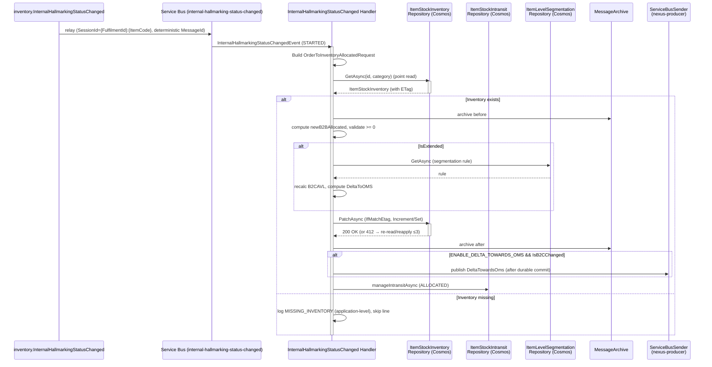
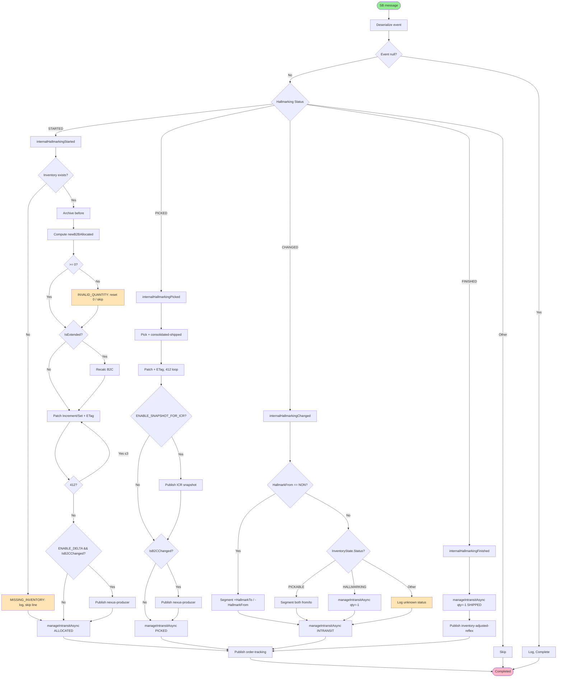

# inventory.InternalHallmarkingStatusChanged - Technical Documentation

## 1. Overview

### Purpose
`inventory.InternalHallmarkingStatusChanged` is a Kafka event that processes
internal hallmarking events for a Warehouse Management System (WMS). It manages
the complete lifecycle of hallmarking operations — inventory allocation,
picking, hallmark-state transitions, and in-transit tracking — across B2B and
B2C domains.

### Business Objective
- Process hallmarking state transitions for items (e.g., non-hallmarked →
  hallmarked).
- Maintain accurate inventory counts across B2B and B2C buckets.
- Track items in transit through different warehouse locations.
- Synchronize B2C availability changes with OMS (via Nexus).
- Publish inventory-adjusted and order-tracking notifications downstream.

### Scope
- Consumes `inventory.InternalHallmarkingStatusChanged` from Kafka, relays it to
  a session-enabled Azure Service Bus queue, and processes it on a Service Bus
  consumer that calls the Application layer.
- Processes 4 hallmarking statuses: STARTED, PICKED, CHANGED, FINISHED.
- Manages inventory across multiple fulfilment centers (warehouses, 3PL centers).
- Handles both B2B and B2C inventory domains, including extended segmentation for
  premium channels.
- Persists inventory to Cosmos DB via ETag-guarded **Patch** operations.
- Publishes downstream events to `order-tracking`, `inventory-adjusted-reflex`,
  and `nexus-producer`.

### High-Level Architecture

Matches the platform data flow in
[integration-resiliency.instructions.md](../ai/integration-resiliency.instructions.md):
a Kafka-to-Service-Bus relay hosted service, then a session-enabled Service Bus
consumer that calls the Application layer, which persists through the Cosmos DB
repository and archives through Blob Storage.

```
Kafka topic `inventory.InternalHallmarkingStatusChanged`
   (Consumer Group: $InternalHallmarkingStatusChangedIIS)
                    ↓
   KafkaConsumerHostedServiceBase (BackgroundService)
     - correlation id / dedup id / type headers read + logged
     - schema + dynamic validation
     - cold-tier request audit (unconditional)
                    ↓
   Azure Service Bus queue `internal-hallmarking-status-changed`
   (session-enabled: SessionId = {FulfilmentId}:{ItemCode};
    message ID deterministic from the Kafka key — never a fresh GUID)
                    ↓
   InternalHallmarkingStatusChangedServiceBusHostedService
     (ServiceBusConsumerHostedService<InternalHallmarkingStatusChangedEvent>)
     - envelope + payload deserialize, dynamic validation, cold-tier audit
                    ↓
      IInternalHallmarkingStatusChangedHandler.HandleAsync
                    ↓
   Status-based processing (STARTED / PICKED / CHANGED / FINISHED)
                    ↓
    ┌───────────────┬───────────────┬──────────────┬──────────────┐
    ↓               ↓               ↓              ↓              ↓
Allocation      Pick & Ship     Hallmark        In-Transit     OMS Delta /
(STARTED)       (PICKED)        Change          management     ICR snapshot
                                (CHANGED)       (all paths)
    ↓               ↓               ↓              ↓              ↓
IItemStockInventoryService → Cosmos DB (ETag-guarded Patch, re-read-and-reapply
on 412) + MessageArchive (Cosmos, optional Blob cold-tier mirror)
                    ↓
   order-tracking · inventory-adjusted-reflex · nexus-producer
   (Service Bus) via cached ServiceBusSender
```

Business logic never touches `CosmosClient`/`Container`/`ServiceBusSender`
directly — it goes through `IItemStockInventoryService` → the Cosmos repository
and through the application-layer publish abstraction (see
[shared/service-bus-publishing.md](shared/service-bus-publishing.md)).

### Assumptions
1. Incoming Kafka messages are valid
   `inventory.InternalHallmarkingStatusChanged` objects, deserialized to
   `InternalHallmarkingStatusChangedEvent`.
2. Inventory records exist or will be created for new hallmark types (created at
   Goods Receipt).
3. Cosmos is eventually consistent — no distributed transaction guarantees;
   correctness comes from deterministic Id + ETag Patch (see
   [cosmos-idempotent-write](shared/cosmos-idempotent-write.md)).
4. **Processing is idempotent** — a deterministic document `Id` plus ETag-guarded
   Patch make redelivery a no-op, not a duplicate/double-count.
5. Correlation context is propagated from upstream services.
6. Quantity calculations fit in a 32-bit integer.
7. Location types are predefined (WAREHOUSE, THIRD_PARTY_LOGISTICS, etc.) and
   hallmark types follow defined enumeration values.

### Key Dependencies

| Dependency | Type | Purpose |
|---|---|---|
| `ItemStockInventoryRepository` | Repository | Core inventory (Cosmos, multi-container EDC/TDC/ADC/CAECOM/BRZ3PL, ETag-guarded Patch; cosmos §5a/§9) |
| `ItemLevelSegmentationRepository` / `FulfilmentLevelSegmentationRepository` | Repository | B2C segmentation rules (Cosmos, read-only) |
| `ItemStockIntransitRepository` / `ItemStockWarehouseIntransitRepository` / `ItemStockInTransitByOrderRepository` | Repository | Item / warehouse / order-level transit tracking (Cosmos) |
| `OrderLineRepository` / `OrderTrackingRepository` | Repository | Order line + order tracking records (Cosmos) |
| `MessageArchiveRepository` | Repository | Before/after snapshot archival (Cosmos + optional Blob) |
| Cached `ServiceBusSender` | Infrastructure | Outbound publishing to `order-tracking`, `inventory-adjusted-reflex`, `nexus-producer` |
| `CountryRepository` | Repository | Country/market resolution (Cosmos, read-only) |
| `IMapper` (AutoMapper) | Service | DTO ↔ request/response mapping |
| `ICorrelationContextAccessor` | Service | Correlation context (event type) |
| `ILoggerService` | Service | Structured logging |
| `ApplicationConfig` | Configuration | Environment-specific settings, feature flags |
| Shared helpers | — | [cosmos-idempotent-write](shared/cosmos-idempotent-write.md), [service-bus-publishing](shared/service-bus-publishing.md), [inventory-formulas](shared/inventory-formulas.md), [delta-towards-oms](shared/delta-towards-oms.md), [country-code-lookup](shared/country-code-lookup.md), [archive-audit](shared/archive-audit.md) |

---

## 2. End-to-End Flow

```
1. MESSAGE RECEPTION (Kafka consumer)
   ├─ InternalHallmarkingStatusChanged deserialized to
   │  InternalHallmarkingStatusChangedEvent
   ├─ correlation/dedup/type headers logged
   ├─ schema + dynamic validation; cold-tier request audit
   └─ relay to Service Bus queue `internal-hallmarking-status-changed`
        · SessionId = {FulfilmentId}:{ItemCode}
        · deterministic message ID from Kafka key (never a fresh GUID)

2. SERVICE BUS CONSUMPTION
   ├─ envelope + payload deserialize, dynamic validation, cold-tier audit
   └─ IInternalHallmarkingStatusChangedHandler.HandleAsync(event)

3. NULL / VALIDATION GUARD
   ├─ null event → log and complete (no state change)
   └─ build deterministic uniqueIdentifier (ItemCode, LineNo, ReferenceId)

4. STATUS ROUTING (STARTED / PICKED / CHANGED / FINISHED / other)
   ├─ STARTED  → internalHallmarkingStarted   → allocate B2B, recalc B2C
   ├─ PICKED   → internalHallmarkingPicked     → pick + consolidated-shipped
   ├─ CHANGED  → internalHallmarkingChanged     → hallmark move + segmentation
   ├─ FINISHED → internalHallmarkingFinished    → complete transit
   └─ other    → skip
   (each path calls manageIntransitAsync as normal handler logic)

5. PERSISTENCE
   └─ Cosmos writes via ETag-guarded Patch (Increment/Set, ≤10 ops),
      deterministic Id + 409-as-applied, 412 → re-read/reapply loop (≤3)
      (see cosmos-idempotent-write.md); archive before/after (archive-audit.md)

6. DOWNSTREAM PUBLISHES (after durable commit)
   ├─ OMS delta (nexus-producer) when ENABLE_DELTA_TOWARDS_OMS && IsB2CChanged
   ├─ order-tracking record (order-tracking)
   └─ inventory-adjusted reflex (inventory-adjusted-reflex) on FINISHED

7. OUTCOME
   └─ no exception → Completed;
      ConcurrencyException/OperationCanceled → Abandoned;
      any other → DeadLettered (see cosmos-idempotent-write.md)
```

### Status-Based Processing Paths

#### Path 1: STARTED Status (Allocation)
```
internalHallmarkingStarted()
├─ Build OrderToInventoryAllocatedRequest
├─ orderToInventoryAllocatedEventAsync()
│  ├─ Read existing ItemStockInventory (point read)
│  ├─ Archive before (archive-audit.md)
│  ├─ Patch Increment B2BAllocated (B2B domain)
│  ├─ Recalculate B2C extension if IsExtended
│  └─ Archive after
├─ Publish delta to OMS via nexus-producer (if ENABLE_DELTA_TOWARDS_OMS && IsB2CChanged)
└─ manageIntransitAsync() with OrderTrackingStatus.ALLOCATED
```
**Key validations:** ItemStockInventory must exist; `AllocatedFromB2BBucketQuantity`
cannot be zero; `B2BAllocated` cannot go negative; `B2CAllocated` cannot exceed
available quantity.

#### Path 2: PICKED Status (Pick & Ship)
```
internalHallmarkingPicked()
├─ Build ItemStockRequest (from ItemLine)
├─ inventoryPickEventHandlerAsync()
│  ├─ Read ItemStockInventory
│  ├─ Patch B2BAllocated (Increment -qty), B2BPrepared (Increment +qty)
│  ├─ Handle B2C overflow if extended
│  └─ Persist (Patch, ETag)
├─ Build B2BOrderConfirmedRequest
├─ consolidatedOrderShippedEventHandlerAsync()
│  ├─ Handle confirmation type (PRELIMINARY vs STANDARD_FOLLOWING_PRELIMINARY)
│  ├─ Adjust PSC, B2BAVL, B2BPrepared based on type
│  └─ Recalculate B2C extension
├─ Update item-level segmentation
├─ Conditionally generate ICR snapshot (ENABLE_SNAPSHOT_FOR_ICR)
├─ Publish delta to OMS if B2C changed
└─ manageIntransitAsync() with OrderTrackingStatus.PICKED
```
**Key calculations:** `B2BAllocated -= PickedQuantity`;
`B2BPrepared += PickedQuantity`; `B2BAVL -= ShippedQuantity` (on final shipment).

#### Path 3: CHANGED Status (Hallmark State Change)
```
internalHallmarkingChanged()
├─ IF HallmarkingFrom == NON
│  ├─ inventorySegmentationAndExtensionAsync(MoveSign="+", HallmarkingTo)  // increase target
│  └─ inventorySegmentationAndExtensionAsync(MoveSign="-", HallmarkingFrom) // decrease source
├─ ELSE IF InventoryState.Status == PICKABLE
│  ├─ Process both source and destination hallmark updates
│  └─ Handle inventory extension logic
├─ ELSE IF InventoryState.Status == HALLMARKING
│  └─ Update in-transit records with quantitySign = -1
└─ manageIntransitAsync() with OrderTrackingStatus.INTRANSIT
```
**Special logic:** when `HallmarkingFrom == NON`, hallmark from nothing (pure
creation); uses ± `moveSign` to increase/decrease inventory; recalculates B2C
extension for each change.

#### Path 4: FINISHED Status (Completion)
```
internalHallmarkingFinished()
├─ manageIntransitAsync() with quantitySign = -1 and OrderTrackingStatus.SHIPPED
├─ Transition from In-Transit to Available in target hallmark
└─ Build InventoryAdjustedEvent and publish to inventory-adjusted-reflex
```

### Data Flow Through Layers
`Kafka → KafkaConsumerHostedServiceBase → Service Bus
(internal-hallmarking-status-changed) → ServiceBusConsumerHostedService →
IInternalHallmarkingStatusChangedHandler → helpers → IItemStockInventoryService →
Cosmos repository (Patch/ETag) + archive → ServiceBusSender (order-tracking,
inventory-adjusted-reflex, nexus-producer)`.

---

## 3. Detailed Business Logic

### 3.1 Inventory Allocation Logic (STARTED Status)

**Why it exists:** B2B customers require inventory reservation before picking.

**Inputs:** `ItemCode`, `FulfilmentCode`, `CountryOfOrigin`, `Hallmark`,
`AllocatedFromB2BBucketQuantity`.

**Processing:**
1. **Read current inventory** by category (point read on
   `FulfilmentId:ItemCode:Hallmark:CountryOfOrigin`).
2. **Compute new B2BAllocated** and apply via `PatchOperation.Increment`:
   ```
   newB2BAllocated = prevB2BAllocated + allocatedQuantity
   Validation:
   - If newB2BAllocated < 0 → business rejection (INVALID_QUANTITY), reset to 0, log warning
   - If allocatedQuantity == 0 → business rejection (INVALID_QUANTITY)
   ```
3. **Update B2C extension** (if `IsExtended`) via the extension calculation
   (recalculate `B2CExtended`, `B2CAVL`, compute delta to OMS).
4. **Persist** via ETag-guarded Patch, archiving before/after.

**Decision points:**
- ItemStockInventory exists? → continue : log warning (`MISSING_INVENTORY`
  application-level rejection) & skip line.
- OrderDomain is B2B/INTERNAL_HALLMARKING? → update B2BAllocated : check B2C.
- Inventory extended? → recalculate B2C : skip extension logic.
- `ENABLE_DELTA_TOWARDS_OMS && IsB2CChanged`? → publish to OMS : skip.

**Outputs:** `OrderToInventoryAllocatedResponse` with `IsB2CChanged`,
`DeltaTowardsOMS`, `IsItemLevelRuleChanged`.

**Edge cases:** missing inventory record → application-level `MISSING_INVENTORY`
rejection (logged, line skipped); negative allocation → `INVALID_QUANTITY`
rejection.

> **Note.** `MISSING_INVENTORY` and `INVALID_QUANTITY` here are
> **application-level business validation codes** — they are *not* Cosmos
> concurrency (`412`) or Cosmos duplicate (`409 Conflict`) signals. See §8.

### 3.2 Inventory Pick Logic (PICKED Status)

**Why it exists:** convert allocated inventory to prepared/shipped state.

**Processing B2B Pick (`InventoryType == PICKEDB2B`):**
```
Inputs:
├─ B2BAllocated (before): 100 units
├─ B2BPrepared (before): 0 units
├─ PickQuantity: 50 units
└─ IsExtended: true/false

Processing (Patch Increment):
├─ B2BAllocated: Increment(-50)  → 50
├─ B2BPrepared: Increment(+50)   → 50
├─ Validate: newB2BAllocated >= 0 → pass
└─ IF IsExtended: recalculate B2CExtended & B2CAVL

Output:
├─ B2BAllocated: 50
├─ B2BPrepared: 50
├─ B2CAVL: recalculated (if extended)
└─ DeltaTowardsOMS: delta from previous B2CAVL
```

**Processing B2C Pick (`InventoryType == PICKEDB2C`):**
```
Case 1: B2CAllocated >= PickQuantity (sufficient)
├─ B2CAllocated: Increment(-PickQuantity)
├─ B2CPrepared: Increment(+PickQuantity)
└─ Proceed normally

Case 2: B2CAllocated < PickQuantity AND NOT Extended
├─ Log warning: pick exceeds allocated (INVALID_QUANTITY business rejection)
└─ Skip line (no mutation)

Case 3: B2CAllocated < PickQuantity AND Extended
├─ b2bStock = PickQuantity - B2CAllocated
├─ B2CAllocated → 0
├─ B2BUsedShare: Increment(-b2bStock)
├─ Recalculate B2C extension with this overflow
└─ Proceed (B2B share fulfils B2C demand)
```

**Validation rules:** `B2BAllocated`/`B2BPrepared` cannot go negative (reset to
0); `B2BUsedShare` cannot go negative (`INVALID_QUANTITY` rejection, skip line);
if extended, B2C can overflow into B2B share.

### 3.3 Consolidated Order Shipped Logic

**Why it exists:** mark items as physically shipped and update available inventory.

| ConfirmationType | Logic | B2BAVL | B2BPrepared | PSC | Notes |
|---|---|---|---|---|---|
| PRELIMINARY | Mark as pre-shipped | no change | no change | `+= ShippedQty` | Tentative shipment |
| STANDARD_FOLLOWING_PRELIMINARY | Finalize shipment | `-= ShippedQty` | `-= ShippedQty` | `-= ShippedQty` | Confirms preliminary |
| OTHER/DEFAULT | Final shipment | `-= ShippedQty` | `-= ShippedQty` | no change | Direct shipment |

**Validation:** `ShippedQuantity > 0`; `AllocatedFromB2BBucketQuantity >=
ShippedQuantity`; `B2BAVL`/`B2BPrepared` cannot go negative (reset to 0). All
changes applied via `PatchOperation.Increment`.

### 3.4 Inventory Segmentation & Extension Logic (CHANGED Status)

**Why it exists:** move inventory between hallmark types and recalculate B2C
available quantities based on store-leverage rules.

**Inputs:** `MoveSign` (`+`/`-`), `Hallmark`, `Quantity`, `LocationType`.

**Processing:**
```
1. Read or create-if-missing ItemStockInventory for hallmark
   (deterministic Id; 409 Conflict → treat as already-created, see
    cosmos-idempotent-write.md)

2. Parse signed inbound quantity (inventory-formulas.md):
   inboundQty = Convert.ToInt32(MoveSign + Quantity.ToString())   // -100 or +100

3. Validate: inboundQty < 0 AND inventory was null → business rejection
   (INVALID_QUANTITY — cannot negate empty inventory)

4. Resolve segmentation rule:
   IF item-level rule exists AND isActive → ExtendInventoryHelper.DoItemLevelExtension()
   ELSE IF fulfilment-level rule exists   → SegmentInventoryHelper.DoFulfilmentLevelSegmentation()
   ELSE (3PL)                             → SegmentInventoryHelper.DoFulfilmentLevelB2CSegmentation()

5. delta = newB2CAVL - prevB2CAVL
   IF delta != 0 AND IsB2CChanged → publish to nexus-producer for OMS sync

6. Update item-level segmentation if rule exists
7. Generate ICR snapshot if ENABLE_SNAPSHOT_FOR_ICR
```

All quantity increments applied via `PatchOperation.Increment` under ETag; see
[inventory-formulas.md](shared/inventory-formulas.md) for the arithmetic.

**Item-level extension** (ecomShare = 30%):
```
Total B2B Available = B2BAVL + PSC (pending shipped count)
B2C Available       = Total B2B Available × (ecomShare / 100)
B2CAVL              = Max(B2COrg, B2C Available)
```
**Fulfilment-level segmentation:**
```
Allocated to B2C = Total Allocated × (StoreLeveragePercentage / 100)
Available to B2C = Total Available × (StoreLeveragePercentage / 100)
```

### 3.5 In-Transit Management Logic (`manageIntransitAsync`)

**Why it exists:** track items in movement between statuses and locations for
fulfilment visibility. This is **normal handler logic** invoked in-process by
each status path — there is no orchestration involved.

**Inputs:** `OrderStatus` (ALLOCATED, PICKED, INTRANSIT, SHIPPED), `Qnty` (signed),
`HallmarkFrom`/`HallmarkTo`, `OrderType` (INTERNALHALLMARKING), `OrderId`.

**Processing by status:**

#### STARTED
```
IF existing ALLOCATED record:
   IF Qnty < 0: validate cannot reduce below negative of quantity
   ELSE: Patch Increment quantity (logic differs for B2B_GOODS_IN_TRANSIT_RECEIVED
         vs others per correlation context)
ELSE IF Qnty > 0: create new ALLOCATED transit record (deterministic Id)
```

#### PICKED
```
1. PICKED record: exists → Patch Increment(+Qnty); else if Qnty > 0 → create
2. ALLOCATED record (same item): exists → Patch Increment(-Qnty), status stays ALLOCATED
```

#### CHANGED
```
IF HallmarkFrom == NON:   // creating hallmarked item
   ├─ Update/create inventory + in-transit record for HallmarkTo
   └─ Remove from ALLOCATED records
ELSE:                     // changing between hallmarks
   ├─ HallmarkFrom: Patch Increment(-) InTransit + in-transit record
   ├─ HallmarkTo:   Patch Increment(+) InTransit + in-transit record
   └─ Update ALLOCATED record
```

#### FINISHED
```
1. HallmarkTo inventory: Patch Increment(InTransit += Qnty)
2. INTRANSIT → CREATED transition: find INTRANSIT record, reduce quantity,
   move to CREATED/previous status
```

**Quantity sign rules:** default `quantitySign = +1`; FINISHED → `-1`; CHANGED
with negative flow → `-1`.

**Validation:** cannot produce negative in-transit quantities; for negative flows,
`|Qnty|` cannot exceed current transit quantity (business rejection, not a Cosmos
error).

---

## 4. Calculation Logic

All quantity math is centralized in
[inventory-formulas.md](shared/inventory-formulas.md); OMS deltas in
[delta-towards-oms.md](shared/delta-towards-oms.md).

### 4.1 Signed inbound quantity
```
inboundQty = Convert.ToInt32(MoveSign + Quantity.ToString())
```
Examples: `("",100)→100`, `("-",75)→-75`, `("+",50)→50`. Increments are applied
with `PatchOperation.Increment`, never read-modify-write-replace.

### 4.2 B2C Available Quantity
```
IF IsExtended:
   B2CExtended = CalculateActualB2BAvailable()
   B2CAVL      = CalculateB2CAvl()
ELSE:
   B2CAVL      = B2COrg (original at receipt)
```
- `CalculateActualB2BAvailable()` = `(B2BAVL + PSC) − B2BUsedShare`.
- `CalculateB2CAvl()` = `Max(B2COrg, CalculateActualB2BAvailable)` — can't reduce
  B2C below original allocation.

**Worked example:**
```
Before: B2BAVL=100, PSC=20, B2BUsedShare=10, B2COrg=30, StoreLeverage=30%
  B2BAvailable = 100 + 20 - 10 = 110
  B2CExtended  = 110 × 0.30 = 33
  B2CAVL       = Max(30, 33) = 33
After:  B2CAVL = 33 (increased by 3 units → delta +3)
```

### 4.3 Delta Towards OMS
```
DeltaTowardsOMS = CurrentB2CAVL − PreviousB2CAVL
```

| Previous | Current | Delta | IsB2CChanged |
|---|---|---|---|
| 30 | 33 | +3 | true |
| 100 | 75 | −25 | true |
| 100 | 100 | 0 | false |

Integer only (truncated, not rounded); null `B2CAVL` treated as 0. When
`IsB2CChanged` and the flag is enabled, published to `nexus-producer` (see
[delta-towards-oms.md](shared/delta-towards-oms.md)).

### 4.4 Quantity Sign Application
```
signedQuantity = quantitySign × baseQuantity
// STARTED:  +1 × 50 = +50 (add to in-transit)
// FINISHED: -1 × 50 = -50 (remove from in-transit)
```

---

## 5. Database Documentation

All Cosmos access follows [cosmos-db.instructions.md](../ai/cosmos-db.instructions.md)
and [cosmos-idempotent-write.md](shared/cosmos-idempotent-write.md).

### 5.1 ItemStockInventory (Cosmos, multi-container per fulfilment code)
Core inventory ledger tracking available, allocated, prepared, and in-transit
quantities across domains and hallmark types.

- **Partition key** `Category` = composite
  `FulfilmentId:ItemCode:Hallmark:CountryOfOrigin`.
- **Read:** `GetAsync(id, category)` — point read within one partition.
- **Create (first write):** deterministic `Id`; `409 Conflict` → return existing
  (redelivery no-op).
- **Update:** **`PatchAsync`** with `IfMatchEtag`, `PatchOperation.Increment` for
  quantity fields and `.Set` for flags (`IsExtended`) and `ModifiedUtc`,
  **≤10 ops**. `412` → `ConcurrencyException` → §8 re-read/reapply loop (max 3).
- **No last-write-wins** on any quantity field.

| Column | Type | Purpose | How derived |
|---|---|---|---|
| ItemCode | string | Product identifier | `Event.ItemLine.ProductId` |
| FulfilmentId | string | Warehouse/location | `Event.Location.Id` |
| Hallmark | string | Hallmark type (NON, 916, 750, …) | `Event.ItemLine.HallmarkingFrom/.To` |
| COO | string | Country of Origin | `Event.ItemLine.CountryOfOrigin` |
| B2BAVL / B2CAVL | int | B2B/B2C available | segmentation + extension → Patch Increment |
| B2BAllocated / B2CAllocated | int | Reserved for orders | allocation/pick events → Patch Increment |
| B2BPrepared / B2CPrepared | int | Picked and staged | pick events → Patch Increment |
| B2CExtended | int | B2C extended from B2B share | segmentation logic |
| B2BUsedShare | int | B2B used for B2C | extended allocation |
| B2COrg | int | Original B2C at receipt | GR event |
| InternalHallmarkAllocated | int | Allocated to hallmarking | STARTED event |
| InTransit | int | Items moving between statuses | transit events |
| PSC | int | Preliminary Shipped Count | PRELIMINARY shipment |
| IsExtended | bool | Extended inventory active? | item-level rule active → Patch Set |
| ModifiedUtc | datetime | Last modified | caller-supplied UTC → Patch Set |

### 5.2 ItemStockIntransit (Cosmos)
Tracks items in movement between order statuses
(ALLOCATED → PICKED → INTRANSIT → CREATED). Composite key includes
`ItemCode:HallmarkCode:CountryOfOriginCode:OrderType:FulfilmentCode:Status`.
Quantity moves applied via Patch Increment; status transitions via Patch Set.
Warehouse- and order-level transit are the analogous
`ItemStockWarehouseIntransit` / `ItemStockInTransitByOrder` containers.

| Status transition | Quantity change |
|---|---|
| ALLOCATED → PICKED | PICKED `Increment(+qty)`, ALLOCATED `Increment(-qty)` |
| PICKED → INTRANSIT | INTRANSIT `Increment(+qty)`, PICKED `Increment(-qty)` |
| INTRANSIT → CREATED | INTRANSIT `Increment(-qty)` |

### 5.3 ItemLevelSegmentation / FulfilmentLevelSegmentation (Cosmos, read-only)
Point reads by category; supply `EcomShare`, `IsActive`,
`StoreLeveragePercentage`, `IsOMNI`. Determine whether B2C can use B2B inventory
share.

### 5.4 OrderTracking / OrderLine (Cosmos)
Order-fulfilment milestones for customer visibility. Read to check whether an
order exists; the order-tracking record is **published** to the `order-tracking`
queue (see §7) rather than written directly here.

### 5.5 Archive
Before/after snapshots via [archive-audit.md](shared/archive-audit.md)
(best-effort; failure does not fail the message). Deterministic archive Id so a
redelivered message does not create duplicate archive rows.

### 5.6 Transaction Flow & Concurrency
Cosmos has no multi-document transactions here; correctness comes from
per-document ETag Patch + the §8 retry loop, not distributed transactions. The
Service Bus session (`SessionId = {FulfilmentId}:{ItemCode}`) serializes messages
for one aggregate, reducing contention.

---

## 6. State Changes & State Machine

```
InternalHallmarkingStatusChangedEvent
   ↓  route by status
   ├── STARTED ──▶ allocate B2B, recalc B2C ──▶ ItemStockInventory (Patch)
   │                                        └──▶ transit ALLOCATED
   ├── PICKED  ──▶ pick + consolidated-shipped ─▶ ItemStockInventory (Patch)
   │                                        └──▶ transit PICKED
   ├── CHANGED ──▶ hallmark move + segmentation ─▶ ItemStockInventory (from+to, Patch)
   │                                        └──▶ transit INTRANSIT
   └── FINISHED ─▶ complete transit ──────────▶ ItemStockInventory (Patch)
                                            └──▶ transit SHIPPED, publish inventory-adjusted-reflex

All persisting paths:
   Fetch/Create (deterministic Id; 409 → existing)
      ↓  archive before
   Patch (ETag, Increment/Set)  ── 412 ─▶ re-read + reapply (≤3)
      ↓  archive after
   Publish downstream (order-tracking / nexus-producer / inventory-adjusted-reflex)
   after durable commit
```

**ItemStockInventory transitions**

| From | To | Trigger | Changed columns |
|---|---|---|---|
| B2BAllocated: 0 | 50 | STARTED | B2BAllocated `Increment(+50)` |
| B2BAllocated: 50, B2BPrepared: 0 | 0 / 50 | PICKED | B2BAllocated `Increment(-50)`, B2BPrepared `Increment(+50)` |
| B2CAVL: 30, B2BUsedShare: 0 | 33 / 10 | PICKED → B2C extend | B2CAVL, B2BUsedShare |
| InTransit: 0, B2BAVL: 100 | 50 / 100 | CHANGED → different hallmark | InTransit `Increment(+50)` |
| InTransit: 50, B2BAVL: 100 | 0 / 150 | FINISHED | InTransit, B2BAVL |

**Critical invariants:** no quantity goes negative; in-transit never decremented
below zero; a redelivered message produces no additional mutation.

---

## 7. API Documentation

### Kafka message contract
Topic `inventory.InternalHallmarkingStatusChanged` (Consumer Group
`$InternalHallmarkingStatusChangedIIS`), mapped to
`InternalHallmarkingStatusChangedEvent`:

```json
{
  "id": "IH-2024-001",
  "channel": "B2B",
  "status": "STARTED",
  "location": { "id": "WH001", "type": "WAREHOUSE" },
  "itemLine": {
    "productId": "PROD-12345",
    "quantity": 50,
    "lineNum": 1,
    "hallmarkingFrom": "NON",
    "hallmarkingTo": "916",
    "countryOfOrigin": "INDIA"
  },
  "inventoryState": { "state": "AVAILABLE", "status": "PICKABLE" },
  "changeDate": "2024-01-15T10:30:00Z"
}
```

### Service Bus message contract
Inbound queue `internal-hallmarking-status-changed`, `ServiceBusRelayEnvelope`
wrapping the event; `SessionId = {FulfilmentId}:{ItemCode}`; deterministic
`MessageId` from the Kafka key; correlation headers per
[service-bus-publishing.md](shared/service-bus-publishing.md).

### Status values
| Status | Meaning | Trigger | Next |
|---|---|---|---|
| STARTED | Hallmark started, allocating inventory | Order placed | PICKED |
| PICKED | Items picked, prepared for shipment | Pick confirmed | CHANGED or FINISHED |
| CHANGED | Hallmark changed (e.g. 916 → 750) | Change request | CHANGED or FINISHED |
| FINISHED | Hallmark process complete, transit finished | Last mile complete | (end) |

### Validation
| Field | Rule | Handling |
|---|---|---|
| payload | not null / schema-valid | poison → DeadLettered |
| Quantity | integer | signed parse |
| Status / State | valid enum | reject invalid |
| Hallmark / COO | valid enum | reject invalid |
| inventory record | exists for this category | missing → `MISSING_INVENTORY` (application-level, skip line) |
| resulting quantity | non-negative | negative → `INVALID_QUANTITY` (application-level, skip line) |

### Sample sequences

**Sequence 1 — Simple allocation & pick**
```
STARTED : B2BAllocated Increment 0 → 100
PICKED  : B2BAllocated → 0, B2BPrepared → 100
FINISHED: B2BAVL → 100 (shipped 100), clear in-transit, publish inventory-adjusted-reflex
```

**Sequence 2 — With B2C extension**
```
PICKED  : B2CAllocated 30, PickQty 50 → B2B overflow 20; B2CAVL 30 → 35;
          DeltaOMS +5 → publish nexus-producer
CHANGED : NON → 916; increase 916 inventory; recalc B2C; DeltaOMS published
```

### Sequence diagram



### Flowchart



---

## 8. Error Handling & Retry

### Application-level (business) rejections
These are **domain validation outcomes**, distinct from any Cosmos status code.
The affected line is logged and skipped without failing the whole message:

| Code / exception | Condition | Result |
|---|---|---|
| `MISSING_INVENTORY` (`MissingItemStockInventoryException`) | Inventory record not found for the category | Log warning, skip line (no state change) |
| `INVALID_QUANTITY` (`InvalidItemStockInventoryQtyException`) | Quantity would go negative / zero allocation / pick exceeds allocated | Log warning, reset-to-0 or skip line |
| `InvalidDataException` | Invalid type/enum value | Log warning, skip |

> **Do not conflate** `MISSING_INVENTORY` / `INVALID_QUANTITY` with Cosmos
> signals. They are **application-level business validation codes**. Cosmos
> `409 Conflict` = duplicate deterministic Id (create path, treated as
> already-applied); Cosmos `412 PreconditionFailed` = stale ETag (concurrency).
> These are three separate concepts — see
> [cosmos-idempotent-write.md](shared/cosmos-idempotent-write.md).

### Cosmos concurrency & idempotency
- **Deterministic Id + `409`-as-applied** on create paths → redelivery no-op.
- **`412` (stale ETag)** → `ConcurrencyException` → bounded re-read-and-reapply
  loop (`maxAttempts = 3`); never last-write-wins. This is the fix for the
  production **duplicate-entry / doubled-quantity** symptom.
- **`429`** → Cosmos SDK retry
  (`MaxRetryAttemptsOnRateLimitedRequests`).

### Service Bus outcome mapping (definitive — see cosmos-idempotent-write.md)
| Result | Service Bus action |
|---|---|
| No exception | `Completed` |
| `ConcurrencyException` (loop exhausted) | `Abandoned` (retried to `MaxDeliveryCount`) |
| `OperationCanceledException` | `Abandoned` |
| Any other exception | `DeadLettered` (`Reason` = type, `Description` = `ex.ToString()`; payload written to hot-tier dead-letter container) |

### Publish resilience
Every outbound publish (`order-tracking`, `inventory-adjusted-reflex`,
`nexus-producer`) is wrapped in the keyed `service-bus-publish` Polly pipeline
(transient `ServiceBusException` retry, exponential backoff + jitter). This
pipeline handles **only** transient Service Bus faults — not Cosmos `429`/`412`.
Publishes happen **after** the Cosmos write is durably committed.

---

## 9. Security & Configuration

### Authentication
- Cosmos DB and Service Bus use **connection strings** sourced from Azure Key
  Vault (delivered as a **Kubernetes Secret**); local dev uses the emulator /
  user-secrets. This is the deliberate documented standard (cosmos §1/§14,
  engineering-standards §6) — **not** Managed Identity / Workload Identity.

### Feature flags
| Flag | Default | Purpose |
|---|---|---|
| ENABLE_DELTA_TOWARDS_OMS | true | OMS B2C delta notifications |
| ENABLE_SNAPSHOT_FOR_ICR | false | ICR inventory comparison snapshots |

### Queue names (kebab-case, config-resolved)
Resolved from the `ServiceBus` configuration section — never hard-coded. The old
env-var constant is shown only for traceability.

| Config key / queue name | Old constant | Direction |
|---|---|---|
| `internal-hallmarking-status-changed` | INTERNAL_HALLMARKING_REFLEX_QUEUE_NAME | inbound (relay) |
| `order-tracking` | ORDER_TRACKING_QUEUE_NAME | outbound |
| `inventory-adjusted-reflex` | INVENTORY_ADJUSTED_REFLEX_QUEUE_NAME | outbound |
| `nexus-producer` | NEXUS_PRODUCER_QUEUE_NAME | outbound (OMS/Nexus) |

### Data protection
TLS 1.2+ in transit; encryption at rest; no secrets, connection strings, or keys
logged. Item codes, quantities, and locations are not PII and are logged in
structured form. Before/after archival provides an immutable audit trail.

---

## 10. Known Limitations & Future Improvements

### Current limitations
- Integer quantities only (no fractional units).
- Segmentation rules read per operation; may be cached (below).
- In-transit management touches several containers per CHANGED message
  (source + destination hallmark); bounded but multiple round-trips.

### Potential improvements
- Cache country codes and segmentation rules per process to cut Cosmos reads.
- Batch downstream publishes where a single status produces multiple events.
- Batch/async archival to reduce write amplification.

> The previous version listed "TODO: OrderTracking / InventoryAdjusted messages
> not sent" and "no idempotency key; duplicate messages processed twice; race
> conditions on concurrent updates" as gaps. All are now resolved by design:
> downstream sends go through the cached `ServiceBusSender` to `order-tracking`,
> `inventory-adjusted-reflex`, and `nexus-producer` (§9); redelivery/concurrency
> are handled by deterministic Id + `409`-as-applied + ETag Patch + the §8
> re-read/reapply loop; and per-aggregate ordering is preserved by the Service
> Bus session (`SessionId = {FulfilmentId}:{ItemCode}`).

---

## 11. Summary

`inventory.InternalHallmarkingStatusChanged` processes internal hallmarking
lifecycle events on the AKS pipeline: it consumes from Kafka, relays to the
session-enabled `internal-hallmarking-status-changed` Service Bus queue, and
routes each message by status (STARTED / PICKED / CHANGED / FINISHED) through the
Application handler, which allocates/picks/moves inventory, manages in-transit
tracking (`manageIntransitAsync`, normal handler logic — no orchestration), and
publishes downstream to `order-tracking`, `inventory-adjusted-reflex`, and
`nexus-producer`.

**Key business logic:** B2B allocation on STARTED; allocated → prepared → shipped
on PICKED with B2C overflow into B2B share; hallmark-type moves with B2C
extension recalculation on CHANGED; transit completion and inventory-adjusted
publish on FINISHED. `MISSING_INVENTORY` and `INVALID_QUANTITY` remain
**application-level business validation codes**, kept strictly separate from
Cosmos `409`/`412`.

**Database updates:** ETag-guarded **Patch** (`Increment`/`Set`, ≤10 ops) on
`ItemStockInventory` and the transit containers, with deterministic Id +
`409`-as-applied and the §8 `412` re-read/reapply loop (max 3) — the fix for the
duplicate-entry / doubled-quantity problem; never last-write-wins.

**Risks & recommendations:** concurrency conflicts should be rare with sessions
in place; monitor dead-letter counts and Cosmos 429 rates; cache rarely-changing
lookups (country codes, segmentation rules).

---

**Document Version:** 2.0 (AKS / k8s)
**Status:** Regenerated
