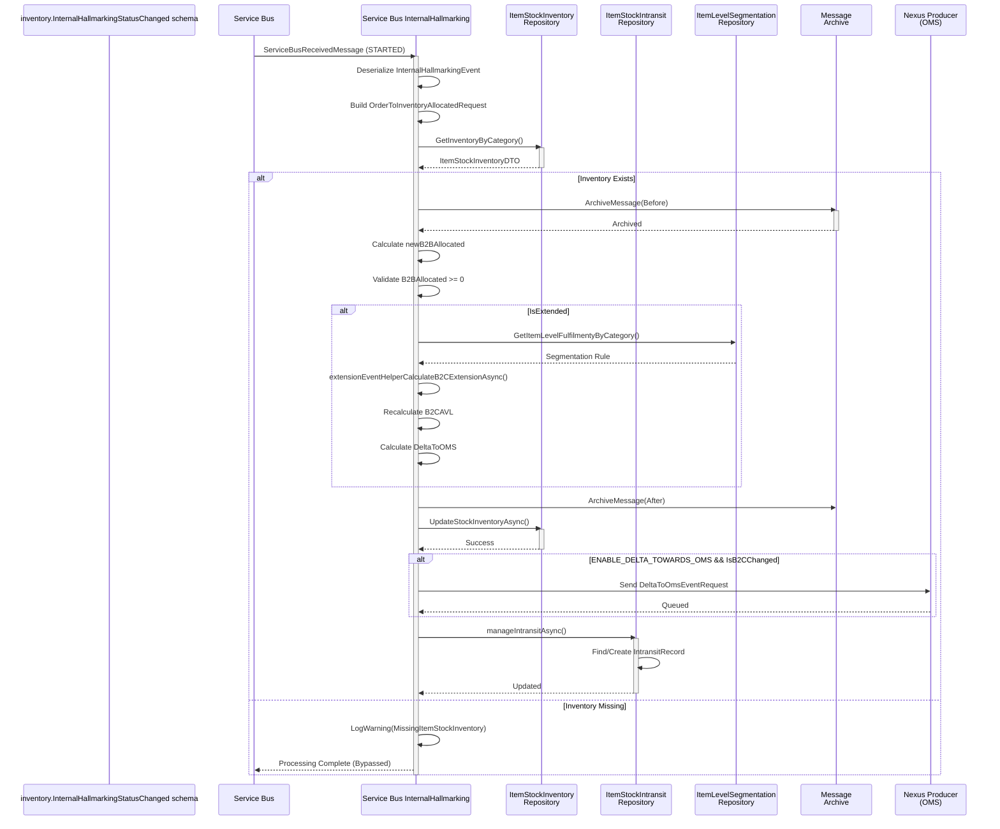
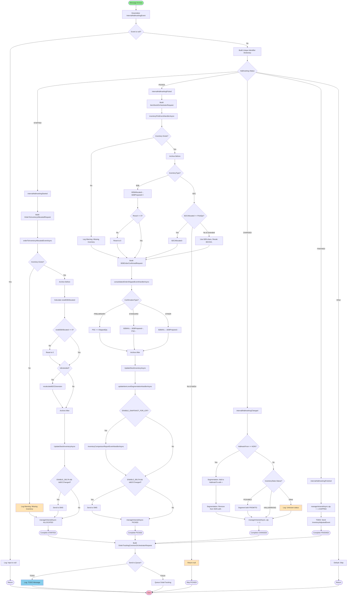

# inventory.InternalHallmarkingStatusChanged - Technical Documentation

## 1. Overview

### Purpose
The `inventory.InternalHallmarkingStatusChanged` is a kafka event that processes internal hallmarking events for a Warehouse Management System (WMS). It manages the complete lifecycle of hallmarking operations, including inventory allocation, picking, status transitions, and in-transit tracking.

### Business Objective
- Process hallmarking state transitions for items (e.g., non-hallmarked → hallmarked items)
- Maintain accurate inventory counts across B2B and B2C buckets
- Track items in transit through different warehouse locations
- Synchronize inventory changes with OMS (Order Management System)
- Generate inventory snapshots for audit and comparison reports

### Scope
- `inventory.InternalHallmarkingStatusChanged` from Kakfa via Consumer Group: `$InternalHallmarkingStatusChangedIIS` and deserialized to `InternalHallmarkingEvent` messages and send to Service Bus Queue
- Processes 4 hallmarking statuses: STARTED, PICKED, CHANGED, FINISHED
- Manages inventory across multiple fulfilment centers (warehouses, 3PL centers)
- Handles both B2B and B2C inventory domains
- Supports extended inventory segmentation for premium channels
- Updates order tracking records
- Archives messages for audit trail

### High-Level Architecture

```
Kafka (inventory.InternalHallmarkingStatusChanged)
           ↓
Service Bus Queue (InternalHallmarkingEvent)
           ↓
Status-based Processing (Switch: STARTED/PICKED/CHANGED/FINISHED)
           ↓
Inventory Operations (Allocation, Pick, Segmentation)
           ↓
Transit Tracking Updates
           ↓
OMS Delta Calculation & Notification
           ↓
Message Archiving
           ↓
Order Tracking Record Creation
```

### Assumptions
1. Kafka incoming messages are valid `inventory.InternalHallmarkingStatusChanged` kafka object
2. serialize `inventory.InternalHallmarkingStatusChanged`to `InternalHallmarkingEvent` objects and send to Service Bus Queue
3. Inventory records exist or will be created for new hallmark types
4. Database is eventually consistent - no distributed transaction guarantees
5. Correlation context is properly propagated from upstream services
6. All configuration values are valid and environment-specific
7. Quantity calculations never exceed integer.MaxValue
8. Location types are predefined (WAREHOUSE, THIRD_PARTY_LOGISTICS, etc.)
9. Hallmark types follow defined enumeration values

### Dependencies

| Dependency | Type | Purpose |
|---|---|---|
| IServiceBusQueueService | Service | Send messages to Order Tracking and Inventory Adjusted queues |
| IMessageArchiveRepository | Repository | Archive messages for audit trail |
| IItemStockInventoryRepository | Repository | Read/update/create inventory records |
| IFulfilmentLevelSegmentationRepository | Repository | Get fulfilment-level B2C segmentation rules |
| IItemLevelSegmentationRepository | Repository | Get item-level B2C extension rules |
| IItemStockIntransitRepository | Repository | Manage item transit tracking |
| IItemStockWarehouseIntransitRepository | Repository | Manage warehouse-level transit |
| IItemStockInTransitByOrderRepository | Repository | Manage order-level transit |
| IOrderLineRepository | Repository | Retrieve order line details |
| IOrderTrackingRepository | Repository | Query order tracking records |
| IMapper (AutoMapper) | Service | Map between DTO and request/response objects |
| ICorrelationContextAccessor | Service | Access correlation context (event type) |
| ILoggerService | Service | Structured logging |
| ApplicationConfig | Configuration | Environment-specific settings |

---

## 2. End-to-End Flow

### Entry Point: `Run()` Method

```
1. Kafka Message arrives on `inventory.InternalHallmarkingStatusChanged`
   ↓
2. Deserialize message to InternalHallmarkingEvent
   ↓
3. Call runInternalHallmarkAsync(internalHallmarkEvent)
   ↓
4. Build OrderTrackingCommonOrchestratorRequest
   ↓
5. Conditionally send messages to queues (Order Tracking, Inventory Adjusted)
   ↓
6. Handle any exceptions with logging
```

### Message Processing Flow

| Step | Action | Input | Output | Notes |
|---|---|---|---|---|
| 1 | Message Deserialization | Raw Service Bus Message | InternalHallmarkingEvent | Handled by GetInputAsync<T> |
| 2 | Null Check | InternalHallmarkingEvent | Boolean | Log if null, exit gracefully |
| 3 | Extract Reference ID | InternalHallmarkingEvent.Id | string | Used in unique identifier dictionary |
| 4 | Build Unique Identifier Dictionary | Event details | Dictionary<string, string> | Contains ItemCode, LineNo, ReferenceId |
| 5 | Status Switch | InternalHallmarkingStatus | Multiple paths | STARTED→PICKED→CHANGED→FINISHED |
| 6 | Status Handler Execution | Status-specific data | Database updates | Each status has dedicated method |
| 7 | Order Tracking Record | Event data | OrderTrackingCommonOrchestratorRequest | Created but NOT queued (TODO) |
| 8 | Inventory Adjusted Event | If FINISHED status | InventoryAdjustedEvent | Created but NOT queued (TODO) |
| 9 | Exception Logging | Any exception | Log entry | ExceptionQueueErrorMessage |

### Status-Based Processing Paths

#### Path 1: STARTED Status (Allocation)
```
internalHallmarkingStarted()
├─ Build OrderToInventoryAllocatedRequest
├─ Call orderToInventoryAllocatedEventAsync()
│  ├─ Retrieve existing ItemStockInventory
│  ├─ Archive before update
│  ├─ Update B2BAllocated (B2B domain)
│  ├─ Recalculate B2C extension if IsExtended
│  └─ Archive after update, persist to DB
├─ Conditionally send delta to OMS (if ENABLE_DELTA_TOWARDS_OMS && IsB2CChanged)
└─ Call manageIntransitAsync() with OrderTrackingStatus.ALLOCATED
```

**Key Validations:**
- ItemStockInventory must exist
- AllocatedFromB2BBucketQuantity cannot be zero
- B2BAllocated cannot go negative
- B2CAllocated cannot exceed available quantity

---

#### Path 2: PICKED Status (Pick & Ship)
```
internalHallmarkingPicked()
├─ Build ItemStockOrchestratorRequest (from ItemLine)
├─ Call inventoryPickEventHandlerAsync()
│  ├─ Retrieve ItemStockInventory
│  ├─ Update B2BAllocated (decrease), B2BPrepared (increase)
│  ├─ Handle B2C overflow if extended
│  └─ Persist changes
├─ Build B2BOrderConfirmedRequest
├─ Call consolidatedOrderShippedEventHandlerAsync()
│  ├─ Handle confirmation type (PRELIMINARY vs STANDARD_FOLLOWING_PRELIMINARY)
│  ├─ Update PSC, B2BAVL, B2BPrepared based on type
│  └─ Recalculate B2C extension
├─ Update item-level segmentation
├─ Conditionally generate inventory comparison snapshot
├─ Send delta to OMS if B2C changed
└─ Call manageIntransitAsync() with OrderTrackingStatus.PICKED
```

**Key Calculations:**
- B2BAllocated = B2BAllocated - PickedQuantity
- B2BPrepared = B2BPrepared + PickedQuantity
- B2BAVL = B2BAVL - ShippedQuantity (on final shipment)

---

#### Path 3: CHANGED Status (Hallmark State Change)
```
internallHallmarkingChanged()
├─ IF HallmarkingFrom == NON
│  ├─ Call inventorySegmentationAndExtensionAsync(MoveSign="+", HallmarkingTo)
│  │  └─ Increase inventory in target hallmark type
│  └─ Call inventorySegmentationAndExtensionAsync(MoveSign="-", HallmarkingFrom)
│     └─ Decrease inventory in source hallmark type
├─ ELSE IF InventoryState.Status == PICKABLE
│  ├─ Process both source and destination hallmark updates
│  └─ Handle inventory extension logic
├─ ELSE IF InventoryState.Status == HALLMARKING
│  └─ Update in-transit records with quantitySign = -1
└─ Call manageIntransitAsync() with OrderTrackingStatus.INTRANSIT
```

**Special Logic:**
- When HallmarkingFrom == NON, hallmark from nothing (pure creation)
- Uses ± moveSign to increase/decrease inventory
- Recalculates B2C extension for each change

---

#### Path 4: FINISHED Status (Completion)
```
internalHallmarkingFinished()
├─ Call manageIntransitAsync() with quantitySign = -1 and OrderTrackingStatus.SHIPPED
├─ Transition from In-Transit to Available in target hallmark
└─ Create InventoryAdjustedEvent (but NOT queued - marked as TODO)
```

---

## 3. Detailed Business Logic

### 3.1 Inventory Allocation Logic (STARTED Status)

**Why it exists:** B2B customers require inventory reservation before picking.

**Inputs:**
- ItemCode: Product identifier
- FulfilmentCode: Warehouse location
- CountryOfOrigin: Product origin country
- Hallmark: Current hallmark type
- AllocatedFromB2BBucketQuantity: Quantity to allocate

**Processing:**

1. **Retrieve Current Inventory**
   ```
   SELECT * FROM ItemStockInventory
   WHERE ItemCode = @itemCode 
   AND Hallmark = @hallmark 
   AND FulfilmentId = @fulfilmentCode 
   AND COO = @countryOfOrigin
   ```

2. **Calculate New B2BAllocated**
   ```
   newB2BAllocated = prevB2BAllocated + allocatedQuantity
   
   Validation:
   - If newB2BAllocated < 0 → Reset to 0, Log Warning
   - If allocatedQuantity == 0 → Reject with error
   ```

3. **Update B2C Extension (if IsExtended)**
   ```
   Call extensionEventHelperCalculateB2CExtensionAsync()
   - Recalculate B2CExtended based on store leverage
   - Calculate new B2CAVL
   - Compute delta to OMS
   ```

4. **Persist Changes**
   ```
   Archive original inventory
   Update ItemStockInventory with new B2BAllocated
   Archive updated inventory
   ```

**Decision Points:**
- ItemStockInventory exists? → Continue : Log Warning & Return
- OrderDomain is B2B/INTERNAL_HALLMARKING? → Update B2BAllocated : Check B2C
- Is inventory extended? → Recalculate B2C : Skip extension logic
- ENABLE_DELTA_TOWARDS_OMS && IsB2CChanged? → Send to OMS : Skip

**Outputs:**
- OrderToInventoryAllocatedResponse containing:
  - IsB2CChanged: Boolean
  - DeltaTowardsOMS: Integer (units to add/remove)
  - IsItemLevelRuleChanged: Boolean

**Edge Cases:**
- Missing inventory record → Log and skip (exception bypassed)
- Negative allocation attempt → Reset to 0
- Overflow in quantity calculation → Log warning but proceed

---

### 3.2 Inventory Pick Logic (PICKED Status)

**Why it exists:** Convert allocated inventory to prepared/shipped state.

**Inputs:**
- ItemCode, Hallmark, FulfilmentCode, CountryOfOrigin
- InventoryType: PICKEDB2B or PICKEDB2C
- Quantity: Units to pick

**Processing B2B Pick (InventoryType == PICKEDB2B):**

```
Inputs:
├─ B2BAllocated (before): 100 units
├─ B2BPrepared (before): 0 units
├─ PickQuantity: 50 units
└─ IsExtended: true/false

Processing:
├─ newB2BAllocated = 100 - 50 = 50
├─ newB2BPrepared = 0 + 50 = 50
├─ Validate: newB2BAllocated >= 0 → Pass
└─ IF IsExtended:
   └─ Recalculate B2CExtended & B2CAVL

Output:
├─ B2BAllocated: 50
├─ B2BPrepared: 50
├─ B2CAVL: Recalculated (if extended)
└─ DeltaTowardsOMS: Delta from previous B2CAVL
```

**Processing B2C Pick (InventoryType == PICKEDB2C):**

```
Case 1: B2CAllocated >= PickQuantity (Sufficient inventory)
├─ newB2CAllocated = B2CAllocated - PickQuantity
├─ newB2CPrepared = B2CPrepared + PickQuantity
└─ Proceed normally

Case 2: B2CAllocated < PickQuantity AND NOT Extended
├─ Log warning: Pick exceeds allocated
└─ Return null (abort operation)

Case 3: B2CAllocated < PickQuantity AND Extended
├─ b2bStock = PickQuantity - B2CAllocated
├─ newB2CAllocated = 0
├─ newB2BUsedShare = B2BUsedShare - b2bStock
├─ Recalculate B2C extension with this overflow
└─ Proceed (B2B share can fulfill B2C demand)
```

**Validation Rules:**
- B2BAllocated cannot go negative → Reset to 0 if violation
- B2BPrepared cannot go negative → Reset to 0 if violation
- B2BUsedShare cannot go negative → Log error & return null
- If extended, B2C can overflow into B2B share

---

### 3.3 Consolidated Order Shipped Logic

**Why it exists:** Mark items as physically shipped and update available inventory.

**Inputs:**
- ShippedQuantity: Units physically leaving warehouse
- ConfirmationType: PRELIMINARY or STANDARD_FOLLOWING_PRELIMINARY
- AllocatedFromB2BBucketQuantity: Expected allocated quantity

**Processing by Confirmation Type:**

| Type | Logic | B2BAVL | B2BPrepared | PSC | Notes |
|---|---|---|---|---|---|
| PRELIMINARY | Mark as pre-shipped | No change | No change | += ShippedQty | Tentative shipment |
| STANDARD_FOLLOWING_PRELIMINARY | Finalize shipment | -= ShippedQty | -= ShippedQty | -= ShippedQty | Confirms preliminary |
| OTHER/DEFAULT | Final shipment | -= ShippedQty | -= ShippedQty | No change | Direct shipment |

**Validation:**
- ShippedQuantity > 0 → Continue : Log Warning
- AllocatedFromB2BBucketQuantity >= ShippedQuantity → Continue : Log Warning
- B2BAVL cannot go negative → Reset to 0
- B2BPrepared cannot go negative → Reset to 0

---

### 3.4 Inventory Segmentation & Extension Logic (CHANGED Status)

**Why it exists:** Move inventory between hallmark types and recalculate B2C available quantities based on store leverage rules.

**Inputs:**
- MoveSign: "+" (add) or "-" (remove)
- Hallmark: Target hallmark type
- Quantity: Units to move
- LocationType: WAREHOUSE or THIRD_PARTY_LOGISTICS

**Processing:**

```
1. Retrieve or Create ItemStockInventory for hallmark

2. Parse Quantity with MoveSign:
   strQuantity = moveSign + quantity.ToString()
   inboundQty = Convert.ToInt32(strQuantity)
   // Result: -100 or +100

3. Validate: If inboundQty < 0 AND inventory was null → Error (can't go negative from zero)

4. Retrieve Item-Level Segmentation Rule:
   IF exists AND isActive:
      // Use item-level store leverage percentage
      ExtendInventoryHelper.DoItemLevelExtension()
   ELSE IF Fulfilment-level rule exists:
      // Use fulfilment-level segmentation
      SegmentInventoryHelper.DoFulfilmentLevelSegmentation()
   ELSE:
      // For 3PL, use fulfilment-level B2C segmentation
      SegmentInventoryHelper.DoFulfilmentLevelB2CSegmentation()

5. Calculate Delta to OMS:
   deltaToOMS = newB2CAVL - prevB2CAVL
   IF deltaToOMS != 0 AND isB2CChanged:
      Send to Nexus Producer for OMS sync

6. Update Item-Level Segmentation if rule exists

7. Generate inventory snapshot if ENABLE_SNAPSHOT_FOR_ICR
```

**Calculation Details:**

For **Item-Level Extension** (ecomShare = 30%):
```
Total B2B Available = B2BAVL + PSC (pending shipped count)
B2C Available = Total B2B Available × (ecomShare / 100)
B2C Org = Original B2C quantity from receipt

B2CAVL = Max(B2COrg, B2C Available)
```

For **Fulfilment-Level Segmentation**:
```
Allocated to B2C = Total Allocated × (StoreLeveragePercentage / 100)
Available to B2C = Total Available × (StoreLeveragePercentage / 100)
```

---

### 3.5 In-Transit Management Logic

**Why it exists:** Track items in movement between statuses and locations for fulfillment visibility.

**Inputs:**
- OrderStatus: ALLOCATED, PICKED, INTRANSIT, SHIPPED
- Qnty: Quantity with sign (+/-)
- HallmarkFrom/HallmarkTo: Source/destination hallmark
- OrderType: INTERNALHALLMARKING
- OrderId: Unique order identifier

**Processing by Status:**

#### STARTED Status:
```
IF existing record with ALLOCATED status:
   IF Qnty < 0:
      Validate: Cannot reduce below negative of quantity
   ELSE:
      Update quantity based on correlation context
      // Different logic for B2B_GOODS_IN_TRANSIT_RECEIVED vs others
ELSE:
   IF Qnty > 0:
      Create new ALLOCATED transit record
```

#### PICKED Status:
```
1. Find PICKED status record:
   IF exists:
      Update quantity (add Qnty)
   ELSE IF Qnty > 0:
      Create new PICKED transit record

2. Find ALLOCATED record for same item:
   IF exists:
      Reduce quantity (subtract Qnty)
      Status remains ALLOCATED
```

#### CHANGED Status:
```
Complex logic handling both source and destination hallmarks:

IF HallmarkFrom == NON:
   // Creating hallmarked item
   ├─ Update/create inventory for HallmarkTo
   ├─ Update/create in-transit record for HallmarkTo
   └─ Remove from ALLOCATED records

ELSE:
   // Changing between hallmarks
   ├─ Update inventory for HallmarkFrom (decrease InTransit)
   ├─ Update in-transit record for HallmarkFrom
   ├─ Update inventory for HallmarkTo (increase InTransit)
   ├─ Update in-transit record for HallmarkTo
   └─ Update ALLOCATED record
```

#### FINISHED Status:
```
1. Update inventory for HallmarkTo:
   InTransit += Qnty

2. Update from INTRANSIT status to CREATED status:
   • Find INTRANSIT record
   • Reduce quantity
   • Move to CREATED/PICKED previous status
```

**Quantity Sign Rules:**
- Default quantitySign = +1 (increase)
- On FINISHED, quantitySign = -1 (decrease allocated, complete transit)
- On CHANGED with negative flow, quantitySign = -1

**Validation:**
- Cannot have negative in-transit quantities
- Absolute value of Qnty cannot exceed current transit quantity (for negatives)

---

## 4. Calculation Logic

### 4.1 B2C Available Quantity Calculation

**Formula:**
```
IF IsExtended:
   B2CExtended = CalculateActualB2BAvailable()
   B2CAVL = CalculateB2CAvl()
ELSE:
   B2CAVL = B2COrg (Original at receipt)
```

**Component: CalculateActualB2BAvailable()**
```
Returns: Adjusted B2B available for B2C extension
Uses: B2BAVL, PSC, B2BUsedShare
Logic: (B2BAVL + PSC) - B2BUsedShare
```

**Component: CalculateB2CAvl()**
```
Returns: New B2C available quantity
Logic: Max(ItemStockInventoryDto.B2COrg, CalculateActualB2BAvailable)
Purpose: Can't reduce B2C below original allocation
```

**Example:**
```
Before:
├─ B2BAVL: 100
├─ PSC: 20
├─ B2BUsedShare: 10
├─ B2COrg: 30
└─ StoreLeveragePercentage: 30%

Calculation:
├─ B2BAvailable = 100 + 20 - 10 = 110
├─ B2CExtended = 110 × 0.30 = 33
├─ B2CAVL = Max(30, 33) = 33

After:
└─ B2CAVL: 33 (increased by 3 units)
```

---

### 4.2 Delta Towards OMS Calculation

**Formula:**
```
DeltaTowardsOMS = CurrentB2CAVL - PreviousB2CAVL

Range: -999 to +999 (typical)
Units: Individual item units
Purpose: Communicate inventory changes to e-commerce system
```

**Example:**
```
Previous B2CAVL: 30
Current B2CAVL: 33
Delta: 33 - 30 = +3

Interpretation: OMS should add 3 units to available inventory
```

**Precision:**
- No decimal points (integer)
- Handles underflow: If negative, send as negative delta
- Not rounded, truncated

**Null Handling:**
- If PreviousB2CAVL is null → Treated as 0
- If CurrentB2CAVL is null → Treated as 0

---

### 4.3 Quantity Sign Application

**Formula:**
```
signedQuantity = quantitySign × baseQuantity

Where:
├─ quantitySign: +1 or -1 (default +1)
├─ baseQuantity: Unsigned quantity from event
└─ Result: Applied as delta to in-transit quantities
```

**Application Example:**
```
// STARTED status
quantitySign = +1
eventQuantity = 50
Applied = +1 × 50 = +50 (add to in-transit)

// FINISHED status
quantitySign = -1
eventQuantity = 50
Applied = -1 × 50 = -50 (remove from in-transit)
```

---

## 5. Database Documentation

### 5.1 ItemStockInventory Table

**Purpose:** Core inventory ledger tracking available, allocated, prepared, and in-transit quantities across domains and hallmark types.

**Key Columns:**

| Column | Type | Purpose | Source | Constraints |
|---|---|---|---|---|
| ItemCode | string | Product identifier | Event.ItemLine.ProductId | NOT NULL, FK |
| FulfilmentId | string | Warehouse/location | Event.Location.Id | NOT NULL, FK |
| Hallmark | string | Hallmark type (NON, 916, 750, etc.) | Event.ItemLine.HallmarkingFrom/.To | NOT NULL |
| COO | string | Country of Origin | Event.ItemLine.CountryOfOrigin | NOT NULL |
| B2BAVL | int | B2B Available | Calculated | >= 0 |
| B2CAVL | int | B2C Available (extended or original) | Calculated | >= 0 |
| B2BAllocated | int | B2B Reserved for orders | Allocation events | >= 0 |
| B2CAllocated | int | B2C Reserved for orders | B2C pick events | >= 0 |
| B2BPrepared | int | B2B Picked and staged | Pick events | >= 0 |
| B2CPrepared | int | B2C Picked and staged | B2C pick events | >= 0 |
| B2CExtended | int | B2C Extended from B2B share | Segmentation logic | >= 0 |
| B2CThreshold | int | Minimum B2C to maintain | Configuration | >= 0 |
| B2BUsedShare | int | B2B quantity used for B2C | Extended allocation | >= 0 |
| B2COrg | int | Original B2C at receipt | GR event | >= 0 |
| InternalHallmarkAllocated | int | Items allocated to hallmarking | STARTED event | >= 0 |
| InTransit | int | Items moving between statuses | Transit events | >= 0 |
| PSC | int | Preliminary Shipped Count | PRELIMINARY shipment | >= 0 |
| IsExtended | bool | Extended inventory active? | Segmentation rule | true/false |

**Read Operations:**

```sql
-- Get Inventory by Category
SELECT * FROM ItemStockInventory
WHERE ItemCode = @itemCode 
  AND Hallmark = @hallmark 
  AND FulfilmentId = @fulfilmentCode 
  AND COO = @countryOfOrigin;
-- Used: Allocation, Pick, Shipment, Segmentation processing
-- Expected: 0 or 1 row
```

**Insert Operations:**

```sql
-- Create new inventory record
INSERT INTO ItemStockInventory (
  ItemCode, FulfilmentId, Hallmark, COO,
  B2BAVL, B2CAVL, B2BAllocated, B2CAllocated,
  B2BPrepared, B2CPrepared, InternalHallmarkAllocated,
  InTransit, B2COrg, IsExtended, PSC
) VALUES (
  @itemCode, @fulfilmentId, @hallmark, @coo,
  0, 0, 0, 0, 0, 0, 0, 0, 0, false, 0
);
-- Occurs: During segmentation & extension for new hallmarks
```

**Update Operations:**

| Event | Columns Updated | Logic | Example |
|---|---|---|---|
| STARTED (Allocate) | B2BAllocated, B2CAVL | Increase allocated, recalc extension | B2BAllocated += 50 |
| PICKED (Pick B2B) | B2BAllocated, B2BPrepared, B2CAVL | Move from allocated to prepared | B2BAllocated -= 50, B2BPrepared += 50 |
| PICKED (Pick B2C) | B2CAllocated, B2CPrepared, B2BUsedShare | Handle B2C, overflow to B2B if extended | B2CAllocated -= qty |
| SHIPPED (Preliminary) | PSC | Mark as preliminary shipped | PSC += 50 |
| SHIPPED (Confirm) | B2BAVL, B2BPrepared, PSC | Finalize shipment | B2BAVL -= 50, B2BPrepared -= 50 |
| CHANGED (Segmentation) | B2BAVL, B2CAVL, InTransit | Move between hallmark types, recalc extension | InTransit += 50 |
| Extension recalc | B2CExtended, B2CAVL | Apply store leverage percentage | B2CAVL = Max(B2COrg, calculated) |

**Transaction Boundaries:**
- Each STARTED/PICKED/CHANGED/FINISHED processes within single transaction
- Archive before update, archive after update (immutable audit trail)
- Rollback if any repository operation fails

**Locking Strategy:**
- Optimistic (no explicit locks) - relying on DB transaction isolation
- Potential race condition: Multiple events for same item simultaneously
- Mitigation: Correlation context ensures sequential processing per item

---

### 5.2 ItemStockIntransit Table

**Purpose:** Track items in movement between order statuses (ALLOCATED → PICKED → INTRANSIT → SHIPPED).

**Key Columns:**

| Column | Type | Purpose | Source |
|---|---|---|---|
| ItemCode | string | Product | Event |
| HallmarkCode | string | Hallmark type | Event.HallmarkFrom or .HallmarkTo |
| CountryOfOriginCode | string | Country | Event |
| FulfilmentCode | string | Destination location | Event |
| FulfilmentType | string | Location type | Event |
| OrderType | string | INTERNALHALLMARKING | Event |
| OrderId | string | Reference ID | Event |
| Status | string | ALLOCATED/PICKED/INTRANSIT/CREATED | Managed by handler |
| Quantity | int | Current transit quantity | Incremented/decremented |
| CreatedTimestamp | datetime | Record creation | DateTime.UtcNow |

**Read Operations:**

```sql
-- Get transit record by category
SELECT * FROM ItemStockIntransit
WHERE Status = @status 
  AND ItemCode = @itemCode
  AND HallmarkCode = @hallmark
  AND CountryOfOriginCode = @coo
  AND OrderType = @orderType
  AND FulfilmentCode = @destination;
```

**Update Operations:**

| Status Transition | Quantity Change | Example |
|---|---|---|
| ALLOCATED → PICKED | Increase PICKED, Decrease ALLOCATED | PICKED qty += 50 |
| PICKED → INTRANSIT | Increase INTRANSIT, Decrease PICKED | Move to INTRANSIT |
| INTRANSIT → SHIPPED | Decrease INTRANSIT | Finalize delivery |

---

### 5.3 ItemLevelSegmentation Table

**Purpose:** Store B2C extension rules per item-fulfilment combination for premium channel segmentation.

**Key Columns:**

| Column | Type | Purpose |
|---|---|---|
| ItemCode | string | Product identifier |
| FulfilmentCode | string | Warehouse |
| Hallmark | string | Hallmark type |
| COO | string | Country of origin |
| EcomShare | int | % of B2B to extend as B2C (0-100) |
| StoreLeveragePercentage | decimal | Leverage factor |
| IsActive | bool | Rule enabled? |
| IsOMNI | bool | Omnichannel applicable? |

**Usage:** Determine if B2C can use B2B inventory share.

---

### 5.4 MessageArchive Table

**Purpose:** Immutable audit trail of all inventory changes.

**Operations:**

```sql
-- Archive before every update
INSERT INTO MessageArchive (Message, MessageType, CreatedAt)
VALUES (@serializedInventory, 'ItemStockInventory', DateTime.UtcNow);

-- Trace inventory state over time
SELECT * FROM MessageArchive
WHERE MessageType = 'ItemStockInventory' 
  AND Message LIKE '%ItemCode%'
ORDER BY CreatedAt DESC;
```

**Retention:** Typically 1-2 years for audit compliance.

---

### 5.5 OrderTracking Table

**Purpose:** Record order fulfillment milestones for customer visibility.

**Read Operations:**

```sql
-- Check if order exists
SELECT * FROM OrderTracking
WHERE OrderId = @orderId 
  AND FulfillmentUnitId = @fulfilmentId;
```

**Write Operations:** (Via OrderTrackingCommonOrchestratorRequest - currently TODO)

```sql
INSERT INTO OrderTracking (
  OrderId, Channel, Status, 
  FulfilmentUnitId, FulfilmentUnitType,
  OrderType, OrderDate
) VALUES (...)
-- Status: ALLOCATED, PICKED, INTRANSIT, SHIPPED
-- Would be sent via Service Bus (TODO in code)
```

---

## 6. State Changes

### Complete State Transition Diagram

```
Initial State (Message Arrives)
    ↓
Parse InternalHallmarkingEvent
    ↓
    ├─────────────────────┬───────────────────┬──────────────────┬─────────────────┐
    ↓                     ↓                   ↓                  ↓                 ↓
STARTED Status      PICKED Status      CHANGED Status    FINISHED Status    Other Status
    ↓                     ↓                   ↓                  ↓                 ↓
Allocate             Pick & Ship      Change Hallmark    Complete Transit    Skip
Inventory            Inventory        Update Transit     Mark as Shipped     
    ↓                     ↓                   ↓                  ↓
Load B2B             Load from          Load both            Load Target
Update               Allocated          hallmarks            hallmark
Allocation           Mark Prepared      Recalculate          Update Transit
Recalculate          Calculate          B2C                  Mark Shipped
B2C Extend           DeltaOMS           Send OMS             (TODO: Generate
Send OMS             Update Transit     Update Transit       InventoryAdjusted)
    ↓                     ↓                   ↓                  ↓
Archive &            Archive &          Archive &            Archive &
Persist              Persist            Persist              Persist
    ↓                     ↓                   ↓                  ↓
Status =             Status =           Status =            Status =
ALLOCATED            PICKED             INTRANSIT           SHIPPED
(Ready to Pick)      (Ready to Ship)    (In Movement)       (Completed)
```

### State Transitions in Detail

#### Entity: ItemStockInventory

| From State | To State | Trigger | Changed Columns | Example |
|---|---|---|---|---|
| B2BAllocated: 0 | B2BAllocated: 50 | STARTED event | B2BAllocated | Order placed, reserve 50 units |
| B2BAllocated: 50, B2BPrepared: 0 | B2BAllocated: 0, B2BPrepared: 50 | PICKED event | B2BAllocated, B2BPrepared | Pick all 50, mark prepared |
| B2CAVL: 30, B2BUsedShare: 0 | B2CAVL: 33, B2BUsedShare: 10 | PICKED → B2C extend | B2CAVL, B2BUsedShare | Extend B2C by using B2B share |
| InTransit: 0, B2BAVL: 100 | InTransit: 50, B2BAVL: 100 | CHANGED → Different hallmark | InTransit | Transfer to target hallmark |
| InTransit: 50, B2BAVL: 100 | InTransit: 0, B2BAVL: 150 | FINISHED | InTransit, B2BAVL | Complete transit, add to available |

#### Entity: ItemStockIntransit

| From Status | To Status | Trigger | Quantity Logic | Notes |
|---|---|---|---|---|
| (new) | ALLOCATED | STARTED event | qty = +50 | Create record |
| ALLOCATED: 50 | PICKED: 50 | PICKED event | ALLOCATED -= 50, PICKED += 50 | Move from allocated |
| PICKED: 50 | INTRANSIT: 50 | CHANGED event | PICKED -= 50, INTRANSIT += 50 | Progress in delivery |
| INTRANSIT: 50 | SHIPPED: 0 | FINISHED event | INTRANSIT -= 50 | Complete |

---

## 7. API Documentation

### 7.1 Service Bus Message Contract

**Topic/Queue Name:** `%INTERNAL_HALLMARKING_REFLEX_QUEUE_NAME%`

**Message Type:** `InternalHallmarkingEvent`

**HTTP Equivalent (REST Simulation):**

```http
POST /internal-hallmarking/process
Content-Type: application/json
X-Correlation-ID: {{correlationId}}
```

### Request Body

```json
{
  "id": "IH-2024-001",
  "channel": "B2B",
  "status": "STARTED",
  "location": {
    "id": "WH001",
    "type": "WAREHOUSE"
  },
  "itemLine": {
    "productId": "PROD-12345",
    "quantity": 50,
    "lineNum": 1,
    "hallmarkingFrom": "NON",
    "hallmarkingTo": "916",
    "countryOfOrigin": "INDIA"
  },
  "inventoryState": {
    "state": "AVAILABLE",
    "status": "PICKABLE"
  },
  "changeDate": "2024-01-15T10:30:00Z"
}
```

### Response

**Success (202 Accepted):**
```
Message processed asynchronously
Database updates committed
Audit trail created
```

**Error Responses:**

| Status | Code | Message | Cause |
|---|---|---|---|
| 400 | INVALID_EVENT | Deserialization failed | Malformed JSON |
| 400 | NULL_EVENT | Event is null | Message body empty |
| 409 | MISSING_INVENTORY | Stock record not found | Item never received |
| 409 | INVALID_QUANTITY | Quantity cannot be negative | Allocation error |
| 500 | DATABASE_ERROR | Update failed | Connection/constraint |

### 7.2 Status Values

| Status | Meaning | Trigger | Next Status |
|---|---|---|---|
| STARTED | Hallmark started, allocating inventory | Order placed | PICKED |
| PICKED | Items picked from shelf, prepared for shipment | Pick confirmed | CHANGED or FINISHED |
| CHANGED | Hallmark changed (e.g., 916 → 750) | Change request | CHANGED or FINISHED |
| FINISHED | Hallmark process complete, transit finished | Last mile complete | (End) |

### 7.3 Sample Request/Response Sequences

**Sequence 1: Simple Allocation & Pick**

```
Event 1: STARTED
├─ Allocate 100 units to B2B
├─ Check inventory: Exists with B2BAVL=200
├─ Update B2BAllocated: 0 → 100
└─ Response: OK

Event 2: PICKED
├─ Pick 100 units
├─ Update B2BAllocated: 100 → 0
├─ Update B2BPrepared: 0 → 100
└─ Response: OK

Event 3: FINISHED
├─ Mark shipped
├─ Update B2BAVL: 200 → 100 (shipped 100)
├─ Clear in-transit
└─ Response: OK
```

**Sequence 2: With B2C Extension**

```
Event 1: PICKED (B2C allocation overflows to B2B)
├─ B2CAllocated: 30, PickQty: 50 (exceeds)
├─ B2B overflow: 50 - 30 = 20
├─ Recalculate B2CAVL with extension
├─ B2CAVL: 30 → 35 (new extension applied)
├─ DeltaOMS: +5 units
└─ Send to OMS via Nexus Producer (TODO)

Event 2: CHANGED (Hallmark change with extension)
├─ Move from NON → 916
├─ Increase 916 hallmark inventory
├─ Recalculate B2C extension
└─ DeltaOMS: Calculated & sent
```

---

## 8. Sequence Diagram



---

## 9. Flowchart



---

## 10. Decision Tree

```
InternalHallmarkingEvent
├─ Event is null?
│  ├─ YES → Log and return
│  └─ NO → Continue
│
├─ Status == STARTED?
│  ├─ YES
│  │  ├─ Get inventory
│  │  │  ├─ Exists?
│  │  │  │  ├─ YES → Archive, update B2BAllocated
│  │  │  │  │        ├─ IsExtended?
│  │  │  │  │        │  ├─ YES → Recalculate B2CAVL, compute delta
│  │  │  │  │        │  └─ NO → Skip extension
│  │  │  │  │        └─ Send to DB and OMS (if delta)
│  │  │  │  └─ NO → Log warning, skip
│  │  └─ Update in-transit (ALLOCATED)
│  │
│  ├─ Status == PICKED?
│  │  ├─ YES
│  │  │  ├─ Get inventory
│  │  │  │  ├─ Exists?
│  │  │  │  │  ├─ YES
│  │  │  │  │  │  ├─ InventoryType == B2B?
│  │  │  │  │  │  │  ├─ YES → B2BAllocated--, B2BPrepared++
│  │  │  │  │  │  │  └─ NO → InventoryType == B2C?
│  │  │  │  │  │  │           ├─ B2CAllocated >= PickQty?
│  │  │  │  │  │  │           │  ├─ YES → B2CAllocated--
│  │  │  │  │  │  │           │  └─ NO
│  │  │  │  │  │  │           │     ├─ IsExtended?
│  │  │  │  │  │  │           │     │  ├─ YES → Use B2B share
│  │  │  │  │  │  │           │     │  └─ NO → Error, abort
│  │  │  │  │  │  ├─ Validate quantities >= 0
│  │  │  │  │  │  ├─ Archive and update
│  │  │  │  │  │  └─ Update segmentation
│  │  │  │  │  └─ NO → Log warning, skip
│  │  │  ├─ Ship handling
│  │  │  │  ├─ ConfirmationType == PRELIMINARY?
│  │  │  │  │  └─ YES → PSC += qty
│  │  │  │  ├─ ConfirmationType == STANDARD?
│  │  │  │  │  └─ YES → B2BAVL--, B2BPrepared--, PSC--
│  │  │  │  └─ OTHER → B2BAVL--, B2BPrepared--
│  │  │  ├─ Generate snapshot (if enabled)
│  │  │  └─ Update in-transit (PICKED)
│  │  │
│  │  └─ Status == CHANGED?
│  │  │  ├─ YES
│  │  │  │  ├─ HallmarkFrom == NON?
│  │  │  │  │  ├─ YES
│  │  │  │  │  │  ├─ InventoryState.Status == PICKABLE?
│  │  │  │  │  │  │  ├─ YES → Segment with +/- moves
│  │  │  │  │  │  │  └─ NO
│  │  │  │  │  │  │     ├─ InventoryState.Status == HALLMARKING?
│  │  │  │  │  │  │     │  └─ YES → Update with qty sign = -1
│  │  │  │  │  │  │     └─ NO → Log unknown status
│  │  │  │  │  └─ NO
│  │  │  │  │     └─ Complex: Move from/to both hallmarks
│  │  │  │  │        ├─ Get FROM inventory, reduce
│  │  │  │  │        ├─ Get TO inventory, increase
│  │  │  │  │        └─ Update transit for both
│  │  │  │  │
│  │  │  │  └─ Status == FINISHED?
│  │  │  │  │  ├─ YES
│  │  │  │  │  │  └─ Finalize in-transit (qty sign = -1)
│  │  │  │  │  │     └─ TODO: Send InventoryAdjustedEvent
│  │  │  │  │  │
│  │  │  │  └─ Status == OTHER?
│  │  │  │     └─ Default: Skip
```

---

## 11. Error Handling

### Validation Errors

| Error | Condition | Handler | Result |
|---|---|---|---|
| MissingItemStockInventoryException | Inventory record not found | Log warning, bypass (marked as "ExceptionBypassedAtIIS") | Operation skipped, no state change |
| InvalidItemStockInventoryQtyException | Quantity would go negative | Log warning, reset to 0 | Continue with reset value |
| InvalidDataException | Invalid type/enum value | Log warning, return null | Operation aborted |
| InvalidEventDataException | Contradictory input data | Log warning | Continue with logging |

### Database Errors

| Scenario | Handling | Recovery |
|---|---|---|
| Connection timeout | Exception propagates | Service Bus message DeadLettered (max retries) |
| Constraint violation | Exception propagates | Manual investigation required |
| Record already locked | Exception propagates | Retry by Service Bus |
| Update affects 0 rows | Continue | Check if record still exists |

### Retry Logic

**Service Bus Native Retries:**
- Failed messages go to deadletter queue after max attempts
- Default: 10 retries with exponential backoff
- Deadletter investigation via Azure Portal

**Application-Level Retries:**
- None explicitly implemented in this trigger
- Relies on Service Bus infrastructure

**Idempotency:**
- Recurring messages for same hallmark event processed again
- Archive trail allows detecting duplicates
- No state guard (can process same event twice)

### Exception Propagation

```
Application Exception
    ↓
LogExceptionErrorMessage() - Structured log
    ↓
Throw exception (re-throw)
    ↓
Service Bus catches
    ↓
Retry or Deadletter
```

---

## 12. Performance Considerations

### Query Optimization

**Index Usage:**

```sql
-- Critical index for allocation lookup
CREATE INDEX IX_ItemStockInventory_Lookup
ON ItemStockInventory(ItemCode, Hallmark, FulfilmentId, COO);
-- Used 10+ times per trigger execution

-- Transit lookup
CREATE INDEX IX_ItemStockIntransit_Lookup
ON ItemStockIntransit(ItemCode, HallmarkCode, Status, FulfilmentCode);

-- Segmentation lookup
CREATE INDEX IX_ItemLevelSegmentation_Lookup
ON ItemLevelSegmentation(ItemCode, FulfilmentCode, Hallmark, COO);
```

### Complexity Analysis

**Time Complexity:**
- Per message: O(n) where n = number of unique hallmarks touched
- Typically O(1) - single status, single hallmark
- CHANGED status: O(2) - source + destination hallmarks
- Database queries: O(1) if indexed (index seeks)
- Total: **O(n) ≈ O(1) for typical cases**

**Space Complexity:**
- Fixed memory for DTOs regardless of quantity
- Inventory records in memory: O(1)
- Archive messages: O(m) where m = message size (small)
- Total: **O(1) - constant space**

### Bottlenecks

1. **Database I/O**
   - 4-8 database roundtrips per message
   - Mitigation: Index properly, connection pooling

2. **Message Deserialization**
   - JSON parsing of complex nested objects
   - Mitigation: Use contract-based serialization

3. **Segmentation Calculation**
   - O(1) math but repeated calls
   - Mitigation: Cache segmentation rules (done via DI)

4. **Archive Operations**
   - Write to archive table per state change
   - Mitigation: Batch archiving (not currently done)

### Throughput

- **Target:** 100+ messages/second per instance
- **Current Bottleneck:** Database writes (archive + inventory update)
- **Scaling Strategy:** Horizontal (multiple trigger instances) with Service Bus partitioning

---

## 13. Security

### Authentication
- Service Bus: connection string
- CosmosDB: connection string

### Authorization

**Service Bus Queue:**
- Function App has "Listen" + "Send" permissions
- Enforced via IAM roles (Contributor on queue)

**Database:**
- Function App service account has SELECT, INSERT, UPDATE
- No DELETE permissions (data integrity)

### Encryption

**In Transit:**
- Service Bus: TLS 1.2+ (enforced)
- Database: Connection string requires encryption

**At Rest:**
- Database: SQL Server TDE (Transparent Data Encryption)
- Archive table: Inherits DB encryption

### Sensitive Data Handling

**Item Codes, Quantities, Locations:**
- Not considered PII
- Logged in structured format
- Archived in database

**Correlation Context:**
- Used for conditional logic
- Not logged directly
- Sourced from trusted service

### Input Validation

**Message Deserialization:**
```csharp
// No explicit validation after deserialization
// Assumes Service Bus enforces schema
// Risk: Invalid enums could throw on Parse()
```

**Quantity Validation:**
```csharp
if (input.AllocatedFromB2BBucketQuantity == 0)
    // Reject: Cannot allocate zero
if (newB2BAllocated < 0)
    // Reject: Quantity must be non-negative
```

### SQL Injection Prevention

**All database access via parameterized queries:**
```csharp
// Repository methods use Entity Framework or parameterized SQL
// No string concatenation in queries
// No risk of SQL injection
```

### Audit Trail

**Archive Messages:**
- Before and after state captured
- Full inventory snapshot in JSON
- Timestamp of each change
- Enables forensics and compliance

---

## 14. Configuration

### Environment Variables (ApplicationConfig)

| Setting | Type | Purpose | Example |
|---|---|---|---|
| INTERNAL_HALLMARKING_REFLEX_QUEUE_NAME | string | Source queue name | "reflex-internal-hallmarking" |
| ServiceBusConnectionString | string | Service Bus connection | "Endpoint=sb://..." |
| ORDER_TRACKING_QUEUE_NAME | string | Outbound queue for tracking | "reflex-order-tracking" |
| INVENTORY_ADJUSTED_REFLEX_QUEUE_NAME | string | Inventory change events | "reflex-inventory-adjusted" |
| NEXUS_PRODUCER_QUEUE_NAME | string | OMS sync queue | "nexus-producer" |
| ENABLE_DELTA_TOWARDS_OMS | bool | Feature flag for OMS sync | true/false |
| ENABLE_SNAPSHOT_FOR_ICR | bool | Enable inventory comparison snapshots | true/false |
| PRODUCT_UNITS | string | Unit of measure | "PCS" |

### Feature Flags

| Flag | Behavior | Impact |
|---|---|---|
| ENABLE_DELTA_TOWARDS_OMS | Controls OMS delta sending | If false, OMS not updated; B2C extensions may drift |
| ENABLE_SNAPSHOT_FOR_ICR | Controls inventory comparison snapshots | If false, no Inventory Comparison Report generated |

### Default Values

- quantitySign: +1 (increase)
- maxRetries: Inherited from Service Bus (10)
- archiveRetention: 2 years (typically)

---

## 15. Complete Data Flow

```
Client/ERP System (External)
    ↓ (Publishes event)
Kafka message
    ↓ (Trigger polls)
inventory.InternalHallmarkingStatusChanged
    ↓ (Deserialization)
Service Bus Queue
    ↓ (Trigger polls)
InternalHallmarkingEvent
    ↓ (Route by status)
    ├─ STARTED → OrderToInventoryAllocatedRequest
    │  ├─ Fetch: ItemStockInventory
    │  ├─ Fetch: ItemLevelSegmentation (if extended)
    │  ├─ Transform data
    │  ├─ Compute B2C extension
    │  ├─ Archive before/after
    │  ├─ Update: ItemStockInventory
    │  └─ Enqueue: DeltaToOmsEventRequest → OMS
    │
    ├─ PICKED → ItemStockOrchestratorRequest
    │  ├─ Fetch: ItemStockInventory
    │  ├─ Update inventory pick state
    │  ├─ Fetch: B2B Order Confirmed
    │  ├─ Update shipment confirmations
    │  ├─ Generate: OmniInventoryAvailabilityReported (snapshot)
    │  ├─ Archive states
    │  └─ Update: Multiple DB tables
    │
    ├─ CHANGED → InventorySegmentationAndExtensionRequest
    │  ├─ Fetch: ItemStockInventory (from + to)
    │  ├─ Fetch: ItemLevelSegmentation rules
    │  ├─ Calculate inventory moves
    │  ├─ Update in-transit tracking
    │  ├─ Recalculate B2C extension
    │  └─ Enqueue: Delta to OMS (if changed)
    │
    └─ FINISHED → In-transit completion
       ├─ Mark inventory as shipped
       ├─ Update transit states
       └─ Enqueue: InventoryAdjustedEvent (TODO)

All paths:
    ├─ Archive: MessageArchive (audit trail)
    ├─ Enqueue: OrderTrackingCommonOrchestratorRequest (TODO)
    └─ Log: Structured logs to Application Insights
```

### Data Transformation Map

| Layer | Input | Transform | Output |
|---|---|---|---|
| Entry | InternalHallmarkingEvent | Deserialize | Object reference |
| Service | Event | Extract + Map | OrderToInventoryAllocatedRequest |
| Repository | Request | Query + Update | ItemStockInventoryDTO |
| Archive | DTO | Serialize | JSON in archive table |
| OMS | Inventory state | Calculate delta | DeltaToOmsEventRequest |

---

## 16. Input vs Output Mapping

### Field Mapping Table

| Input Field | Validation | Transformation | Database Column | Output Field |
|---|---|---|---|---|
| **From InternalHallmarkingEvent** |
| Id | Not null | Use as is | OrderTrackingCommonOrchestratorRequest.OrderId | OrderTracking.OrderId |
| Channel | Valid enum | ToString() | OrderTrackingCommonOrchestratorRequest.Channel | OrderTracking.Channel |
| Status | Valid enum | Map to OrderTrackingStatus | OrderTrackingCommonOrchestratorRequest.OrderStatus | OrderTracking.Status |
| Location.Id | Not null | Use as is | ItemStockInventory.FulfilmentId | InTransitOrchestratorRequest.DestinationFulfilmentCode |
| Location.Type | Valid enum | ToString() | (Stored as type lookup) | InTransitOrchestratorRequest.DestinationFulfilmentType |
| ItemLine.ProductId | Not null | Use as is | ItemStockInventory.ItemCode | Various requests.ItemCode |
| ItemLine.Quantity | >= 0 | Use as is | quantitySign × Quantity | InTransitOrchestratorRequest.Qnty |
| ItemLine.LineNum | Not null | Use as is | (Stored as audit) | OrderTrackingLine.LineNumber |
| ItemLine.HallmarkingFrom | Valid enum | Parse(ToString()) | ItemStockInventory.Hallmark (source) | Various.HallmarkFrom |
| ItemLine.HallmarkingTo | Valid enum | Parse(ToString()) | ItemStockInventory.Hallmark (target) | Various.HallmarkTo |
| ItemLine.CountryOfOrigin | Valid enum | Parse(ToString()) | ItemStockInventory.COO | Various.CountryOfOrigin |
| InventoryState.State | Valid enum | Use as is | OrderTrackingCommonOrchestratorRequest.Lines[].State | OrderTracking.ItemState |
| InventoryState.Status | Valid enum | Use as is | (Validation logic) | Conditional branching |
| ChangeDate | Valid datetime | Use as is | Not persisted in core tables | Archive timestamp |
| **Calculated/Derived** |
| (ReferenceId) | Generated | Guid.NewGuid() | DeltaToOmsEventRequest.ReferenceId | Message tracking |
| (DeltaOMS) | Calculated | prevB2CAVL - currB2CAVL | DeltaToOmsEventRequest.QuantityDetails[].Quantity | OMS adjustment |
| (NextStatus) | Derived from current status | Status enum → OrderTrackingStatus | ItemStockIntransit.Status | Tracking record |

---

## 17. Assumptions

1. **Service Bus Reliability**
   - Messages are delivered at least once (duplicate handling required)
   - Message serialization/deserialization follows contracts

2. **Inventory Existence**
   - Inventory records created during Goods Receipt (GR) event prior
   - Missing records logged but operation continues (bypass mode)

3. **Repository Consistency**
   - All repositories return null if not found (not throw)
   - No transaction isolation issues (eventual consistency)

4. **Enum Definitions**
   - HallMarkType, Status, Channel, LocationType enums are frozen
   - Enum.Parse() will not throw if values from trusted source

5. **Database Constraints**
   - Foreign keys enforced but not applied to this table structure
   - Unique constraints on (ItemCode, Hallmark, FulfilmentId, COO)

6. **Correlation Context**
   - ICorrelationContextAccessor populated by upstream middleware
   - Available in all async call contexts

7. **Configuration Stability**
   - ApplicationConfig values don't change during trigger execution
   - Queue names, connection strings valid for lifetime of message

8. **Quantity Boundaries**
   - All quantities fit in 32-bit integer (max ~2.1B)
   - No overflow handling implemented

---

## 18. Known Limitations

### Functional Limitations

| Limitation | Impact | Workaround |
|---|---|---|
| TODOs in code | Order Tracking messages not sent | Manual dispatch via fallback service |
| TODOs in code | Inventory Adjusted events not sent | Manual notification to OMS |
| No idempotency key | Duplicate messages processed twice | Archive trail shows duplicates but no guard |
| No distributed lock | Race condition if same item processed concurrently | Application-level conflict (rare) |
| No explicit timeout | Long-running DB operations hang trigger | Service Bus timeout (5 min default) |
| Limited error context | Exception messages lack item details | Archive logs provide context |

### Performance Limitations

| Limitation | Impact | Boundary |
|---|---|---|
| No query batching | Multiple DB roundtrips per message | ~100 msg/sec per instance |
| No connection pooling config | Connection exhaustion possible | 100+ concurrent triggers |
| No caching of segmentation rules | Rules fetched per segment operation | Rules change infrequently |
| Archive writes synchronous | Blocks trigger if DB slow | Archive latency becomes bottleneck |

### Technical Debt

1. **Extension Logic Complexity**
   - Store leverage percentage calculations intertwined with pick logic
   - Consider separating into Extension Service

2. **Error Handling Inconsistency**
   - Some operations return null on error
   - Others throw exceptions
   - Consider standardized error handling

3. **Status Mapping**
   - Manual enum parsing via Enum.Parse()
   - Consider auto-mapper for status conversion

4. **Duplicate Code**
   - In-transit record creation repeated (3+ places)
   - Extract to helper method

5. **Missing Logging**
   - No DEBUG logs for happy path
   - Difficult to trace successful operations

---

## 19. Summary

### Complete Execution Summary

The **inventory.InternalHallmarkingStatusChanged** orchestrates a complex multi-step inventory management process triggered by hallmarking state events from warehouse operations systems. 

**Flow Overview:**
1. Event arrives on Service Bus queue
2. Deserialize to InternalHallmarkingEvent
3. Route to status-specific handler (STARTED/PICKED/CHANGED/FINISHED)
4. Fetch current inventory and apply business rules
5. Update inventory quantities and in-transit tracking
6. Calculate B2C extensions if applicable
7. Compute and broadcast inventory deltas to OMS
8. Archive state changes for audit compliance
9. Create order tracking records (TODO)

### Key Business Logic

- **Allocation (STARTED):** Reserve B2B inventory for orders
- **Picking (PICKED):** Move from allocated to prepared state; handle B2C overflow into B2B share
- **Hallmark Change (CHANGED):** Transfer inventory between hallmark types with extension recalculation
- **Completion (FINISHED):** Finalize transit and mark as shipped

### Database Updates Summary

| Operation | Frequency | Tables | Impact |
|---|---|---|---|
| Allocate | Per order | ItemStockInventory, ItemStockIntransit | B2BAllocated +=, create transit record |
| Pick | Per pick event | ItemStockInventory, ItemStockIntransit | Move allocated→prepared, recalc B2C |
| Segment | Per hallmark change | ItemStockInventory (2x), ItemLevelSegmentation | Move between hallmarks, recalc |
| Ship | Per shipment | ItemStockInventory, ItemStockIntransit | Finalize B2BAVL reduction |
| Archive | Every update | MessageArchive | Full state snapshot |

### Calculation Summary

- **B2C Available = Max(B2COriginal, B2BAvailable × StoreLeveragePercentage)**
- **Delta to OMS = CurrentB2CAVL - PreviousB2CAVL**
- **InTransitQuantity = quantitySign × EventQuantity**
- **B2BAvailable = B2BAVL + PSC - B2BUsedShare**

### Risks

1. **Data Integrity Risk:** No distributed lock on inventory; concurrent events for same item race
2. **OMS Sync Risk:** TODOs not implemented; OMS may drift from WMS
3. **Performance Risk:** Archive writes synchronous; slow DB impacts trigger latency
4. **Audit Risk:** No idempotency key; duplicate messages not detected

### Recommendations

1. **Implement Idempotency:**
   - Add unique constraint on (OrderId, Status) to prevent duplicate processing
   - Check archive for prior execution

2. **Complete TODOs:**
   - Enable OrderTracking queue sending
   - Enable InventoryAdjusted event sending
   - Test OMS integration end-to-end

3. **Refactor Error Handling:**
   - Standardize exception propagation
   - Add meaningful error codes for client handling
   - Log full context (item, hallmark, quantities)

4. **Optimize Performance:**
   - Batch archive writes
   - Cache segmentation rules with TTL
   - Consider async archive operations

5. **Improve Observability:**
   - Add DEBUG logs for happy path
   - Track processing duration per status
   - Monitor deadletter queue growth

---

## Appendix: Related Systems

### Upstream Services
- **Goods Receipt (GR):** Creates initial ItemStockInventory records
- **Order Management System (OMS):** Initiates hallmarking orders → Service Bus event
- **Warehouse Operations:** Provides status updates (STARTED, PICKED, FINISHED)

### Downstream Services
- **Order Tracking Service:** Consumes OrderTrackingCommonOrchestratorRequest (via queue, TODO)
- **Inventory Adjusted Service:** Consumes InventoryAdjustedEvent (via queue, TODO)
- **Nexus Producer:** Sends DeltaToOmsEventRequest to OMS for B2C inventory sync

### Configuration References
- **ApplicationConfig:** Injected settings container
- **IMapper (AutoMapper):** Profile definitions for DTO conversions
- **ICorrelationContextAccessor:** Carries correlation ID and event type through async calls

---

**Document Version:** 1.0  
**Last Updated:** 2024-01-20  
**Author:** Technical Documentation System  
**Scope:** Complete implementation reference for developers and architects
