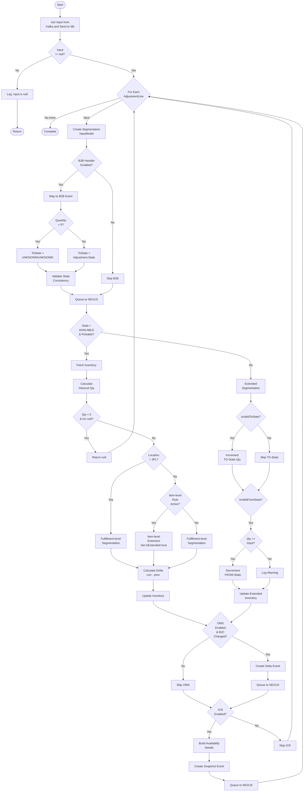

# inventory.InventoryAdjusted - Complete Technical Documentation

## 1. Overview

### Purpose
The `inventory.InventoryAdjusted` is a kafka event that processes inventory adjustment events from the WMS system. It handles real-time inventory updates across multiple fulfillment locations and inventory management systems, including segmentation rules, B2B/B2C domain allocation, and downstream event propagation.

### Business Objective
- **Inventory Accuracy**: Maintain accurate inventory levels across different fulfillment locations (warehouses and 3PL facilities)
- **Multi-Domain Management**: Allocate inventory between B2B (Business-to-Business) and B2C (Business-to-Consumer) channels
- **Inventory Visibility**: Segment inventory by hallmarking, country of origin, and fulfillment location
- **System Integration**: Propagate inventory changes to SAP (via NEXUS), OMS (Order Management System), and ICR (Inventory Comparison Report)
- **Delta Tracking**: Calculate and report inventory delta changes to dependent systems

### Scope
- **Input**: `inventory.InventoryAdjusted` from Kakfa via Consumer Group: `$InventoryAdjusted` and deserialized to `InventoryAdjustedEvent` messages and send to Service Bus Queue
- **Processing**: Inventory segmentation, B2B/B2C allocation, state transitions, delta calculations
- **Output**: 
  - Updated inventory records in CosmosDB
  - Downstream events to NEXUS_PRODUCER_QUEUE (B2B Adjusted/Moved, B2C Inventory Adjusted)
  - Inventory reports to ICR system

### High-Level Architecture
```
Kafka (inventory.InventoryAdjusted)
    ↓
Service Bus Queue (InventoryAdjustedEvent)
    ↓
    ├─→ B2B Inventory Handler
    ├─→ Inventory Segmentation Handler
    ├─→ Extended Inventory Handler
    ├─→ OMS Delta Handler
    └─→ ICR Snapshot Handler
    ↓
CosmosDB + Service Bus Queues
```

### Assumptions
1. Kafka incoming messages are valid `inventory.InventoryStateChanged` kafka object
2. serialize `inventory.InventoryStateChanged`to `InventoryAdjustedEvent` objects and send to Service Bus Queue
3. All enum values in messages match domain model definitions
4. Repository implementations are functional and responsive
5. CosmosDB is accessible with appropriate permissions
6. Configuration flags are set appropriately per environment
7. Correlation context is properly propagated through the message pipeline

### Dependencies
**Internal Repositories:**
- `IItemStockInventoryRepository` - Core inventory records
- `IItemLevelSegmentationRepository` - Item-level segmentation rules
- `IFulfilmentLevelSegmentationRepository` - Fulfillment-level rules
- `IItemStockInventoryExtendedRepository` - Extended inventory state records
- `ICountryRepository` - Location to country code mapping
- `IMessageArchiveRepository` - Message archival for audit trail

**Helper Classes:**
- `SegmentInventoryHelper` - B2C and fulfillment-level segmentation
- `ExtendedInventoryHelper` - Item-level extension calculations
- `FormulaHelper` - Delta calculations

---

## 2. End-to-End Flow

### Step 1: Message Receipt & Deserialization
- serialize `inventory.InventoryStateChanged`to `InventoryAdjustedEvent` and send to Service Bus Queue
- Read Service Bus Queue Message and Validate input is not null
- If null: log "input is null" and return
- If valid: Extract `ReferenceId` from input

### Step 2: Iterate Through Adjustment Lines
For each `AdjustmentLine`:
1. Create `SegmentationInputModel` with item details (ProductId, CountryOfOrigin, Hallmark, Quantity, LocationType)
2. Create unique identifier dictionary (ItemCode, LineNo, ReferenceId)

### Step 3: B2B Inventory Handler
**Condition**: `ENABLE_DELTA_TOWARDS_SAP == true` AND (Location != ADC OR `ENABLE_ADC_DELTA_TOWARDS_AX12 == true`)

**Processing**:
1. Map to `B2BInventoryAdjustedOrMovedEvent`
2. Determine `ToState` based on quantity sign:
   - If Quantity < 0: ToState = (UNKNOWN, UNKNOWN)
   - Else: ToState = input.Adjustment.State
3. Validate state transitions (SAE-2798, SAE-3032 fixes)
4. Normalize statuses (non-AVAILABLE states → UNKNOWN status)
5. Convert negative quantities to absolute values
6. Queue `NexusProducerRequest` to NEXUS_PRODUCER_QUEUE

### Step 4: Inventory Segmentation Handler
**Condition**: State == AVAILABLE AND Status == PICKABLE

**Path A - Regular Segmentation**:
1. Fetch or create `ItemStockInventory` record
2. Archive previous state
3. Calculate inbound quantity: `int.Parse(MoveSign + Quantity)`
4. Validate: Cannot apply negative quantity to empty inventory
5. Save previous B2C values
6. **Location-based routing**:
   - **If 3PL**: Apply fulfillment-level B2C segmentation
   - **If Warehouse**: 
     - Check item-level segmentation rule
     - If active: Apply item-level extension (set IsExtended=true)
     - Else: Apply fulfillment-level segmentation
7. Calculate delta: `result.DeltaTowardsOMS = curr - prev B2CAvl`
8. Archive new state
9. Update inventory in CosmosDB

**Path B - Extended Segmentation** (other states):
1. Determine which states are valid for extended handling
2. Process TO-State (if valid):
   - Fetch or create extended inventory record
   - Increment quantity
   - Update and archive
3. Process FROM-State (if valid):
   - Fetch extended inventory
   - Validate sufficient quantity
   - Decrement quantity
   - Update and archive

### Step 5: Update Item-Level Segmentation
**Condition**: Regular segmentation executed (AVAILABLE/PICKABLE)
- Fetch inventory
- If exists: Call `UpdateItemLevelFulfilmentAsync()`
- If missing: Log warning

### Step 6: OMS Delta Handler
**Condition**: `ENABLE_DELTA_TOWARDS_OMS` enabled AND `IsB2CChanged == true`

1. Determine OMS flag based on location type (3PL vs Warehouse)
2. Fetch country code from location
3. Create `DeltaTowardsOmsEventRequest` with:
   - ReferenceId (new GUID)
   - ProductId, Location, AdjustmentDate
   - QuantityDetails with CountryOfOrigin, Hallmarking, Quantity
4. Queue `NexusProducerRequest` (type: Inventory_B2CInventoryAdjusted)

### Step 7: ICR Snapshot Handler
**Condition**: `ENABLE_SNAPSHOT_FOR_ICR == true`

1. Fetch `ItemStockInventory`
2. Determine B2C quantity:
   - If IsExtended: Use B2COrg (original)
   - Else: Use B2CAVL (current)
3. Build 4 quantity details:
   - B2B Available (B2BAVL, AVAILABLE/PICKABLE)
   - B2C Available (B2COrg or B2CAVL, AVAILABLE/PICKABLE)
   - B2B Prepared (B2BPrepared, AVAILABLE/PREPARED)
   - B2C Prepared (B2CPrepared, AVAILABLE/PREPARED)
4. Determine location type (CAECOM=3PL, else=WAREHOUSE)
5. Create `OmniInventoryAvailabilityReported` event
6. Queue `NexusProducerRequest` (type: Inventory_OmniInventoryAvailabilityReported)

### Step 8: Function Completion
- Continue to next adjustment line
- After all lines processed, complete function

---

## 3. Detailed Business Logic

### B2B State Mapping Logic
**Why**: SAP/AX12 systems require accurate state transitions for reconciliation.

**Rules**:
- **If Quantity < 0** (deduction): ToState = (UNKNOWN, UNKNOWN) - final state uncertain
- **If Quantity ≥ 0** (addition): ToState = Adjustment.State - use provided state

**State Consistency Fixes** (SAE-2798, SAE-3032):
- If FromState == ToState AND neither is AVAILABLE → Reject event
- If State != AVAILABLE → Force Status = UNKNOWN
- All negative quantities → Convert to Math.Abs()

### B2C Inventory Segmentation Logic
**Why**: B2C channel requires separate inventory allocation based on location rules and ecommerce share.

**3PL Locations** → Fulfillment-level segmentation (fixed rules)

**Warehouse Locations**:
- If item-level segmentation rule exists AND active:
  - Extract EcomShare percentage
  - Apply item-level extension logic
  - Set IsExtended = true
- Else:
  - Apply fulfillment-level segmentation

**Delta Calculation**: 
```
Δ = Current B2C Available - Previous B2C Available
IsB2CChanged = (Δ ≠ 0)
```

### Extended Inventory State Transitions
**Why**: Track inventory in non-standard states (RESERVED, DEFECTIVE, IN_TRANSIT, etc.) separately.

**Validation Rules**:
- Skip processing if state is standard (AVAILABLE/PICKABLE)
- TO-State: Always create if missing, increment if exists
- FROM-State: Only process if sufficient quantity available

**Quantity Constraints**:
- Cannot decrement extended inventory below zero
- Source state must have Qty ≥ Math.Abs(input.Quantity)

---

## 4. Calculation Logic

### Inbound Quantity Calculation
```
inboundQty = int.Parse((MoveSign ?? "") + Quantity.ToString())
```
- Handles signed adjustments (negative = deductions)
- Result is integer (whole units only)

**Examples**:
- MoveSign="" + Qty=100 → 100
- MoveSign="-" + Qty=75 → -75
- MoveSign="+" + Qty=50 → 50

### Delta Towards OMS
```
DeltaTowardsOMS = FormulaHelper.CalculateDeltaTowardsOMS(prevB2CAvl, currB2CAvl)
Result = currB2CAvl - prevB2CAvl
```

**Examples**:
| Previous | Current | Delta | IsB2CChanged |
|----------|---------|-------|--------------|
| 100 | 150 | +50 | true |
| 100 | 75 | -25 | true |
| 100 | 100 | 0 | false |

---

## 5. Database Documentation

### ItemStockInventory (CosmosDB)
**Purpose**: Core inventory record with quantities by domain and state.

**Read Operation**: `GetInventoryByCategory(itemCode, hallmark, fulfilmentCode, countryOfOrigin)`
- Index: Composite on (ItemCode, Hallmark, FulfilmentId, COO)
- Result: Single DTO or null

**Columns Updated**:
| Column | Calculated By | Source |
|--------|---------------|--------|
| B2BAVL | Segmentation logic | SegmentInventoryHelper |
| B2CAVL | Segmentation logic | SegmentInventoryHelper or ExtendedInventoryHelper |
| B2COrg | Extension logic | ExtendedInventoryHelper |
| IsExtended | Rule check | Set to true if item-level rule active |

**Insert**: `AddStockInventoryAsync()` - Creates new with all quantities = 0

**Update**: `UpdateStockInventoryAsync()` - Persists modified inventory

**Archive**: Before and after each update for audit trail

### ItemLevelSegmentation (CosmosDB)
**Purpose**: Per-item ecommerce share rules.

**Key Fields**:
- EcomShare: B2C allocation percentage (0-100)
- IsActive: Rule currently applicable
- IsOMNI: Omnichannel eligible

**Read Operation**: `GetItemLevelFulfilmentyByCategory(fulfilmentCode, hallmark, itemCode, countryOfOrigin)`

### ItemStockInventoryExtended (CosmosDB)
**Purpose**: Inventory in non-standard states (RESERVED, DEFECTIVE, IN_TRANSIT).

**Composite Index**: (ItemCode, Hallmark, FulfilmentId, COO, State, Status)

**Fields**:
- Qty: Quantity in this state
- State, Status: The non-standard state combination

**Operations**:
- Create: If record doesn't exist for TO-state
- Increment: Add quantity to TO-state
- Decrement: Subtract from FROM-state (if sufficient qty)

---

## 6. State Changes

### B2B Inventory State Transition
```
Initial: FromState from message
  ↓
Check Quantity Sign
  ├─ Qty < 0 → ToState = UNKNOWN/UNKNOWN
  └─ Qty ≥ 0 → ToState = Adjustment.State
  ↓
Validate State Consistency
  (SAE-2798, SAE-3032 fixes)
  ↓
Normalize Statuses
  (Non-AVAILABLE → UNKNOWN)
  ↓
Convert Negative Quantities
  (Use Math.Abs())
  ↓
Final: B2BInventoryAdjustedOrMovedEvent ready for SAP
```

### B2C Inventory Segmentation State Transition
```
Initial: InventoryAdjustmentLine with Quantity
  ↓
Fetch/Create ItemStockInventory
  (All quantities initialized to 0 if new)
  ↓
Archive Previous State
  ↓
Calculate Inbound Quantity
  (Apply MoveSign prefix)
  ↓
Validate (Cannot decrement empty inventory)
  ↓
Apply Segmentation Rules
  ├─ 3PL → Fulfillment-level segmentation
  └─ WH → Item-level (if active) or Fulfillment-level
  ↓
Update B2CAVL, B2BAVL, IsExtended
  ↓
Calculate Delta
  (Current - Previous B2CAvl)
  ↓
Archive New State
  ↓
Persist to CosmosDB
  ↓
Final: ItemStockInventory updated with new quantities
```

---

## 7. API Documentation

### Input Message
**Kafka**: inventory.InventoryAdjusted message and send to Service Bus Queue

**Message Type**: ServiceBusReceivedMessage containing InventoryAdjustedEvent

**JSON Structure**:
```json
{
  "Channel": "B2B|B2C",
  "Adjustment": {
    "ReferenceId": "ABC123-XYZ789",
    "Location": {
      "Id": "WAREHOUSE_1",
      "Type": "WAREHOUSE|THIRD_PARTY_LOGISTICS"
    },
    "State": {
      "State": "AVAILABLE|RESERVED|DEFECTIVE|...",
      "Status": "PICKABLE|PREPARED|..."
    },
    "AdjustmentLines": [
      {
        "ProductId": "SKU-001",
        "LineNum": "1",
        "Quantity": 100,
        "CountryOfOrigin": "INDIA",
        "Hallmarking": "916"
      }
    ]
  }
}
```

### Response
**Function Type**: Async void (no direct response)

**Side Effects**:
1. CosmosDB records updated
2. Messages archived
3. Downstream events queued to NEXUS_PRODUCER_QUEUE

### Validation Rules
| Field | Rule | Error Handling |
|-------|------|----------------|
| input | Must not be null | Return early with info log |
| Quantity | Must be integer | Auto int.Parse conversion |
| State values | Valid enum | Reject if invalid |
| Location.Id | Must exist in country repo | Fallback to UNKNOWN country code |
| Negative qty on empty inventory | Invalid | Log exception, return null |

---

## 8. Sequence Diagram

```mermaid
sequenceDiagram
    participant Kafka as inventory.InventoryAdjusted schema
    participant SB as Service Bus
    participant IAT as InventoryAdjusted
    participant Repo as Repositories
    participant CosmosDB as CosmosDB
    participant Archive as Archive
    participant NexusSB as NEXUS<br/>Queue

    SB->>IAT: InventoryAdjustedEvent
    IAT->>IAT: Validate input != null
    
    loop For each AdjustmentLine
        IAT->>IAT: Create SegmentationInputModel
        
        opt B2B Handler enabled
            IAT->>IAT: Determine ToState based on qty sign
            IAT->>IAT: Validate state transitions
            IAT->>NexusSB: Queue B2BInventoryAdjustedOrMoved
        end

        opt AVAILABLE + PICKABLE
            IAT->>Repo: GetInventoryByCategory()
            Repo->>CosmosDB: Query
            CosmosDB-->>Repo: Return DTO
            Repo-->>IAT: Return DTO
            
            IAT->>Archive: Archive previous state
            IAT->>IAT: Calculate inbound qty
            IAT->>IAT: Apply segmentation rules
            IAT->>Archive: Archive new state
            IAT->>Repo: UpdateStockInventoryAsync()
            Repo->>CosmosDB: Update
        else Other states
            IAT->>Repo: Get extended inventory
            IAT->>IAT: Process TO-state (increment)
            IAT->>IAT: Process FROM-state (decrement)
            IAT->>Repo: Update extended inventory
        end

        opt OMS Delta enabled & B2C changed
            IAT->>IAT: Create delta event
            IAT->>NexusSB: Queue B2CInventoryAdjusted
        end

        opt ICR enabled
            IAT->>IAT: Build availability snapshot
            IAT->>NexusSB: Queue OmniInventoryAvailabilityReported
        end
    end
```

---

## 9. Flowchart



---

## 10. Decision Tree

### B2B Handler Decision Path
```
├─ ENABLE_DELTA_TOWARDS_SAP?
│  ├─ YES
│  │  ├─ Location == ADC?
│  │  │  ├─ YES → ENABLE_ADC_DELTA_TOWARDS_AX12?
│  │  │  │  ├─ YES → Process B2B
│  │  │  │  └─ NO → Skip
│  │  │  └─ NO → Process B2B
│  │  ├─ Quantity < 0?
│  │  │  ├─ YES → ToState = UNKNOWN/UNKNOWN
│  │  │  └─ NO → ToState = Adjustment.State
│  │  └─ Queue event
│  └─ NO → Skip
```

### Segmentation Decision Path
```
├─ State == AVAILABLE & Status == PICKABLE?
│  ├─ YES → Regular Segmentation
│  │  ├─ LocationType == 3PL?
│  │  │  ├─ YES → Fulfillment-level
│  │  │  └─ NO → Check item rule
│  │  │      ├─ Active → Item-level (IsExtended=true)
│  │  │      └─ Not active → Fulfillment-level
│  │  └─ Update inventory
│  └─ NO → Extended Segmentation
│     ├─ Process TO-state (increment)
│     └─ Process FROM-state (decrement if qty sufficient)
```

### OMS Notification Decision
```
├─ LocationType == 3PL?
│  ├─ YES → Use ENABLE_DELTA_TOWARDS_OMS_3PL
│  └─ NO → Use ENABLE_DELTA_TOWARDS_OMS
├─ Enabled & IsB2CChanged?
│  ├─ YES → Create and queue delta event
│  └─ NO → Skip
```

---

## 11. Error Handling

### Validation Errors
| Error | Condition | Action |
|-------|-----------|--------|
| Input Null | input == null | Return with info log |
| Negative on Empty | Qty < 0 AND Inv null | Log exception, return null |
| Extended Qty Insufficient | Qty insufficient for decrement | Log warning, skip update |
| Missing Inventory on ICR | Inventory record not found | Log warning, return empty |

### Database Errors
| Error | Handling |
|-------|----------|
| Query failure | Propagate → function fails → retry |
| Update failure | Propagate → function fails → retry |
| Archive failure | Propagate → function fails → retry |

### Exception Bypass
- `MissingItemStockInventoryException`: Logged with bypass flag, processing continues
- `InvalidExendedItemStockInventoryQtyException`: Logged as warning, update skipped

---

## 12. Performance Considerations

### Query Optimization
- **GetInventoryByCategory**: O(1) via composite index lookup
- Recommend: RU provisioning ~10 RU per call

### Complexity Analysis
- **Time**: O(n) where n = adjustment lines (sequential processing per line)
- **Space**: O(n) for archive snapshots

### Bottlenecks
1. Message archive creation (doubles write volume)
2. Multiple DB lookups for same item
3. Sequential processing of lines

### Optimization Recommendations
- Cache country codes and segmentation rules
- Batch Cosmos operations where possible
- Consider parallel line processing with careful concurrency

---

## 13. Security

### Authentication
- Service Bus: connection string
- CosmosDB: connection string

### Authorization
- Service Bus: Listen on input queue, Send on output queue
- CosmosDB: Read/Write permissions on collections

### Data Protection
- **Data in Transit**: TLS 1.2 (enforced by Azure)
- **Data at Rest**: Encryption (Microsoft-managed or customer-managed via Key Vault)
- **Sensitive Data**: No passwords/API keys logged; business data safe

### Input Validation
- `int.Parse()` validates quantity format
- String fields used as parameterized query filters
- Enum values validated against definitions

---

## 14. Configuration

### Feature Flags
| Flag | Default | Purpose |
|------|---------|---------|
| ENABLE_DELTA_TOWARDS_SAP | true | Enable B2B SAP events |
| ENABLE_ADC_DELTA_TOWARDS_AX12 | false | Enable ADC-specific SAP events |
| ENABLE_DELTA_TOWARDS_OMS | true | Enable OMS B2C notifications (warehouse) |
| ENABLE_DELTA_TOWARDS_OMS_3PL | true | Enable OMS B2C notifications (3PL) |
| ENABLE_SNAPSHOT_FOR_ICR | false | Enable ICR inventory snapshots |

### Queue Names
| Config | Purpose |
|--------|---------|
| INVENTORY_ADJUSTED_REFLEX_QUEUE_NAME | Input queue |
| NEXUS_PRODUCER_QUEUE_NAME | Output queue for all events |

---

## 15. Data Flow

Input Event → Deserialization → Service Bus Queue → Validation → Line Loop → B2B Handler → Segmentation Handler → Extended Handler → OMS Handler → ICR Handler → Archive → Update DB → Queue Events → Complete

---

## 16. Input/Output Mapping

### Request Body Transformation
| Input | Transformation | Output |
|-------|----------------|--------|
| InventoryAdjustedEvent | Deserialize | ReferenceId extracted |
| AdjustmentLine | Map | SegmentationInputModel |
| Adjustment | Map | B2BInventoryAdjustedOrMovedEvent |
| Quantity + MoveSign | int.Parse | inboundQty (signed) |
| ItemStockInventory | Calc | Updated B2CAVL, B2BAVL |
| prev/curr B2CAvl | Subtract | DeltaTowardsOMS |
| InventorySnapshot | Build | OmniInventoryQuantityDetails |
| Events | Wrap | NexusProducerRequest<T> |

---

## 17. Assumptions

1. Service Bus messages are valid JSON InventoryAdjustedEvent
2. All enum values match domain definitions
3. Repository implementations functional and responsive
4. CosmosDB accessible with proper permissions
5. Configuration properly initialized
6. AutoMapper configured for all mappings
7. Correlation context properly propagated
8. All Location.Id values valid in country repository
9. Message ordering preserved (Service Bus FIFO)
10. No external API calls required outside Azure services

---

## 18. Known Limitations

### Edge Cases
- Concurrent adjustments may cause ETag conflicts (handled via retry)
- Floating point calculations not supported (integers only)
- Stale segmentation rules possible (considered by design)
- Extended inventory may remain inconsistent if decrement insufficient

### Unsupported Scenarios
- Bulk adjustments (must send multiple messages)
- Reversals/corrections (use negative adjustments)
- Allocation management (separate system)
- Multi-step workflows (require external orchestration)
- Custom state transitions (only predefined enums)

### Technical Debt
1. **TODO Comments**: Message queuing not implemented (lines 203, 267, 565)
   - Impact: Downstream events not sent to SAP, OMS, ICR
2. **Commented Validation**: Line 434 suggests previous state combination issues
3. **Magic Strings**: Hard-coded values like "NA", CAECOMFulfilmentId

### Future Improvements
1. Implement message queuing (complete TODOs)
2. Add input validation (length limits, quantity caps)
3. Cache country codes and segmentation rules
4. Add structured logging with correlation IDs
5. Implement dead-letter handling for poison messages

---

## 19. Summary

**inventory.InventoryAdjusted** processes WMS inventory adjustments in real-time:
1. Receives events from Service Bus
2. Applies B2B and B2C segmentation rules
3. Manages extended inventory state transitions
4. Calculates delta changes for OMS
5. Generates snapshots for ICR
6. Updates CosmosDB with audit trail
7. Queues downstream events (currently TODOs - not sent)

**Critical Gap**: Downstream event queuing is implemented but disabled (TODO comments). Enable to integrate with SAP, OMS, and ICR systems.

**Key Business Rules**:
- B2B: Negative quantities → UNKNOWN state; positive → provided state
- B2C: 3PL uses fulfillment rules; Warehouse uses item-level rules if active
- Extended: Track non-standard states separately; prevent negative quantities
- Delta: Calculate change for OMS only if B2C availability changed
- Archive: Maintain complete before/after snapshots for audit

**Risks**:
- Critical: TODOs not implemented → no downstream notifications
- Medium: Concurrent updates → ETag conflicts, requires retry
- Low: Missing country code → defaults to UNKNOWN

**Recommendation**: Implement message queuing to NEXUS_PRODUCER_QUEUE to enable system integration.

---

**Document Version**: 1.0  
**Generated**: 2026-07-30  
**Status**: Complete
