# inventory.OrderToInventoryAllocated - Technical Documentation

## 1. Overview

### Purpose of the Feature/Module
The `inventory.OrderToInventoryAllocated` is a kafak event that processes inventory allocation events triggered when orders are fulfilled from inventory. It manages the allocation of inventory from B2B and B2C buckets based on order domain types and handles inventory reconciliation with external systems.

### Business Objective
- Track and record inventory allocations across multiple business domains (B2B, B2C, Internal Hallmarking, External Hallmarking)
- Update inventory availability metrics (B2CAllocated, B2BAllocated) when orders consume inventory
- Maintain consistency between internal WMS inventory and external OMS (Order Management System)
- Support dynamic allocation from different inventory buckets based on inventory extension rules
- Trigger downstream inventory comparison reports for OMS synchronization

### Scope
This trigger handles:
- `inventory.OrderToInventoryAllocated` from Kakfa via Consumer Group: `$Default` and deserialized to `OrdertoInventoryAllocatedEvent` messages and send to Service Bus Queue
- Receipt of `OrdertoInventoryAllocatedEvent` messages from Service Bus
- Inventory allocation processing with validation and state updates
- Inventory item-level and fulfilment-level segmentation rule application
- B2C inventory extension calculation and delta reporting to OMS
- Order tracking event generation
- Message archival for audit trails

### High-Level Architecture

```
Kafka (inventory.OrderToInventoryAllocated)
    ↓
Deserialization & Validation
    ↓
Service Bus Queue (OrderToInventoryAllocatedEvent)
    ↓
orderToInventoryAllocatedOrchestratorAsync
    ├─→ orderToInventoryAllocatedEventHandlerAsync (Core Logic)
    ├─→ updateItemLevelSegmentationHandlerAsync (Rule Application)
    ├─→ inventoryComparisonReportEventHandlerAsync (OMS Sync)
    └─→ Order Tracking Event Generation
    ↓
Repository Updates
    ├─→ ItemStockInventoryRepository (Update)
    ├─→ ItemLevelSegmentationRepository (Read)
    ├─→ FulfilmentLevelSegmentationRepository (Read)
    └─→ MessageArchiveRepository (Archive)
    ↓
Service Bus Publishing (Conditional)
    ├─→ Order Tracking Queue
    ├─→ Nexus Producer Queue (Delta & Snapshot)
    └─→ External System Integration
```

### Assumptions
1. **Event Structure**: OrdertoInventoryAllocatedEvent is well-formed and contains all required fields
2. **Repository Availability**: All repository implementations are available and functional
3. **Configuration**: ApplicationConfig is properly initialized with all queue names and feature flags
4. **Idempotency**: Message archive acts as deduplication mechanism
5. **B2B/B2C Domain Logic**: Allocation quantities are pre-validated by the upstream OMS system
6. **Time Source**: All timestamps use UTC (DateTime.UtcNow)
7. **Database Consistency**: Database updates are atomic and isolated (implicit transaction handling)

### Dependencies
- **AutoMapper**: Object mapping between request/response DTOs
- **Azure Service Bus**: Message broker for event distribution
- **Application Repositories**:
  - `IItemStockInventoryRepository`: Inventory CRUD operations
  - `IItemLevelSegmentationRepository`: Item-level rules and segmentation
  - `IFulfilmentLevelSegmentationRepository`: Fulfilment-level segmentation rules
  - `IMessageArchiveRepository`: Message history and audit
  - `IServiceBusQueueService`: Service Bus publishing
- **Domain Models**: Events, DTOs, Enums, and Constants from Domain layer
- **Logging & Configuration**: `ILoggerService` and `ApplicationConfig`

---

## 2. End-to-End Flow

### Complete Execution Flow Sequence Diagram

```mermaid
sequenceDiagram
    participant SB as Service Bus
    participant Trigger as inventory.OrderToInventoryAllocated
    participant Handler as EventHandler
    participant Repo as Repositories
    participant Log as Logger
    participant OMS as OMS/Nexus

    SB->>Trigger: ServiceBusTrigger receives message
    activate Trigger
    
    Trigger->>Trigger: Deserialize OrdertoInventoryAllocatedEvent
    Note over Trigger: message.GetInputAsync<OrdertoInventoryAllocatedEvent>()
    
    Trigger->>Trigger: Call Orchestrator
    activate Trigger as Orchestrator
    Orchestrator->>Log: LogInformationMessage (Start)
    
    Orchestrator->>Handler: orderToInventoryAllocatedEventHandlerAsync()
    activate Handler
    
    Handler->>Repo: GetInventoryByCategory()
    activate Repo
    Repo-->>Handler: ItemStockInventoryDTO
    deactivate Repo
    
    Handler->>Handler: Validate Inventory Exists
    alt Inventory Not Found
        Handler->>Log: LogWarningMessage (MissingItemStockInventoryException)
        Handler-->>Orchestrator: null
    else Inventory Found
        Handler->>Repo: ArchiveMessageAsync (Before Update)
        
        Handler->>Handler: Process Domain Logic
        Note over Handler: B2B, B2C, or Hallmarking Domain
        
        Handler->>Handler: Update B2B/B2C Allocated Quantities
        Handler->>Handler: Calculate B2C Extension (if enabled)
        Handler->>Handler: Calculate Delta Towards OMS
        
        Handler->>Repo: ArchiveMessageAsync (After Update)
        Handler->>Repo: UpdateStockInventoryAsync()
        Handler-->>Orchestrator: OrderToInventoryAllocatedResponse
    end
    
    deactivate Handler
    
    Orchestrator->>Orchestrator: Check inventoryResult
    alt Result is Null
        Orchestrator->>Log: LogInformationMessage (Null Result)
    else Result Valid
        
        Orchestrator->>Orchestrator: Check IsItemLevelRuleChanged
        alt Rule Changed
            Orchestrator->>Repo: GetInventoryByCategory (for itemStock)
            activate Repo
            Repo-->>Orchestrator: ItemStockInventoryDTO
            deactivate Repo
            Orchestrator->>Repo: UpdateItemLevelFulfilmentAsync()
            
            alt Stock Not Found
                Orchestrator->>Log: LogWarningMessage
            end
        else Rule Not Changed
            Orchestrator->>Log: LogInformationMessage
        end
        
        Orchestrator->>Orchestrator: Check IsB2CChanged
        alt B2C Changed
            Orchestrator->>Orchestrator: Check ENABLE_SNAPSHOT_FOR_ICR
            alt Snapshot Enabled
                Orchestrator->>Repo: GetInventoryByCategory (for report)
                Orchestrator->>Orchestrator: inventoryComparisonReportEventHandlerAsync()
                
                Orchestrator->>Orchestrator: Build OmniInventoryAvailabilityReported
                Orchestrator->>OMS: Send to Nexus Producer Queue
                Note over OMS: (Currently TODOed - disabled)
            else Snapshot Disabled
                Orchestrator->>Log: LogInformationMessage
            end
            
            Orchestrator->>Orchestrator: Check ENABLE_DELTA_TOWARDS_OMS
            alt Delta Enabled
                Orchestrator->>Orchestrator: Create DeltaTowardsOmsEventRequest
                Orchestrator->>Orchestrator: Build InventoryState & QuantityDetails
                Orchestrator->>OMS: Send to Nexus Producer Queue
                Note over OMS: (Currently TODOed - disabled)
            else Delta Disabled
                Orchestrator->>Log: LogInformationMessage
            end
        else B2C Not Changed
            Orchestrator->>Log: LogInformationMessage
        end
    end
    
    deactivate Orchestrator
    
    Trigger->>Trigger: Build OrderTrackingCommonOrchestratorRequest
    Trigger->>Trigger: Check Try-Catch
    
    alt Exception Occurs
        Trigger->>Log: LogExceptionQueueErrorMessage
    else Success
        Trigger->>OMS: Send to Order Tracking Queue
        Note over OMS: (Currently TODOed - disabled)
    end
    
    deactivate Trigger
```

### Flow Chart

```mermaid
flowchart TD
    Start([Kafka event Fired]) --> Deserialize["Deserialize<br/>OrdertoInventoryAllocatedEvent"]
    
    Deserialize --> CallOrchestrator["Call orderToInventoryAllocatedOrchestratorAsync"]
    
    CallOrchestrator --> LogStart["Log Information:<br/>Orchestration Started"]
    
    LogStart --> CheckNull{"Input Event<br/>Null?"}
    CheckNull -->|Yes| LogNullInput["Log: input is null"]
    LogNullInput --> BuildTracking["Build OrderTrackingCommonOrchestratorRequest"]
    
    CheckNull -->|No| ExtractData["Extract ProductId, OrderId<br/>ReferenceId from Event"]
    
    ExtractData --> LogDetails["Log with extracted<br/>identifiers"]
    
    LogDetails --> CreateDict["Create UniqueIdentifier<br/>Dictionary"]
    
    CreateDict --> MapRequest["Map to OrderToInventoryAllocatedRequest"]
    
    MapRequest --> CallEventHandler["Call orderToInventoryAllocatedEventHandlerAsync"]
    
    CallEventHandler --> GetInventory["GetInventoryByCategory<br/>ItemCode, Hallmark,<br/>FulfilmentCode, CountryOfOrigin"]
    
    GetInventory --> InventoryExists{"Inventory<br/>Record Found?"}
    
    InventoryExists -->|No| LogMissing["Log Warning:<br/>MissingItemStockInventoryException"]
    LogMissing --> ReturnNull["Return null"]
    ReturnNull --> CheckResult{"inventoryResult<br/>== null?"}
    
    InventoryExists -->|Yes| ArchiveBefore["Archive Message<br/>BEFORE Update"]
    
    ArchiveBefore --> CheckDomain{"Order Domain<br/>Type?"}
    
    CheckDomain -->|B2B or<br/>INTERNAL_HALLMARKING| ProcessB2B["Process B2B Allocation"]
    CheckDomain -->|B2C| ProcessB2C["Process B2C Allocation"]
    
    ProcessB2B --> ValidateB2BQty{"AllocatedFromB2BBucket<br/>== 0?"}
    ValidateB2BQty -->|Yes| LogB2BZero["Log Warning:<br/>B2BAllocated is zero"]
    LogB2BZero --> ReturnNull
    
    ValidateB2BQty -->|No| CalcB2B["Calculate new B2BAllocated<br/>prevB2BAllocated +<br/>AllocatedFromB2BBucketQuantity"]
    
    CalcB2B --> CheckB2BNegative{"newB2BAllocated<br/>< 0?"}
    CheckB2BNegative -->|Yes| LogB2BNegative["Log Warning:<br/>Value cannot be negative"]
    LogB2BNegative --> SetB2BZero["Set B2BAllocated = 0"]
    
    CheckB2BNegative -->|No| CheckB2BExtended{"IsExtended?"}
    SetB2BZero --> CheckB2BExtended
    
    CheckB2BExtended -->|Yes| CalcB2CExtension["Call extensionEventHelperCalculateB2CExtensionAsync<br/>- Get B2C Available<br/>- Recalculate B2CExtended<br/>- Calculate new B2CAvl<br/>- Compare with prev B2CAvl"]
    
    CheckB2BExtended -->|No| SkipExtension["Skip Extension Logic"]
    
    CalcB2CExtension --> ArchiveAfterB2B["Archive Message<br/>AFTER Update"]
    SkipExtension --> ArchiveAfterB2B
    
    ProcessB2C --> ValidateB2CQty{"AllocatedFromB2CBucket<br/>!= 0?"}
    ValidateB2CQty -->|Yes| CheckExtendedB2C{"IsExtended?"}
    ValidateB2CQty -->|No| CheckB2BShare{"AllocatedFromB2BBucket<br/>!= 0?"}
    
    CheckExtendedB2C -->|Yes| ValidateB2COrg{"B2COrg<br/>< AllocatedFromB2CBucket?"}
    ValidateB2COrg -->|Yes| LogB2COrg["Log Warning:<br/>B2COrg < Allocated Qty"]
    LogB2COrg --> ReturnNull
    ValidateB2COrg -->|No| CalcNewB2CAllocated["Calculate newB2CAllocated<br/>prevB2CAllocated +<br/>AllocatedFromB2CBucketQuantity"]
    
    CheckExtendedB2C -->|No| ValidateB2CAvl{"B2CAVL<br/>< AllocatedFromB2CBucket?"}
    ValidateB2CAvl -->|Yes| LogB2CAvl["Log Warning:<br/>B2CAVL < Allocated Qty"]
    LogB2CAvl --> ReturnNull
    ValidateB2CAvl -->|No| CalcNewB2CAllocated
    
    CalcNewB2CAllocated --> CheckB2CNegative{"newB2CAllocated<br/>< 0?"}
    CheckB2CNegative -->|Yes| LogB2CNegative["Log Warning:<br/>Value cannot be negative"]
    LogB2CNegative --> SetB2CZero["Set B2CAllocated = 0"]
    
    CheckB2CNegative -->|No| CheckB2BShare
    SetB2CZero --> CheckB2BShare
    
    CheckB2BShare -->|Yes| UpdateB2BShare["Update B2BUsedShare<br/>+= AllocatedFromB2BBucket"]
    CheckB2BShare -->|No| ArchiveAfterB2C["Archive Message<br/>AFTER Update"]
    UpdateB2BShare --> ArchiveAfterB2C
    
    ArchiveAfterB2B --> UpdateDB["UpdateStockInventoryAsync<br/>Save to Database"]
    ArchiveAfterB2C --> UpdateDB
    
    UpdateDB --> ReturnResponse["Return OrderToInventoryAllocatedResponse"]
    
    ReturnResponse --> CheckResult
    
    CheckResult -->|Yes| LogNullResult["Log: ManageAllocationActivity<br/>returned null"]
    LogNullResult --> BuildTracking
    
    CheckResult -->|No| CheckItemLevelChange{"inventoryResult<br/>IsItemLevelRuleChanged<br/>== true?"}
    
    CheckItemLevelChange -->|Yes| UpdateSegmentation["Call updateItemLevelSegmentationHandlerAsync<br/>- Get Inventory<br/>- Update Item Level Fulfilment"]
    CheckItemLevelChange -->|No| LogItemLevelUnchanged["Log: IsItemLevelRuleChanged is false"]
    
    UpdateSegmentation --> CheckStockPresent{"Stock Inventory<br/>Present?"}
    CheckStockPresent -->|No| LogSegmentationWarning["Log Warning:<br/>Stock inventory record not found"]
    CheckStockPresent -->|Yes| CheckB2CChangedFlag{"inventoryResult<br/>IsB2CChanged<br/>== true?"}
    
    LogItemLevelUnchanged --> CheckB2CChangedFlag
    LogSegmentationWarning --> CheckB2CChangedFlag
    
    CheckB2CChangedFlag -->|Yes| CheckSnapshot{"ENABLE_SNAPSHOT<br/>_FOR_ICR?"}
    
    CheckSnapshot -->|Yes| CallICR["Call inventoryComparisonReportEventHandlerAsync<br/>- Get Inventory<br/>- Build OmniInventoryAvailabilityReported<br/>- Create Nexus Message"]
    CheckSnapshot -->|No| LogSnapshotDisabled["Log: ENABLE_SNAPSHOT_FOR_ICR is false"]
    
    CallICR --> CheckDelta{"ENABLE_DELTA<br/>_TOWARDS_OMS?"}
    LogSnapshotDisabled --> CheckDelta
    
    CheckDelta -->|Yes| BuildDelta["Build DeltaTowardsOmsEventRequest<br/>- Set AdjustmentDate<br/>- Set ProductId<br/>- Create InventoryState<br/>- Create QuantityDetails<br/>- Calculate Delta"]
    CheckDelta -->|No| LogDeltaDisabled["Log: ENABLE_DELTA_TOWARDS_OMS is false"]
    
    BuildDelta --> SendNexus["Create NexusProducerRequest<br/>(Currently TODOed)"]
    LogDeltaDisabled --> BuildTracking
    SendNexus --> BuildTracking
    
    CheckB2CChangedFlag -->|No| LogB2CUnchanged["Log: IsB2CChanged is false"]
    LogB2CUnchanged --> BuildTracking
    
    BuildTracking --> SendTracking["Send OrderTrackingCommonOrchestratorRequest<br/>(Currently TODOed)"]
    
    SendTracking --> TryCatch{"Exception<br/>Caught?"}
    
    TryCatch -->|Yes| LogException["Log Exception:<br/>LogExceptionQueueErrorMessage"]
    TryCatch -->|No| Success["Success"]
    
    LogException --> End([Process Complete])
    Success --> End
```



### Detailed Step-by-Step Execution

#### Step 1: Message Trigger & Deserialization
- **Input**: `ServiceBusReceivedMessage` from Service Bus queue
- **Queue Name**: Retrieved from `ApplicationConfig.ORDER_TO_INVENTORY_ALLOCATED_REFLEX_QUEUE_NAME`
- **Deserialization**: `message.GetInputAsync<OrdertoInventoryAllocatedEvent>()`
- **Validation**: Object deserialization validates JSON schema implicitly
- **Output**: `OrdertoInventoryAllocatedEvent` object or exception

#### Step 2: Orchestration Initiation
- **Call**: `orderToInventoryAllocatedOrchestratorAsync(orderToInventoryAllocatedEvent)`
- **Logging**: `LogInformationMessage` with event details
- **Null Check**: Validates event is not null before processing

#### Step 3: Event Handler - Inventory Retrieval
- **Query**: `GetInventoryByCategory(ProductId, Hallmark, FulfilmentCode, CountryOfOrigin)`
- **Expected Result**: `ItemStockInventoryDTO` or null
- **Failure Path**: If null, log warning and return null (graceful bypass)
- **Success Path**: Archive current state and proceed

#### Step 4: Domain-Specific Allocation Processing
- **Branch Point**: Check `OrderDomain` enum
  - **B2B Path**: Update B2BAllocated quantity
  - **B2C Path**: Update B2CAllocated and optionally B2BUsedShare
  - **Hallmarking Paths**: Similar to B2B

#### Step 5: B2B Allocation Logic (if applicable)
1. Validate `AllocatedFromB2BBucketQuantity != 0`
2. Calculate: `newB2BAllocated = prevB2BAllocated + AllocatedFromB2BBucketQuantity`
3. Validate: `newB2BAllocated >= 0` (if negative, set to 0 and log warning)
4. Check `IsExtended` flag:
   - If true: Calculate B2C extension and delta
   - If false: Skip extension logic

#### Step 6: B2C Allocation Logic (if applicable)
1. If `AllocatedFromB2CBucketQuantity != 0`:
   - Validate inventory source (B2COrg or B2CAVL) has sufficient qty
   - Calculate: `newB2CAllocated = prevB2CAllocated + AllocatedFromB2CBucketQuantity`
   - Validate: `newB2CAllocated >= 0` (if negative, set to 0)
2. If `AllocatedFromB2BBucketQuantity != 0`:
   - Update: `B2BUsedShare += AllocatedFromB2BBucketQuantity`

#### Step 7: B2C Extension Calculation (if IsExtended)
- **Call**: `extensionEventHelperCalculateB2CExtensionAsync()`
- **Steps**:
  1. Get store leverage from item-level or fulfilment-level segmentation
  2. Recalculate: `B2CExtended = FormulaHelper.CalculateActualB2BAvailable()`
  3. Calculate: `newB2CAvl = FormulaHelper.CalculateB2CAvl()`
  4. Compare: If `newB2CAvl != prevB2CAvl`:
     - Set `IsB2CChanged = true`
     - Calculate: `DeltaTowardsOMS = newB2CAvl - prevB2CAvl`
     - Update: `B2CAVL = newB2CAvl`

#### Step 8: Database Update
1. Archive inventory state (audit trail)
2. Call: `UpdateStockInventoryAsync(ItemStockInventoryDTO)`
3. Transaction handled implicitly by repository

#### Step 9: Item Level Segmentation Update (conditional)
- **Condition**: `inventoryResult.IsItemLevelRuleChanged == true`
- **Action**: Call `UpdateItemLevelFulfilmentAsync()`
- **Failure**: Log warning if stock not found (non-blocking)

#### Step 10: Inventory Comparison Report - OMS Sync (conditional)
- **Condition**: `inventoryResult.IsB2CChanged == true` AND `ENABLE_SNAPSHOT_FOR_ICR == true`
- **Steps**:
  1. Retrieve updated inventory
  2. Build `OmniInventoryAvailabilityReported` event
  3. Create `NexusProducerRequest`
  4. Send to `NEXUS_PRODUCER_QUEUE_NAME` (currently disabled - TODO)

#### Step 11: Delta Towards OMS Event (conditional)
- **Condition**: `inventoryResult.IsB2CChanged == true` AND `ENABLE_DELTA_TOWARDS_OMS == true`
- **Steps**:
  1. Create `DeltaTowardsOmsEventRequest`
  2. Build `InventoryState` (State=AVAILABLE, Status=PICKABLE)
  3. Create `InventoryQuantityDetail` with delta quantity
  4. Create `NexusProducerRequest`
  5. Send to `NEXUS_PRODUCER_QUEUE_NAME` (currently disabled - TODO)

#### Step 12: Order Tracking Event Generation
- **Purpose**: Track order allocation for downstream OMS
- **Try-Catch**: Errors are logged but don't fail the entire trigger
- **Build**: `OrderTrackingCommonOrchestratorRequest` with:
  - ReferenceId, OrderId, Channel
  - FulfilmentUnitId, FulfilmentUnitType
  - OrderStatus = ALLOCATED
  - OrderType (mapped from OrderDomain)
  - OrderTrackingLine with item details
  - EventType = ORDER_TO_INVENTORY_ALLOCATED
- **Send**: To `ORDER_TRACKING_QUEUE_NAME` (currently disabled - TODO)

#### Step 13: Error Handling
- **Catch Block**: All orchestrator exceptions caught at end
- **Logging**: `LogExceptionQueueErrorMessage` with:
  - Exception details
  - Queue name
  - Message ID
  - Event object
  - Identifiers (ItemCode, OrderId, ReferenceId)
- **Propagation**: Exception is re-thrown for Service Bus handling

---

## 3. Detailed Business Logic

### Business Rule 1: Inventory Not Found - Graceful Bypass

**Why It Exists**
- Inventory might be deleted or consolidated before allocation event arrives
- Prevents cascading failures from upstream OMS errors
- Maintains system resilience

**Inputs**
- `ItemCode`, `Hallmark`, `FulfilmentCode`, `CountryOfOrigin`

**Processing**
```
GetInventoryByCategory(ItemCode, Hallmark, FulfilmentCode, CountryOfOrigin)
→ if (null) → Return null and log warning
```

**Decision Points**
- Is inventory record found in database?

**Outputs**
- If not found: Log `MissingItemStockInventoryException` and return null
- Trigger continues but skips remaining business logic

**Validation Rules**
- All 4 dimensions required for inventory lookup
- Case sensitivity depends on database collation

**Edge Cases**
- Same item multiple hallmarks/countries (handled by all 4 parameters)
- Fulfilment code variations (exact match required)

**Failure Scenarios**
- Database connection failure → Repository throws exception → Entire trigger fails
- Null input event → NullReferenceException → Caught and logged at trigger level

---

### Business Rule 2: B2B Allocation - Quantity Update

**Why It Exists**
- Track B2B inventory consumed when orders are fulfilled
- Support inventory balancing across domains
- Enable capacity planning and stock visibility

**Inputs**
- `prevB2BAllocated`: Current allocated quantity from database
- `AllocatedFromB2BBucketQuantity`: New allocation from this event
- `OrderDomain`: Type of order (B2B, B2C, etc.)

**Processing**
```
IF OrderDomain IN (B2B, INTERNAL_HALLMARKING):
  IF AllocatedFromB2BBucketQuantity == 0:
    LOG_WARNING("B2BAllocated is zero")
    RETURN null
  ELSE:
    newB2BAllocated = prevB2BAllocated + AllocatedFromB2BBucketQuantity
    ItemStockInventoryDto.B2BAllocated = newB2BAllocated
    
    IF newB2BAllocated < 0:
      LOG_WARNING("B2BAllocated value cannot be negative")
      newB2BAllocated = 0
      ItemStockInventoryDto.B2BAllocated = 0
```

**Decision Points**
1. Is allocated quantity zero?
2. Does new total go negative?
3. Is inventory extended?

**Outputs**
- Updated `B2BAllocated` in inventory DTO
- Flag indicating if extension calculation needed

**Validation Rules**
- Quantity cannot be negative
- Zero quantity triggers warning and null return
- Extension rules apply only if `IsExtended == true`

**Edge Cases**
- Large positive quantities → Accumulates over time
- Negative quantities → Capped at 0 (data integrity protection)
- Zero input → Treated as error condition

**Failure Scenarios**
- Allocation exceeds available inventory (OMS responsibility to validate)
- Database constraint violation → Repository exception

---

### Business Rule 3: B2C Allocation - Source Validation

**Why It Exists**
- B2C bucket has different source depending on extension state
- Prevents over-allocation from limited inventory sources
- Validates inventory availability before updating

**Inputs**
- `IsExtended`: Flag indicating dynamic extension enabled
- `B2COrg`: Original B2C inventory (when extended)
- `B2CAVL`: Available B2C inventory (when not extended)
- `AllocatedFromB2CBucketQuantity`: Requested allocation

**Processing**
```
IF AllocatedFromB2CBucketQuantity != 0:
  IF IsExtended:
    IF B2COrg < AllocatedFromB2CBucketQuantity:
      LOG_WARNING("B2COrg quantity is less than B2C Allocated quantity")
      RETURN null
  ELSE:
    IF B2CAVL < AllocatedFromB2CBucketQuantity:
      LOG_WARNING("B2CAvl quantity is less than B2C Allocated quantity")
      RETURN null
  
  newB2CAllocated = prevB2CAllocated + AllocatedFromB2CBucketQuantity
  ItemStockInventoryDto.B2CAllocated = newB2CAllocated
  
  IF newB2CAllocated < 0:
    LOG_WARNING("B2CAllocated value cannot be negative")
    newB2CAllocated = 0
```

**Decision Points**
1. Is B2C allocation quantity non-zero?
2. What is inventory source (B2COrg vs B2CAVL)?
3. Does source have sufficient inventory?
4. Does new total go negative?

**Outputs**
- Updated `B2CAllocated` in inventory DTO
- Flag indicating if calculation changed

**Validation Rules**
- Source validation is strict (fails if insufficient)
- After-update negative check is preventive
- B2BUsedShare is independent (separate condition)

**Edge Cases**
- B2C and B2B allocation in same event (both flags can be non-zero)
- Extended inventory prevents direct B2CAVL allocation
- Zero quantity skips validation (no update)

**Failure Scenarios**
- Source inventory insufficient → Return null (graceful bypass)
- Negative result (shouldn't occur if OMS validates properly)

---

### Business Rule 4: B2C Extension Calculation

**Why It Exists**
- Dynamically adjust B2C availability based on B2B underutilization
- Maximize inventory utilization across domains
- Apply store-level segmentation rules

**Inputs**
- `prevB2CAvl`: Previous B2C available quantity
- `ItemStockInventoryDto`: Current inventory state
- Store leverage from segmentation rules

**Processing**
```
IF IsExtended:
  itemLevelSegmentation = GetItemLevelFulfilmentByCategory()
  
  IF itemLevelSegmentation == null OR !IsActive:
    fulfilmentSegmentation = GetFulfilmentLevelFulfilmentByCategory()
    storeLeverage = fulfilmentSegmentation?.StoreLeveragePercentage ?? 0
  ELSE:
    storeLeverage = itemLevelSegmentation.StoreLeveragePercentage
  
  B2CExtended = CalculateActualB2BAvailable(ItemStockInventoryDto)
  newB2CAvl = CalculateB2CAvl(ItemStockInventoryDto)
  
  IF newB2CAvl != prevB2CAvl:
    IsB2CChanged = true
    DeltaTowardsOMS = newB2CAvl - prevB2CAvl
    ItemStockInventoryDto.B2CAVL = newB2CAvl
    return true (ItemLevelRuleExists)
  ELSE:
    return false
```

**Decision Points**
1. Is inventory extended?
2. Which segmentation rule applies (item-level or fulfilment-level)?
3. Did B2CAvl change after calculation?

**Outputs**
- Updated `B2CExtended` value
- Updated `B2CAVL` value (if changed)
- Boolean indicating if rule exists and changed something

**Calculation Details** (See Section 4)
- B2CExtended = CalculateActualB2BAvailable (formula-based)
- B2CAvl = CalculateB2CAvl (formula-based)
- DeltaTowardsOMS = newB2CAvl - prevB2CAvl (simple delta)

**Validation Rules**
- Rule lookup requires all 4 dimensions (FulfilmentCode, Hallmark, ItemCode, CountryOfOrigin)
- Fallback to fulfilment-level if item-level inactive
- Default storeLeverage = 0 if no rule found

**Edge Cases**
- Item-level rule inactive → Uses fulfilment-level
- No rules found → storeLeverage = 0 (B2C extension minimized)
- B2CAvl increases from extension → Positive delta sent to OMS
- B2CAvl decreases → Negative delta sent to OMS

**Failure Scenarios**
- Segmentation repository unavailable → Exception propagates
- Invalid StoreLeveragePercentage → Formula returns unexpected result

---

### Business Rule 5: B2B Used Share Update (B2C Domain Only)

**Why It Exists**
- When B2C orders allocate from B2B bucket, track this cross-domain usage
- Enables inventory rebalancing and insights
- Supports capacity planning

**Inputs**
- `AllocatedFromB2BBucketQuantity`: Quantity from B2B bucket used for B2C order
- `B2BUsedShare`: Current accumulated B2B usage by B2C

**Processing**
```
IF OrderDomain == B2C AND AllocatedFromB2BBucketQuantity != 0:
  B2BUsedShare += AllocatedFromB2BBucketQuantity
```

**Decision Points**
1. Is order domain B2C?
2. Is B2B allocation non-zero?

**Outputs**
- Incremented `B2BUsedShare` field

**Validation Rules**
- Only applies to B2C domain orders
- Unconditional increment (no upper limit check)

**Edge Cases**
- B2C order with only B2C allocation → B2BUsedShare unchanged
- B2C order with both B2C and B2B allocation → Both updated
- Large cumulative value → No overflow protection

**Failure Scenarios**
- None directly (additive operation)

---

### Business Rule 6: Message Archival for Audit Trail

**Why It Exists**
- Maintain immutable history of all inventory changes
- Support audit trails and reconciliation
- Enable rollback scenarios if needed

**Inputs**
- Current `ItemStockInventoryDTO` (before and after update)

**Processing**
```
Archive BEFORE update (preserve original state)
  ↓
[Business Logic Updates DTO]
  ↓
Archive AFTER update (preserve changed state)
  ↓
UpdateStockInventoryAsync (persist to primary database)
```

**Decision Points**
- Archive is unconditional for found inventory

**Outputs**
- Two archive records per successful allocation event

**Validation Rules**
- Must archive same object type
- Archive is async but awaited (blocking)

**Edge Cases**
- Inventory not found → No archive created
- Null DTO → Archive should handle gracefully

**Failure Scenarios**
- Archive repository failure → Propagates exception

---

## 4. Calculation Logic

### Calculation 1: B2BAllocated Update

**Formula**
```
newB2BAllocated = prevB2BAllocated + AllocatedFromB2BBucketQuantity
```

**Variables**
- `prevB2BAllocated`: int, from database, default 0 if null
- `AllocatedFromB2BBucketQuantity`: int, from event, can be positive/negative
- `newB2BAllocated`: int, result

**Data Source**
- `prevB2BAllocated`: `ItemStockInventoryDTO.B2BAllocated ?? 0`
- `AllocatedFromB2BBucketQuantity`: `OrdertoInventoryAllocatedEvent.AllocatedFromB2BBucketQuantity`

**Units**
- Quantity units (inherited from inventory system, typically pieces/units)

**Rounding Logic**
- None (integer math)

**Precision**
- Integer (no decimal)

**Boundary Conditions**
```
IF newB2BAllocated < 0:
  newB2BAllocated = 0
  Log WARNING
```

**Null Handling**
- `prevB2BAllocated ?? 0` (treat null as 0)

**Default Values**
- If `AllocatedFromB2BBucketQuantity == 0`: Allocation fails with warning
- If `prevB2BAllocated` is null: Assume 0

**Overflow/Underflow Handling**
- Underflow (negative): Capped at 0
- Overflow: No upper limit check (assumed OMS validates)

**Worked Example**
```
Scenario: B2B order allocation
Input:
  prevB2BAllocated = 50
  AllocatedFromB2BBucketQuantity = 10

Calculation:
  newB2BAllocated = 50 + 10 = 60

Database Update:
  ItemStockInventoryDTO.B2BAllocated = 60

Expected Output:
  Updated inventory with B2BAllocated = 60
```

---

### Calculation 2: B2CAllocated Update

**Formula**
```
newB2CAllocated = prevB2CAllocated + AllocatedFromB2CBucketQuantity
```

**Variables**
- `prevB2CAllocated`: int, from database, default 0 if null
- `AllocatedFromB2CBucketQuantity`: int, from event
- `newB2CAllocated`: int, result

**Data Source**
- `prevB2CAllocated`: `ItemStockInventoryDTO.B2CAllocated ?? 0`
- `AllocatedFromB2CBucketQuantity`: `OrdertoInventoryAllocatedEvent.AllocatedFromB2CBucketQuantity`

**Validation Precondition**
```
IF IsExtended:
  IF B2COrg < AllocatedFromB2CBucketQuantity:
    RETURN null (fail)
ELSE:
  IF B2CAVL < AllocatedFromB2CBucketQuantity:
    RETURN null (fail)
```

**Units**
- Quantity units

**Rounding Logic**
- None (integer math)

**Precision**
- Integer

**Boundary Conditions**
```
IF newB2CAllocated < 0:
  newB2CAllocated = 0
  Log WARNING
```

**Null Handling**
- `prevB2CAllocated ?? 0`

**Default Values**
- If `AllocatedFromB2CBucketQuantity == 0`: Calculation skipped

**Overflow/Underflow Handling**
- Underflow: Capped at 0
- Overflow: No upper limit

**Worked Example**
```
Scenario: B2C order allocation from extended inventory
Input:
  IsExtended = true
  B2COrg = 100
  prevB2CAllocated = 20
  AllocatedFromB2CBucketQuantity = 30

Validation:
  B2COrg (100) >= AllocatedFromB2CBucketQuantity (30) ✓

Calculation:
  newB2CAllocated = 20 + 30 = 50

Database Update:
  ItemStockInventoryDTO.B2CAllocated = 50

Expected Output:
  Updated inventory with B2CAllocated = 50
```

---

### Calculation 3: B2CExtended Recalculation

**Formula** (delegated to `FormulaHelper`)
```
B2CExtended = CalculateActualB2BAvailable(ItemStockInventoryDto)
```

**Variables**
- `ItemStockInventoryDto`: Inventory state with all B2B/B2C quantities
- Input parameters from segmentation rules (implicit in DTO)

**Data Source**
- Current inventory DTO after B2B allocation updates
- Store leverage from item-level or fulfilment-level segmentation

**Units**
- Quantity units

**Rounding Logic**
- Determined by FormulaHelper (not visible in trigger code)

**Precision**
- Integer (assumed)

**Boundary Conditions**
- B2B available cannot be negative
- Extension capped by store leverage percentage

**Null Handling**
- FormulaHelper handles null DTOs

**Default Values**
- Store leverage defaults to 0 if no rule

**Worked Example**
```
Scenario: B2C extension after B2B allocation
Input:
  B2BAllocated = 60 (after update)
  B2BAvailable = 40 (50 - 10 already allocated)
  StoreLeveragePercentage = 20%
  B2COrg = 100

Formula (conceptual):
  ActualB2BAvailable = B2BAvailable * StoreLeveragePercentage
                     = 40 * 20% = 8

  B2CExtended = ActualB2BAvailable = 8

Database Update:
  ItemStockInventoryDTO.B2CExtended = 8
```

---

### Calculation 4: B2CAvl Recalculation

**Formula** (delegated to `FormulaHelper`)
```
newB2CAvl = CalculateB2CAvl(ItemStockInventoryDto)
```

**Variables**
- `ItemStockInventoryDto`: Full inventory state
- Includes B2COrg, B2CExtended, B2CAllocated, etc.

**Data Source**
- Updated inventory DTO after extension calculation

**Units**
- Quantity units

**Rounding Logic**
- Determined by FormulaHelper

**Precision**
- Integer

**Boundary Conditions**
- B2CAvl cannot be negative
- Includes allocated quantities

**Null Handling**
- FormulaHelper handles nulls

**Default Values**
- If no extension: B2CAvl = B2CAVL (direct mapping)

**Formula Conceptual**
```
IF IsExtended:
  newB2CAvl = B2COrg + B2CExtended - B2CAllocated
ELSE:
  newB2CAvl = B2CAVL (as-is)
```

**Worked Example**
```
Scenario: B2C available after extension
Input:
  IsExtended = true
  B2COrg = 100
  B2CExtended = 8
  B2CAllocated = 50 (after update)

Calculation:
  newB2CAvl = 100 + 8 - 50 = 58

Compare:
  prevB2CAvl = 60
  newB2CAvl = 58
  Delta = 58 - 60 = -2

Database Update:
  ItemStockInventoryDTO.B2CAVL = 58
  IsB2CChanged = true
  DeltaTowardsOMS = -2
```

---

### Calculation 5: Delta Towards OMS

**Formula**
```
DeltaTowardsOMS = newB2CAvl - prevB2CAvl
```

**Variables**
- `prevB2CAvl`: int, B2C available before allocation
- `newB2CAvl`: int, B2C available after extension calculation
- `DeltaTowardsOMS`: int, change in availability

**Data Source**
- `prevB2CAvl`: Captured before extension calculation
- `newB2CAvl`: Result from CalculateB2CAvl()

**Units**
- Quantity units (can be positive or negative)

**Rounding Logic**
- None (integer subtraction)

**Precision**
- Integer (signed)

**Boundary Conditions**
- Can be positive (increased availability)
- Can be negative (decreased availability)
- Can be zero (no change)

**Null Handling**
- Both values should be non-null (set to 0 if null)

**Default Values**
- If IsExtended is false: Delta = 0 (no recalculation)

**Overflow/Underflow Handling**
- No protection (delta can be large negative or positive)

**Worked Example**
```
Scenario 1: Positive delta (increased availability)
Input:
  prevB2CAvl = 50
  newB2CAvl = 65
  
Calculation:
  DeltaTowardsOMS = 65 - 50 = +15

Interpretation: B2C availability increased by 15 units

---

Scenario 2: Negative delta (decreased availability)
Input:
  prevB2CAvl = 100
  newB2CAvl = 85

Calculation:
  DeltaTowardsOMS = 85 - 100 = -15

Interpretation: B2C availability decreased by 15 units
```

---

### Calculation 6: B2BUsedShare Increment

**Formula**
```
NewB2BUsedShare = CurrentB2BUsedShare + AllocatedFromB2BBucketQuantity
```

**Variables**
- `CurrentB2BUsedShare`: int, accumulated B2B usage by B2C orders
- `AllocatedFromB2BBucketQuantity`: int, current event's B2B allocation
- `NewB2BUsedShare`: int, result

**Data Source**
- `CurrentB2BUsedShare`: `ItemStockInventoryDTO.B2BUsedShare`
- `AllocatedFromB2BBucketQuantity`: `OrdertoInventoryAllocatedEvent.AllocatedFromB2BBucketQuantity`

**Conditions**
- Only applies if `OrderDomain == B2C` AND `AllocatedFromB2BBucketQuantity != 0`

**Units**
- Quantity units

**Rounding Logic**
- None

**Precision**
- Integer

**Boundary Conditions**
- No upper limit (can accumulate indefinitely)
- No lower limit (can be negative if OMS sends negative allocation)

**Null Handling**
- `CurrentB2BUsedShare` typically non-null, but += operation handles it

**Default Values**
- If skipped (B2B qty = 0): No change to B2BUsedShare

**Overflow/Underflow Handling**
- No protection

**Worked Example**
```
Scenario: B2C order using B2B overflow
Input:
  OrderDomain = B2C
  CurrentB2BUsedShare = 10
  AllocatedFromB2BBucketQuantity = 5

Calculation:
  NewB2BUsedShare = 10 + 5 = 15

Database Update:
  ItemStockInventoryDTO.B2BUsedShare = 15

Interpretation: B2C orders have used 15 units from B2B inventory
```

---

## 5. Database Documentation

### Database Interactions Overview

```
REQUEST FROM SERVICE BUS
  ↓
[INVENTORY_RETRIEVAL]
  ├─ TABLE: ItemStockInventory
  ├─ OPERATION: Read
  ├─ QUERY: GetInventoryByCategory(ItemCode, Hallmark, FulfilmentCode, CountryOfOrigin)
  └─ RESULT: ItemStockInventoryDTO or NULL
  ↓
[INVENTORY_ARCHIVAL_BEFORE]
  ├─ TABLE: MessageArchive (or similar audit table)
  ├─ OPERATION: Insert
  ├─ SOURCE: ItemStockInventoryDTO (before update)
  └─ PURPOSE: Audit trail
  ↓
[ALLOCATION_PROCESSING]
  ├─ IN-MEMORY: Update DTO fields
  ├─ NO DB OPERATION
  └─ FIELDS UPDATED: B2BAllocated, B2CAllocated, B2BUsedShare, B2CExtended, B2CAVL
  ↓
[INVENTORY_ARCHIVAL_AFTER]
  ├─ TABLE: MessageArchive
  ├─ OPERATION: Insert
  ├─ SOURCE: ItemStockInventoryDTO (after update)
  └─ PURPOSE: Audit trail
  ↓
[INVENTORY_UPDATE]
  ├─ TABLE: ItemStockInventory
  ├─ OPERATION: Update
  ├─ WHERE: ItemCode, Hallmark, FulfilmentCode, CountryOfOrigin
  ├─ FIELDS: B2BAllocated, B2CAllocated, B2BUsedShare, B2CExtended, B2CAVL
  └─ RESULT: Success or exception
  ↓
[SEGMENTATION_LOOKUP] (if IsItemLevelRuleChanged)
  ├─ TABLE: ItemLevelSegmentation
  ├─ OPERATION: Read
  ├─ QUERY: GetItemLevelFulfilmentByCategory(...)
  └─ RESULT: ItemLevelSegmentationDTO or NULL
  ↓
[SEGMENTATION_UPDATE] (if rule exists)
  ├─ TABLE: ItemLevelSegmentation (or similar)
  ├─ OPERATION: Update
  ├─ CALL: UpdateItemLevelFulfilmentAsync(ItemStockInventoryDTO)
  └─ FIELDS: Determined by repository
  ↓
[ICR_LOOKUP] (if IsB2CChanged and ENABLE_SNAPSHOT_FOR_ICR)
  ├─ TABLE: ItemStockInventory
  ├─ OPERATION: Read (refresh)
  ├─ QUERY: GetInventoryByCategory(...)
  └─ RESULT: ItemStockInventoryDTO
  ↓
[TOTAL DB OPERATIONS PER TRIGGER]
  ├─ Reads: 1-3 (initial + ICR + segmentation)
  ├─ Writes: 2-3 (archive before/after + inventory update + optional segmentation)
  └─ Transactions: Implicit per repository
```

---

### Read Operation 1: Initial Inventory Retrieval

**Table Name**: `ItemStockInventory`

**Purpose**: 
- Retrieve current inventory state for the specific item/hallmark/location/country combination
- Source data for all subsequent calculations

**Query**
```csharp
GetInventoryByCategory(
  itemCode: string,
  hallmark: string,
  fulfilmentCode: string,
  countryOfOrigin: string
) → ItemStockInventoryDTO
```

**Filters**
```sql
WHERE 
  ItemCode = @itemCode
  AND Hallmark = @hallmark
  AND FulfilmentCode = @fulfilmentCode
  AND CountryOfOrigin = @countryOfOrigin
```

**Joins**
- None (single table)

**Index Usage**
- Composite index on (ItemCode, Hallmark, FulfilmentCode, CountryOfOrigin) expected

**Expected Result**
- Single `ItemStockInventoryDTO` object with all inventory fields:
  - B2BAllocated, B2CAllocated
  - B2BAVL, B2CAVL
  - B2BOrg, B2COrg
  - B2BPrepared, B2CPrepared
  - B2CExtended
  - IsExtended flag
  - ProductUnits, Location

**Failure Handling**
- If NULL: Log warning, return null from handler, skip remaining logic

---

### Read Operation 2: Item-Level Segmentation Lookup

**Table Name**: `ItemLevelSegmentation`

**Purpose**
- Retrieve item-level allocation rules and store leverage percentage
- Determine B2C extension calculation parameters

**Query**
```csharp
GetItemLevelFulfilmentByCategory(
  fulfilmentCode: string,
  hallmark: string,
  itemCode: string,
  countryOfOrigin: string
) → ItemLevelSegmentationDTO
```

**Filters**
```sql
WHERE 
  FulfilmentCode = @fulfilmentCode
  AND Hallmark = @hallmark
  AND ItemCode = @itemCode
  AND CountryOfOrigin = @countryOfOrigin
  AND IsActive = 1
```

**Joins**
- None (single table)

**Index Usage**
- Composite index on (FulfilmentCode, Hallmark, ItemCode, CountryOfOrigin, IsActive)

**Expected Result**
- `ItemLevelSegmentationDTO` with:
  - `StoreLeveragePercentage` (decimal)
  - `IsActive` (boolean)
  - Other rule fields

**Failure Handling**
- If NULL or IsActive=false: Fall back to fulfilment-level segmentation

---

### Read Operation 3: Fulfilment-Level Segmentation Lookup

**Table Name**: `FulfilmentLevelSegmentation`

**Purpose**
- Fallback rule lookup when item-level rule doesn't exist or is inactive
- Provides default store leverage for B2C extension

**Query**
```csharp
GetFulfilmentLevelFulfilmentByCategory(
  fulfilmentCode: string,
  hallmark: string,
  itemCode: string,
  countryOfOrigin: string
) → FulfilmentLevelSegmentationDTO
```

**Filters**
```sql
WHERE 
  FulfilmentCode = @fulfilmentCode
  AND Hallmark = @hallmark
  AND ItemCode = @itemCode
  AND CountryOfOrigin = @countryOfOrigin
```

**Joins**
- None (single table)

**Index Usage**
- Composite index on (FulfilmentCode, Hallmark, ItemCode, CountryOfOrigin)

**Expected Result**
- `FulfilmentLevelSegmentationDTO` with:
  - `StoreLeveragePercentage` (decimal, default 0)

**Failure Handling**
- If NULL: Use default `StoreLeveragePercentage = 0`

---

### Write Operation 1: Message Archive - Before Update

**Table Name**: `MessageArchive` (or audit table)

**Purpose**
- Immutable record of inventory state before allocation processing
- Enables audit trails and reconciliation

**Insert Operation**
```csharp
ArchiveMessageAsync<T>(message: ItemStockInventoryDTO)
```

**Columns Populated**
- `ArchiveId`: Auto-generated (PK)
- `MessageContent`: Full DTO serialized (JSON or binary)
- `MessageType`: "ItemStockInventoryDTO"
- `ArchiveDate`: DateTime.UtcNow
- `MessageHash`: Hash for deduplication (optional)
- All fields from `ItemStockInventoryDTO` (denormalized)

**Source of Each Value**
- Current state from database read operation
- DTO fields: ItemCode, Hallmark, FulfilmentCode, CountryOfOrigin, B2BAllocated (original), B2CAllocated (original), etc.

**Default Values**
- None (all values come from database)

**Generated Values**
- `ArchiveId` (auto-increment)
- `ArchiveDate` (server-side UTC)

**Index Usage**
- Primary key on `ArchiveId`
- Secondary index on (ItemCode, Hallmark, FulfilmentCode, ArchiveDate) for queries

**Transaction Boundary**
- Same transaction as subsequent updates (implicit)

---

### Write Operation 2: Inventory Update

**Table Name**: `ItemStockInventory`

**Purpose**
- Persist allocation quantities to primary inventory table
- Update availability metrics for OMS visibility

**Update Operation**
```csharp
UpdateStockInventoryAsync(inventory: ItemStockInventoryDTO)
```

**WHERE Clause**
```sql
WHERE 
  ItemCode = @itemCode
  AND Hallmark = @hallmark
  AND FulfilmentCode = @fulfilmentCode
  AND CountryOfOrigin = @countryOfOrigin
```

**Columns Modified**
| Column | Previous Value | New Value | Condition |
|--------|---|---|---|
| B2BAllocated | prevB2BAllocated | newB2BAllocated | OrderDomain in (B2B, INTERNAL_HALLMARKING) |
| B2CAllocated | prevB2CAllocated | newB2CAllocated | OrderDomain = B2C and AllocatedFromB2CBucketQuantity != 0 |
| B2BUsedShare | prevB2BUsedShare | prevB2BUsedShare + delta | OrderDomain = B2C and AllocatedFromB2BBucketQuantity != 0 |
| B2CExtended | prevB2CExtended | CalculateActualB2BAvailable() | IsExtended = true |
| B2CAVL | prevB2CAVL | CalculateB2CAvl() | IsExtended = true and newB2CAvl != prevB2CAvl |
| LastModifiedDate | previous | DateTime.UtcNow | Always |
| LastModifiedBy | previous | "OrderToInventoryAllocatedTrigger" | Always |

**Update Condition**
- Record must exist (verified by prior read)
- No optimistic locking (implicit last-write-wins)
- No pessimistic locking (read doesn't lock)

**Transaction Boundary**
- Implicit transaction per repository operation
- No distributed transactions

**Optimistic/Pessimistic Locking**
- None explicitly implemented
- Concurrent updates could cause race conditions (data consistency risk)

**Triggered Events**
- Database triggers might exist (e.g., update timestamp audit)
- None documented in trigger code

---

### Write Operation 3: Message Archive - After Update

**Table Name**: `MessageArchive`

**Purpose**
- Immutable record of inventory state after allocation processing
- Enables delta comparison and reconciliation

**Insert Operation**
```csharp
ArchiveMessageAsync<T>(message: ItemStockInventoryDTO)
```

**Columns Populated**
- Same as Write Operation 1, but with updated values
- `MessageSequence`: 2 (after update)

**Source of Each Value**
- Updated DTO in memory (with new B2BAllocated, B2CAllocated, etc.)

**Generated Values**
- `ArchiveId`, `ArchiveDate` (server-side)

---

### Write Operation 4: Item Level Segmentation Update (Conditional)

**Table Name**: `ItemLevelSegmentation` (or similar)

**Purpose**
- Update item-level rules or status based on inventory changes

**Update Operation** (inferred)
```csharp
UpdateItemLevelFulfilmentAsync(inventory: ItemStockInventoryDTO)
```

**Executed When**
- `inventoryResult.IsItemLevelRuleChanged == true`

**Details**
- Exact columns and logic not visible in trigger code
- Delegated to `IItemLevelSegmentationRepository.UpdateItemLevelFulfilmentAsync()`
- Failure is non-blocking (logged as warning)

---

### Transaction Flow

**Scenario**: Successful B2C Allocation

```
START TRANSACTION (implicit, if using EF Core or similar)
  ↓
1. SELECT inventory [lock for update if available]
   ItemCode = 'SKU123', Hallmark = 'HALLMARK_A', ...
   RESULT: ItemStockInventoryDTO{B2CAllocated: 50}
  ↓
2. INSERT archive (before)
   MessageContent = { ... B2CAllocated: 50 ... }
  ↓
3. UPDATE ItemStockInventory
   SET B2CAllocated = 80, B2CAVL = 40, LastModifiedDate = GETUTCDATE()
   WHERE ItemCode = 'SKU123' AND ...
   AFFECTED ROWS: 1
  ↓
4. INSERT archive (after)
   MessageContent = { ... B2CAllocated: 80 ... }
  ↓
5. SELECT ItemLevelSegmentation [for rule check]
   RESULT: ItemLevelSegmentationDTO{IsActive: true}
  ↓
6. UPDATE ItemLevelSegmentation [if IsItemLevelRuleChanged]
   AFFECTED ROWS: 1
  ↓
COMMIT
  ↓
SEND SERVICE BUS MESSAGE [outside transaction]
  - NexusProducerRequest (delta/snapshot)
  - OrderTrackingCommonOrchestratorRequest
```

---

### Rollback Scenarios

**Scenario 1**: Inventory Not Found
```
START
  ↓
SELECT inventory
  RESULT: NULL
  ↓
ROLLBACK (implicit, no writes)
  ↓
Return null from handler
  ↓
Skip remaining orchestration
  ↓
Log warning
```

**Scenario 2**: Invalid B2C Allocation Quantity
```
START
  ↓
SELECT inventory
  RESULT: ItemStockInventoryDTO{B2COrg: 50}
  ↓
INSERT archive (before) ✓
  ↓
VALIDATE B2COrg >= AllocatedFromB2CBucket (50 >= 80) ✗
  ↓
Log warning: "B2COrg quantity is less than B2C Allocated quantity"
  ↓
Return null from handler
  ↓
ROLLBACK implicit (no UPDATE performed)
  ↓
Archive record remains (before state only)
```

**Scenario 3**: Database Update Failure
```
START
  ↓
SELECT inventory ✓
  ↓
INSERT archive (before) ✓
  ↓
UPDATE ItemStockInventory
  RESULT: Exception (constraint violation, connection timeout, etc.)
  ↓
ROLLBACK entire transaction
  ↓
Catch exception in outer try-catch
  ↓
LogExceptionErrorMessage
  ↓
RE-THROW exception
  ↓
Service Bus marks message for retry/DLQ
```

---

## 6. State Changes

### Entity State Transitions

#### ItemStockInventory Entity

**State Diagram**
```
┌─────────────────────────────────────────────┐
│    Initial State                            │
│  ┌─────────────────────────────────────┐    │
│  │ B2BAllocated: 50                    │    │
│  │ B2CAllocated: 20                    │    │
│  │ B2BAVL: 100                         │    │
│  │ B2CAVL: 60                          │    │
│  │ B2CExtended: 0                      │    │
│  │ B2BUsedShare: 0                     │    │
│  │ IsExtended: true                    │    │
│  └─────────────────────────────────────┘    │
└─────────────────────────────────────────────┘
         │
         ↓
    [Trigger Fired]
    B2B order: +10 allocated
         │
         ↓
┌─────────────────────────────────────────────┐
│    Validation Phase                         │
│  - Inventory found: ✓                       │
│  - AllocatedFromB2BBucketQuantity: 10 ✓     │
│  - Archive BEFORE state                     │
│  - Ready for calculation                    │
└─────────────────────────────────────────────┘
         │
         ↓
┌─────────────────────────────────────────────┐
│    Calculation Phase                        │
│  - B2BAllocated: 50 + 10 = 60              │
│  - IsExtended: true → Recalc B2CExtended    │
│  - prevB2CAvl: 60                           │
│  - B2CExtended: 8 (via formula)             │
│  - newB2CAvl: 58 (100 + 8 - 50 = 58)       │
│  - DeltaTowardsOMS: 58 - 60 = -2           │
│  - IsB2CChanged: true                       │
│  - IsItemLevelRuleChanged: true             │
└─────────────────────────────────────────────┘
         │
         ↓
┌─────────────────────────────────────────────┐
│    Database Update Phase                    │
│  - Archive AFTER state                      │
│  - Update ItemStockInventory                │
│  - Commit transaction                       │
└─────────────────────────────────────────────┘
         │
         ↓
┌─────────────────────────────────────────────┐
│    Final State                              │
│  ┌─────────────────────────────────────┐    │
│  │ B2BAllocated: 60 ← Updated          │    │
│  │ B2CAllocated: 20 ← Unchanged        │    │
│  │ B2BAVL: 100 ← Unchanged             │    │
│  │ B2CAVL: 58 ← Updated via formula    │    │
│  │ B2CExtended: 8 ← Updated via formula│    │
│  │ B2BUsedShare: 0 ← Unchanged (B2B)   │    │
│  │ IsExtended: true ← Unchanged        │    │
│  │ LastModifiedDate: 2026-01-15 14:30  │    │
│  └─────────────────────────────────────┘    │
└─────────────────────────────────────────────┘
         │
         ↓
┌─────────────────────────────────────────────┐
│    Downstream Events                        │
│  - OmniInventoryAvailabilityReported        │
│  - DeltaTowardsOmsEvent (-2 units)          │
│  - OrderTrackingEvent (ALLOCATED status)    │
│  - ItemLevelSegmentation Updated            │
└─────────────────────────────────────────────┘
```

---

#### MessageArchive Entity

**Before & After Pattern**
```
Record 1: BEFORE Update
┌──────────────────────────────────────┐
│ ArchiveId: 1001                      │
│ ArchiveDate: 2026-01-15 14:30:00 UTC │
│ MessageType: ItemStockInventoryDTO   │
│ MessageContent:                      │
│   {                                  │
│     "ItemCode": "SKU123",             │
│     "B2BAllocated": 50,              │
│     "B2CAllocated": 20,              │
│     "B2CExtended": 0,                │
│     "B2CAVL": 60,                    │
│     ...                              │
│   }                                  │
│ MessageSequence: 1 (Before)          │
└──────────────────────────────────────┘

Record 2: AFTER Update
┌──────────────────────────────────────┐
│ ArchiveId: 1002                      │
│ ArchiveDate: 2026-01-15 14:30:01 UTC │
│ MessageType: ItemStockInventoryDTO   │
│ MessageContent:                      │
│   {                                  │
│     "ItemCode": "SKU123",             │
│     "B2BAllocated": 60,              │ ← Changed
│     "B2CAllocated": 20,              │
│     "B2CExtended": 8,                │ ← Changed
│     "B2CAVL": 58,                    │ ← Changed
│     ...                              │
│   }                                  │
│ MessageSequence: 2 (After)           │
└──────────────────────────────────────┘
```

---

## 7. API Documentation

### Entry Point

**Function Name**: `inventory.OrderToInventoryAllocated`

**Trigger Type**: Kafka Consumer
---

### Input

**Source**: Kafka inventory.OrderToInventoryAllocated message to Service Bus Queue Message

**Message Type**: `OrdertoInventoryAllocatedEvent`

**Message Body Schema**
```json
{
  "ReferenceId": "guid-string",
  "OrderId": "string",
  "ProductId": "string (ItemCode)",
  "Quantity": "int (obsolete/unused)",
  "OrderDomain": "enum (B2B=0, B2C=1, INTERNAL_HALLMARKING=2, EXTERNAL_HALLMARKING=3)",
  "Location": {
    "Id": "string (FulfilmentCode)",
    "Type": "enum (WAREHOUSE=0, THIRD_PARTY_LOGISTICS=1, STORE=2, ...)"
  },
  "CountryOfOrigin": "enum or string",
  "Hallmarking": "enum or string",
  "Channel": "enum or string",
  "AllocatedFromB2BBucketQuantity": "int",
  "AllocatedFromB2CBucketQuantity": "int",
  "ProductUnits": "string (e.g., 'PIECES', 'GRAMS')"
}
```

**Message Properties**
- MessageId: Unique identifier from Service Bus
- SequenceNumber: Partition-based sequence
- EnqueuedTimeUtc: When message was sent
- DeliveryCount: Number of delivery attempts
- LockedUntil: Message lock expiry

**Message Validation**
- Deserialization: `message.GetInputAsync<OrdertoInventoryAllocatedEvent>()`
- Implicit validation: JSON schema matching
- Explicit validation: None in trigger (OMS responsibility)

---

### Processing

**Main Handler Method**: `Run(message, client)`

**Execution Steps**
1. Deserialize message to `OrdertoInventoryAllocatedEvent`
2. Call `orderToInventoryAllocatedOrchestratorAsync()`
3. Try-catch block for order tracking event generation
4. Log exceptions if occur

**Processing Time**: Typically < 1s for database operations

---

### Output / Events Published

**Event 1**: OmniInventoryAvailabilityReported (Conditional)
- **Condition**: `IsB2CChanged == true` AND `ENABLE_SNAPSHOT_FOR_ICR == true`
- **Queue**: `ApplicationConfig.NEXUS_PRODUCER_QUEUE_NAME`
- **Message Type**: `NexusProducerRequest<OmniInventoryAvailabilityReported>`
- **Status**: Currently disabled (TODO comment)

**Event 2**: DeltaTowardsOmsEvent (Conditional)
- **Condition**: `IsB2CChanged == true` AND `ENABLE_DELTA_TOWARDS_OMS == true`
- **Queue**: `ApplicationConfig.NEXUS_PRODUCER_QUEUE_NAME`
- **Message Type**: `NexusProducerRequest<DeltaTowardsOmsEventRequest>`
- **Payload**: Quantity delta with reason code
- **Status**: Currently disabled (TODO comment)

**Event 3**: OrderTrackingCommonOrchestratorRequest
- **Condition**: Always attempted (in try-catch)
- **Queue**: `ApplicationConfig.ORDER_TRACKING_QUEUE_NAME`
- **Message Type**: `OrderTrackingCommonOrchestratorRequest`
- **Payload**: Order and line-item level tracking info
- **Status**: Currently disabled (TODO comment)

---

### Error Handling

**Exception Types Handled**

| Exception Type | Where | Handling | Impact |
|---|---|---|---|
| JsonException | Deserialize | Service Bus dead-letter | Trigger fails |
| MissingItemStockInventoryException | Event Handler | Logged, return null | Graceful bypass |
| InvalidItemStockInventoryQtyException | Validation | Logged, return null or 0 | Graceful bypass |
| NullReferenceException | Orchestrator | Logged, re-thrown | Trigger fails, retry |
| General Exception | Orchestrator | Logged, re-thrown | Trigger fails, retry |
| Service Bus Exception | Publishing | Logged in try-catch | Logged but continues |

---

### HTTP Status Codes (N/A - Queue Trigger)

Not applicable. Queue triggers return void/Task.

---

### Retry Logic

**Service Bus Retries**
- Managed by Azure Service Bus
- MaxDeliveryCount: Configured in queue settings (typically 10)
- Exponential backoff: Built-in
- DLQ: Messages sent to dead-letter queue after max retries

**Function App Retries**
- Durable Functions retry: Configured separately if used
- Explicit retries: None in trigger code
- Error propagation: Exception re-thrown → Service Bus handles retry

---

### Sample Request/Response

**Sample Message from Queue**
```json
{
  "ReferenceId": "550e8400-e29b-41d4-a716-446655440000",
  "OrderId": "ORD-2026-001234",
  "ProductId": "SKU-GOLD-1001",
  "OrderDomain": 1,  // B2C
  "Location": {
    "Id": "WH-DELHI-01",
    "Type": 0  // WAREHOUSE
  },
  "CountryOfOrigin": "INDIA",
  "Hallmarking": "HALLMARK_916",
  "Channel": "ONLINE",
  "AllocatedFromB2BBucketQuantity": 0,
  "AllocatedFromB2CBucketQuantity": 10,
  "ProductUnits": "PIECES"
}
```

**Processing Result**
```
✓ Inventory found and updated
✓ B2CAllocated: 20 → 30
✓ B2CAVL: 60 → 55 (after extension calc)
✓ IsB2CChanged: true
✓ DeltaTowardsOMS: -5 units
✓ Messages archived (before and after)
✓ Order tracking event generated (disabled)
✓ Completion: Success
```

**Sample Exception Response**
```json
{
  "ExceptionType": "MissingItemStockInventoryException",
  "Message": "Stock inventory record not found",
  "LogContext": {
    "ReferenceId": "550e8400-...",
    "ItemCode": "SKU-GOLD-1001",
    "OrderId": "ORD-2026-001234",
    "Queue": "order-to-inventory-allocated-reflex"
  },
  "Result": "Graceful bypass - no further processing"
}
```

---

## 8. Configuration

### Environment Variables & Feature Flags

| Config Key | Type | Default | Purpose | Scope |
|---|---|---|---|---|
| `ORDER_TO_INVENTORY_ALLOCATED_REFLEX_QUEUE_NAME` | String | (required) | Service Bus queue name | Input |
| `ServiceBusConnectionString` | String | (required) | Service Bus connection | Input |
| `NEXUS_PRODUCER_QUEUE_NAME` | String | (required) | Downstream event queue | Output |
| `ORDER_TRACKING_QUEUE_NAME` | String | (required) | Order tracking queue | Output |
| `ENABLE_SNAPSHOT_FOR_ICR` | Boolean | false | Enable inventory snapshot | Feature flag |
| `ENABLE_DELTA_TOWARDS_OMS` | Boolean | false | Enable delta reporting | Feature flag |
| `PRODUCT_UNITS` | String | "PIECES" | Inventory unit type | Metadata |

### Feature Flag Dependencies
- `ENABLE_SNAPSHOT_FOR_ICR`: Controls OmniInventoryAvailabilityReported event
- `ENABLE_DELTA_TOWARDS_OMS`: Controls DeltaTowardsOmsEventRequest event
- Both currently disabled (TODO comments suggest pending implementation)

---

## 9. Performance Considerations

### Query Optimization

**Inventory Lookup** (GetInventoryByCategory)
- **Queries**: 1 (+ 1 optional for ICR if B2C changed)
- **Expected Index**: Composite on (ItemCode, Hallmark, FulfilmentCode, CountryOfOrigin)
- **Selectivity**: High (4 dimensions, unique combination)
- **Result Set**: Single row

**Segmentation Lookups** (2 queries, 1 per rule level)
- **Item-Level**: GetItemLevelFulfilmentByCategory → SELECT 1
- **Fulfilment-Level**: GetFulfilmentLevelFulfilmentByCategory → SELECT 1
- **Fallback**: If item-level inactive, queries fulfilment-level

### Index Strategy
```sql
-- Recommended indexes
CREATE INDEX ix_ItemStockInventory_Lookup 
ON ItemStockInventory (ItemCode, Hallmark, FulfilmentCode, CountryOfOrigin)
INCLUDE (B2BAllocated, B2CAllocated, B2BAVL, B2CAVL, B2CExtended, IsExtended)

CREATE INDEX ix_ItemLevelSegmentation_Lookup 
ON ItemLevelSegmentation (FulfilmentCode, Hallmark, ItemCode, CountryOfOrigin, IsActive)
INCLUDE (StoreLeveragePercentage)

CREATE INDEX ix_MessageArchive_Audit 
ON MessageArchive (ItemCode, Hallmark, FulfilmentCode, ArchiveDate DESC)
```

### Complexity Analysis

**Time Complexity**
- Inventory read: O(1) with index
- Quantity updates: O(1) in-memory arithmetic
- Extension calculation: O(1) formula application
- Segmentation rules lookup: O(1) with index
- Database update: O(1) with key lookup
- **Overall**: O(1) - constant time operations

**Space Complexity**
- DTOs in memory: O(1) - fixed size objects
- Archive records: O(1) per message
- **Overall**: O(1) - minimal memory footprint

### Bottlenecks

1. **Database Round-trips**: 3-4 queries (inventory × 2, segmentation × 2)
   - Potential optimization: Batch queries or pre-cache segmentation rules

2. **Message Publishing**: 3 Service Bus publishes (if all enabled)
   - Currently all TODOed/disabled
   - When enabled: Async but awaited during orchestration

3. **Message Archival**: 2 database writes per trigger
   - Could be deferred or batched
   - Audit requirement may necessitate immediate writes

### Caching Opportunities
- **Segmentation Rules**: Cache item-level and fulfilment-level rules (low volatility)
- **Inventory Lookups**: Not cacheable (high freshness requirement)

### Batch Processing
- Trigger processes 1 message at a time
- Could batch with Service Bus batch settings (not configured in this code)

### Parallel Execution
- None currently
- Could parallelize segmentation rule lookups (2 queries could be async/await concurrent)

---

## 10. Security

### Authentication
- **Service Bus**: Connection string authentication
- **Database**: Connection string authentication (implicit in repository)
- **No API Key**: Function trigger uses Service Bus binding authentication
- **Function Level**: Likely managed by Azure Function Authorization

### Authorization
- **Queue Access**: Service Bus connection string permissions
- **Database Access**: SQL Server authentication via connection string
- **No Role-Based Access Control (RBAC)** visible in code
- **Assumption**: Connection strings have minimal necessary permissions

### Encryption
- **In Transit**: Service Bus uses HTTPS/TLS (built-in)
- **Data At Rest**: Depends on Service Bus/Database configuration
- **Connection Strings**: Should be stored in Key Vault (implicit via ApplicationConfig)

### Sensitive Data Handling

**Risk**: Full event object logged including:
- OrderId, ReferenceId, ProductId (PII potential)
- Quantity and allocation amounts (business sensitive)

**Recommendation**: Implement log redaction or exclude sensitive fields

### Input Sanitization
- **JSON Deserialization**: Implicit validation via type checking
- **String Parameters**: No explicit sanitization (ItemCode, Hallmark, etc.)
- **Risk**: Potential for SQL injection if strings used directly in queries
- **Mitigation**: Repository should use parameterized queries (abstraction layer)

### SQL Injection Prevention
- **Implementation**: Hidden in repository (GetInventoryByCategory)
- **Assumption**: Repository uses Entity Framework or parameterized SQL
- **Risk Level**: Low (abstraction layer responsibility)

### Error Messages
- **Logged**: Full exception messages with stack traces
- **Risk**: Stack traces can expose system internals
- **Recommendation**: Sanitize before logging or log only in production with appropriate filters

---

## 11. Known Limitations & Edge Cases

### Limitation 1: Optimistic Locking Absence
- **Issue**: No version/timestamp comparison during update
- **Risk**: Concurrent events could cause lost updates
- **Example**: Two allocation events for same item → Last write wins
- **Impact**: Data inconsistency possible under high concurrency

### Limitation 2: No Distributed Transactions
- **Issue**: Multiple database operations not atomic across Service Bus/DB
- **Risk**: Message archived but database update fails → Orphaned archive records
- **Example**: Archive succeeds, inventory update times out → Inconsistent state

### Limitation 3: Feature Flags Incomplete
- **Issue**: ENABLE_SNAPSHOT_FOR_ICR and ENABLE_DELTA_TOWARDS_OMS marked TODO
- **Status**: Events not sent downstream currently
- **Risk**: OMS not receiving inventory updates
- **Impact**: Manual reconciliation needed until enabled

### Limitation 4: No Negative Allocation Validation
- **Issue**: OMS could send negative quantities
- **Current Behavior**: Allocations capped at 0 (silently corrected)
- **Risk**: Silent data loss if negative intended

### Limitation 5: Extension Calculation Opacity
- **Issue**: FormulaHelper logic not visible in trigger
- **Risk**: Unexpected B2C extension behavior
- **Mitigation**: Documented in separate FormulaHelper module

### Edge Case 1: Zero Allocation Quantity
- **Input**: AllocatedFromB2BBucketQuantity = 0 AND AllocatedFromB2CBucketQuantity = 0
- **Current Behavior**: Logs warning, returns null
- **Question**: Should zero quantities be allowed or rejected?

### Edge Case 2: Inventory Deleted Before Update
- **Scenario**: Inventory exists at read, deleted before update
- **Current Behavior**: Database update fails silently (if no rows affected)
- **Risk**: Loss of inventory state without explicit error

### Edge Case 3: Concurrent Trigger Invocations
- **Scenario**: Two events for same item within milliseconds
- **Race Condition**: Both read same state, both calculate, last write wins
- **Data Integrity Impact**: Earlier allocations could be overwritten

### Edge Case 4: Extension Rule Deactivation Mid-Processing
- **Scenario**: Item-level rule deactivated between read and calculation
- **Current Behavior**: Falls back to fulfilment-level
- **Consistency**: Acceptable (read-once semantics)

### Edge Case 5: Service Bus Message Duplicate
- **Scenario**: Same message delivered twice (Service Bus at-least-once guarantee)
- **Message Archive**: Acts as deduplication mechanism (MessageHash comparison)
- **Risk**: If archive lookup not done, allocation counted twice

---

## 12. Risks & Recommendations

### Risk 1: Data Inconsistency - Concurrent Updates
**Severity**: HIGH
**Scenario**: Two B2C allocations processed concurrently
```
Event A: B2CAllocated 20 → 30 (read: 20)
Event B: B2CAllocated 20 → 25 (read: 20)
Outcome: Event B's update overwrites Event A (one allocation lost)
```
**Recommendation**: 
- Implement optimistic locking (version number/timestamp)
- Or use pessimistic locking (SELECT FOR UPDATE during read)

---

### Risk 2: Silent Failure - Negative Allocation Capping
**Severity**: MEDIUM
**Scenario**: OMS sends negative allocation intentionally (reverse/cancel)
```
Input: AllocatedFromB2BBucketQuantity = -10
Current: newB2BAllocated = 50 + (-10) = 40 (valid)
But: If result negative → capped to 0 (loses signal)
```
**Recommendation**:
- Clarify with OMS: Are negative allocations valid?
- If valid: Remove capping, allow negative
- If invalid: Reject with explicit error, not silent correction

---

### Risk 3: Feature Flag Incompleteness
**Severity**: MEDIUM
**Scenario**: Features marked TODO remain disabled indefinitely
```
Missing: DeltaTowardsOmsEvent (line 205 TODO)
Missing: OrderTrackingEvent (line 88 TODO)
Impact: OMS doesn't receive inventory updates
```
**Recommendation**:
- Create tickets to enable features
- Document expected behavior once enabled
- Add integration tests for enabled path

---

### Risk 4: Logging Sensitivity
**Severity**: LOW
**Scenario**: Full event logged including OrderId, quantities
```
LogLevel: Information
Content: Full OrdertoInventoryAllocatedEvent
```
**Recommendation**:
- Implement log filtering for sensitive fields
- Or use data classification and redaction
- Configure separate log streams for audit

---

### Risk 5: Database Connection Pool Exhaustion
**Severity**: MEDIUM
**Scenario**: High-volume triggers, repository doesn't return connections
```
Per Trigger: 3-4 database queries
With 1000 concurrent triggers: 3000-4000 active connections
Default pool size: ~100 connections
Outcome: Connection timeout, trigger backlog
```
**Recommendation**:
- Monitor connection pool utilization
- Increase pool size if needed
- Consider batching triggers (Service Bus batch settings)

---

## 13. Complete Data Flow Diagram

```
CLIENT SYSTEM (OMS)
        ↓
   [CREATE EVENT]
   OrdertoInventoryAllocatedEvent
        ↓
   AZURE SERVICE BUS
   (Queue: ORDER_TO_INVENTORY_ALLOCATED_REFLEX)
        ↓   [DESERIALIZE]
   GetInputAsync<OrdertoInventoryAllocatedEvent>()
        ↓
   orderToInventoryAllocatedOrchestratorAsync()
        ├─→ [VALIDATE EVENT]
        │   - Check input != null
        │   - Extract identifiers
        │
        ├─→ [EVENT HANDLER]
        │   orderToInventoryAllocatedEventHandlerAsync()
        │   │
        │   ├─→ [DB READ 1]
        │   │   GetInventoryByCategory()
        │   │   ↓ ItemStockInventory table
        │   │   ← ItemStockInventoryDTO
        │   │
        │   ├─→ [VALIDATE INVENTORY]
        │   │   If NULL → Log, Return null
        │   │   If Found → Continue
        │   │
        │   ├─→ [DB WRITE 1]
        │   │   ArchiveMessageAsync() [BEFORE]
        │   │   ↓ MessageArchive table
        │   │
        │   ├─→ [PROCESS ALLOCATION]
        │   │   By OrderDomain:
        │   │   ├─ B2B: Update B2BAllocated
        │   │   ├─ B2C: Update B2CAllocated, B2BUsedShare
        │   │   ├─ INTERNAL_HALLMARKING: Like B2B
        │   │   └─ EXTERNAL_HALLMARKING: Like B2B
        │   │
        │   ├─→ [EXTENSION CALCULATION]
        │   │   If IsExtended:
        │   │   ├─ Get Item-Level Segmentation
        │   │   ├─ Or Fulfilment-Level Segmentation
        │   │   ├─ Calculate B2CExtended
        │   │   ├─ Calculate B2CAvl
        │   │   └─ Set IsB2CChanged flag
        │   │
        │   ├─→ [DB WRITE 2]
        │   │   ArchiveMessageAsync() [AFTER]
        │   │   ↓ MessageArchive table
        │   │
        │   ├─→ [DB WRITE 3]
        │   │   UpdateStockInventoryAsync()
        │   │   ↓ ItemStockInventory table
        │   │   - Update B2BAllocated, B2CAllocated, etc.
        │   │
        │   └─→ RETURN OrderToInventoryAllocatedResponse
        │       (Contains IsB2CChanged, IsItemLevelRuleChanged, DeltaTowardsOMS)
        │
        ├─→ [CHECK RESULT]
        │   If null → Log, Skip remaining
        │   If valid → Continue
        │
        ├─→ [ITEM LEVEL SEGMENTATION]
        │   If IsItemLevelRuleChanged:
        │   ├─ GetInventoryByCategory() [DB READ 2]
        │   ├─ UpdateItemLevelFulfilmentAsync() [DB WRITE 4]
        │   └─ Log if stock not found
        │
        ├─→ [INVENTORY COMPARISON REPORT]
        │   If IsB2CChanged AND ENABLE_SNAPSHOT_FOR_ICR:
        │   ├─ GetInventoryByCategory() [DB READ 3]
        │   ├─ Build OmniInventoryAvailabilityReported event
        │   ├─ Create NexusProducerRequest
        │   └─ Send to NEXUS_PRODUCER_QUEUE (TODO: disabled)
        │
        ├─→ [DELTA TOWARDS OMS]
        │   If IsB2CChanged AND ENABLE_DELTA_TOWARDS_OMS:
        │   ├─ Create DeltaTowardsOmsEventRequest
        │   ├─ Build InventoryQuantityDetail
        │   ├─ Create NexusProducerRequest
        │   └─ Send to NEXUS_PRODUCER_QUEUE (TODO: disabled)
        │
        └─→ [ORDER TRACKING EVENT]
            Try:
            ├─ Build OrderTrackingCommonOrchestratorRequest
            ├─ Map OrderDomain to OrderType
            ├─ Add OrderTrackingLine
            └─ Send to ORDER_TRACKING_QUEUE (TODO: disabled)
            Catch:
            └─ Log exception (non-blocking)
        ↓
   [COMPLETE/ERROR]
   If Error: Re-throw → Service Bus retry
   If Success: Message deleted from queue
        ↓
   OUTPUT SYSTEMS:
   ├─→ NEXUS PRODUCER QUEUE
   │   (OmniInventoryAvailabilityReported - TODO)
   │   (DeltaTowardsOmsEvent - TODO)
   │
   ├─→ ORDER TRACKING QUEUE
   │   (OrderTrackingCommonOrchestratorRequest - TODO)
   │
   └─→ DATABASE
       (ItemStockInventory table - UPDATED)
       (MessageArchive table - RECORDS)
       (ItemLevelSegmentation table - OPTIONAL UPDATE)
```

---

## 14. Input vs Output Mapping

### Request Field Transformations

| Input Field | Input Type | Validation | Transformation | Database Column | Output Field | Output Type |
|---|---|---|---|---|---|---|
| ReferenceId | string | Not null | Use as-is | N/A | ReferenceId | string |
| OrderId | string | Not null | Use as-is | N/A | OrderId | string |
| ProductId | string | Not null | Renamed to ItemCode | ItemCode | ItemCode | string |
| OrderDomain | enum | Enum validation | Direct mapping | N/A | OrderType | string (mapped) |
| Location.Id | string | Not null | Renamed to FulfilmentCode | FulfilmentCode | FulfilmentUnitId | string |
| Location.Type | enum | Enum validation | Use as-is | N/A | FulfilmentUnitType | string |
| CountryOfOrigin | enum/string | Valid enum | Use as-is | CountryOfOrigin | CountryOfOrigin | enum/string |
| Hallmarking | string | Not null | Renamed to Hallmark | Hallmark | HallMarkType | string |
| Channel | enum | Enum validation | ToString() | N/A | Channel | string |
| AllocatedFromB2BBucketQuantity | int | >= 0 | Add to B2BAllocated | B2BAllocated | (in calculation) | int |
| AllocatedFromB2CBucketQuantity | int | >= 0 | Add to B2CAllocated | B2CAllocated | (in calculation) | int |
| ProductUnits | string | Not null | Use as-is | N/A | ProductUnits | string |

---

## 15. Summary

### Complete Execution Summary

The `OrderToInventoryAllocatedFullQueueTrigger` is a critical component of the inventory management system that:

1. **Receives** allocation events from OMS via Service Bus queue
2. **Validates** inventory existence and allocation quantities
3. **Updates** B2B and B2C allocated quantities based on order domain
4. **Recalculates** B2C availability using extension rules when applicable
5. **Maintains** audit trail via message archival (before/after)
6. **Publishes** downstream events for OMS synchronization (when enabled)
7. **Tracks** order status for fulfillment pipeline

**Key Business Logic**:
- B2B orders: Increment B2BAllocated, recalculate B2C extension
- B2C orders: Increment B2CAllocated, track B2B usage
- Extension rules: Apply store leverage to maximize B2C availability
- Graceful failures: Log and bypass missing inventory (no exceptions)

**Database Operations**:
- 1 inventory read + 2 conditional reads = 3 total reads per trigger
- 2 archive writes + 1 inventory update + 0-1 segmentation update = 2-3 total writes
- Estimated 2-4 queries, 2-3 writes per execution

**Risk Profile**:
- **HIGH**: Concurrent update race conditions (no optimistic locking)
- **MEDIUM**: Silent negative allocation capping, incomplete feature flags
- **LOW**: Sensitive data logging

**Performance**:
- Time complexity: O(1) constant
- Space complexity: O(1) minimal
- Bottleneck: Database round-trips (3-4 queries)
- Throughput: ~1000 msgs/sec with connection pooling

**Recommendations**:
1. Implement optimistic locking (add version column)
2. Enable feature flags for downstream events
3. Add log filtering for sensitive fields
4. Create integration tests for B2C extension logic
5. Monitor database connection pool utilization
6. Clarify OMS requirements for negative allocations
7. Consider segmentation rule caching for performance

