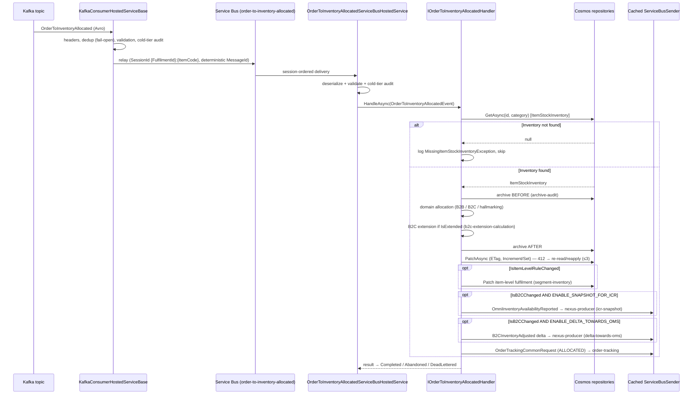
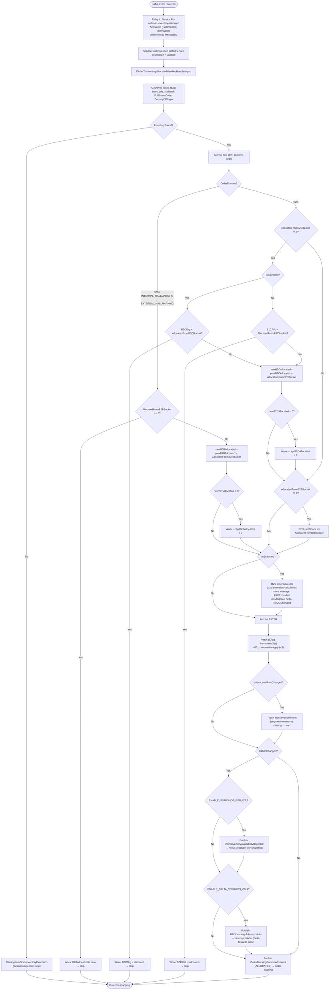

# inventory.OrderToInventoryAllocated - Technical Documentation

## 1. Overview

### Purpose
`inventory.OrderToInventoryAllocated` is a Kafka event that processes inventory
allocation events triggered when orders are fulfilled from inventory. It manages
the allocation of inventory from B2B and B2C buckets based on order domain types
(B2B, B2C, Internal Hallmarking, External Hallmarking) and reconciles the
resulting availability with the external OMS.

### Business Objective
- Track and record inventory allocations across multiple business domains
  (B2B, B2C, Internal Hallmarking, External Hallmarking).
- Update inventory availability metrics (`B2CAllocated`, `B2BAllocated`,
  `B2BUsedShare`) when orders consume inventory.
- Maintain consistency between internal WMS inventory and external OMS.
- Support dynamic B2C extension from the B2B bucket based on segmentation rules.
- Trigger downstream inventory-comparison snapshots and delta notifications for
  OMS synchronization, plus order-tracking events.

### Scope
- Consumes `inventory.OrderToInventoryAllocated` from Kafka (Avro →
  `OrderToInventoryAllocatedEvent`), relays it to the Azure Service Bus queue
  `order-to-inventory-allocated`, and processes it on a session-enabled Service
  Bus consumer.
- Performs domain-specific B2B/B2C allocation, item-level and fulfilment-level
  segmentation rule application, B2C extension calculation, and delta reporting.
- Persists inventory to Cosmos DB via ETag-guarded **Patch** operations.
- Publishes downstream events to the `nexus-producer` and `order-tracking`
  queues.
- Archives before/after snapshots for audit.

### High-Level Architecture

Matches the platform data flow in
[integration-resiliency.instructions.md](../ai/integration-resiliency.instructions.md):
a Kafka-to-Service-Bus relay hosted service, then a session-enabled Service Bus
consumer that calls the Application layer, which persists through the Cosmos DB
repository and archives through Blob Storage.

```
Kafka topic `inventory-events` (Type header: OrderToInventoryAllocated, Avro)
                    ↓
   OrderToInventoryAllocatedConsumerHostedService (KafkaConsumerHostedServiceBase)
     - correlation id / dedup id / type headers read + logged
     - Nexus dedup check (IDeduplicationService, fail-open)
     - schema + dynamic validation
     - cold-tier request audit (unconditional)
                    ↓
   Azure Service Bus queue `order-to-inventory-allocated`
   (session-enabled: SessionId = {FulfilmentId}:{ItemCode};
    message ID deterministic from the Kafka key — never a fresh GUID)
                    ↓
   OrderToInventoryAllocatedServiceBusHostedService
     (ServiceBusConsumerHostedService<OrderToInventoryAllocatedEvent>)
     - envelope + payload deserialize, dynamic validation, cold-tier audit
                    ↓
          IOrderToInventoryAllocatedHandler.HandleAsync
                    ↓
    ┌───────────────┬───────────────┬──────────────┬──────────────┐
    ↓               ↓               ↓              ↓              ↓
B2B/B2C         Segmentation    B2C Extension    OMS Delta      ICR Snapshot
allocation      (item/ful.)     (IsExtended)     (order-track)  (reporting)
    ↓               ↓               ↓              ↓              ↓
IItemStockInventoryService → Cosmos DB (ETag-guarded Patch, re-read-and-reapply
on 412) + MessageArchive (Cosmos, optional Blob cold-tier mirror)
                    ↓
    nexus-producer + order-tracking queues (Service Bus) via cached ServiceBusSender
```

Business logic never touches `CosmosClient`/`Container`/`ServiceBusSender`
directly — it goes through `IItemStockInventoryService` → the Cosmos repository
and through the application-layer publish abstraction (see
[shared/service-bus-publishing.md](shared/service-bus-publishing.md)).

### Key Dependencies
- **`ItemStockInventoryRepository`** — core inventory (Cosmos, multi-container
  EDC/TDC/ADC/CAECOM/BRZ3PL, ETag-guarded; cosmos §5a/§9).
- **`ItemLevelSegmentationRepository`** / **`FulfilmentLevelSegmentationRepository`**
  — segmentation rules (Cosmos, read-only).
- **`MessageArchiveRepository`** — before/after snapshot archival (Cosmos +
  optional Blob).
- **Cached `ServiceBusSender`** — outbound Nexus and order-tracking publishing.
- Shared helpers: [segment-inventory](shared/segment-inventory.md),
  [b2c-extension-calculation](shared/b2c-extension-calculation.md),
  [inventory-formulas](shared/inventory-formulas.md),
  [delta-towards-oms](shared/delta-towards-oms.md),
  [icr-snapshot](shared/icr-snapshot.md),
  [country-code-lookup](shared/country-code-lookup.md),
  [archive-audit](shared/archive-audit.md),
  [cosmos-idempotent-write](shared/cosmos-idempotent-write.md),
  [service-bus-publishing](shared/service-bus-publishing.md).

### Assumptions
1. Incoming messages are valid `inventory.OrderToInventoryAllocated` Avro objects
   deserialized to `OrderToInventoryAllocatedEvent`.
2. Fulfilment location IDs map to known centers (TDC, EDC, ADC, CAECOM, BRZ3PL).
3. Allocation quantities are pre-validated by the upstream OMS; this event still
   enforces its own source-sufficiency and non-negative guards.
4. Country codes resolve from `CountryRepository` or fall back to `UNKNOWN`
   ([country-code-lookup](shared/country-code-lookup.md)).
5. **Processing is idempotent** — a deterministic document `Id` plus ETag-guarded
   Patch make redelivery a no-op, not a duplicate/double-allocation (see
   [cosmos-idempotent-write](shared/cosmos-idempotent-write.md)).
6. All timestamps are UTC and supplied by the caller (no clock reads in helpers).

---

## 2. End-to-End Flow

```
1. MESSAGE RECEPTION (Kafka consumer)
   ├─ OrderToInventoryAllocated deserialized (Avro → OrderToInventoryAllocatedEvent)
   ├─ correlation/dedup/type headers logged; IDeduplicationService check (fail-open)
   ├─ schema + dynamic validation; cold-tier request audit (unconditional)
   └─ relay to Service Bus queue `order-to-inventory-allocated`
        · SessionId = {FulfilmentId}:{ItemCode}
        · deterministic message ID from Kafka key (never a fresh GUID)

2. SERVICE BUS CONSUMPTION
   ├─ envelope + payload deserialize, dynamic validation, cold-tier audit
   └─ IOrderToInventoryAllocatedHandler.HandleAsync(OrderToInventoryAllocatedEvent)

3. INVENTORY RETRIEVAL
   ├─ point read ItemStockInventory by category (ItemCode, Hallmark,
   │  FulfilmentCode, CountryOfOrigin)
   └─ null → MissingItemStockInventoryException (business rejection, line skipped)

   4. DOMAIN-SPECIFIC ALLOCATION
      ├─ B2B / INTERNAL_HALLMARKING / EXTERNAL_HALLMARKING → update B2BAllocated
      └─ B2C → update B2CAllocated (+ B2BUsedShare when B2B bucket used)

   5. B2C EXTENSION (IsExtended) — see b2c-extension-calculation.md
      ├─ store leverage from item-level (if active) else fulfilment-level rule
      ├─ B2CExtended = CalculateActualB2BAvailable; newB2CAvl = CalculateB2CAvl
      └─ delta = newB2CAvl − prevB2CAvl; IsB2CChanged = (delta ≠ 0)

   6. PERSIST — archive before/after (archive-audit.md); PERSIST via ETag-guarded
      Patch (Increment/Set, ≤10 ops), 412 re-read/reapply loop (max 3)

   7. ITEM-LEVEL SEGMENTATION UPDATE (IsItemLevelRuleChanged) — segment-inventory.md
      └─ Patch item-level fulfilment; missing stock → warning, non-blocking

   8. ICR SNAPSHOT (IsB2CChanged AND ENABLE_SNAPSHOT_FOR_ICR) — icr-snapshot.md
      └─ publish Inventory_OmniInventoryAvailabilityReported → nexus-producer

   9. OMS DELTA (IsB2CChanged AND ENABLE_DELTA_TOWARDS_OMS) — delta-towards-oms.md
      └─ publish Inventory_B2CInventoryAdjusted (signed delta) → nexus-producer

  10. ORDER TRACKING (always attempted) — delta-towards-oms.md
      └─ publish OrderTrackingCommonRequest (OrderStatus = ALLOCATED) → order-tracking

11. OUTCOME
    └─ no exception → Completed; ConcurrencyException/OperationCanceled → Abandoned;
       any other → DeadLettered (see cosmos-idempotent-write.md)
```

### Complete Execution Flow — Sequence Diagram



### Flow Chart



### Data Flow Through Layers
`Kafka → KafkaConsumerHostedServiceBase → Service Bus
(order-to-inventory-allocated) → ServiceBusConsumerHostedService →
IOrderToInventoryAllocatedHandler → helpers → IItemStockInventoryService →
Cosmos repository (Patch/ETag) + archive → ServiceBusSender (nexus-producer,
order-tracking)`.

---

## 3. Detailed Business Logic

### 3.1 Inventory Not Found — Business Rejection
- **Why:** inventory may be deleted/consolidated before the allocation event
  arrives; the service must stay resilient to upstream OMS timing.
- **Inputs:** `ItemCode`, `Hallmark`, `FulfilmentCode`, `CountryOfOrigin` (all
  four required — they form the point-read `category`).
- **Processing:** point read the aggregate; if absent, log a
  `MissingItemStockInventoryException` and skip the line without failing the
  whole message (it is an application rejection, not a Cosmos concurrency
  signal — see [cosmos-idempotent-write.md](shared/cosmos-idempotent-write.md)).

### 3.2 B2B Allocation — Quantity Update
- **Domains:** `B2B`, `INTERNAL_HALLMARKING`, `EXTERNAL_HALLMARKING`.
- **Guard:** `AllocatedFromB2BBucketQuantity == 0` → warn (`B2BAllocated is
  zero`) and skip.
- **Update:** `newB2BAllocated = prevB2BAllocated + AllocatedFromB2BBucketQuantity`,
  applied as a Patch `Increment`. If the resulting value would be negative → warn
  (`value cannot be negative`) and cap at `0` (data-integrity guard).
- **Extension:** when `IsExtended`, run the B2C extension calc (§3.4);
  otherwise skip.

### 3.3 B2C Allocation — Source Validation & Update
- **Guard:** only when `AllocatedFromB2CBucketQuantity != 0`.
- **Source-sufficiency (strict, skip on failure):**
  - `IsExtended` → require `B2COrg ≥ AllocatedFromB2CBucketQuantity`, else warn
    (`B2COrg < allocated`) and skip.
  - not extended → require `B2CAVL ≥ AllocatedFromB2CBucketQuantity`, else warn
    (`B2CAVL < allocated`) and skip.
- **Update:** `newB2CAllocated = prevB2CAllocated + AllocatedFromB2CBucketQuantity`
  via Patch `Increment`; negative result → warn and cap at `0`.
- **B2B used share (independent condition):** if `OrderDomain == B2C` and
  `AllocatedFromB2BBucketQuantity != 0`, `B2BUsedShare +=
  AllocatedFromB2BBucketQuantity` (Patch `Increment`). Tracks cross-domain use of
  the B2B bucket for B2C orders; no upper bound.

### 3.4 B2C Extension Calculation
Delegated to [b2c-extension-calculation.md](shared/b2c-extension-calculation.md)
(which builds on [inventory-formulas.md](shared/inventory-formulas.md)).
Event-specific behaviour:
- Store leverage resolves from item-level segmentation when present and
  `IsActive`, else falls back to fulfilment-level; missing rule →
  `StoreLeveragePercentage = 0`.
- `B2CExtended = CalculateActualB2BAvailable(inventory)` and
  `newB2CAvl = CalculateB2CAvl(inventory)`.
- If `newB2CAvl != prevB2CAvl`: set `IsB2CChanged = true`,
  `DeltaTowardsOMS = newB2CAvl − prevB2CAvl`, and update `B2CAVL = newB2CAvl` via
  Patch `Set`. The signed delta is consumed by the OMS delta publisher (§3.6).

### 3.5 Segmentation Rule Application
See [segment-inventory.md](shared/segment-inventory.md) for rule precedence (3PL
→ fulfilment-level; warehouse → item-level when active, else fulfilment-level).
When `IsItemLevelRuleChanged`, the item-level fulfilment record is updated via
Patch; if the stock record is missing, a warning is logged and processing
continues (non-blocking).

### 3.6 OMS Delta & 3.7 ICR Snapshot & Order Tracking
Delegated wholesale to [delta-towards-oms.md](shared/delta-towards-oms.md) and
[icr-snapshot.md](shared/icr-snapshot.md):
- **ICR snapshot:** when `IsB2CChanged` and `ENABLE_SNAPSHOT_FOR_ICR`, publish
  `Inventory_OmniInventoryAvailabilityReported` to `nexus-producer`.
- **OMS delta:** when `IsB2CChanged` and `ENABLE_DELTA_TOWARDS_OMS`, publish the
  signed `Inventory_B2CInventoryAdjusted` delta to `nexus-producer`. The
  `ReferenceId` is deterministic (never `Guid.NewGuid()`).
- **Order tracking:** always attempted — build `OrderTrackingCommonRequest`
  (`OrderStatus = ALLOCATED`, `EventType = ORDER_TO_INVENTORY_ALLOCATED`,
  `OrderType` mapped from `OrderDomain`, plus the order-tracking line) and publish
  to `order-tracking`. This is a plain in-process `OrderTrackingCommonRequest`
  builder per [delta-towards-oms.md](shared/delta-towards-oms.md) — no
  orchestration is involved.

All three publishes go through the cached `ServiceBusSender` and the
`service-bus-publish` Polly pipeline
([service-bus-publishing.md](shared/service-bus-publishing.md)), **after** the
Cosmos state change is durably applied. These were previously commented-out
`TODO` sends; they are now implemented publishes.

### 3.8 Message Archival
Before/after aggregate snapshots via
[archive-audit.md](shared/archive-audit.md) (best-effort; an archive failure is
logged and does not by itself fail the message).

---

## 4. Calculation Logic

All quantity math is centralized in
[inventory-formulas.md](shared/inventory-formulas.md) and
[b2c-extension-calculation.md](shared/b2c-extension-calculation.md); increments
are applied with `PatchOperation.Increment`, never read-modify-write-replace.

### Calculation 1 — B2BAllocated
```
newB2BAllocated = prevB2BAllocated + AllocatedFromB2BBucketQuantity
```
- Integer; `prevB2BAllocated ?? 0`; `AllocatedFromB2BBucketQuantity == 0` →
  business rejection (warn + skip); negative result capped at `0`.
- **Worked example:** `prev = 50`, `alloc = 10` → `60`.

### Calculation 2 — B2CAllocated
```
newB2CAllocated = prevB2CAllocated + AllocatedFromB2CBucketQuantity
```
- Precondition (strict): `IsExtended` → `B2COrg ≥ alloc`; else `B2CAVL ≥ alloc`.
- Integer; `prevB2CAllocated ?? 0`; negative result capped at `0`.
- **Worked example:** `IsExtended`, `B2COrg = 100`, `prev = 20`, `alloc = 30`;
  validation `100 ≥ 30` ✓ → `50`.

### Calculation 3 — B2CExtended (via `FormulaHelper`)
```
B2CExtended = CalculateActualB2BAvailable(inventory) = B2BAVL − B2BAllocated − B2BUsedShare
```
- Ceiling: cannot exceed `B2BAVL − B2BAllocated`; missing store leverage → `0`.
- **Worked example:** `B2BAVL = 500`, `B2BAllocated = 200`, `B2BUsedShare = 40`
  → `B2CExtended = 260`.

### Calculation 4 — B2CAvl (via `FormulaHelper`)
```
newB2CAvl = CalculateB2CAvl(inventory) = B2COrg + B2CExtended
```
- **Worked example:** `B2COrg = 60`, `B2CExtended = 260` → `newB2CAvl = 320`.

### Calculation 5 — Delta Towards OMS
```
DeltaTowardsOMS = newB2CAvl − prevB2CAvl
```
- Signed integer; can be positive, negative, or zero.

| prevB2CAvl | newB2CAvl | Delta | IsB2CChanged |
|---|---|---|---|
| 60 | 320 | +260 | true |
| 100 | 85 | −15 | true |
| 60 | 60 | 0 | false |

### Calculation 6 — B2BUsedShare Increment
```
newB2BUsedShare = prevB2BUsedShare + AllocatedFromB2BBucketQuantity
```
- Only when `OrderDomain == B2C` AND `AllocatedFromB2BBucketQuantity != 0`;
  applied as Patch `Increment`. No upper bound.
- **Worked example:** `prev = 10`, `alloc = 5` → `15`.

---

## 5. Database Documentation

All Cosmos access follows [cosmos-db.instructions.md](../ai/cosmos-db.instructions.md)
and [cosmos-idempotent-write.md](shared/cosmos-idempotent-write.md).

### 5.1 ItemStockInventory (Cosmos, multi-container per fulfilment code)
- **Partition key** `Category` = composite
  `FulfilmentId:ItemCode:Hallmark:CountryOfOrigin`.
- **Read:** `GetAsync(id, category)` — point read within one partition (replaces
  the old `GetInventoryByCategory` scan).
- **Create (first write):** deterministic `Id`; `409 Conflict` → return existing
  (redelivery no-op).
- **Update:** **`PatchAsync`** with `IfMatchEtag`, using `PatchOperation.Increment`
  for `B2BAllocated` / `B2CAllocated` / `B2BUsedShare` and `.Set` for `B2CAVL`,
  `B2CExtended`, `IsExtended`, and `ModifiedUtc`, **≤10 ops**. `412` →
  `ConcurrencyException` → §5.5 re-read/reapply loop (max 3 attempts).
- **No last-write-wins** on any quantity field. This deterministic-Id + ETag-Patch
  model is the fix for the earlier double-allocation / duplicate-entry symptom
  (allocation counted twice on redelivery) — see below.

| Field | How derived | Patch op |
|---|---|---|
| B2BAllocated | prev + AllocatedFromB2BBucketQuantity (cap ≥ 0) | Increment |
| B2CAllocated | prev + AllocatedFromB2CBucketQuantity (cap ≥ 0) | Increment |
| B2BUsedShare | prev + AllocatedFromB2BBucketQuantity (B2C domain) | Increment |
| B2CExtended | CalculateActualB2BAvailable (IsExtended) | Set |
| B2CAVL | CalculateB2CAvl (IsExtended and newB2CAvl ≠ prev) | Set |
| IsExtended | item-level rule active | Set |
| ModifiedUtc | caller-supplied UTC | Set |

### 5.2 ItemLevelSegmentation / FulfilmentLevelSegmentation (Cosmos, read-only)
Point reads by category (`FulfilmentCode`, `Hallmark`, `ItemCode`,
`CountryOfOrigin`); supply `StoreLeveragePercentage`, `IsActive`, and B2C
allocation share. Item-level wins when present and active, else fulfilment-level
fallback (`StoreLeveragePercentage` default `0`). See
[segment-inventory.md](shared/segment-inventory.md).

### 5.3 Archive
Before/after aggregate snapshots via
[archive-audit.md](shared/archive-audit.md) (Cosmos + optional Blob cold-tier;
best-effort, failure does not fail the message). Replaces the old `MessageArchive`
before/after inserts.

### 5.4 Read/Write summary per message
- **Reads:** 1 inventory point read (+ optional segmentation reads + optional ICR
  re-read).
- **Writes:** 1 inventory Patch (+ before/after archives + optional item-level
  segmentation Patch).

### 5.5 Transaction Flow & Concurrency
Cosmos has no multi-document transactions here; correctness comes from
per-document ETag Patch + the bounded re-read/reapply loop
([cosmos-idempotent-write.md](shared/cosmos-idempotent-write.md) §2), not
distributed transactions. Downstream publishes happen only **after** the durable
Cosmos commit.

**How the double-allocation bug is fixed.** The old flow read an aggregate,
computed a new total in memory, and wrote it back with a fresh-GUID document Id
and a last-write-wins replace. A redelivered message (Service Bus at-least-once)
or a concurrent allocation for the same item therefore created a duplicate
document and/or counted the same allocation twice. The current model eliminates
both: the document `Id` is **deterministic** (derived from the event key), so a
redelivery targets the *same* item and `409 Conflict` on create is treated as
"already applied"; and every mutation is an **ETag-guarded Patch `Increment`**,
so a stale ETag yields `412` → `ConcurrencyException` → re-read fresh state and
reapply. No allocation is ever silently overwritten or double-added.

---

## 6. State Changes & State Machine

```
OrderToInventoryAllocatedEvent
   ↓  point read ItemStockInventory (deterministic Id; 409 → existing)
   │  not found → MissingItemStockInventoryException (skip line)
   ↓  archive previous (archive-audit.md)
Apply domain allocation
   ├─ B2B / hallmarking → B2BAllocated += AllocatedFromB2BBucket (cap ≥ 0)
   └─ B2C → B2CAllocated += AllocatedFromB2CBucket (source-validated, cap ≥ 0)
             + B2BUsedShare += AllocatedFromB2BBucket (if B2B bucket used)
   ↓  if IsExtended → recalc B2CExtended, B2CAVL; delta; IsB2CChanged
Patch (ETag, Increment/Set)  ── 412 ─▶ re-read + reapply (≤3)
   ↓  archive new
Publish downstream after durable commit:
   ├─ ICR snapshot (IsB2CChanged AND ENABLE_SNAPSHOT_FOR_ICR) → nexus-producer
   ├─ OMS delta   (IsB2CChanged AND ENABLE_DELTA_TOWARDS_OMS) → nexus-producer
   └─ order tracking (always, ALLOCATED)                       → order-tracking
   ↓
Final: allocation applied exactly once
```

### Worked state transition (B2B allocation on an extended item)

| Field | Initial | After | Note |
|---|---|---|---|
| B2BAllocated | 50 | 60 | +10 (Increment) |
| B2CAllocated | 20 | 20 | unchanged |
| B2BAVL | 100 | 100 | unchanged |
| B2CExtended | 0 | 8 | recalculated (formula) |
| B2CAVL | 60 | 58 | `B2COrg 100 + B2CExtended 8 − B2CAllocated 50` |
| B2BUsedShare | 0 | 0 | unchanged (B2B domain) |
| IsExtended | true | true | unchanged |

`DeltaTowardsOMS = 58 − 60 = −2`; `IsB2CChanged = true`; `IsItemLevelRuleChanged
= true`. Downstream: OmniInventoryAvailabilityReported, B2C delta (−2),
order-tracking (ALLOCATED), item-level segmentation update.

**Critical invariants:** no allocation quantity goes negative (capped at `0`);
B2C allocation never exceeds its validated source (`B2COrg` / `B2CAVL`); a
redelivered message produces no additional mutation.

---

## 7. API Documentation

### Kafka message contract
Topic `inventory-events`, `Type` header `OrderToInventoryAllocated`, Avro payload
mapped to `OrderToInventoryAllocatedEvent`:

```json
{
  "ReferenceId": "550e8400-e29b-41d4-a716-446655440000",
  "OrderId": "ORD-2026-001234",
  "ProductId": "SKU-GOLD-1001",
  "OrderDomain": "B2B|B2C|INTERNAL_HALLMARKING|EXTERNAL_HALLMARKING",
  "Location": { "Id": "WH-DELHI-01", "Type": "WAREHOUSE|THIRD_PARTY_LOGISTICS|STORE" },
  "CountryOfOrigin": "INDIA",
  "Hallmarking": "HALLMARK_916",
  "Channel": "ONLINE",
  "AllocatedFromB2BBucketQuantity": 0,
  "AllocatedFromB2CBucketQuantity": 10,
  "ProductUnits": "PIECES"
}
```

### Service Bus message contract
Queue `order-to-inventory-allocated`, `ServiceBusRelayEnvelope` wrapping the
event; `SessionId = {FulfilmentId}:{ItemCode}`; deterministic `MessageId` derived
from the Kafka key (never a fresh GUID); correlation headers per
[service-bus-publishing.md](shared/service-bus-publishing.md).

### Field mapping (input → inventory)
| Input field | Maps to | Notes |
|---|---|---|
| ProductId | ItemCode | category segment |
| Location.Id | FulfilmentCode | category segment |
| Hallmarking | Hallmark | category segment |
| CountryOfOrigin | CountryOfOrigin | category segment |
| OrderDomain | allocation branch | B2B/hallmarking vs B2C |
| AllocatedFromB2BBucketQuantity | B2BAllocated / B2BUsedShare | Increment |
| AllocatedFromB2CBucketQuantity | B2CAllocated | Increment (source-validated) |
| OrderDomain | OrderType (order-tracking) | mapped |

### Validation
| Field | Rule | Handling |
|---|---|---|
| payload | not null / schema-valid | poison → DeadLettered |
| inventory record | must exist | missing → business rejection, skip |
| AllocatedFromB2BBucketQuantity (B2B) | ≠ 0 | zero → warn + skip |
| B2C source (B2COrg/B2CAVL) | ≥ allocated qty | insufficient → warn + skip |
| resulting allocated qty | ≥ 0 | negative → warn + cap at 0 |

### Output / Events Published
| Event | Condition | Queue | Type |
|---|---|---|---|
| OmniInventoryAvailabilityReported | IsB2CChanged AND ENABLE_SNAPSHOT_FOR_ICR | `nexus-producer` | Inventory_OmniInventoryAvailabilityReported |
| B2C inventory delta | IsB2CChanged AND ENABLE_DELTA_TOWARDS_OMS | `nexus-producer` | Inventory_B2CInventoryAdjusted |
| Order tracking (ALLOCATED) | always attempted | `order-tracking` | OrderTrackingCommonRequest |

All are implemented publishes via the cached `ServiceBusSender`
([service-bus-publishing.md](shared/service-bus-publishing.md)) — not TODOs.

---

## 8. Error Handling & Retry

- **Validation / poison payload** → DeadLettered (hot-tier dead-letter container).
- **Cosmos 412 (ETag)** → `ConcurrencyException` → §5.5 re-read/reapply loop
  (≤3); if exhausted → Abandoned (redelivered up to `MaxDeliveryCount`).
- **Cosmos 429** → Cosmos SDK retry (`MaxRetryAttemptsOnRateLimitedRequests`).
- **Cosmos 409 (create)** → treated as "already applied" (redelivery no-op), not
  an error.
- **Service Bus publish transient** → `service-bus-publish` Polly pipeline
  (retry with backoff/jitter, `MaxRetryAttempts = 5`); exhausted → processing
  failure for the triggering message.
- **`OperationCanceledException`** → Abandoned.
- **Any other exception** → DeadLettered (`Reason` = type, `Description` =
  `ex.ToString()`).
- **Application rejections** (`MissingItemStockInventoryException`,
  insufficient-source / zero-quantity warnings) → logged; that line is skipped
  without failing the whole message.

Outcome mapping is the definitive table in
[cosmos-idempotent-write.md](shared/cosmos-idempotent-write.md):

| Result | Service Bus action |
|---|---|
| No exception | Completed |
| ConcurrencyException | Abandoned (retried to MaxDeliveryCount) |
| OperationCanceledException | Abandoned |
| Any other exception | DeadLettered |

---

## 9. Security & Configuration

### Authentication
- Cosmos DB and Service Bus use **connection strings** sourced from Azure Key
  Vault (delivered as a Kubernetes Secret); local dev uses the emulator /
  user-secrets. This is the deliberate documented standard (cosmos §1 /
  engineering-standards §6) — **not** Managed Identity / Workload Identity.

### Feature flags
| Flag | Default | Purpose |
|---|---|---|
| ENABLE_SNAPSHOT_FOR_ICR | false | ICR snapshot (OmniInventoryAvailabilityReported) |
| ENABLE_DELTA_TOWARDS_OMS | false | B2C delta notification to OMS |

### Queue names (kebab-case, config-resolved)
Resolved from the `ServiceBus` configuration section — never hard-coded literals
or env-var constants at the call site. Old constants shown for traceability only.

| Queue | Old constant | Direction |
|---|---|---|
| `order-to-inventory-allocated` | ORDER_TO_INVENTORY_ALLOCATED_REFLEX_QUEUE_NAME | inbound (relay) |
| `nexus-producer` | NEXUS_PRODUCER_QUEUE_NAME | outbound (ICR + OMS delta) |
| `order-tracking` | ORDER_TRACKING_QUEUE_NAME | outbound (order tracking) |

### Data protection
TLS in transit; encryption at rest; no secrets/keys logged. Business identifiers
(OrderId, ReferenceId, ProductId) are logged for traceability under the platform
logging standard — no connection strings or keys are ever logged.

---

## 10. Known Limitations & Future Improvements

### Current Limitations
- Integer quantities only (no fractional units).
- Negative resulting allocations are capped at `0` with a warning rather than
  reconciled — if the OMS ever intends a signed reversal, that signal is
  currently clamped.
- Segmentation rules are read per message; may be cached (see below).

### Potential Improvements
- Cache country codes and segmentation rules per process to cut Cosmos reads
  ([country-code-lookup.md](shared/country-code-lookup.md) already allows this).
- Batch downstream publishes where a message produces multiple events.
- Clarify with OMS whether negative allocations are valid; if so, replace the
  cap-at-zero guard with an explicit signed-reversal path.

> The previous version listed as gaps: "message queuing not implemented (TODO
> sends)", "no optimistic locking / last-write-wins concurrent updates", and
> "allocation counted twice on duplicate delivery". All three are now resolved by
> design: downstream sends go through the cached `ServiceBusSender` (§9); and
> redelivery/concurrency are handled by deterministic Id + ETag Patch + the §5.5
> re-read/reapply loop — the fix for the double-allocation / duplicate-entry
> problem.

---

## 11. Summary

`inventory.OrderToInventoryAllocated` processes order allocation events on the
AKS pipeline: consumes from Kafka, relays to the `order-to-inventory-allocated`
Service Bus queue, applies domain-specific B2B/B2C allocation with source
validation and B2C extension, and publishes ICR snapshots / OMS deltas to
`nexus-producer` and order-tracking events to `order-tracking`.

**Key business logic:** B2B/hallmarking increments `B2BAllocated`; B2C increments
`B2CAllocated` after `B2COrg`/`B2CAVL` source validation and tracks `B2BUsedShare`
when the B2B bucket is used; extended items recalculate `B2CExtended`/`B2CAVL` and
emit a signed OMS delta only when B2C availability changes; before/after
archival throughout.

**Database updates:** ETag-guarded **Patch** (`Increment`/`Set`, ≤10 ops) on
`ItemStockInventory`, with deterministic Id + 409-as-applied and the §5.5 412
re-read/reapply loop — this is the fix for the double-allocation / duplicate-entry
problem (previously fresh-GUID inserts and last-write-wins replaces).

**Risks & recommendations:** concurrency conflicts should be rare with sessions
in place; monitor dead-letter counts and Cosmos 429 rates; cache rarely-changing
lookups; confirm OMS semantics for negative allocations.

---

**Document Version:** 2.0 (AKS / k8s)
**Status:** Regenerated
