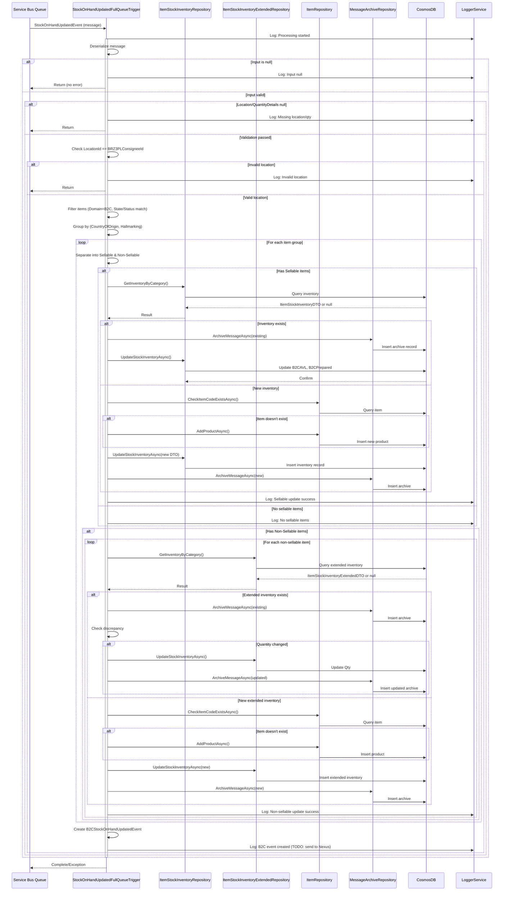

# inventory.StockOnHandUpdated - Technical Documentation

## 1. Overview

### Purpose
The `inventory.StockOnHandUpdated` is a kafka event that processes inventory stock quantity updates received from external inventory management systems. It synchronizes stock levels across different inventory states and domains, maintaining accurate inventory records in the IIS (Inventory Information System) database.

### Business Objective
- Synchronize real-time inventory updates from the WMS (Warehouse Management System) to the IIS system
- Maintain accurate stock-on-hand quantities for B2C (Business-to-Consumer) inventory across different states (AVAILABLE, INSPECTION, AVAILABLETOSELL)
- Track inventory by product characteristics (Country of Origin, Hallmarking) and fulfillment centers
- Archive inventory state transitions for audit and historical tracking
- Distinguish between sellable and non-sellable inventory for business logic purposes

### Scope
- `inventory.StockOnHandUpdated` from Kakfa via Consumer Group: `$Default` and deserialized to `StockOnHandUpdatedEvent` messages and send to Service Bus Queue
- Processes `StockOnHandUpdatedEvent` messages from Azure Service Bus queue
- Handles only BRAZIL 3PL (BRZ3PL) location inventory updates
- Processes B2C domain inventory only
- Filters items based on specific state/status combinations
- Updates and archives inventory records in CosmosDB
- Creates requests for Orchestrator services for both sellable and non-sellable items

### High-Level Architecture

```
Kafka (inventory.StockOnHandUpdated)
        ↓
Service Bus (StockOnHandUpdatedEvent)
        ↓
┌─────────────────────────────────────────┐
│ Message Validation & Filtering          │
├─────────────────────────────────────────┤
│ 1. Parse StockOnHandUpdatedEvent        │
│ 2. Validate Location & QuantityDetails  │
│ 3. Filter by Location (BRZ3PLConsigneeId) │
│ 4. Filter by Domain (B2C)               │
│ 5. Filter by State/Status Combinations  │
│ 6. Group by CountryOfOrigin & Hallmarking│
└─────────────────────────────────────────┘
        ↓
        ├──────────────────────────────────┬──────────────────────────────┐
        ↓                                  ↓                              ↓
  ┌──────────────────┐        ┌─────────────────────────┐    ┌────────────────────┐
  │ Case 1: Sellable │        │ Case 2: Non-Sellable    │    │ Case 3: B2C        │
  │ Items Processing │        │ Items Processing        │    │ Stock Notification │
  └──────────────────┘        └─────────────────────────┘    └────────────────────┘
        ↓                                  ↓                              ↓
  Repository: ItemStockInventoryRepository
  Archive: MessageArchiveRepository
        ↓
   CosmosDB Update
```

### Assumptions
1. Service Bus connection and queue names are correctly configured in ApplicationConfig
2. Input messages are in correct JSON format deserializable to `StockOnHandUpdatedEvent`
3. Country of Origin and Hallmarking values are valid enums
4. Product IDs exist or will be created if missing
5. The B2C location being processed is always `ReflexConstants.BRZ3PLConsigneeId`
6. Fulfillment code is consistently `ReflexConstants.BRZDC3PLFulfilmentId` for this location
7. Negative quantities received should be treated as zero
8. The system supports optimistic concurrency at the repository level

### Dependencies
- **AutoMapper**: For mapping between DTOs and domain events
- **Azure Service Bus**: Message queue infrastructure
- **CosmosDB**: Persistence layer for inventory data
- **IItemStockInventoryRepository**: For B2C sellable inventory operations
- **IItemStockInventoryExtendedRepository**: For extended inventory (non-sellable) operations
- **IItemRepository**: For product/item existence validation and creation
- **IMessageArchiveRepository**: For archiving previous inventory states
- **ILoggerService**: For structured logging and error tracking
- **ApplicationConfig**: Configuration management for queue names and connection strings

---

## 2. End-to-End Flow

### Complete Execution Flow

```
START: Kafak message received
  ↓
[STEP 1] Deserialize Message
  Input: inventory.StockOnHandUpdated
  Output: StockOnHandUpdatedEvent
  ↓
[STEP 2] Log Initial Processing
  Log: "Processing StockOnHandUpdatedEvent for ProductId: {ProductId}, LocationId: {LocationId}"
  ↓
[STEP 3] Null Validation - Input
  Decision: Is input null?
  ├─ Yes → Log: "Input message is null" → RETURN (exit gracefully)
  └─ No → Continue
  ↓
[STEP 4] Validation - Location and QuantityDetails
  Check: LocationId != null AND QuantityDetails != null
  Decision: Are both present?
  ├─ No → Log validation error → RETURN (exit gracefully)
  └─ Yes → Continue
  ↓
[STEP 5] Validation - Location ID
  Check: LocationId == BRZ3PLConsigneeId (BRAZIL 3PL location)
  Decision: Is location valid for this trigger?
  ├─ No → Log: "Invalid location id" → RETURN (exit gracefully)
  └─ Yes → Continue
  ↓
[STEP 6] Data Filtering and Grouping
  Input: QuantityDetails list from event
  Process:
    a. Filter items where Domain == B2C
    b. Filter items with specific State/Status combinations:
       - (AVAILABLE + PREPARED) OR
       - (AVAILABLE + PICKABLE) OR
       - (INSPECTION + PICKABLE) OR
       - (AVAILABLETOSELL + PICKABLE) OR
       - (AVAILABLE + HELD)
    c. Group filtered items by (CountryOfOrigin, Hallmarking)
  Output: List of grouped items
  ↓
[STEP 7] Process Each Item Group
  For each grouped item (identified by CountryOfOrigin, Hallmarking):
    ↓
    [7A] CASE 1: SELLABLE ITEMS PROCESSING
    ├─ Filter sellable items:
    │   - (AVAILABLE + PREPARED) OR
    │   - (AVAILABLE + PICKABLE) OR
    │   - (AVAILABLETOSELL + PICKABLE)
    │ ↓
    │ Create StockOnHandUpdatedRequest:
    │   - FulfilmentCode: BRZDC3PLFulfilmentId
    │   - ItemCode: from event
    │   - CountryOfOrigin, Hallmark: from group key
    │   - StateLevelQtyList: List of (Quantity, State, Domain)
    │   - UniqueIdentifiers: {ItemCode}
    │ ↓
    │ Set B2CAvailableToSell:
    │   - If location == BRZ3PLConsigneeId
    │   - B2CAvailableToSell = quantity where (AVAILABLETOSELL + PICKABLE)
    │ ↓
    │ Decision: StateLevelQtyList.Count > 0?
    │ ├─ Yes → Call stockOnHandUpdatedEventHandlerAsync(request)
    │ │   ├─ Fetch existing inventory by category
    │ │   ├─ If not exists:
    │ │   │   ├─ Create new ItemStockInventoryDTO with all fields
    │ │   │   ├─ Update B2CAVL = B2CAvailableToSell + PreparedQty
    │ │   │   ├─ Update B2CPrepared
    │ │   │   └─ Save to repository
    │ │   ├─ Else (exists):
    │ │   │   ├─ Update B2CAvailableToSell
    │ │   │   ├─ Update B2CAVL = B2CAvailableToSell + PreparedQty
    │ │   │   ├─ Update B2CPrepared
    │ │   │   └─ Save to repository
    │ │   └─ Archive updated inventory
    │ └─ Exception handled: Log error, continue
    └─ No → Skip (no sellable items)
    ↓
    [7B] CASE 2: NON-SELLABLE ITEMS PROCESSING
    ├─ For each non-sellable item:
    │   Filter: (AVAILABLE + HELD) OR (INSPECTION + PICKABLE)
    │ ↓
    │ For each item in filtered list:
    │   Create ExtendedStockOnHandUpdatedRequest:
    │     - FulfilmentCode: BRZDC3PLFulfilmentId
    │     - ItemCode, CountryOfOrigin, Hallmark: from event/group
    │     - Domain: from item
    │     - Quantity: item quantity (0 if negative)
    │     - State: from item
    │     - UniqueIdentifiers: {ItemCode}
    │   ↓
    │   Call extendedStockOnHandUpdatedEventHandlerAsync(request):
    │     ├─ Fetch existing extended inventory
    │     ├─ If not exists:
    │     │   ├─ Validate/create product if needed
    │     │   ├─ Build new ItemStockInventoryExtendedDTO
    │     │   ├─ Save to repository
    │     │   └─ Archive message
    │     ├─ Else (exists):
    │     │   ├─ Archive previous state
    │     │   ├─ Check discrepancy (old qty != new qty)
    │     │   ├─ Update quantity
    │     │   ├─ If discrepancy exists:
    │     │   │   ├─ Update and archive
    │     │   │   └─ Calculate delta quantity
    │     │   └─ Else: Skip update
    │     └─ Exception handled: Log error, continue
    └─ End For

[STEP 8] B2C Stock Notification (OMS)
  Action: Create B2CStockOnHandUpdatedEvent
  ├─ Set Channel = OWN_ONLINE
  ├─ Map StockOnHandUpdatedEvent to B2CStockOnHandUpdatedEvent
  ├─ Create NexusProducerRequest
  ├─ TODO: Send to Nexus Producer via Service Bus Queue
  └─ Exception handled: Log error, continue

[STEP 9] Final Error Handling
  Outer catch block captures any uncaught exceptions:
    ├─ Log exception with context
    └─ Re-throw exception (Function fails)

END: Return (Success or Exception)
```

### Key Steps Explained

| Step | Action | Input | Processing | Output | Error Handling |
|------|--------|-------|-----------|--------|----------------|
| 1 | Deserialize | ServiceBusReceivedMessage | JSON to StockOnHandUpdatedEvent | StockOnHandUpdatedEvent object | Return if null |
| 2 | Validate Location | LocationId | Check == BRZ3PLConsigneeId | Boolean | Return if invalid |
| 3 | Filter Items | QuantityDetails list | Filter by domain & state/status | List<QuantityDetail> | Return if empty |
| 4 | Group Items | Filtered items | GroupBy (CountryOfOrigin, Hallmarking) | IGrouping list | Continue with empty |
| 5 | Process Sellable | Grouped items | Create request & call handler | bool | Log error, continue |
| 6 | Process Non-sellable | Non-sellable items | Create request & call handler | long | Log error, continue |
| 7 | Send B2C Notification | Event | Map & create producer request | bool | Log error, continue |

---

## 3. Detailed Business Logic

### Business Rule 1: Location Filtering
**Purpose**: Ensure only BRAZIL 3PL inventory updates are processed by this trigger.

**Rule Implementation**:
```
IF input.Location.Id != ReflexConstants.BRZ3PLConsigneeId THEN
  Log informational message indicating invalid location
  RETURN (exit function)
END IF
```

**Why**: This trigger is specifically designed for BRAZIL 3PL fulfillment center. Other locations have different processing logic and should not be processed here.

**Inputs**: 
- `input.Location.Id` from StockOnHandUpdatedEvent

**Processing**:
1. Extract LocationId from input
2. Compare with BRZ3PLConsigneeId constant
3. If mismatch, log and exit

**Decision Points**:
- Is LocationId null? (checked earlier in validation)
- Does LocationId match BRZ3PLConsigneeId?

**Outputs**:
- Valid: Continue processing
- Invalid: Graceful exit

**Validation Rules**:
- LocationId must not be null
- LocationId must exactly match BRZ3PLConsigneeId

**Edge Cases**:
- Multiple locations in single message: Not supported (each message should have single location)
- Location ID changes during processing: N/A (read-only)

**Failure Scenarios**:
- LocationId is null: Caught in validation step, return early
- LocationId is different: Logged and returns early
- LocationId is empty string: Comparison fails, returns early

---

### Business Rule 2: Domain and State/Status Filtering
**Purpose**: Select only relevant inventory items for processing based on business domain (B2C) and inventory states.

**Rule Implementation**:
```
Filter items WHERE:
  (Domain == B2C) AND
  (
    (State == AVAILABLE AND Status == PREPARED) OR
    (State == AVAILABLE AND Status == PICKABLE) OR
    (State == INSPECTION AND Status == PICKABLE) OR
    (State == AVAILABLETOSELL AND Status == PICKABLE) OR
    (State == AVAILABLE AND Status == HELD)
  )
```

**Why**: 
- B2C domain distinguishes consumer sales inventory from B2B or other domains
- Only specific state/status combinations are relevant for B2C processing
- PREPARED status indicates ready for picking by warehouse
- PICKABLE status indicates items available for order fulfillment
- AVAILABLETOSELL indicates cleared for customer sale
- HELD status indicates items in quality control or reserved

**Inputs**:
- `input.QuantityDetails` array containing inventory details

**Processing**:
1. Iterate through QuantityDetails
2. Check Domain == B2C
3. Check if State+Status combination matches allowed list
4. Accumulate matching items

**Decision Points**:
- Is Domain == B2C?
- Is (State, Status) in allowed combinations?

**Outputs**:
- Filtered list of QuantityDetail objects matching criteria

**Validation Rules**:
- QuantityDetails must not be null (checked in validation step)
- State and Status enums must be valid

**Edge Cases**:
- Empty QuantityDetails: Results in empty filtered list
- Multiple items with same State/Status: All included
- Items with negative quantity: Included in filter, quantity normalized to 0 later
- Unknown state/status combination: Excluded from processing

**Failure Scenarios**:
- Invalid enum value: Throws exception during enum conversion
- Null state or status: Excluded from filter (comparison fails)
- Quantity is negative: Processed but normalized to 0

---

### Business Rule 3: Grouping by Characteristics
**Purpose**: Group inventory by product characteristics (Country of Origin, Hallmarking) for better inventory tracking and reporting.

**Rule Implementation**:
```
GROUP filtered_items BY (CountryOfOrigin, Hallmarking)
```

**Why**: 
- Different products from different countries have different tax and compliance implications
- Hallmarking indicates quality certifications or metal purity standards
- Grouping enables separate orchestration requests per characteristic combination
- Enables accurate tracking of inventory by origin and certification

**Inputs**:
- Filtered QuantityDetails list

**Processing**:
1. Apply GroupBy on (CountryOfOrigin, Hallmarking)
2. Creates groups with composite key

**Decision Points**:
- None (grouping is deterministic)

**Outputs**:
- `IEnumerable<IGrouping<AnonymousType, QuantityDetail>>`

**Validation Rules**:
- CountryOfOrigin must be valid enum
- Hallmarking must be valid enum or null

**Edge Cases**:
- All items have same Country and Hallmarking: Single group
- Each item unique by Country/Hallmarking: N groups
- Null/default Country or Hallmarking values: Grouped separately

**Failure Scenarios**:
- Invalid enum: Exception during filtering (caught in outer try-catch)

---

### Business Rule 4: Sellable vs Non-Sellable Separation
**Purpose**: Process different inventory states through different orchestrator handlers based on saleability.

**Sellable Items**:
```
Items WHERE:
  (State == AVAILABLE AND Status == PREPARED) OR
  (State == AVAILABLE AND Status == PICKABLE) OR
  (State == AVAILABLETOSELL AND Status == PICKABLE)
```

**Non-Sellable Items**:
```
Items WHERE:
  (State == AVAILABLE AND Status == HELD) OR
  (State == INSPECTION AND Status == PICKABLE)
```

**Why**:
- Sellable items flow through standard B2C inventory orchestration
- Non-sellable items require extended tracking for quality control, customs, or reserved status
- Different systems need different level of detail
- Held items need separate tracking to prevent accidental allocation

**Inputs**:
- Grouped items for current (CountryOfOrigin, Hallmarking) pair

**Processing**:
1. Filter group for sellable state/status combinations
2. Filter same group for non-sellable state/status combinations
3. Process each subset independently

**Decision Points**:
- Is item sellable?
- Is item non-sellable?
- Can item be both? (No, mutually exclusive by design)

**Outputs**:
- Two separate request lists: `StockOnHandUpdatedRequest[]` and `ExtendedStockOnHandUpdatedRequest[]`

**Validation Rules**:
- State and Status must be valid enums
- Items cannot be both sellable and non-sellable

**Edge Cases**:
- Item matches neither: Excluded from processing
- All items in group are sellable: Non-sellable list empty
- All items in group are non-sellable: Sellable list empty

**Failure Scenarios**:
- Handler exception for sellable: Logged, continues with non-sellable
- Handler exception for non-sellable: Logged, continues to next item/group

---

### Business Rule 5: Quantity Normalization
**Purpose**: Ensure quantities are never negative in the inventory system.

**Rule Implementation**:
```
IF Quantity < 0 THEN
  Quantity = 0
ELSE
  Quantity = Quantity (as-is)
END IF
```

**Why**: 
- Negative inventory indicates data anomaly or system error
- Business logic cannot handle negative stock (cannot sell negative units)
- Systems expecting non-negative quantities will fail
- Zero is safe default for corrupted/negative data

**Inputs**:
- `item.Quantity` from QuantityDetail

**Processing**:
1. Check if quantity < 0
2. Set to 0 if true, else keep as-is

**Decision Points**:
- Is Quantity < 0?

**Outputs**:
- Normalized quantity (0 or positive)

**Validation Rules**:
- Quantity must be numeric
- No minimum value in input validation (caught here)

**Edge Cases**:
- Quantity == 0: Passed as-is
- Very large quantity: Passed as-is (no maximum validation)
- Fractional quantity: Would fail if not integer (but input is integer)

**Failure Scenarios**:
- Quantity is null: Would cause exception (but QuantityDetails is required)
- Quantity is string: Would cause exception during filtering

---

### Business Rule 6: B2C Available to Sell Calculation
**Purpose**: Track inventory specifically available for consumer sale separate from prepared inventory.

**Rule Implementation**:
```
B2CAvailableToSell = 
  SUM(Quantity where State == AVAILABLETOSELL AND Status == PICKABLE)
```

**Why**:
- Some inventory is prepared but not yet available for sale (in quality control)
- AVAILABLETOSELL status explicitly indicates items cleared for customer sales
- Enables accurate order fulfillment availability
- Distinguish from PREPARED which may be in validation phases

**Inputs**:
- `sellableItems` list filtered from group

**Processing**:
1. Filter sellableItems where (State == AVAILABLETOSELL AND Status == PICKABLE)
2. Get first item's quantity using FirstOrDefault (assuming max 1 per category)
3. Default to 0 if no items match

**Decision Points**:
- Are there items with (AVAILABLETOSELL + PICKABLE)?
- Should multiple items be summed or just first? (Design uses FirstOrDefault)

**Outputs**:
- Integer quantity available to sell

**Validation Rules**:
- Must check if items exist before accessing quantity
- Default to 0 if no items

**Edge Cases**:
- Multiple items with AVAILABLETOSELL+PICKABLE: Only first is used (potential bug?)
- No items with AVAILABLETOSELL+PICKABLE: Returns 0
- FirstOrDefault returns null: Cause exception (mitigated by ?? 0)

**Failure Scenarios**:
- No items match: Returns 0 (safe)
- Multiple items match: Only first used (may be incorrect)

---

### Business Rule 7: Inventory Update and Archive
**Purpose**: Maintain current inventory state and historical audit trail.

**Rule Implementation**:
```
TRANSACTION:
  a. Save updated inventory to active store
  b. Archive previous/updated state to history table
END TRANSACTION
```

**Why**:
- Current inventory needed for real-time queries
- Archive maintains audit trail for compliance and debugging
- Two-step process ensures both operations succeed together
- Rollback on failure prevents inconsistency

**Inputs**:
- Updated `ItemStockInventoryExtendedDTO` or `ItemStockInventoryDTO`

**Processing**:
1. Call UpdateStockInventoryAsync on repository
2. Call ArchiveMessageAsync on archive repository
3. Both calls are awaited sequentially

**Decision Points**:
- Should archive happen before or after update?
- What if archive fails after update?

**Outputs**:
- None (void operations)

**Validation Rules**:
- DTO must have all required fields populated
- Both operations must complete (exception stops flow)

**Edge Cases**:
- First insert (no previous state): Still archives new state
- Update with no quantity change: Still archives if any field changes
- Zero quantity after update: Archives as-is

**Failure Scenarios**:
- Update fails: Exception thrown, caught by handler
- Archive fails after update: Inconsistent state (no rollback)

---

## 4. Calculation Logic

### Calculation 1: B2C Available Inventory (B2CAVL)
**Formula**:
```
B2CAVL = B2CAvailableToSell + B2CPrepared
```

**Variables**:
- **B2CAvailableToSell**: Quantity in AVAILABLETOSELL+PICKABLE state
- **B2CPrepared**: Quantity in AVAILABLE+PREPARED state

**Data Source**:
- Both extracted from StockOnHandUpdatedEvent.QuantityDetails

**Units**: Count of items (integer)

**Rounding Logic**: None (integer arithmetic)

**Precision**: No decimal values

**Boundary Conditions**:
- Min: 0 (both components ≥ 0)
- Max: No upper limit

**Null Handling**:
- B2CAvailableToSell: Default to 0 if not present
- B2CPrepared: Default to 0 if no PREPARED items
- Result: Never null

**Default Values**:
- Both components default to 0
- Result defaults to 0

**Overflow/Underflow Handling**:
- No checks (assumes inputs within int32 range)

**Worked Example 1**:
```
Input:
  B2CAvailableToSell = 50
  B2CPrepared = 30

Calculation:
  B2CAVL = 50 + 30 = 80

Output:
  B2CAVL = 80
```

**Worked Example 2**:
```
Input:
  B2CAvailableToSell = 0 (no items in AVAILABLETOSELL)
  B2CPrepared = 45

Calculation:
  B2CAVL = 0 + 45 = 45

Output:
  B2CAVL = 45
```

---

### Calculation 2: Quantity Delta for Extended Inventory
**Formula**:
```
QuantityDelta = CurrentQuantity - PreviousQuantity
```

**Variables**:
- **CurrentQuantity**: New quantity from event
- **PreviousQuantity**: Existing quantity in database

**Data Source**:
- CurrentQuantity: From StockOnHandUpdatedEvent
- PreviousQuantity: From database fetch

**Units**: Count of items (integer)

**Rounding Logic**: None

**Precision**: No decimals

**Boundary Conditions**:
- Min: Negative (reduction)
- Max: Positive (increase)

**Null Handling**:
- PreviousQuantity defaults to 0 if null: `existing.Qty ?? 0`
- Current: Never null (checked in request)

**Default Values**:
- Previous defaults to 0

**Overflow/Underflow Handling**:
- No checks (accepts negative deltas)

**Worked Example 1**:
```
Input:
  PreviousQuantity = 100
  CurrentQuantity = 150

Calculation:
  Delta = 150 - 100 = 50

Output:
  Delta = 50 (quantity increased by 50)
```

**Worked Example 2**:
```
Input:
  PreviousQuantity = 75
  CurrentQuantity = 50

Calculation:
  Delta = 50 - 75 = -25

Output:
  Delta = -25 (quantity decreased by 25)
```

**Worked Example 3**:
```
Input:
  PreviousQuantity = null (new item)
  CurrentQuantity = 100

Calculation:
  PreviousQty = 0 (default)
  Delta = 100 - 0 = 100

Output:
  Delta = 100 (new inventory of 100)
```

---

## 5. Database Documentation

### Table 1: ItemStockInventory (Sellable B2C Inventory)

**Purpose**: Maintains current B2C sellable inventory across all state levels.

**Read Operations**:

| Operation | Query | Filters | Joins | Expected Result |
|-----------|-------|---------|-------|-----------------|
| Get inventory by category | `GetInventoryByCategory()` | ItemCode, Hallmark, FulfilmentCode, CountryOfOrigin | None | Single ItemStockInventoryDTO or null |
| Columns fetched | B2CAVL, B2CPrepared, B2CAvailableToSell, and all other properties | - | - | Complete DTO object |

**Index Usage**: 
- Composite index recommended on (ItemCode, Hallmark, FulfilmentCode, CountryOfOrigin) for query performance

**Insert Operations**:

| Column | Source | Value | Type |
|--------|--------|-------|------|
| ItemCode | Event | input.ProductId | string |
| B2CAVL | Calculated | B2CAvailableToSell + B2CPrepared | int |
| B2CAVLAllocated | Initialized | 0 | int |
| B2CPrepared | Calculated | Quantity from PREPARED state | int |
| B2CAvailableToSell | Event | From AVAILABLETOSELL+PICKABLE items | int |
| B2BAVL | Initialized | 0 | int |
| B2BAllocated | Initialized | 0 | int |
| B2BPrepared | Initialized | 0 | int |
| B2BUsedShare | Initialized | 0 | int |
| B2COrg | Initialized | 0 | int |
| B2CExtended | Initialized | 0 | int |
| B2CThreshold | Initialized | 0 | int |
| PSC | Initialized | 0 | int |
| COO | Event | request.CountryOfOrigin.ToString() | string |
| FulfilmentId | Event | request.FulfilmentCode.ToString() | string |
| Hallmark | Event | request.Hallmark.ToString() | string |
| IsExtended | Initialized | false | bool |

**Update Operations**:

| Column | Update Condition | New Value Source | Trigger |
|--------|-----------------|-----------------|---------|
| B2CAvailableToSell | Always | request.B2CAvailableToSell | StockOnHandUpdatedEvent |
| B2CAVL | Always | B2CAvailableToSell + B2CPrepared | Calculated |
| B2CPrepared | Always | Quantity from PREPARED state | StockOnHandUpdatedEvent |
| All others | Only if explicitly updated | - | - |

**Transaction Boundary**: 
```
BEGIN TRANSACTION
  1. Fetch existing inventory
  2. Update quantities
  3. Save changes
  4. Archive message
COMMIT TRANSACTION
```

**Optimistic Locking**: Not explicitly implemented (assumes no concurrent updates to same item)

**Triggered Events**: 
- Message archived after update
- May trigger downstream B2C notification to OMS

---

### Table 2: ItemStockInventoryExtended (Non-Sellable B2C Inventory)

**Purpose**: Tracks B2C inventory in special states (HELD, INSPECTION) requiring extended tracking.

**Read Operations**:

| Operation | Query | Filters | Expected Result |
|-----------|-------|---------|-----------------|
| Get by category | `GetInventoryByCategory()` | ItemCode, Hallmark, FulfilmentCode, CountryOfOrigin, State, Status | Single ItemStockInventoryExtendedDTO or null |

**Index Usage**: 
- Composite index on (ItemCode, Hallmark, FulfilmentCode, CountryOfOrigin, State, Status)

**Insert Operations**:

| Column | Source | Value |
|--------|--------|-------|
| ItemCode | Event | input.ProductId |
| Qty | Event | request.Quantity (normalized: max(0, quantity)) |
| COO | Event | request.CountryOfOrigin.ToString() |
| FulfilmentId | Event | request.FulfilmentCode.ToString() |
| Hallmark | Event | request.Hallmark.ToString() |
| State | Event | request.State.State |
| Status | Event | request.State.Status |

**Update Operations**:

| Column | Update Condition |
|--------|-----------------|
| Qty | If discrepancy exists (previous != new) |

**Delete Operations**: 
- Soft delete implied (archived records retained)
- Hard delete not supported (audit trail maintained)

---

### Table 3: MessageArchive

**Purpose**: Maintains audit trail of all inventory state transitions and updates.

**Archive Operations**:

| Trigger | Data Archived | Action |
|---------|---------------|--------|
| Before any inventory update | Previous state | ArchiveMessageAsync called before update |
| After inventory update | Updated state | ArchiveMessageAsync called after update |
| New inventory creation | New state | ArchiveMessageAsync called after creation |

**Archive Fields**:
- Complete DTO snapshot (all fields)
- Timestamp of archive
- Transaction context

**Rollback Scenarios**:
- If update fails: Archive not called, no state change
- If archive fails: Update already done, inconsistency possible (no explicit rollback)

---

## 6. State Changes

### State Transition Diagram for Sellable Inventory

```
Initial State (No record)
        ↓
[Validation] Location, Domain, State/Status
        ↓ Valid
[Fetch] Existing inventory from DB
        ↓
    ├─ Not Found → NEW ITEM PATH
    │   ↓
    │   [Create] Check if product exists
    │   ├─ No → Create product in system
    │   └─ Yes → Skip creation
    │   ↓
    │   [Calculate] Determine B2CAVL = B2CAvailableToSell + B2CPrepared
    │   ↓
    │   [Update] Save new ItemStockInventoryDTO with all initialized fields
    │   ├─ B2CAVL = calculated value
    │   ├─ B2CAvailableToSell = from request
    │   ├─ B2CPrepared = from request
    │   └─ Other fields = 0 or defaults
    │   ↓
    │   [Archive] Save new state snapshot
    │   ↓
    │   Final State: Inventory record exists with B2C quantities
    │
    └─ Found → EXISTING ITEM PATH
        ↓
        [Load] Retrieve current state
        ├─ B2CAvailableToSell_old
        ├─ B2CPrepared_old
        └─ B2CAVL_old
        ↓
        [Calculate] New values
        ├─ B2CAvailableToSell_new = from request
        ├─ B2CPrepared_new = from request
        └─ B2CAVL_new = B2CAvailableToSell_new + B2CPrepared_new
        ↓
        [Compare] Discrepancy check
        ├─ B2CAvailableToSell changed?
        ├─ B2CPrepared changed?
        └─ B2CAVL changed?
        ↓
        [Archive] Save previous state snapshot
        ↓
        [Update] Apply new quantities
        ↓
        Final State: Inventory updated with new B2C quantities
```

### State Transition Diagram for Non-Sellable Inventory

```
Initial State (No extended record)
        ↓
[Validation] Domain, State/Status, Location
        ↓ Valid
[Fetch] Existing extended inventory from DB
        ↓
    ├─ Not Found → NEW EXTENDED ITEM
    │   ↓
    │   [Create] Check if product exists
    │   ├─ No → Create product
    │   └─ Yes → Skip
    │   ↓
    │   [Build] Create ItemStockInventoryExtendedDTO
    │   ├─ Qty = request.Quantity (normalized)
    │   ├─ State = request.State.State
    │   ├─ Status = request.State.Status
    │   └─ Other fields = from request
    │   ↓
    │   [Update] Save to extended inventory table
    │   ↓
    │   [Archive] Save state snapshot
    │   ↓
    │   Final State: Extended inventory record created
    │
    └─ Found → EXISTING EXTENDED ITEM
        ↓
        [Load] Current quantity and state
        ├─ Qty_old = existing.Qty ?? 0
        └─ State_old = existing (entire DTO)
        ↓
        [Archive] Save previous state
        ↓
        [Check] Discrepancy = (Qty_old != Qty_new)?
        ↓
        [Update] Qty = request.Quantity
        ↓
        ├─ If discrepancy exists:
        │   ├─ Archive updated state
        │   └─ Return QuantityDelta = (Qty_new - Qty_old)
        └─ Else:
            └─ Skip archive, return delta = 0
        ↓
        Final State: Quantity updated (if changed) with archived history
```

---

## 7. API Documentation

### 7.1 Azure Service Bus Queue Message

**Endpoint**: Azure Service Bus Queue  
**Queue Name**: `{STOCK_ON_HAND_UPDATED_REFLEX_QUEUE_NAME}` (from ApplicationConfig)

**HTTP Equivalent**: Async message queue trigger (no HTTP)

**Request**:

```csharp
{
  "ProductId": "PROD-12345",
  "Location": {
    "Id": "BRZ3PLConsignee",
    "Name": "Brazil 3PL"
  },
  "QuantityDetails": [
    {
      "Domain": "B2C",
      "Quantity": 100,
      "State": {
        "State": "AVAILABLE",
        "Status": "PICKABLE"
      },
      "CountryOfOrigin": "IN",
      "Hallmarking": "PURE"
    },
    {
      "Domain": "B2C",
      "Quantity": 50,
      "State": {
        "State": "AVAILABLETOSELL",
        "Status": "PICKABLE"
      },
      "CountryOfOrigin": "IN",
      "Hallmarking": "PURE"
    }
  ]
}
```

**Request Body Schema**:

| Field | Type | Required | Description |
|-------|------|----------|-------------|
| ProductId | string | Yes | Unique product identifier |
| Location | object | Yes | Location details |
| Location.Id | string | Yes | Location identifier (must be BRZ3PLConsigneeId) |
| Location.Name | string | No | Location display name |
| QuantityDetails | array | Yes | List of quantity records by state |
| QuantityDetails[].Domain | enum | Yes | Inventory domain (B2C, B2B, etc.) |
| QuantityDetails[].Quantity | int | Yes | Item count (can be negative, normalized to 0) |
| QuantityDetails[].State | object | Yes | Inventory state |
| QuantityDetails[].State.State | enum | Yes | Main state (AVAILABLE, INSPECTION, etc.) |
| QuantityDetails[].State.Status | enum | Yes | Status code (PREPARED, PICKABLE, HELD, etc.) |
| QuantityDetails[].CountryOfOrigin | enum | Yes | Country of origin (IN, ZA, etc.) |
| QuantityDetails[].Hallmarking | enum | Yes | Hallmark certification |

**Response**:

No explicit response (async queue trigger). Function either succeeds silently or throws exception.

**Success Behavior**:
- Message processed
- Inventory updated in database
- Message archived
- No response returned

**Failure Behavior**:
- Exception logged
- Function re-throws exception
- Message may be retried by Service Bus based on max delivery count

**Status Codes**: N/A (async processing)

**Error Codes**:

| Error | Cause | Handling |
|-------|-------|----------|
| NullReferenceException | Input message null | Return gracefully, log info |
| ValidationException | Location/QuantityDetails null | Return gracefully, log info |
| InvalidLocationException | LocationId != BRZ3PLConsigneeId | Return gracefully, log info |
| InvalidItemCodeException | ProductId invalid | Log error, create product if needed |
| DatabaseException | Update/archive fails | Log error, re-throw |

**Sample Request** (Full):
```json
{
  "ProductId": "GOLD-BAR-001",
  "Channel": "OWN_ONLINE",
  "Location": {
    "Id": "BRZ3PLConsignee",
    "Name": "Brazil Fulfillment"
  },
  "QuantityDetails": [
    {
      "Domain": "B2C",
      "Quantity": 500,
      "State": {
        "State": "AVAILABLE",
        "Status": "PREPARED"
      },
      "CountryOfOrigin": "IN",
      "Hallmarking": "PURE",
      "SourceSystem": "WMS"
    },
    {
      "Domain": "B2C",
      "Quantity": 300,
      "State": {
        "State": "AVAILABLETOSELL",
        "Status": "PICKABLE"
      },
      "CountryOfOrigin": "IN",
      "Hallmarking": "PURE",
      "SourceSystem": "WMS"
    },
    {
      "Domain": "B2C",
      "Quantity": 50,
      "State": {
        "State": "INSPECTION",
        "Status": "PICKABLE"
      },
      "CountryOfOrigin": "IN",
      "Hallmarking": "PURE",
      "SourceSystem": "WMS"
    }
  ]
}
```

**Sample Response**: None (async)

---

## 8. Sequence Diagram



---

## 9. Flow Chart

```mermaid
flowchart TD
    Start([Trigger invoked by Service Bus]) --> Deserialize["Deserialize message to<br/>StockOnHandUpdatedEvent"]
    Deserialize --> LogStart["Log: Processing started<br/>ProductId, LocationId"]
    
    LogStart --> CheckInputNull{"Input == null?"}
    CheckInputNull -->|Yes| LogInputNull["Log: Input null"]
    LogInputNull --> Return1["RETURN<br/>Exit gracefully"]
    
    CheckInputNull -->|No| CheckValidation{"Location.Id != null &&<br/>QuantityDetails != null?"}
    CheckValidation -->|No| LogValidation["Log: Missing location<br/>or QuantityDetails"]
    LogValidation --> Return2["RETURN"]
    
    CheckValidation -->|Yes| CheckLocation{"Location.Id ==<br/>BRZ3PLConsigneeId?"}
    CheckLocation -->|No| LogLocation["Log: Invalid location id"]
    LogLocation --> Return3["RETURN"]
    
    CheckLocation -->|Yes| Filter["Filter items:<br/>Domain == B2C AND<br/>Valid State/Status"]
    Filter --> Group["Group by<br/>CountryOfOrigin, Hallmarking"]
    
    Group --> ForEachGroup{"For each<br/>group?"}
    ForEachGroup -->|No more groups| B2CNotification["Create B2CStockOnHandUpdatedEvent<br/>Map to NexusProducerRequest"]
    B2CNotification --> LogB2C["Log: B2C event created<br/>TODO: Send to Nexus"]
    LogB2C --> TryCatch{{"Catch<br/>exceptions"}}
    
    ForEachGroup -->|Next group| SeparateSellable["Separate into:<br/>CASE 1: Sellable items<br/>CASE 2: Non-sellable items"]
    
    SeparateSellable --> Case1{"CASE 1:<br/>Any sellable items?"}
    Case1 -->|No| Case2{"CASE 2:<br/>Any non-sellable items?"}
    
    Case1 -->|Yes| CreateSellableReq["Create StockOnHandUpdatedRequest<br/>- FulfilmentCode<br/>- ItemCode<br/>- CountryOfOrigin<br/>- Hallmark<br/>- StateLevelQtyList<br/>- B2CAvailableToSell"]
    
    CreateSellableReq --> CheckSellableCount{"StateLevelQtyList<br/>.Count > 0?"}
    CheckSellableCount -->|No| Case2
    CheckSellableCount -->|Yes| CallSellableHandler["Call stockOnHandUpdatedEventHandlerAsync()"]
    
    CallSellableHandler --> FetchSellable["FetchExistingInventory()<br/>GetInventoryByCategory()"]
    FetchSellable --> CheckSellableExists{"Inventory<br/>exists?"}
    
    CheckSellableExists -->|No| CreateProduct["CheckItemCodeExistsAsync()"]
    CreateProduct --> ItemExists{"Item<br/>exists?"}
    ItemExists -->|No| AddProduct["AddProductAsync()"]
    AddProduct --> BuildNewDTO["BuildInventoryDTO()<br/>All fields initialized"]
    BuildNewDTO --> UpdateNew["UpdateStockInventoryAsync()<br/>Save new inventory"]
    UpdateNew --> ArchiveNew["ArchiveMessageAsync()"]
    
    ItemExists -->|Yes| BuildNewDTO
    
    ArchiveNew --> ReturnSellable["Return to Case 1"]
    
    CheckSellableExists -->|Yes| ArchiveExisting["ArchiveMessageAsync()<br/>Save previous state"]
    ArchiveExisting --> CheckDiscrepancy{"HasDiscrepancy<br/>= (old_qty !=<br/>new_qty)?"}
    
    CheckDiscrepancy -->|No| ReturnSellable
    CheckDiscrepancy -->|Yes| UpdateExisting["Update quantities"]
    UpdateExisting --> ArchiveUpdated["ArchiveMessageAsync()"]
    ArchiveUpdated --> ReturnSellable
    
    ReturnSellable --> SellableException{"Exception<br/>caught?"}
    SellableException -->|Yes| LogSellableError["Log error:<br/>Sellable update failed"]
    SellableException -->|No| LogSellableSuccess["Log: Success"]
    LogSellableError --> Case2
    LogSellableSuccess --> Case2
    
    Case2 -->|No| ForEachGroup
    Case2 -->|Yes| ForEachNonSellable{"For each<br/>non-sellable item?"}
    
    ForEachNonSellable -->|No more| ForEachGroup
    ForEachNonSellable -->|Next item| CreateExtendedReq["Create ExtendedStockOnHandUpdatedRequest<br/>- FulfilmentCode<br/>- ItemCode<br/>- CountryOfOrigin<br/>- Hallmark<br/>- Domain<br/>- Quantity (normalized)<br/>- State"]
    
    CreateExtendedReq --> CallExtendedHandler["Call extendedStockOnHandUpdatedEventHandlerAsync()"]
    
    CallExtendedHandler --> FetchExtended["FetchExistingInventory()<br/>GetInventoryByCategory()"]
    FetchExtended --> CheckExtendedExists{"Extended inventory<br/>exists?"}
    
    CheckExtendedExists -->|No| CheckItemExist["CheckItemCodeExistsAsync()"]
    CheckItemExist --> ItemExist2{"Item<br/>exists?"}
    ItemExist2 -->|No| AddProduct2["AddProductAsync()"]
    AddProduct2 --> BuildExtendedDTO["BuildInventoryDTO()"]
    ItemExist2 -->|Yes| BuildExtendedDTO
    BuildExtendedDTO --> UpdateExtendedNew["UpdateStockInventoryAsync()"]
    UpdateExtendedNew --> ArchiveExtendedNew["ArchiveMessageAsync()"]
    ArchiveExtendedNew --> ReturnExtended["Return QuantityDelta"]
    
    CheckExtendedExists -->|Yes| ArchiveExtendedExist["ArchiveMessageAsync()"]
    ArchiveExtendedExist --> CheckExtendedDiscrep{"HasDiscrepancy<br/>= (old != new)?"}
    
    CheckExtendedDiscrep -->|No| ReturnExtended
    CheckExtendedDiscrep -->|Yes| UpdateQty["Update Qty"]
    UpdateQty --> ArchiveExtendedUpdated["ArchiveMessageAsync()"]
    ArchiveExtendedUpdated --> ReturnExtended
    
    ReturnExtended --> ExtendedException{"Exception<br/>caught?"}
    ExtendedException -->|Yes| LogExtendedError["Log error:<br/>Non-sellable update failed"]
    ExtendedException -->|No| LogExtendedSuccess["Log: Success"]
    LogExtendedError --> ForEachNonSellable
    LogExtendedSuccess --> ForEachNonSellable
    
    TryCatch -->|Exception| LogFinalError["Log exception:<br/>Trigger threw error"]
    LogFinalError --> RethrowException["RE-THROW Exception"]
    TryCatch -->|No exception| End(["Success<br/>Return"])
    
    RethrowException --> EndError(["Function failed<br/>Message may retry"])
    Return1 --> End
    Return2 --> End
    Return3 --> End
```



---

## 10. Decision Tree

```
Processing StockOnHandUpdatedEvent

├─ IS INPUT NULL?
│  ├─ YES → Log "Input null" → Exit
│  └─ NO → Continue
│
├─ ARE LOCATION.ID AND QUANTITYDETAILS PRESENT?
│  ├─ NO → Log "Missing required fields" → Exit
│  └─ YES → Continue
│
├─ IS LOCATION.ID == BRZ3PLCONSIGNEEID?
│  ├─ NO → Log "Invalid location" → Exit
│  └─ YES → Continue
│
├─ FILTER AND GROUP ITEMS
│  ├─ Domain == B2C? 
│  │  ├─ NO → Exclude item
│  │  └─ YES → Continue
│  │
│  ├─ IS STATE/STATUS IN ALLOWED COMBINATIONS?
│  │  ├─ NO → Exclude item
│  │  └─ YES → Continue
│  │
│  └─ GROUP BY (CountryOfOrigin, Hallmarking)
│
├─ FOR EACH GROUP:
│  │
│  ├─ CASE 1: SELLABLE ITEMS
│  │  │
│  │  ├─ ARE THERE SELLABLE ITEMS?
│  │  │  ├─ NO → Skip Case 1
│  │  │  └─ YES → Continue
│  │  │
│  │  ├─ CREATE StockOnHandUpdatedRequest
│  │  │
│  │  ├─ FETCH EXISTING INVENTORY
│  │  │  │
│  │  │  ├─ EXISTS?
│  │  │  │  ├─ NO → NEW INVENTORY PATH
│  │  │  │  │  ├─ Does product exist?
│  │  │  │  │  │  ├─ NO → Create product
│  │  │  │  │  │  └─ YES → Continue
│  │  │  │  │  ├─ Build new ItemStockInventoryDTO
│  │  │  │  │  ├─ Calculate B2CAVL = B2CAvailableToSell + B2CPrepared
│  │  │  │  │  ├─ Save to database
│  │  │  │  │  └─ Archive new state
│  │  │  │  │
│  │  │  │  └─ YES → EXISTING INVENTORY PATH
│  │  │  │     ├─ Archive previous state
│  │  │  │     ├─ Check discrepancy (old != new)?
│  │  │  │     │  ├─ YES → Update and archive
│  │  │  │     │  └─ NO → Skip update
│  │  │  │     └─ Continue
│  │  │  │
│  │  │  ├─ EXCEPTION?
│  │  │  │  ├─ YES → Log error, continue
│  │  │  │  └─ NO → Success
│  │  │
│  │  └─ END CASE 1
│  │
│  ├─ CASE 2: NON-SELLABLE ITEMS
│  │  │
│  │  ├─ ARE THERE NON-SELLABLE ITEMS?
│  │  │  ├─ NO → Skip Case 2
│  │  │  └─ YES → Continue
│  │  │
│  │  ├─ FOR EACH NON-SELLABLE ITEM:
│  │  │  │
│  │  │  ├─ CREATE ExtendedStockOnHandUpdatedRequest
│  │  │  │
│  │  │  ├─ FETCH EXISTING EXTENDED INVENTORY
│  │  │  │  │
│  │  │  │  ├─ EXISTS?
│  │  │  │  │  ├─ NO → NEW EXTENDED PATH
│  │  │  │  │  │  ├─ Does product exist?
│  │  │  │  │  │  │  ├─ NO → Create product
│  │  │  │  │  │  │  └─ YES → Continue
│  │  │  │  │  │  ├─ Build new ItemStockInventoryExtendedDTO
│  │  │  │  │  │  ├─ Save to database
│  │  │  │  │  │  └─ Archive
│  │  │  │  │  │
│  │  │  │  │  └─ YES → EXISTING EXTENDED PATH
│  │  │  │  │     ├─ Archive previous state
│  │  │  │  │     ├─ Check discrepancy (old != new)?
│  │  │  │  │     │  ├─ YES → Update and archive
│  │  │  │  │     │  └─ NO → Skip update
│  │  │  │  │     └─ Continue
│  │  │  │  │
│  │  │  │  ├─ EXCEPTION?
│  │  │  │  │  ├─ YES → Log error, continue to next item
│  │  │  │  │  └─ NO → Success
│  │  │  │
│  │  │  └─ END FOR EACH ITEM
│  │  │
│  │  └─ END CASE 2
│  │
│  └─ END FOR EACH GROUP
│
├─ B2C STOCK NOTIFICATION (OMS)
│  │
│  ├─ MAP EVENT TO B2CStockOnHandUpdatedEvent
│  │  └─ Set Channel = OWN_ONLINE
│  │
│  ├─ CREATE NexusProducerRequest
│  │  └─ Type = Inventory_B2CStockOnHandUpdated
│  │
│  ├─ TODO: SEND TO NEXUS PRODUCER
│  │  └─ Via Service Bus Queue
│  │
│  └─ EXCEPTION?
│     ├─ YES → Log error, continue
│     └─ NO → Success
│
├─ FINAL EXCEPTION CHECK
│  │
│  ├─ UNCAUGHT EXCEPTION?
│  │  ├─ YES → Log with context
│  │  │  └─ RE-THROW EXCEPTION
│  │  │     └─ Function fails, Message may retry
│  │  │
│  │  └─ NO → EXIT SUCCESSFULLY
│
└─ END
```

---

## 11. Error Handling

### Validation Errors

| Error | Detection | Handling | Message |
|-------|-----------|----------|---------|
| Null input | `input == null` | Return early | "Input message is null" |
| Missing Location | `input.Location?.Id == null` | Return early | "Input message is missing Location or QuantityDetails" |
| Missing QuantityDetails | `input.QuantityDetails == null` | Return early | Same as above |
| Invalid Location ID | `LocationId != BRZ3PLConsigneeId` | Return early | "Invalid location id {LocationId}" |

### Business Logic Errors

| Error | Detection | Handling | Message |
|-------|-----------|----------|---------|
| Invalid ItemCode | Item not found & cannot create | Log error bypass, continue | "ItemCode {code} is invalid" |
| No matching items after filter | Empty filtered list | Continue to next operation | No error logged |
| No inventory found | Repository returns null | Create new record | Implicit (no error) |

### Database Errors

| Error | Detection | Handling | Message |
|-------|-----------|----------|---------|
| Update fails | Exception in UpdateStockInventoryAsync | Log and re-throw | "Sellable/Non-sellable StockOnHandUpdated failed" |
| Archive fails | Exception in ArchiveMessageAsync | Log and re-throw | Included in outer catch |
| Query fails | Exception in GetInventoryByCategory | Log and re-throw | Generic exception message |

### Exception Propagation

```
Inner Try-Catch (Case handlers)
    ├─ Sellable handler exception
    │   └─ Caught → Log error, Continue (not re-thrown)
    ├─ Non-sellable handler exception
    │   └─ Caught → Log error, Continue (not re-thrown)
    └─ B2C notification exception
        └─ Caught → Log error, Continue (not re-thrown)

Outer Try-Catch (Main function)
    └─ Any uncaught exception
        └─ Caught → Log error, RE-THROW to caller
           └─ Function fails (Service Bus may retry)
```

### Retry Logic

**Service Bus Level**:
- Azure Service Bus handles message retries based on configuration
- Max delivery count determines when message is moved to dead-letter queue
- Backoff strategy applied between retries (exponential)

**Application Level**:
- No explicit retry logic in trigger
- Individual handler errors logged but don't stop processing
- If outer exception occurs, entire message is retried

### Rollback Behavior

**Transaction Scope**:
- No explicit transaction management
- Each operation (Update, Archive) executes independently
- If Update succeeds but Archive fails: Inconsistent state (no rollback)

**Partial Failure Scenarios**:
- Sellable update fails → Non-sellable processing continues
- Archive fails after update → Update remains, no rollback
- B2C notification fails → Inventory update unaffected

---

## 12. Performance Considerations

### Query Optimization

**GetInventoryByCategory() - Sellable Inventory**:
- Composite index: (ItemCode, Hallmark, FulfilmentCode, CountryOfOrigin)
- Single point lookup (O(1) with index)
- No joins required
- Estimated cost: Very low

**GetInventoryByCategory() - Extended Inventory**:
- Composite index: (ItemCode, Hallmark, FulfilmentCode, CountryOfOrigin, State, Status)
- Unique lookup (6-field composite key)
- No joins required
- Estimated cost: Very low

### Complexity Analysis

**Time Complexity**:
```
O(n) = O(groups * items_per_group + handlers)

Where:
  groups = Number of (CountryOfOrigin, Hallmarking) combinations
  items_per_group = QuantityDetails count per group
  handlers = Sellable + Non-sellable handler calls

Typical: 1-5 groups, 5-20 items per group
Worst case: 50+ groups, 100+ items (unlikely in single message)
```

**Space Complexity**:
```
O(n) = Memory for grouping results

Where:
  n = Number of items in QuantityDetails
  
Stores:
  - IGrouping objects for each combination
  - Request objects (1-3 per group)
  - DTOs from database fetches

Typical memory: Small (< 1 MB for reasonable message size)
```

### Caching

**Current Implementation**: No caching
- Each trigger invocation queries fresh from database
- CosmosDB handles internal caching

**Optimization Opportunity**: 
- Cache product existence check (AddProductAsync is relatively expensive)
- Cache inventory lookups within same message (multiple items same product)

### Batch Processing

**Current**: Messages processed individually
- One message = one trigger invocation
- Sequential item group processing
- Sequential handler calls per group

**Bottleneck**: 
- If many groups (50+), many database round trips
- Each handler call = separate Update + Archive calls (2x database operations)

### Parallel Execution

**Current**: Sequential processing
```
Group 1 → Handler 1 → Handler 2 → Handler 3
Group 2 → Handler 1 → Handler 2 → Handler 3
...
```

**Potential Improvement**: Process groups in parallel
```
Task.WhenAll([
  ProcessGroup(group1),
  ProcessGroup(group2),
  ...
])
```

---

## 13. Security

### Authentication

**Service Bus**: Managed Service Identity (MSI) or Connection String
- Connection string in ApplicationConfig.ServiceBusConnectionString
- Should use Key Vault reference
- Function app has permissions to read messages

### Authorization

**Function App**: 
- Restricted to service-to-service only
- No user input (internal system message)
- No API authentication needed

**Database Access**:
- Repositories use configured CosmosDB connection
- Credentials injected via dependency injection
- No hardcoded credentials

### Input Validation

**Validation Points**:
```
1. Deserialize: JSON schema validation by framework
2. Null checks: LocationId, QuantityDetails
3. Enum validation: State, Status, Domain, etc.
4. Location filtering: LocationId must match exact value
5. Quantity: No negative validation (normalized later)
6. String fields: No length validation (relies on database schema)
```

**Gaps**:
- No max size check on QuantityDetails array (DoS risk)
- No rate limiting per ItemCode
- No anomaly detection (10x normal quantity spike)

### Sensitive Data Handling

**Logged Data**:
- ProductId (not sensitive)
- LocationId (system constant, not sensitive)
- Quantities (potentially sensitive business data)
- Logger should respect data classification

**Stored Data**:
- CosmosDB is encrypted at rest
- Backup policies should be defined
- Archive table contains full state snapshots

### SQL Injection Prevention

**Not applicable**: No SQL queries written
- Using ORM via repositories
- Parameterized queries via EF Core / CosmosDB SDK

### XSS Prevention

**Not applicable**: Backend processing only, no HTML generation

### CSRF Protection

**Not applicable**: Service Bus messages, not HTTP requests

### Other Security Considerations

**Message Queue Security**:
- Service Bus enforces authorized access
- Messages in transit encrypted by Azure
- Sensitive data should be encrypted at application level

**Product ID Validation**:
- No validation that ProductId is legitimate
- Could create records for non-existent products
- AddProductAsync creates product if missing (by design)

---

## 14. Configuration

### Environment Variables / ApplicationConfig

| Property | Purpose | Type | Example |
|----------|---------|------|---------|
| STOCK_ON_HAND_UPDATED_REFLEX_QUEUE_NAME | Service Bus queue name | string | "stock-onhand-updated-reflex" |
| ServiceBusConnectionString | Service Bus connection | string | Connection string with key |
| NEXUS_PRODUCER_QUEUE_NAME | Nexus queue for B2C notification | string | "nexus-producer" |

### Feature Flags

**None currently implemented**

**Potential Flags**:
- Enable/disable B2C notification to OMS
- Enable/disable message archiving
- Enable/disable extended inventory processing

### Configuration Files

**host.json** (Function App configuration):
- Logging settings
- Service Bus retry policy
- Max concurrent processing

**local.settings.json** (Local development):
```json
{
  "AzureWebJobsStorage": "...",
  "FUNCTIONS_WORKER_RUNTIME": "dotnet",
  "ServiceBusConnectionString": "...",
  "STOCK_ON_HAND_UPDATED_REFLEX_QUEUE_NAME": "...",
  "NEXUS_PRODUCER_QUEUE_NAME": "..."
}
```

### Default Values

| Setting | Default | Override |
|---------|---------|----------|
| Fulfilled Code | BRZDC3PLFulfilmentId | Cannot override |
| Location ID | BRZ3PLConsigneeId | Cannot override |
| Channel for B2C | OWN_ONLINE | Cannot override |
| Quantity floor | 0 (if negative) | Cannot override |

---

## 15. Complete Data Flow

```
StockOnHandUpdatedEvent (from Service Bus)
        ↓
┌───────────────────────────────────────────┐
│ CONTROLLER: StockOnHandUpdatedFullQueueTrigger
│ - Deserialize message
│ - Validate input
│ - Parse ProductId, Location, QuantityDetails
└───────────────────────────────────────────┘
        ↓
┌───────────────────────────────────────────┐
│ SERVICE LAYER: Data Transformation
│ - Filter by Domain (B2C)
│ - Filter by State/Status combinations
│ - Group by (CountryOfOrigin, Hallmarking)
│ - Separate into Sellable/Non-Sellable
│ - Create Orchestrator Requests
└───────────────────────────────────────────┘
        ↓
        ├────────────────────────┬──────────────────────┐
        ↓                        ↓                      ↓
  ┌──────────────────┐  ┌──────────────────┐  ┌─────────────────┐
  │ HANDLER 1:       │  │ HANDLER 2:       │  │ HANDLER 3:      │
  │ Sellable Items   │  │ Non-Sellable     │  │ B2C Notification│
  │                  │  │ Items            │  │                 │
  │ StockOnHand      │  │ Extended         │  │ B2CStockOnHand  │
  │ UpdatedRequest   │  │ StockOnHand      │  │ UpdatedEvent    │
  │                  │  │ UpdatedRequest   │  │                 │
  └──────────────────┘  └──────────────────┘  └─────────────────┘
        ↓                        ↓                      ↓
  ┌──────────────────┐  ┌──────────────────┐  ┌─────────────────┐
  │ REPOSITORY:      │  │ REPOSITORY:      │  │ TODO:           │
  │ ItemStock        │  │ ItemStock        │  │ Send via Service│
  │ InventoryRepo    │  │ InventoryExtended│  │ Bus to Nexus    │
  │                  │  │ Repo             │  │ Producer        │
  │ Operations:      │  │                  │  │                 │
  │ - Fetch by Key   │  │ Operations:      │  │ Not implemented │
  │ - Update/Insert  │  │ - Fetch by Key   │  │                 │
  │                  │  │ - Update/Insert  │  │                 │
  └──────────────────┘  └──────────────────┘  └─────────────────┘
        ↓                        ↓
        ├────────────────────────┤
        ↓                        ↓
  ┌─────────────────────────────────────────┐
  │ DATABASE: CosmosDB                      │
  │                                         │
  │ Collections:                            │
  │ - ItemStockInventory                    │
  │   └─ B2C sellable inventory             │
  │                                         │
  │ - ItemStockInventoryExtended            │
  │   └─ B2C non-sellable inventory         │
  │                                         │
  │ - MessageArchive                        │
  │   └─ Historical state snapshots         │
  │                                         │
  │ - Item                                  │
  │   └─ Product master data                │
  └─────────────────────────────────────────┘
        ↓
┌─────────────────────────────────────────┐
│ ARCHIVE: MessageArchiveRepository       │
│ - Save previous state snapshot          │
│ - Save updated state snapshot           │
│ - Maintain audit trail                  │
└─────────────────────────────────────────┘
        ↓
┌─────────────────────────────────────────┐
│ LOGGER: Structured Logging              │
│ - Success: Processed count, quantities  │
│ - Error: Exception details, context     │
│ - Flow: Each major step logged          │
└─────────────────────────────────────────┘

Mapping Transformations:
┌────────────────────────────────────────────────┐
│ Input Event → Internal Request → Database DTO  │
├────────────────────────────────────────────────┤
│ StockOnHandUpdatedEvent                        │
│   ├─ ProductId → ItemCode                      │
│   ├─ Location.Id → FulfilmentCode              │
│   ├─ QuantityDetails[].Quantity → Qty          │
│   ├─ QuantityDetails[].State → State/Status    │
│   └─ QuantityDetails[].CountryOfOrigin → COO   │
│           ↓                                     │
│ StockOnHandUpdatedRequest (or Extended variant)│
│   ├─ ItemCode ✓                                │
│   ├─ FulfilmentCode ✓                          │
│   ├─ CountryOfOrigin ✓                         │
│   ├─ Hallmark ✓                                │
│   └─ StateLevelQtyList ✓                       │
│           ↓                                     │
│ ItemStockInventoryDTO                          │
│   ├─ ItemCode ✓                                │
│   ├─ B2CAVL (calculated)                       │
│   ├─ B2CAvailableToSell ✓                      │
│   ├─ B2CPrepared ✓                             │
│   └─ Other fields (initialized)                │
└────────────────────────────────────────────────┘
```

---

## 16. Input vs Output Mapping

### Request Field Mapping

| Input Field | Type | Validation | Transformation | Repository Field | Response Field |
|-------------|------|-----------|-----------------|------------------|----------------|
| ProductId | string | Required, not null | As-is | ItemCode | ItemCode |
| Location.Id | string | Required, exact match BRZ3PLConsigneeId | As-is | FulfilmentCode | FulfilmentCode |
| Location.Name | string | Optional | Ignored | - | - |
| QuantityDetails[].Domain | enum | Required, must be B2C | Filter | Domain | Domain |
| QuantityDetails[].Quantity | int | Required, numeric | Normalize (max 0 if negative) | Qty | Qty |
| QuantityDetails[].State.State | enum | Required, specific values | As-is | State | State |
| QuantityDetails[].State.Status | enum | Required, specific values | As-is | Status | Status |
| QuantityDetails[].CountryOfOrigin | enum | Required, valid country | ToString() | COO | COO |
| QuantityDetails[].Hallmarking | enum | Required, valid hallmark | ToString() | Hallmark | Hallmark |

### Request to Database Mapping for Sellable Inventory

| Input | Type | Processing | Database Column | Notes |
|-------|------|-----------|-----------------|-------|
| ProductId | string | As-is | ItemCode | Primary identifier |
| B2CAvailableToSell (calculated) | int | From AVAILABLETOSELL+PICKABLE items | B2CAvailableToSell | Sum of quantities |
| B2CPrepared (calculated) | int | From PREPARED status items | B2CPrepared | Sum of quantities |
| B2CAVL (calculated) | int | Sum of above two | B2CAVL | Total available |
| CountryOfOrigin | enum | ToString() | COO | Country code |
| Hallmark | enum | ToString() | Hallmark | Certification |
| FulfilmentCode | string | As-is | FulfilmentId | Fixed: BRZDC3PLFulfilmentId |
| Initialized | - | Set to 0 or false | B2BAVL, B2BAllocated, B2BPrepared, B2BUsedShare, B2COrg, B2CExtended, B2CThreshold, PSC, IsExtended | Default values |

### Request to Database Mapping for Non-Sellable Inventory

| Input | Type | Processing | Database Column | Notes |
|-------|------|-----------|-----------------|-------|
| ProductId | string | As-is | ItemCode | Primary identifier |
| Quantity | int | Normalize (max 0) | Qty | Item count |
| State.State | enum | As-is | State | Inventory state |
| State.Status | enum | As-is | Status | Status code |
| CountryOfOrigin | enum | ToString() | COO | Country code |
| Hallmark | enum | ToString() | Hallmark | Certification |
| Domain | enum | As-is | Domain | Inventory domain |
| FulfilmentCode | string | As-is | FulfilmentId | Fixed: BRZDC3PLFulfilmentId |

---

## 17. Assumptions

1. **Service Bus Configuration**: Queue name and connection string are correct and accessible
2. **Message Format**: All messages are valid JSON deserializable to StockOnHandUpdatedEvent
3. **Location Filtering**: BRZ3PLConsigneeId is the only location processed by this trigger
4. **Fulfillment Code**: BRZDC3PLFulfilmentId is constant for all BRZ3PL messages
5. **Product Master**: Products either exist in database or will be created if missing
6. **Enum Values**: All State, Status, Domain, CountryOfOrigin, Hallmarking values are valid enums
7. **Negative Quantities**: Treated as zero (no business logic for negative inventory)
8. **Concurrency**: No concurrent updates to same inventory item (no locking mechanism)
9. **Archive Success**: Archiving always succeeds (no retry logic if archive fails)
10. **Database Connectivity**: CosmosDB is always accessible and responsive
11. **Idempotency**: Messages are unique (no duplicate processing detection)
12. **Time Zone**: All timestamps use UTC (no time zone conversion)
13. **Grouping**: Exactly one group per (CountryOfOrigin, Hallmarking) combination
14. **State Combinations**: Only listed state/status combinations are valid for processing
15. **FirstOrDefault Behavior**: Only one item per category with AVAILABLETOSELL+PICKABLE (no sum)

---

## 18. Known Limitations

### Edge Cases

| Edge Case | Behavior | Impact | Recommendation |
|-----------|----------|--------|-----------------|
| Null QuantityDetails | Return early | Message lost, no retry | Validate at source |
| Empty QuantityDetails array | Skip all processing | No inventory update | Consider log warning |
| Quantity > int.MaxValue | Overflow (silent) | Incorrect value stored | Add range validation |
| Quantity very negative (-1000000) | Normalized to 0 | Data loss | Log anomaly |
| 50+ item groups in single message | Very slow processing | Timeout risk | Batch messages smaller |
| Duplicate items (same key) | Last value wins | Data inconsistency | Deduplicate at source |
| Archive fails after update | Inconsistent state | Audit trail breaks | Implement transaction |

### Unsupported Scenarios

- Multiple locations in single message (not designed for)
- B2B domain inventory (different handler needed)
- Partial message processing (all-or-nothing)
- Message deduplication (no idempotency check)
- Negative quantity business logic (no specific handling)
- Rate limiting (no throttling mechanism)
- Dead-letter queue monitoring (relies on Service Bus)

### Technical Debt

1. **B2C Notification TODO**: "Send message to Nexus Producer via Service Bus Queue" not implemented
2. **No Transaction Management**: Update and Archive are separate operations
3. **No Retry Logic**: Individual handler failures don't retry
4. **No Circuit Breaker**: Failed database calls will cascade
5. **Hardcoded Constants**: Location and fulfillment codes hardcoded
6. **No Caching**: All lookups hit database
7. **No Deduplication**: Same message processed multiple times = duplicate work
8. **FirstOrDefault Issue**: AVAILABLETOSELL calculation may miss items

### Future Improvements

1. Implement B2C notification to OMS/Nexus
2. Add explicit transaction management for Update+Archive
3. Implement exponential backoff for handler retries
4. Add circuit breaker pattern for database access
5. Move constants to configuration
6. Implement message deduplication using message ID
7. Add rate limiting per product
8. Add anomaly detection for unusual quantity spikes
9. Add compression for large archive payloads
10. Parallel processing of item groups for better performance

---

## 19. Summary

### Complete Execution Summary

The `StockOnHandUpdatedFullQueueTrigger` is an Azure Function that synchronizes B2C inventory updates from the WMS to the IIS system through a Service Bus queue. 

**High-Level Flow**:
1. Receives `StockOnHandUpdatedEvent` from Service Bus queue
2. Validates input (location, quantity details)
3. Filters items by domain (B2C) and specific state/status combinations
4. Groups items by (CountryOfOrigin, Hallmarking)
5. For each group, processes:
   - **Sellable items** (AVAILABLE+PREPARED, AVAILABLE+PICKABLE, AVAILABLETOSELL+PICKABLE) → Updates `ItemStockInventory` with B2C available and prepared quantities
   - **Non-sellable items** (AVAILABLE+HELD, INSPECTION+PICKABLE) → Updates `ItemStockInventoryExtended` with individual item quantities
6. Archives previous inventory state for audit trail
7. Sends B2C notification to OMS (TODO: implementation pending)
8. Returns success or re-throws exception for Service Bus retry

### Key Business Logic

| Logic | Purpose |
|-------|---------|
| Location Filtering | Ensure only BRAZIL 3PL inventory is processed |
| Domain Filtering | Focus on B2C (consumer) sales inventory |
| State/Status Filtering | Process only relevant inventory states |
| Grouping by Characteristics | Separate inventory by origin and certification |
| Sellable vs Non-Sellable | Different orchestration paths for different business needs |
| Quantity Normalization | Prevent negative inventory |
| B2CAVL Calculation | Track total B2C available inventory |
| Archive on Update | Maintain audit trail |

### Database Updates Summary

| Operation | Frequency | Table | Records |
|-----------|-----------|-------|---------|
| Select | 2 per group | ItemStockInventory, ItemStockInventoryExtended | 1 record each |
| Insert (new) | If not exists | ItemStockInventory or Extended | 1-2 records |
| Update | If changed | ItemStockInventory or Extended | 1-2 records |
| Archive | Every case | MessageArchive | 1-2 records |
| Product Create | If missing | Item | 0-1 record |

### Calculation Summary

| Calculation | Formula | Uses |
|-------------|---------|------|
| B2CAVL | B2CAvailableToSell + B2CPrepared | For total available tracking |
| QuantityDelta | Current - Previous | For change detection |
| Normalized Qty | max(0, input qty) | For preventing negative stock |

### Risks

| Risk | Impact | Mitigation |
|------|--------|-----------|
| Archive failure after update | Inconsistent audit trail | Implement transaction |
| Large message processing | Timeout | Add message size validation |
| Duplicate messages | Double-counting inventory | Add idempotency check |
| Concurrent updates | Last write wins | Implement optimistic locking |
| Invalid LocationId | Silently rejected | Improve source system validation |
| Unknown State/Status | Silently excluded | Log anomalies |
| Slow database | Cascading timeouts | Add connection pooling |
| TODONexus integration | OMS notification missing | Implement priority fix |

### Recommendations

1. **CRITICAL**: Implement B2C notification to Nexus/OMS (currently TODO)
2. **HIGH**: Add explicit transaction management for Update+Archive operations
3. **HIGH**: Implement message deduplication using message ID header
4. **MEDIUM**: Add circuit breaker for database access failures
5. **MEDIUM**: Move hardcoded constants to configuration
6. **MEDIUM**: Add anomaly detection for unusual quantity spikes
7. **MEDIUM**: Implement exponential backoff retry for handlers
8. **LOW**: Add compression for archived message payloads
9. **LOW**: Parallelize item group processing for better throughput
10. **LOW**: Add FirstOrDefault comment explaining single-item assumption for B2CAvailableToSell

---

## Appendix A: Data Models

### StockOnHandUpdatedEvent (Input)
```csharp
public class StockOnHandUpdatedEvent
{
    public string ProductId { get; set; }
    public string Channel { get; set; }
    public Location Location { get; set; }
    public List<QuantityDetail> QuantityDetails { get; set; }
}

public class Location
{
    public string Id { get; set; }
    public string Name { get; set; }
}

public class QuantityDetail
{
    public InventoryDomain Domain { get; set; }
    public int Quantity { get; set; }
    public InventoryState State { get; set; }
    public CountryOfOrigin CountryOfOrigin { get; set; }
    public Hallmarking Hallmarking { get; set; }
}

public class InventoryState
{
    public State State { get; set; }
    public Status Status { get; set; }
}
```

### StockOnHandUpdatedRequest (Sellable)
```csharp
public class StockOnHandUpdatedRequest
{
    public string FulfilmentCode { get; set; }
    public string ItemCode { get; set; }
    public CountryOfOrigin CountryOfOrigin { get; set; }
    public Hallmarking Hallmark { get; set; }
    public List<StateLevelQty> StateLevelQtyList { get; set; }
    public Dictionary<string, string> UniqueIdentifiers { get; set; }
    public int B2CAvailableToSell { get; set; }
}

public class StateLevelQty
{
    public int Quantity { get; set; }
    public InventoryState State { get; set; }
    public InventoryDomain Domain { get; set; }
}
```

### ItemStockInventoryDTO (Database - Sellable)
```csharp
public class ItemStockInventoryDTO
{
    public string ItemCode { get; set; }
    public int B2CAVL { get; set; }
    public int B2CAVLAllocated { get; set; }
    public int B2CPrepared { get; set; }
    public int B2CAvailableToSell { get; set; }
    public int B2BAVL { get; set; }
    public int B2BAllocated { get; set; }
    public int B2BPrepared { get; set; }
    public int B2BUsedShare { get; set; }
    public int B2COrg { get; set; }
    public int B2CExtended { get; set; }
    public int B2CThreshold { get; set; }
    public int PSC { get; set; }
    public string COO { get; set; }
    public string FulfilmentId { get; set; }
    public string Hallmark { get; set; }
    public bool IsExtended { get; set; }
}
```

### ItemStockInventoryExtendedDTO (Database - Non-Sellable)
```csharp
public class ItemStockInventoryExtendedDTO
{
    public string ItemCode { get; set; }
    public int? Qty { get; set; }
    public string COO { get; set; }
    public string FulfilmentId { get; set; }
    public string Hallmark { get; set; }
    public State State { get; set; }
    public Status Status { get; set; }
}
```

