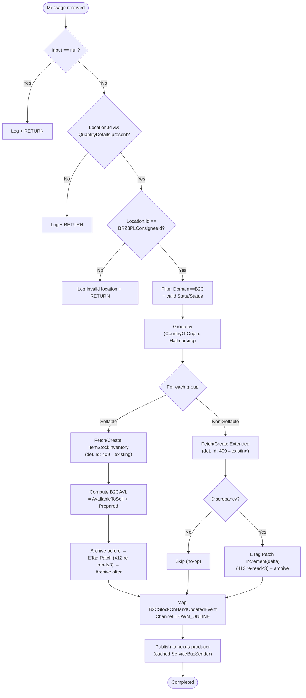

# inventory.StockOnHandUpdated - Technical Documentation

## 1. Overview

### Purpose
`inventory.StockOnHandUpdated` is a Kafka event that processes inventory
stock-quantity updates received from the WMS (Warehouse Management System). It
synchronizes B2C stock levels across inventory states and keeps accurate
stock-on-hand records for the BRAZIL 3PL (BRZ3PL) fulfilment location in the
IIS (Inventory Information System) Cosmos DB store.

### Business Objective
- Synchronize real-time inventory updates from the WMS into the IIS system.
- Maintain accurate B2C (Business-to-Consumer) stock-on-hand quantities across
  states (AVAILABLE, INSPECTION, AVAILABLETOSELL) and statuses (PREPARED,
  PICKABLE, HELD).
- Track inventory by product characteristics (Country of Origin, Hallmarking)
  and by the BRZ3PL fulfilment centre.
- Archive inventory state transitions for audit and historical tracking.
- Distinguish sellable from non-sellable inventory for downstream business
  logic and notify OMS of B2C stock changes.

### Scope
- Consumes `inventory.StockOnHandUpdated` from Kafka, relays it to the Azure
  Service Bus queue `stock-on-hand-updated`, and processes it on a
  session-enabled Service Bus consumer as `StockOnHandUpdatedEvent`.
- Handles **BRAZIL 3PL (BRZ3PL) only** — this event is **B2C-only** and carries
  **no B2B segmentation**.
- Filters items by specific state/status combinations and groups by
  (CountryOfOrigin, Hallmarking).
- Persists sellable and non-sellable inventory to Cosmos DB via ETag-guarded
  **Patch** operations and archives snapshots.
- Publishes a downstream B2C stock notification to the `nexus-producer` queue.

### High-Level Architecture

Matches the platform data flow in
[integration-resiliency.instructions.md](../ai/integration-resiliency.instructions.md):
a Kafka-to-Service-Bus relay hosted service, then a session-enabled Service Bus
consumer that calls the Application layer, which persists through the Cosmos DB
repository and archives through Blob Storage.

```
Kafka topic `inventory.StockOnHandUpdated`
                    ↓
   KafkaConsumerHostedServiceBase
     - correlation id / dedup id / type headers read + logged
     - schema + dynamic validation
     - cold-tier request audit (unconditional)
                    ↓
   Azure Service Bus queue `stock-on-hand-updated`
   (session-enabled: SessionId = {FulfilmentId}:{ItemCode};
    message ID deterministic from the Kafka key — never a fresh GUID)
                    ↓
   StockOnHandUpdatedServiceBusHostedService
   (ServiceBusConsumerHostedService<StockOnHandUpdatedEvent>)
     - envelope + payload deserialize, dynamic validation, cold-tier audit
                    ↓
          IStockOnHandUpdatedHandler.HandleAsync
                    ↓
    ┌───────────────────┬────────────────────┬─────────────────────┐
    ↓                   ↓                    ↓                     ↓
 Validation &      Case 1: Sellable     Case 2: Non-Sellable   Case 3: B2C
 Filtering         items (B2C)          items (extended)       stock notification
 (BRZ3PL, B2C,          ↓                    ↓                     ↓
  state/status)   ItemStockInventory   ItemStockInventory     nexus-producer
                  (ETag Patch)         Extended (ETag Patch)  (ServiceBusSender)
                    ↓                    ↓
        Cosmos DB (ETag-guarded Patch; 409-as-applied; 412 re-read/reapply)
        + MessageArchive (Cosmos, optional Blob cold-tier mirror)
```

Business logic never touches `CosmosClient`/`Container`/`ServiceBusSender`
directly — it goes through the repository abstractions and the application-layer
publish abstraction (see
[shared/service-bus-publishing.md](shared/service-bus-publishing.md)).

### Key Dependencies
- **`ItemStockInventoryRepository`** — B2C sellable inventory (Cosmos, BRZ3PL
  container, ETag-guarded Patch; cosmos §5a/§9).
- **`ItemStockInventoryExtendedRepository`** — non-sellable / extended-state
  inventory (Cosmos, ETag-guarded Patch).
- **`ItemRepository`** — product/item existence validation and creation.
- **`MessageArchiveRepository`** — snapshot archival (Cosmos + optional Blob).
- **Cached `ServiceBusSender`** — outbound B2C stock notification.
- Shared helpers: [cosmos-idempotent-write](shared/cosmos-idempotent-write.md),
  [service-bus-publishing](shared/service-bus-publishing.md),
  [b2c-extension-calculation](shared/b2c-extension-calculation.md),
  [inventory-formulas](shared/inventory-formulas.md),
  [icr-snapshot](shared/icr-snapshot.md),
  [country-code-lookup](shared/country-code-lookup.md),
  [archive-audit](shared/archive-audit.md).

### Assumptions
1. Incoming messages are valid `inventory.StockOnHandUpdated` objects
   deserializable to `StockOnHandUpdatedEvent`.
2. The B2C location being processed is always `ReflexConstants.BRZ3PLConsigneeId`.
3. Fulfilment code is consistently `ReflexConstants.BRZDC3PLFulfilmentId` for
   this location.
4. CountryOfOrigin and Hallmarking values are valid enums.
5. Product IDs exist or are created if missing.
6. Negative quantities are normalized to zero (see
   [inventory-formulas](shared/inventory-formulas.md)).
7. **Processing is idempotent** — a deterministic document `Id` plus
   ETag-guarded Patch make redelivery a no-op, not a duplicate/double-count (see
   [cosmos-idempotent-write](shared/cosmos-idempotent-write.md)).

---

## 2. End-to-End Flow

```
1. MESSAGE RECEPTION (Kafka consumer)
   ├─ inventory.StockOnHandUpdated deserialized → StockOnHandUpdatedEvent
   ├─ correlation/dedup/type headers logged
   ├─ schema + dynamic validation; cold-tier request audit
   └─ relay to Service Bus queue `stock-on-hand-updated`
        · SessionId = {FulfilmentId}:{ItemCode}
        · deterministic message ID from Kafka key (never a fresh GUID)

2. SERVICE BUS CONSUMPTION
   ├─ envelope + payload deserialize, dynamic validation, cold-tier audit
   └─ IStockOnHandUpdatedHandler.HandleAsync(StockOnHandUpdatedEvent)

3. VALIDATION & FILTERING
   ├─ null input → return (graceful, no mutation)
   ├─ Location.Id and QuantityDetails present? else return
   ├─ Location.Id == BRZ3PLConsigneeId? else return
   ├─ filter Domain == B2C AND valid State/Status combination
   └─ group by (CountryOfOrigin, Hallmarking)

4. FOR EACH GROUP
   4a. CASE 1 — SELLABLE ITEMS
       (AVAILABLE+PREPARED) OR (AVAILABLE+PICKABLE) OR (AVAILABLETOSELL+PICKABLE)
       ├─ build StockOnHandUpdatedRequest (FulfilmentCode, ItemCode,
       │  CountryOfOrigin, Hallmark, StateLevelQtyList, B2CAvailableToSell)
       ├─ set B2CAvailableToSell = qty where (AVAILABLETOSELL+PICKABLE)
       ├─ if StateLevelQtyList.Count > 0 → HandleSellableAsync:
       │    · fetch/create ItemStockInventory (deterministic Id; 409 → existing)
       │    · compute B2CAVL = B2CAvailableToSell + B2CPrepared
       │    · archive before, PERSIST via ETag-guarded Patch (Set/Increment),
       │      412 → re-read/reapply loop, archive after
       └─ else skip

   4b. CASE 2 — NON-SELLABLE ITEMS
       (AVAILABLE+HELD) OR (INSPECTION+PICKABLE)
       For each item:
       ├─ build ExtendedStockOnHandUpdatedRequest (Domain, State, normalized Qty)
       └─ HandleExtendedAsync:
            · fetch/create ItemStockInventoryExtended (deterministic Id; 409 → existing)
            · archive before; discrepancy = (Qty_old != Qty_new)?
            · if discrepancy → PERSIST via ETag-guarded Patch, archive after,
              QuantityDelta = Qty_new - Qty_old; else skip (no-op)

5. CASE 3 — B2C STOCK NOTIFICATION (OMS)
   ├─ map StockOnHandUpdatedEvent → B2CStockOnHandUpdatedEvent (Channel = OWN_ONLINE)
   ├─ wrap as Inventory_B2CStockOnHandUpdated
   └─ PUBLISH to `nexus-producer` via cached ServiceBusSender (after durable commit)

6. OUTCOME
   └─ no exception → Completed; ConcurrencyException/OperationCanceled → Abandoned;
      any other → DeadLettered (see cosmos-idempotent-write.md)
```

### Key Steps

| Step | Action | Input | Processing | Output |
|------|--------|-------|-----------|--------|
| 1 | Deserialize | Kafka/Service Bus message | JSON → StockOnHandUpdatedEvent | Event object (return if null) |
| 2 | Validate location | LocationId | Check == BRZ3PLConsigneeId | Continue / return |
| 3 | Filter items | QuantityDetails | Domain == B2C + valid state/status | Filtered list |
| 4 | Group items | Filtered items | GroupBy (CountryOfOrigin, Hallmarking) | Groups |
| 5 | Process sellable | Grouped items | Patch ItemStockInventory | Persisted + archived |
| 6 | Process non-sellable | Non-sellable items | Patch ItemStockInventoryExtended | Persisted + archived |
| 7 | Publish B2C notification | Event | Map + publish to nexus-producer | Downstream message |

---

## 3. Detailed Business Logic

### Business Rule 1: Location Filtering (BRZ3PL only)
**Purpose:** ensure only BRAZIL 3PL inventory updates are processed.

```
IF input.Location.Id != ReflexConstants.BRZ3PLConsigneeId THEN
  log informational message, RETURN (graceful exit)
END IF
```

This event is dedicated to the BRZ3PL fulfilment centre. Other locations have
different processing paths. `LocationId` must be non-null and match
`BRZ3PLConsigneeId` exactly; null/mismatch/empty all exit early.

### Business Rule 2: Domain and State/Status Filtering
**Purpose:** select only relevant B2C inventory items.

```
Filter items WHERE Domain == B2C AND (
    (State == AVAILABLE       AND Status == PREPARED) OR
    (State == AVAILABLE       AND Status == PICKABLE) OR
    (State == INSPECTION      AND Status == PICKABLE) OR
    (State == AVAILABLETOSELL AND Status == PICKABLE) OR
    (State == AVAILABLE       AND Status == HELD)
)
```

This is a **B2C-only** event — there is no B2B branch or B2B segmentation. Only
the listed state/status combinations are relevant: PREPARED (ready for picking),
PICKABLE (available for fulfilment), AVAILABLETOSELL (cleared for customer sale),
HELD (quality control / reserved). Unknown combinations are excluded; invalid
enum values surface as a processing error.

### Business Rule 3: Grouping by Characteristics
**Purpose:** track inventory separately per product characteristic.

```
GROUP filtered_items BY (CountryOfOrigin, Hallmarking)
```

Different origins carry different tax/compliance implications and hallmarking
indicates purity/certification. Each group is processed with its own composite
key. Null/default characteristic values are grouped separately.

### Business Rule 4: Sellable vs Non-Sellable Separation
**Purpose:** route inventory states through the appropriate repository.

```
Sellable      = (AVAILABLE+PREPARED) OR (AVAILABLE+PICKABLE) OR (AVAILABLETOSELL+PICKABLE)
Non-Sellable  = (AVAILABLE+HELD)     OR (INSPECTION+PICKABLE)
```

Sellable items update `ItemStockInventory`; non-sellable items require extended
tracking in `ItemStockInventoryExtended` (quality control, customs, reserved).
The two sets are mutually exclusive by design. A failure processing the sellable
set is logged and does not stop non-sellable processing (see §8).

### Business Rule 5: Quantity Normalization
**Purpose:** never store negative stock.

```
IF Quantity < 0 THEN Quantity = 0 ELSE Quantity = Quantity
```

Negative inventory indicates a data anomaly; zero is the safe floor. Delegated to
[inventory-formulas.md](shared/inventory-formulas.md); a resulting negative is a
business rejection, not a Cosmos error.

### Business Rule 6: B2C Available to Sell
**Purpose:** track inventory explicitly cleared for consumer sale.

```
B2CAvailableToSell = Quantity where (State == AVAILABLETOSELL AND Status == PICKABLE)
```

Selected with `FirstOrDefault` per category (design assumes at most one such line
per group) defaulting to `0`. Distinguishes cleared-for-sale stock from PREPARED
stock still in validation.

### Business Rule 7: Inventory Update and Archive (idempotent)
**Purpose:** maintain current state plus an audit trail without double-counting.

Each mutation follows the shared idempotent-write discipline in
[cosmos-idempotent-write.md](shared/cosmos-idempotent-write.md): a deterministic
document `Id`, first-write via `CreateAsync` with `409 Conflict` treated as
"already applied", and every subsequent mutation via **ETag-guarded `PatchAsync`**
(`Increment` for quantities, `Set` for scalars, ≤10 ops). Before/after snapshots
are archived via [archive-audit.md](shared/archive-audit.md) (best-effort; an
archive failure does not by itself fail the message). This is the fix for the
production **"double-counting inventory" / duplicate-entry / doubled-quantity**
symptom that came from `Guid.NewGuid()` Ids and last-write-wins replaces.

---

## 4. Calculation Logic

All quantity math is centralized in
[inventory-formulas.md](shared/inventory-formulas.md) and
[b2c-extension-calculation.md](shared/b2c-extension-calculation.md); increments
are applied with `PatchOperation.Increment`, never read-modify-write-replace.

### Calculation 1: B2C Available Inventory (B2CAVL)

```
B2CAVL = B2CAvailableToSell + B2CPrepared
```

- **B2CAvailableToSell** — quantity in (AVAILABLETOSELL + PICKABLE); default 0.
- **B2CPrepared** — quantity in (AVAILABLE + PREPARED); default 0.
- Integer arithmetic, no rounding; min 0, no enforced maximum; result never null.

| B2CAvailableToSell | B2CPrepared | B2CAVL |
|---|---|---|
| 50 | 30 | 80 |
| 0 | 45 | 45 |

### Calculation 2: Quantity Delta for Extended Inventory

```
QuantityDelta = CurrentQuantity - PreviousQuantity   (PreviousQuantity defaults to 0)
```

Used to detect discrepancy on non-sellable items; only when `Qty_old != Qty_new`
is a Patch applied.

| Previous | Current | Delta | Action |
|---|---|---|---|
| 100 | 150 | +50 | Patch Increment(+50) |
| 75 | 50 | −25 | Patch Increment(−25) |
| null (new) | 100 | +100 | create-if-missing then Increment(+100) |

---

## 5. Database Documentation

All Cosmos access follows
[cosmos-db.instructions.md](../ai/cosmos-db.instructions.md) and
[cosmos-idempotent-write.md](shared/cosmos-idempotent-write.md).

### 5.1 ItemStockInventory (Sellable B2C inventory — BRZ3PL container)
- **Partition key** `Category` = composite
  `FulfilmentId:ItemCode:Hallmark:CountryOfOrigin`.
- **Read:** point read `GetAsync(id, category)` within one partition.
- **Create (first write):** deterministic `Id`; `409 Conflict` → return existing
  (redelivery no-op).
- **Update:** **`PatchAsync`** with `IfMatchEtag`, `PatchOperation.Set` for
  `B2CAvailableToSell`/`B2CPrepared` (event-supplied absolute values) and
  `PatchOperation.Increment`/`Set` for `B2CAVL` per the formula, plus `.Set` for
  `ModifiedUtc`, **≤10 ops**. `412` → `ConcurrencyException` → §2
  re-read/reapply loop (max 3). **No last-write-wins** on any quantity field.

| Field | How derived |
|---|---|
| ItemCode | event `ProductId` |
| B2CAvailableToSell | from (AVAILABLETOSELL + PICKABLE) → Patch Set |
| B2CPrepared | from (AVAILABLE + PREPARED) → Patch Set |
| B2CAVL | B2CAvailableToSell + B2CPrepared → Patch |
| COO / Hallmark / FulfilmentId | from group key / request (BRZDC3PLFulfilmentId) |
| B2BAVL/B2BAllocated/B2BPrepared/B2BUsedShare/B2COrg/B2CExtended/B2CThreshold/PSC/B2CAVLAllocated | initialized 0 on create (this event is B2C-only) |
| IsExtended | initialized false |

### 5.2 ItemStockInventoryExtended (Non-Sellable B2C inventory)
- Composite key incl. State/Status:
  `ItemCode, Hallmark, FulfilmentId, CountryOfOrigin, State, Status`.
- **Create (first write):** deterministic `Id`; `409 Conflict` → existing.
- **Update:** ETag-guarded `PatchAsync` — `Increment` on `Qty` by the computed
  delta only when a discrepancy exists; otherwise a no-op. `412` → §2 loop.
- No hard delete — history retained via archive.

| Field | How derived |
|---|---|
| Qty | `request.Quantity` normalized (`max(0, quantity)`) → Patch Increment(delta) |
| COO / Hallmark / FulfilmentId | request (BRZDC3PLFulfilmentId) |
| State / Status | `request.State.State` / `request.State.Status` |

### 5.3 MessageArchive
Before/after snapshots via [archive-audit.md](shared/archive-audit.md)
(best-effort; deterministic archive id so redelivery does not create duplicate
rows; failure does not fail the message).

### 5.4 Transaction Flow & Concurrency
Cosmos has no multi-document transactions here; correctness comes from
per-document ETag Patch + the §2 retry loop and the deterministic-Id /
409-as-applied create path — **not** distributed transactions or last-write-wins.

---

## 6. State Changes & State Machine

### Sellable inventory

```
StockOnHandUpdatedEvent (BRZ3PL, B2C)
   ↓  filter + group (CountryOfOrigin, Hallmarking)
Fetch/Create ItemStockInventory (deterministic Id; 409 → existing)
   ↓  archive previous
Compute B2CAVL = B2CAvailableToSell + B2CPrepared
   ↓
Patch (ETag, Set/Increment)  ── 412 ─▶ re-read + reapply (≤3)
   ↓  archive new
Publish B2C notification (nexus-producer) after durable commit
   ↓
Final: sellable inventory updated exactly once
```

### Non-sellable (extended) inventory

```
Non-sellable item (AVAILABLE+HELD | INSPECTION+PICKABLE)
   ↓
Fetch/Create ItemStockInventoryExtended (deterministic Id; 409 → existing)
   ↓  archive previous
Discrepancy = (Qty_old != Qty_new)?
   ├─ No  → skip (no mutation)
   └─ Yes → Patch Increment(delta) (ETag) ── 412 ─▶ re-read + reapply (≤3)
             ↓  archive new
Final: extended inventory updated exactly once (or unchanged)
```

**Critical invariants:** no quantity goes negative; a redelivered message
produces no additional mutation (idempotent create + ETag Patch); the two paths
are independent — one failing does not corrupt the other.



---

## 7. API Documentation

### 7.1 Kafka message contract
Topic `inventory.StockOnHandUpdated`, mapped to `StockOnHandUpdatedEvent`:

```json
{
  "ProductId": "GOLD-BAR-001",
  "Channel": "OWN_ONLINE",
  "Location": { "Id": "BRZ3PLConsignee", "Name": "Brazil 3PL" },
  "QuantityDetails": [
    { "Domain": "B2C", "Quantity": 500,
      "State": { "State": "AVAILABLE", "Status": "PREPARED" },
      "CountryOfOrigin": "IN", "Hallmarking": "PURE" },
    { "Domain": "B2C", "Quantity": 300,
      "State": { "State": "AVAILABLETOSELL", "Status": "PICKABLE" },
      "CountryOfOrigin": "IN", "Hallmarking": "PURE" },
    { "Domain": "B2C", "Quantity": 50,
      "State": { "State": "INSPECTION", "Status": "PICKABLE" },
      "CountryOfOrigin": "IN", "Hallmarking": "PURE" }
  ]
}
```

| Field | Type | Required | Description |
|-------|------|----------|-------------|
| ProductId | string | Yes | Unique product identifier (→ ItemCode) |
| Location.Id | string | Yes | Must be `BRZ3PLConsigneeId` |
| Location.Name | string | No | Display name |
| QuantityDetails | array | Yes | Quantity records by state |
| QuantityDetails[].Domain | enum | Yes | Must be `B2C` |
| QuantityDetails[].Quantity | int | Yes | Count (negative normalized to 0) |
| QuantityDetails[].State.State | enum | Yes | AVAILABLE / INSPECTION / AVAILABLETOSELL |
| QuantityDetails[].State.Status | enum | Yes | PREPARED / PICKABLE / HELD |
| QuantityDetails[].CountryOfOrigin | enum | Yes | Country of origin |
| QuantityDetails[].Hallmarking | enum | Yes | Hallmark certification |

### 7.2 Inbound Service Bus contract
Queue `stock-on-hand-updated`, `ServiceBusRelayEnvelope` wrapping the event;
session-enabled with `SessionId = {FulfilmentId}:{ItemCode}`; deterministic
`MessageId` derived from the Kafka key (never a fresh GUID); correlation headers
per [service-bus-publishing.md](shared/service-bus-publishing.md).

### 7.3 Outbound Service Bus contract (B2C stock notification)
Queue `nexus-producer` (old constant `NEXUS_PRODUCER_QUEUE_NAME`, for
traceability only — resolved from config, not used as a live literal). The
handler maps `StockOnHandUpdatedEvent` → `B2CStockOnHandUpdatedEvent`
(`Channel = OWN_ONLINE`), wraps it as `Inventory_B2CStockOnHandUpdated`, and
publishes via the cached `ServiceBusSender` **after** the Cosmos write is durably
committed. This is the fully implemented replacement for the previous "send to
Nexus Producer" TODO. See [service-bus-publishing.md](shared/service-bus-publishing.md).
The full-availability ICR snapshot path
([icr-snapshot.md](shared/icr-snapshot.md)) publishes
`Inventory_OmniInventoryAvailabilityReported` to `nexus-producer` when
`ENABLE_SNAPSHOT_FOR_ICR` is enabled.

### 7.4 Validation

| Field | Rule | Handling |
|---|---|---|
| Input | not null | return early (graceful) |
| Location / QuantityDetails | not null | return early |
| Location.Id | == BRZ3PLConsigneeId | return early on mismatch |
| Domain | == B2C | non-B2C excluded from filter |
| State/Status | valid enum + allowed combination | invalid excluded / rejected |
| Quantity | integer | normalized (`max(0, qty)`) |
| poison / schema-invalid payload | not deserializable | DeadLettered |

---

## 8. Error Handling & Retry Mechanisms

- **Validation / poison payload** → DeadLettered (hot-tier dead-letter container).
- **Graceful business exits** (null input, missing fields, non-BRZ3PL location,
  empty filtered set) → logged and returned; the message is **Completed** (no
  mutation, nothing to retry).
- **Per-case isolation:** a failure in the sellable path is logged and does not
  stop the non-sellable path (and vice versa); a B2C-notification failure does
  not undo the inventory write.
- **Cosmos 412 (ETag)** → `ConcurrencyException` → §2 re-read/reapply loop (≤3);
  if exhausted → Abandoned (redelivered up to `MaxDeliveryCount`).
- **Cosmos 429** → Cosmos SDK retry (`MaxRetryAttemptsOnRateLimitedRequests`).
- **Service Bus publish transient** → `service-bus-publish` Polly pipeline
  ([service-bus-publishing.md](shared/service-bus-publishing.md)).
- **`OperationCanceledException`** → Abandoned.
- **Any other exception** → DeadLettered (`Reason` = type, `Description` =
  `ex.ToString()`).

Message outcome mapping (no exception → **Completed**;
`ConcurrencyException`/`OperationCanceledException` → **Abandoned**; any other →
**DeadLettered**) is the definitive table in
[cosmos-idempotent-write.md](shared/cosmos-idempotent-write.md) — not restated
here.

---

## 9. Security & Configuration

### Authentication
- Cosmos DB and Service Bus use **connection strings** sourced from Azure Key
  Vault and delivered as a **Kubernetes Secret**; local dev uses the emulator /
  user-secrets. This is the deliberate documented standard (cosmos §1/§14,
  engineering-standards §6) — **not** Managed Identity / Workload Identity.
- No secrets, connection strings, or keys are logged.

### Feature flags
| Flag | Default | Purpose |
|---|---|---|
| ENABLE_SNAPSHOT_FOR_ICR | false | Publish ICR availability snapshot (icr-snapshot.md) |

### Queue names (kebab-case, config-resolved)
| Queue | Old constant | Direction |
|---|---|---|
| `stock-on-hand-updated` | STOCK_ON_HAND_UPDATED_REFLEX_QUEUE_NAME | inbound (relay) |
| `nexus-producer` | NEXUS_PRODUCER_QUEUE_NAME | outbound (B2C notification / ICR) |

### Fixed values
| Setting | Value |
|---|---|
| Location ID | `BRZ3PLConsigneeId` (only location processed) |
| Fulfilment code | `BRZDC3PLFulfilmentId` |
| Channel for B2C | `OWN_ONLINE` |
| Quantity floor | 0 (negatives normalized) |

### Data protection
TLS in transit; Cosmos encryption at rest; archived payloads carry business data
only (no secrets). Country/market values resolve via
[country-code-lookup.md](shared/country-code-lookup.md) with a fail-safe
`CountryCode.UNKNOWN` fallback.

---

## 10. Known Limitations & Future Improvements

### Current Limitations
- Integer quantities only (no fractional units); no upper-bound / anomaly check
  on very large quantities.
- `B2CAvailableToSell` uses `FirstOrDefault` per category — assumes at most one
  (AVAILABLETOSELL + PICKABLE) line per group; additional lines are not summed.
- Extended inventory with no discrepancy is skipped (by design).
- No max-size guard on the `QuantityDetails` array.

### Potential Improvements
- Cache product-existence checks and inventory lookups within one message
  (multiple lines share the same product).
- Sum, rather than `FirstOrDefault`, for `B2CAvailableToSell` if multiple
  qualifying lines become valid.
- Evaluate bounded parallel group processing within one message, preserving
  per-aggregate ordering via the session.
- Add anomaly detection for unusual quantity spikes.

> The previous version listed the B2C-to-Nexus notification as a `TODO` and
> flagged "no idempotency / double-counting on concurrent or duplicate
> messages" and "last write wins" as risks. All are now resolved by design: the
> B2C notification is an implemented publish through the cached `ServiceBusSender`
> to `nexus-producer` (§7.3), and redelivery/concurrency are handled by
> deterministic Id + 409-as-applied + ETag Patch + the §2 re-read/reapply loop
> ([cosmos-idempotent-write.md](shared/cosmos-idempotent-write.md)).

---

## 11. Summary

`inventory.StockOnHandUpdated` synchronizes **B2C-only, BRZ3PL** stock-on-hand
updates on the AKS pipeline: it consumes from Kafka, relays to the
session-enabled `stock-on-hand-updated` Service Bus queue, validates and filters
to BRZ3PL/B2C items, groups by (CountryOfOrigin, Hallmarking), and updates
sellable and non-sellable inventory in Cosmos DB.

**Key business logic:** location filtering to BRZ3PL; B2C domain and
state/status filtering (no B2B segmentation); sellable vs non-sellable routing;
quantity normalization to a zero floor; `B2CAVL = B2CAvailableToSell +
B2CPrepared`; before/after archival.

**Database updates:** ETag-guarded **Patch** (`Set`/`Increment`, ≤10 ops) on
`ItemStockInventory` and `ItemStockInventoryExtended`, with deterministic Id +
409-as-applied and the §2 412 re-read/reapply loop — this is the fix for the
duplicate-entry / doubled-quantity production problem (no last-write-wins).

**Downstream:** the B2C stock notification (`Inventory_B2CStockOnHandUpdated`,
`Channel = OWN_ONLINE`) and the optional ICR snapshot are published to
`nexus-producer` via the cached `ServiceBusSender` after the Cosmos write
commits.

**Risks & recommendations:** concurrency conflicts should be rare with sessions
in place; monitor dead-letter counts and Cosmos 429 rates; revisit the
`FirstOrDefault` assumption for `B2CAvailableToSell` and cache rarely-changing
lookups.

---

**Document Version:** 2.0 (AKS / k8s)
**Status:** Regenerated
