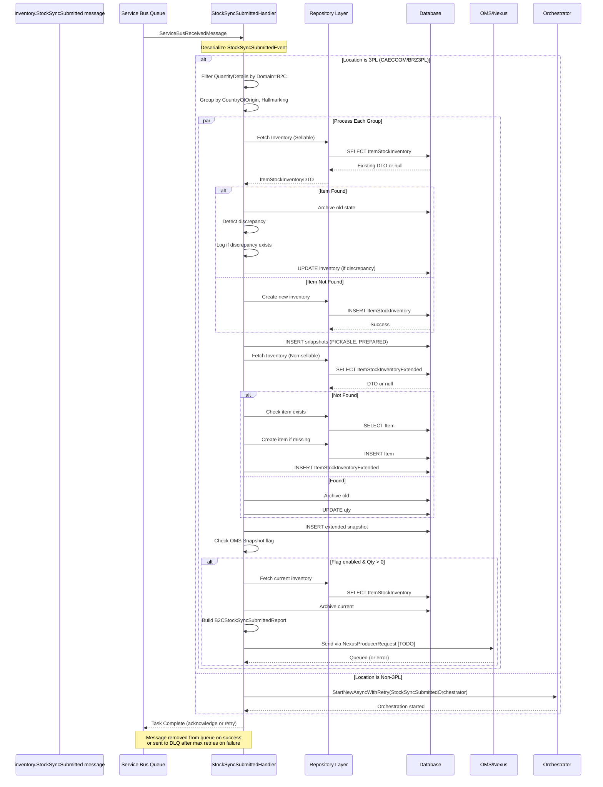

# inventory.StockSyncSubmitted - Technical Documentation

## 1. Overview

### Purpose of the Feature/Module
The **inventory.StockSyncSubmitted** is a kafka event that processes inventory synchronization events from external systems (specifically 3PL fulfillment centers and OMS). It acts as the primary integration point for keeping the IIS WMS inventory system synchronized with real-time stock levels from fulfillment locations.

### Business Objective
- **Real-time Inventory Sync**: Maintain accurate inventory levels across multiple fulfillment centers (CAECCOM, BRZ3PL)
- **Inventory Classification**: Separate handling of sellable (B2C/B2B) vs. non-sellable inventory
- **Discrepancy Detection**: Identify and log inventory mismatches between IIS and source systems
- **OMS Integration**: Send synchronized inventory snapshots to Order Management System for order fulfillment decisions
- **Audit Trail**: Archive all inventory changes for compliance and troubleshooting

### Scope
- `inventory.StockSyncSubmitted` from Kakfa via Consumer Group: `$Default` and deserialized to `StockSyncSubmittedEvent` messages and send to Service Bus Queue
- Processes `StockSyncSubmittedEvent` messages from the Service Bus queue
- Handles inventory updates at the item-location-hallmarking-country level
- Manages state/status combinations: AVAILABLE→PREPARED, AVAILABLE→PICKABLE, INSPECTION→PICKABLE, AVAILABLETOSELL→PICKABLE, AVAILABLE→HELD
- Routes to orchestrator for non-3PL locations
- Supports CA (Canada) and BR (Brazil) markets

### High-Level Architecture

```
Kafka (inventory.StockSyncSubmitted)
        ↓
Service Bus (StockSyncSubmittedEvent)
        ├─→ 3PL Location Check (CAECCOM/BRZ3PL)
        │   ├─→ Sellable Items Processing
        │   │   ├─→ stockSyncSubmitted3PLEventHandlerAsync
        │   │   ├─→ Update Inventory Repository
        │   │   └─→ Save Snapshots
        │   └─→ Non-Sellable Items Processing
        │       ├─→ extendedStockSyncSubmitted3PLEventHandlerAsync
        │       ├─→ Fetch/Create Inventory
        │       └─→ Archive Changes
        └─→ Non-3PL Location
            └─→ StockSyncSubmittedOrchestrator (Durable Function)

Database Updates: ItemStockInventory, SnapshotStockSyncItem, ItemDiscrepencyDetail, MessageArchive
OMS Integration: B2CStockSyncSubmittedReport (via Nexus Producer)
```

### Assumptions
1. **Kafka Input**: Kafka incoming messages are valid `inventory.StockSyncSubmitted` kafka object
2. **Service Bus**: Serialize `inventory.StockSyncSubmitted`to `StockSyncSubmittedEvent` objects and send to Service Bus Queue
3. **Event Format**: message is a valid `StockSyncSubmittedEvent` object
4. **Location Mapping**: BRZ3PLConsigneeId maps to BRZDC3PLFulfilmentId internally
5. **Item Existence**: Items may not exist in IIS master data; missing items will be auto-created
6. **Inventory Uniqueness**: Inventory is unique by (ItemCode, Hallmark, FulfilmentCode, CountryOfOrigin, State, Status)
7. **Negative Quantities**: Negative quantities are normalized to 0 (never negative in final state)
8. **Snapshot Consistency**: Snapshots are saved regardless of inventory update success/failure
9. **Error Handling**: Non-sellable item failures do not stop processing of other items; overall handler failures re-throw

### Dependencies

| Component | Purpose | Type |
|-----------|---------|------|
| `IItemStockInventoryExtendedRepository` | Extended inventory read operations | Interface |
| `ISnapshotStockSyncItemRepository` | Save inventory snapshots | Interface |
| `IItemRepository` | Item master data CRUD | Interface |
| `IMessageArchiveRepository` | Archive inventory state changes | Interface |
| `IItemStockInventoryRepository` | Standard inventory CRUD | Interface |
| `IItemStockIntransitRepository` | In-transit inventory tracking | Interface |
| `IItemLevelSegmentationRepository` | Item-level segmentation logic | Interface |
| `IFulfilmentLevelSegmentationRepository` | Fulfillment-level segmentation | Interface |
| `IItemDiscrepencyDetailRepository` | Discrepancy logging | Interface |
| `ICorrelationContextAccessor` | Distributed tracing context | Interface |
| `ServiceBusReceivedMessage` | Trigger input from queue | Framework |
| `DurableTaskClient` | Durable Function orchestration | Framework |
| `ApplicationConfig` | Configuration (queue names, feature flags) | Config |

---

## 2. End-to-End Flow

### Complete Execution Flow: Request to Response

```
┌─────────────────────────────────────────────────────────────────────┐
│ 1. MESSAGE ARRIVAL & DESERIALIZATION                               │
└─────────────────────────────────────────────────────────────────────┘
   Kafka inventory.StockSyncSubmitted message arrives
                        ↓
   Deserialize to StockSyncSubmittedEvent
   - ProductId: Item identifier
   - Location: Fulfillment location {Id, Name, Entity}
   - QuantityDetails: Array of inventory with State/Status
   - SyncDate: Timestamp of synchronization
   - CountryOfOrigin: COO code
   - Hallmarking: Hallmarking details

┌─────────────────────────────────────────────────────────────────────┐
│ 2. INITIAL LOGGING                                                  │
└─────────────────────────────────────────────────────────────────────┘
   Log: "Processing StockSyncSubmittedEvent for ProductId: X, LocationId: Y"
   Context: Product ID, Location ID

┌─────────────────────────────────────────────────────────────────────┐
│ 3. LOCATION ROUTING DECISION                                        │
└─────────────────────────────────────────────────────────────────────┘
   IF Location.Id == CAECCOM OR Location.Id == BRZ3PLConsigneeId
   │
   ├─→ YES: Process as 3PL Inline (THIS HANDLER)
   │         ├─→ Filter Quantity Details by Domain=B2C
   │         └─→ Apply State/Status Filters
   │
   └─→ NO:  Delegate to Orchestrator
            └─→ START StockSyncSubmittedOrchestrator with retry logic

┌─────────────────────────────────────────────────────────────────────┐
│ 4. 3PL INLINE PROCESSING                                            │
└─────────────────────────────────────────────────────────────────────┘
   Set fulfilmentId = (BRZ3PLConsigneeId → BRZDC3PLFulfilmentId : Location.Id)

   Group filtered QuantityDetails by (CountryOfOrigin, Hallmarking)
   
   FOR EACH GROUP:
   
   A. SELLABLE INVENTORY BRANCH
      ├─→ Filter: (AVAILABLE→PREPARED) OR (AVAILABLE→PICKABLE)
      ├─→ Extract: avlPickableQnty, b2BPreparedQty
      ├─→ Validate & Log Quantity Changes (Qty < 0 → 0)
      ├─→ Call stockSyncSubmitted3PLEventHandlerAsync()
      │   ├─→ Fetch existing inventory from DB
      │   ├─→ Compare B2CAVL: IIS value vs. incoming value
      │   ├─→ IF DISCREPANCY: Log discrepancy details
      │   ├─→ Update: B2CAVL, B2CPrepared, B2CAvailableToSell (BR only)
      │   ├─→ Archive previous state
      │   └─→ Save snapshot (B2C.PICKABLE, B2C.PREPARED)
      └─→ RETURN: Success flag
   
   B. NON-SELLABLE INVENTORY BRANCH
      FOR EACH non-sellable item with (AVAILABLE→HELD) OR (INSPECTION→PICKABLE):
      ├─→ Call extendedStockSyncSubmitted3PLEventHandlerAsync()
      │   ├─→ Fetch existing extended inventory
      │   ├─→ IF NOT FOUND:
      │   │   ├─→ Validate item exists in master; create if missing
      │   │   ├─→ Create new ItemStockInventoryExtendedDTO
      │   │   ├─→ Update inventory
      │   │   ├─→ Archive
      │   │   └─→ Save snapshot (returns Qty since previous = 0)
      │   ├─→ ELSE:
      │   │   ├─→ Archive previous state
      │   │   ├─→ Compare Qty with existing
      │   │   ├─→ IF DISCREPANCY: Update + Archive
      │   │   ├─→ Save snapshot
      │   │   └─→ Return (new Qty - previous Qty)
      └─→ ON ERROR: Log exception, continue to next item

   C. OMS SNAPSHOT BRANCH (Conditional)
      IF enableSnapshotTowardsOMS == true:
      (Default true, unless ENABLE_SNAPSHOT_TOWARDS_OMS_BRZ3PL is disabled for BRZ)
      ├─→ Build B2CStockSyncSubmittedEvent
      │   ├─→ ProductId, Location, Hallmarking, CountryOfOrigin
      │   ├─→ Set Market = (BRZDC3PLFulfilmentId → BR : CA)
      │   └─→ Update Location.Id to fulfilmentId for BRZ
      ├─→ Call b2cStockSyncSubmittedOmsEventHandlerAsync()
      │   ├─→ Fetch latest inventory from DB
      │   ├─→ Archive current state
      │   ├─→ Validate B2CAVL > 0 (or CAECCOM exemption)
      │   ├─→ Build B2CStockSyncSubmittedReport with:
      │   │   ├─→ ProductUnits from config
      │   │   ├─→ Market (CA/BR)
      │   │   ├─→ QuantityDetails with AVAILABLE→PICKABLE state
      │   │   └─→ Location mapping (BRZDC3PLFulfilmentId → BRZ3PLConsigneeId)
      │   └─→ Prepare NexusProducerRequest for Nexus Service Bus Queue [TODO]
      └─→ ON ERROR: Log exception, continue to next group

┌─────────────────────────────────────────────────────────────────────┐
│ 5. ERROR HANDLING & COMPLETION                                      │
└─────────────────────────────────────────────────────────────────────┘
   TRY-CATCH Wrapper:
   ├─→ ON SUCCESS: Return async Task (implicit)
   ├─→ ON EXCEPTION:
   │   ├─→ Log error with context (ProductId, LocationId, orderId="")
   │   └─→ RE-THROW exception (allows Service Bus DLQ handling)
   └─→ Service Bus acknowledges message based on completion status

```

### Input Validation

| Field | Validation | Error Handling |
|-------|-----------|-----------------|
| `message` | Must be valid ServiceBusReceivedMessage | Framework handles (poison queue) |
| `StockSyncSubmittedEvent` | Deserialized from message body | Logged as null if missing |
| `Location.Id` | Checked against known fulfillment IDs | Routed to orchestrator if unknown |
| `ProductId` | Checked in item master data | Auto-created if missing with log warning |
| `QuantityDetails` | Filtered by Domain=B2C and State/Status | Empty filtered lists silently skip processing |
| `Quantity` | Normalized: negative → 0 | Applied silently before storage |

### Service Layer Execution

The handler follows a layered architecture:

1. **Trigger Layer** (`inventory.StockSyncSubmitted` kafka consumer): Routes incoming events
2. **Handler Layer** (Async methods): Process event business logic
   - `stockSyncSubmitted3PLEventHandlerAsync()`: Sellable inventory
   - `extendedStockSyncSubmitted3PLEventHandlerAsync()`: Non-sellable inventory
   - `b2cStockSyncSubmittedOmsEventHandlerAsync()`: OMS synchronization
3. **Repository Layer**: Database persistence via injected interfaces
4. **Helper Layer**: Common operations (build DTO, fetch inventory, archive)

### Business Logic Processing

**For Sellable Items:**
- Extracts PREPARED and PICKABLE quantities at item-hallmarking-country level
- Detects discrepancies between IIS current B2CAVL and incoming value
- Updates inventory only if changed (IISAvlQty != avlPickableQnty)
- Archives before update for audit trail
- Saves snapshots with QuantityType = "B2C.PICKABLE" / "B2C.PREPARED"

**For Non-Sellable Items:**
- Processes HELD and INSPECTION→PICKABLE items separately
- Each state/status combination creates separate inventory record
- Validates master data existence, auto-creates missing items
- Calculates delta (new Qty - previous Qty) for audit

**For OMS Sync:**
- Checks if B2CAVL > 0 (exemption: CAECCOM)
- Builds report with market-specific data (CA/BR)
- Maps location ID back to source ID for BRZ
- Prepares for Nexus Producer dispatch [currently stubbed]

### Database Interactions

**Read Operations:**
```
GetInventoryByCategory(itemCode, hallmark, fulfilmentCode, coo, state, status)
  → ItemStockInventoryExtendedDTO or ItemStockInventoryDTO
  → Used to detect existing inventory for delta calculation
```

**Insert Operations:**
```
AddProductAsync(itemCode)
  → Creates missing item in master data
  → Called when inventory references non-existent item

SaveSnapshotDetails(snapshotList)
  → Inserts SnapshotStockSyncItemDTO records
  → One record per item-hallmark-coo-state-status combination
```

**Update Operations:**
```
UpdateStockInventoryAsync(dto)
  → Updates existing inventory record
  → Changes: B2CAVL, B2CPrepared, B2CAvailableToSell, Qty (extended)
  → Only called if discrepancy exists or first-time insert

SaveItemDiscrepencyDetailAsync(dto, fulfilmentCode)
  → Logs discrepancy record (IIS Qty vs. Reflex Qty)
  → Called when B2CAVL != avlPickableQnty
```

**Archive Operations:**
```
ArchiveMessageAsync(dto)
  → Copies current inventory state to audit/archive table
  → Called before every update to preserve history
```

### External API Calls
Currently stubbed:
```
NexusProducerRequest → NEXUS_B2CSTOCK_PRODUCER_QUEUE_NAME
  [TODO] Send B2CStockSyncSubmittedReport via Service Bus
```

### Cache Usage
No caching implemented. All reads hit database directly.

### Event/Message Queue Interactions

**Input Queue:**
- Name: `inventory.StockSyncSubmitted` (kafka)
- Message Type: serialize to `StockSyncSubmittedEvent`

**Output Queues:**
- `NEXUS_B2CSTOCK_PRODUCER_QUEUE_NAME`: Sends B2CStockSyncSubmittedReport [TODO]
- Durable Function Orchestrator: `StockSyncSubmittedOrchestrator` (for non-3PL locations)

### Response Generation
No direct HTTP response (async void Function). Completion status:
- **Success**: Message acknowledged by Service Bus
- **Failure**: Exception re-thrown → Message sent to DLQ after retries

### Error Handling

| Scenario | Handler | Outcome |
|----------|---------|---------|
| Input message is null | Null check + log information | Continue (implicit success) |
| Item master data missing | Log warning + auto-create | Continue with new item |
| Inventory not found (new item) | Create new DTO + insert | Return quantity inserted |
| Inventory exists (update) | Archive + update if changed | Return delta (new - old) |
| Non-sellable handler fails | Catch + log error + continue | Next item processed |
| OMS handler fails | Catch + log error + continue | Next group processed |
| Orchestrator routing fails | Re-throw | Service Bus DLQ |

### Retry Mechanism

**Service Bus Level:**
- Default retry policy (configurable)
- Max delivery count before DLQ

**Application Level:**
- No explicit retry for repository calls
- Failures propagated to caller

### Logging

**Information Level:**
- Processing start: ProductId, LocationId
- No-discrepancy scenarios
- Processing completion

**Error Level:**
- Item master data missing
- Discrepancy detection (logged but not thrown)
- Non-sellable handler failures
- OMS handler failures

All logs include:
- Event context (ProductId, Hallmarking, CountryOfOrigin)
- Previous vs. current values (for discrepancies)
- Order ID: "" (empty by design)

### Monitoring

**Key Metrics to Monitor:**
1. Message processing rate (messages/second)
2. Processing latency (time from queue arrival to completion)
3. Discrepancy rate (% of messages with qty mismatches)
4. Non-sellable failure rate
5. OMS sync failure rate
6. Orchestrator routing rate (% non-3PL locations)
7. DLQ message count
8. Auto-created items rate

**Alert Triggers:**
- Sustained high DLQ rate
- >50% of messages have discrepancies
- OMS sync failures >10%
- Processing latency >30 seconds

---

## 3. Detailed Business Logic

### Business Rule 1: Inventory Routing by Location

**Why it Exists:**
CAECCOM and BRZ3PL locations require immediate, inline processing with simple B2C logic. Other locations (ADC, PDC, etc.) require complex orchestration and fulfillment calculations handled by the orchestrator.

**Inputs:**
- `Location.Id` from StockSyncSubmittedEvent

**Processing:**
```
IF Location.Id IN [CAECCOM, BRZ3PLConsigneeId]
  THEN: Process inline (3PL branch)
  ELSE: Route to StockSyncSubmittedOrchestrator with durable function
```

**Decision Points:**
- Location ID exact match against constants
- Mapping: BRZ3PLConsigneeId → BRZDC3PLFulfilmentId (for consistency)

**Outputs:**
- 3PL: Inline processing completes
- Non-3PL: Durable function orchestrated (async, separate track)

**Validation Rules:**
- Location must be non-null
- Location.Id must be string

**Edge Cases:**
- Unknown location ID: Treated as non-3PL → routed to orchestrator (safe default)
- Null location: Would throw NullReferenceException before check (input validation failure)

**Failure Scenarios:**
- Orchestrator unavailable: Durable function framework handles retries
- Invalid location mapping: Could route wrong location to orchestrator (detected by orchestrator logic)

---

### Business Rule 2: Inventory State/Status Filtering

**Why it Exists:**
Only specific inventory combinations (sellable and non-sellable states) should be processed. States like UNAVAILABLE or DEFECTIVE are excluded. The Domain filter (B2C only) separates consumer from business channels.

**Inputs:**
- `QuantityDetails[].Domain`
- `QuantityDetails[].State.State` (AVAILABLE, INSPECTION, AVAILABLETOSELL)
- `QuantityDetails[].State.Status` (PREPARED, PICKABLE, HELD)

**Processing:**

**Sellable Inventory Filter:**
```
Domain == B2C AND (
  (State == AVAILABLE AND Status == PREPARED) OR
  (State == AVAILABLE AND Status == PICKABLE) OR
  (State == INSPECTION AND Status == PICKABLE) OR
  (State == AVAILABLETOSELL AND Status == PICKABLE) OR
  (State == AVAILABLE AND Status == HELD)
)
```

**Grouping:**
- Group by (CountryOfOrigin, Hallmarking)
- One handler call per group

**Non-Sellable Extraction (from same group):**
```
(State == AVAILABLE AND Status == HELD) OR
(State == INSPECTION AND Status == PICKABLE)
```

**Outputs:**
- `itemDetails`: List of filtered groups
- Per group: Separate sellable and non-sellable items

**Validation Rules:**
- Domain must be an InventoryDomain enum
- State and Status must be valid enums
- Quantity must be numeric (negative normalized to 0)

**Edge Cases:**
- Empty filtered list: Loop skipped silently (no error, no snapshot created)
- All quantities negative: Normalized to 0, snapshot still created
- Mixed domains in input: Only B2C processed; B2B silently ignored

**Failure Scenarios:**
- Invalid enum values: Would throw during deserialization before reaching this code
- Null QuantityDetails: NullReferenceException (input validation failure)

---

### Business Rule 3: Quantity Discrepancy Detection & Logging

**Why it Exists:**
Mismatches between IIS inventory and external source inventory indicate sync failures, stock loss, or data corruption. Logging enables root cause analysis and operational visibility.

**Inputs:**
- `IISAvlQty`: Current B2CAVL from database
- `avlPickableQnty`: Incoming AVAILABLE→PICKABLE quantity

**Processing:**
```
discrepancyExists = (IISAvlQty != avlPickableQnty)

IF discrepancyExists THEN:
  SaveItemDiscrepencyDetailDto {
    IISAvlQty: previous B2CAVL,
    ReflexAvlQty: incoming avlPickableQnty,
    ItemCode: request.ItemCode,
    CountryOfOrigin: request.CountryOfOrigin,
    Hallmark: request.Hallmark,
    MasterDataExists: isItemValid
  }
  AWAIT _itemDiscrepencyDetailRepository.SaveItemDiscrepencyDetailAsync(dto, fulfilmentCode)
```

**Decision Points:**
- Numeric equality check: == comparison
- Master data validation flag: Included in discrepancy record

**Outputs:**
- Discrepancy record saved to database
- Informational log message

**Validation Rules:**
- Quantities must be numeric (null treated as 0)
- Discrepancy logged even if item master data is missing

**Edge Cases:**
- Both quantities zero: No discrepancy
- IIS has 0, incoming has quantity: Discrepancy logged, inventory created
- IIS has quantity, incoming has 0: Discrepancy logged, inventory zeroed
- Negative incoming quantity: Normalized to 0 before comparison

**Failure Scenarios:**
- Database unavailable: SaveItemDiscrepencyDetailAsync throws → logged but continues
- Invalid location/fulfillment code: Discrepancy record incomplete → visual in database

---

### Business Rule 4: New vs. Existing Inventory Handling

**Why it Exists:**
First-time inventory sync (new item/location) must create records. Subsequent syncs must update existing records with delta tracking. Different paths ensure idempotency and audit trails.

**Inputs:**
- `ExtendedStockSyncSubmittedRequest` with item/location/hallmark/coo
- `ItemStockInventoryExtendedDTO` from database (null = new)

**Processing:**

**NEW INVENTORY PATH:**
```
IF existing == NULL THEN:
  1. Check item in master data: CheckItemCodeExistsAsync(itemCode)
     IF not exists:
       - Log warning: "ItemCode X is invalid"
       - Create item: AddProductAsync(itemCode)
     ENDIF
  2. Build new DTO: BuildInventoryDTO(request)
     itemStockInventoryExtendedDTO {
       ItemCode, Qty, COO, FulfilmentId, Hallmark, State, Status
     }
  3. Update DB: UpdateStockInventoryAsync(newDTO)
  4. Archive: ArchiveMessageAsync(newDTO)
  5. Save snapshot
  6. RETURN: request.Quantity (delta = Qty - 0)
ENDIF
```

**EXISTING INVENTORY PATH:**
```
IF existing != NULL THEN:
  1. Capture previous state: previousQty = existing.Qty
  2. Archive: ArchiveMessageAsync(existing)
  3. Detect discrepancy: existing.Qty != request.Quantity
  4. Update: existing.Qty = request.Quantity
  5. IF discrepancy THEN:
       UpdateStockInventoryAsync(existing)
     ELSE:
       Skip update (already matches)
  6. Save snapshot
  7. RETURN: request.Quantity - previousQty (delta)
ENDIF
```

**Decision Points:**
- Null check: existing == null
- Discrepancy check: existing.Qty != request.Quantity
- Update decision: Only update if changed (optimization)

**Outputs:**
- New: Inventory created + snapshot saved
- Existing: Inventory updated IF changed + snapshot saved
- Return: Quantity change delta

**Validation Rules:**
- Item must exist in master data (auto-created if missing)
- Request must have valid Quantity (>=0)

**Edge Cases:**
- Item created during processing: Archived immediately
- No change between old and new: Snapshot still created, update skipped
- Negative quantity normalized: Applied before comparison and storage

**Failure Scenarios:**
- Master data creation fails: Logged, continue anyway
- Update fails: Exception thrown, item skipped
- Archive fails: Exception thrown, item skipped

---

### Business Rule 5: Negative Quantity Normalization

**Why it Exists:**
Inventory quantities must never be negative. External systems sometimes send negative values due to correction events or data sync failures. Normalization prevents negative stock scenarios and aligns with business rules (minimum inventory = 0).

**Inputs:**
- `Quantity` from request or QuantityDetail

**Processing:**
```
normalizedQty = quantity < 0 ? 0 : quantity
```

**Applied At:**
- Sellable item extraction: `.Select(i => i.Quantity < 0 ? 0 : i.Quantity)`
- Non-sellable item extraction: `i.Quantity = i.Quantity < 0 ? 0 : i.Quantity`
- Before storing in database

**Decision Points:**
- Numeric comparison: < 0
- Ternary assignment: Replace with 0 if true

**Outputs:**
- Normalized quantity stored in database
- Original negative value not persisted

**Validation Rules:**
- Applied universally to all quantities
- No business rule exemptions

**Edge Cases:**
- Zero quantity: Passed through unchanged
- Large negative value: All treated same (→ 0)

**Failure Scenarios:**
- None; normalization always succeeds

---

### Business Rule 6: OMS Snapshot Conditional Send

**Why it Exists:**
OMS needs current inventory for order fulfillment decisions. BRZ3PL has a feature flag to disable OMS sync during data migrations. CAECCOM always syncs. The snapshots are only meaningful for items with available inventory (B2CAVL > 0).

**Inputs:**
- `fulfilmentId` (CAECCOM or BRZDC3PLFulfilmentId)
- `enableSnapShotTowardsOMS` feature flag
- `itemStockInventoryDto.B2CAVL` (current available quantity)

**Processing:**
```
enableSnapShotTowardsOMS = (
  fulfilmentId == BRZDC3PLFulfilmentId AND !ENABLE_SNAPSHOT_TOWARDS_OMS_BRZ3PL
) ? false : true

IF enableSnapShotTowardsOMS THEN:
  market = (fulfilmentId == BRZDC3PLFulfilmentId) ? BR : CA
  
  IF fulfilmentId == BRZDC3PLFulfilmentId:
    Update input.Location.Id = fulfilmentId  // Map BRZ3PLConsigneeId back to BRZDC3PLFulfilmentId
  
  Build B2CStockSyncSubmittedEvent
  
  Validate: B2CAVL > 0 OR Location.Id == CAECCOM
  
  IF valid:
    Build B2CStockSyncSubmittedReport
    Create NexusProducerRequest
    Send to NEXUS_B2CSTOCK_PRODUCER_QUEUE_NAME [TODO]
ENDIF
```

**Decision Points:**
- Feature flag check for BRZ
- Market determination by fulfillment ID
- Availability validation (>0 or exemption)

**Outputs:**
- Report sent to OMS (Nexus) IF conditions met
- Silent skip IF B2CAVL == 0 (non-CAECCOM)

**Validation Rules:**
- Fulfillment ID must be valid
- B2CAVL must be >= 0 (null treated as 0)

**Edge Cases:**
- CAECCOM with B2CAVL == 0: Still sent (exemption)
- BRZ with feature flag disabled: Completely skipped
- Location mapping: BRZ3PLConsigneeId → BRZDC3PLFulfilmentId → BRZ3PLConsigneeId (round-trip)

**Failure Scenarios:**
- Inventory fetch fails: Exception logged, continue
- Report creation fails: Exception logged, continue
- Nexus queue unavailable: [TODO] would fail when implemented

---

## 4. Calculation Logic

### Calculation 1: Quantity Delta (Change Amount)

**Formula:**
```
Delta = NewQuantity - PreviousQuantity
```

**Variables:**
- `NewQuantity`: Incoming quantity from event
- `PreviousQuantity`: Current quantity in database

**Data Source:**
- NewQuantity: StockSyncSubmittedEvent.QuantityDetails[].Quantity
- PreviousQuantity: ItemStockInventoryExtendedDTO.Qty (or 0 if new)

**Units:**
- Unit count (pieces, items, units)
- No currency or weight conversion

**Rounding Logic:**
- Integer arithmetic (no decimal quantities)
- Result is integer

**Precision:**
- Exact (no floating-point operations)

**Boundary Conditions:**
- NewQuantity: 0 to max int
- PreviousQuantity: 0 to max int
- Delta: -(max int) to (max int)

**Null Handling:**
- PreviousQuantity null: Treated as 0

**Default Values:**
- NewQuantity must be provided (no default)
- PreviousQuantity default: 0

**Overflow/Underflow Handling:**
- .NET int overflow/underflow: System.OverflowException
- Unlikely in practice (max int ~2B)

**Example:**

**Scenario 1: New Item**
```
Input Quantity: 100
Database Qty: null (not found)
Previous Qty: 0
Delta = 100 - 0 = 100
Result: 100 units created
```

**Scenario 2: Increase**
```
Input Quantity: 150
Database Qty: 100 (existing)
Previous Qty: 100
Delta = 150 - 100 = 50
Result: 50 units increase
```

**Scenario 3: Decrease**
```
Input Quantity: 75
Database Qty: 100 (existing)
Previous Qty: 100
Delta = 75 - 100 = -25
Result: 25 units decrease
```

**Scenario 4: Negative Normalization**
```
Input Quantity: -50 (before normalization)
Normalized Quantity: 0
Database Qty: 100
Previous Qty: 100
Delta = 0 - 100 = -100
Result: All units removed (normalized from negative)
```

---

### Calculation 2: Available Quantity Extraction (Per State/Status)

**Formula:**
```
avlPickableQnty = StateLevelQtyList.Where(Status == PICKABLE).Select(Quantity).FirstOrDefault()
b2BPreparedQty = StateLevelQtyList.Where(Status == PREPARED).Select(Quantity).FirstOrDefault()
b2CAvailableToSell = (BRZ only) StateLevelQtyList.Where(State == AVAILABLETOSELL).Select(Quantity).FirstOrDefault()
```

**Variables:**
- `StateLevelQtyList`: Filtered list of quantities by state/status
- `Status`: Inventory status enum
- `State`: Inventory state enum

**Data Source:**
- StockSyncSubmitted3PLRequest.StateLevelQtyList (pre-filtered)
- StockSyncSubmitted3PLRequest.B2CAvailableToSell (optional, BRZ only)

**Units:**
- Unit count

**Rounding Logic:**
- No rounding (integer)

**Precision:**
- Exact integer

**Boundary Conditions:**
- Quantity >= 0 (negative normalized before this step)
- Default (not found): 0 (FirstOrDefault behavior)

**Null Handling:**
- StateLevelQtyList null: Would throw NullReferenceException
- FirstOrDefault returns null for reference types; cast to int with ?? 0

**Default Values:**
- If no matching status found: 0

**Overflow/Underflow Handling:**
- Same as Calculation 1

**Example:**

**Scenario 1: Single Status**
```
Input StateLevelQtyList:
  [{ Status: PICKABLE, Quantity: 50 },
   { Status: PREPARED, Quantity: 0 }]

avlPickableQnty = 50
b2BPreparedQty = 0
```

**Scenario 2: Multiple Same Status (FirstOrDefault)**
```
Input StateLevelQtyList:
  [{ Status: PICKABLE, Quantity: 50 },
   { Status: PICKABLE, Quantity: 100 }]  <- Should not occur in practice

avlPickableQnty = 50 (takes first only)
```

**Scenario 3: BRZ with AvailableToSell**
```
Input Request.B2CAvailableToSell: 25
Input StateLevelQtyList: [{ Status: PICKABLE, Quantity: 75 }]

avlPickableQnty = 75
b2BPreparedQty = 0 (no PREPARED status)
b2CAvailableToSell = 25 (BRZ only)
```

---

## 5. Database Documentation

### Table 1: ItemStockInventory (Standard Inventory)

**Purpose:**
Stores current inventory levels per item-fulfillment-hallmark-country combination for B2B and B2C domains.

**Read Operations:**

**Query: GetInventoryByCategory**
```sql
SELECT * FROM ItemStockInventory
WHERE ItemCode = @itemCode
  AND Hallmark = @hallmark
  AND FulfilmentId = @fulfilmentCode
  AND COO = @countryOfOrigin
LIMIT 1
```

**Filters:**
- ItemCode (exact match)
- Hallmark (exact match, string)
- FulfilmentId (exact match, string)
- COO (exact match, string)

**Joins:**
- None (single table)

**Index Usage:**
- Composite index recommended: (ItemCode, Hallmark, FulfilmentId, COO)

**Expected Result:**
- Single row: ItemStockInventoryDTO with columns B2CAVL, B2CPrepared, B2CAvailableToSell, etc.
- Null: Not found (new item)

**Insert Operations:**

**Not explicitly called for standard inventory in this handler.**
*Note: This handler only updates existing records; inserts happen elsewhere in the domain.*

**Update Operations:**

**Operation: UpdateStockInventoryAsync**
```sql
UPDATE ItemStockInventory SET
  B2CAVL = @newB2CAVL,
  B2CPrepared = @newB2CPrepared,
  B2CAvailableToSell = @newB2CAvailableToSell
WHERE ItemCode = @itemCode
  AND Hallmark = @hallmark
  AND FulfilmentId = @fulfilmentCode
  AND COO = @countryOfOrigin
```

**Table Updated:** ItemStockInventory

**Columns Modified:**
- `B2CAVL`: Available quantity for B2C orders (AVAILABLE→PICKABLE)
- `B2CPrepared`: Prepared quantity for B2B (AVAILABLE→PREPARED)
- `B2CAvailableToSell`: Available to sell (AVAILABLETOSELL→PICKABLE, BRZ only)

**Previous Value:**
- From database fetch (before update)
- Used for discrepancy detection

**New Value:**
- From StockSyncSubmitted3PLRequest.StateLevelQtyList
- avlPickableQnty, b2BPreparedQty, avlToSellQty

**Update Condition:**
- Only IF discrepancyExists (B2CAVL != avlPickableQnty)
- Optimization: Skip update if no change

**Transaction Boundary:**
- Single update statement (implicit transaction)
- No explicit transaction control

**Optimistic/Pessimistic Locking:**
- No locking mechanism (last-write-wins)
- Concurrent updates could lose data

**Triggered Events:**
- None directly (domain events handled at service layer)

---

### Table 2: ItemStockInventoryExtended (Non-Sellable Inventory)

**Purpose:**
Stores extended/non-sellable inventory per item-location-hallmark-country-state-status combination (granular tracking).

**Read Operations:**

**Query: GetInventoryByCategory**
```sql
SELECT * FROM ItemStockInventoryExtended
WHERE ItemCode = @itemCode
  AND Hallmark = @hallmark
  AND FulfilmentId = @fulfilmentCode
  AND COO = @countryOfOrigin
  AND State = @state
  AND Status = @status
LIMIT 1
```

**Filters:**
- ItemCode, Hallmark, FulfilmentId, COO, State, Status (all required)

**Joins:**
- None

**Index Usage:**
- Composite index: (ItemCode, Hallmark, FulfilmentId, COO, State, Status)

**Expected Result:**
- Single row: ItemStockInventoryExtendedDTO
- Null: Not found (new state/status combination)

**Insert Operations:**

**Operation: UpdateStockInventoryAsync (creates if not exists)**
```sql
INSERT INTO ItemStockInventoryExtended
(ItemCode, Hallmark, FulfilmentId, COO, State, Status, Qty)
VALUES (@itemCode, @hallmark, @fulfilmentCode, @coo, @state, @status, @qty)
```

**Columns Populated:**
- `ItemCode`: From request
- `Hallmark`: From request
- `FulfilmentId`: From request (fulfilmentCode)
- `COO` (Country of Origin): From request
- `State`: From request.State.State (e.g., INSPECTION)
- `Status`: From request.State.Status (e.g., PICKABLE)
- `Qty`: From request.Quantity (normalized)

**Source of Each Value:**
- All from ExtendedStockSyncSubmittedRequest

**Default Values:**
- None (all required)

**Generated Values:**
- CreatedAt/ModifiedAt (if tracked by ORM)

**Update Operations:**

**Operation: UpdateStockInventoryAsync (if exists)**
```sql
UPDATE ItemStockInventoryExtended SET
  Qty = @newQty
WHERE ItemCode = @itemCode
  AND Hallmark = @hallmark
  AND FulfilmentId = @fulfilmentCode
  AND COO = @countryOfOrigin
  AND State = @state
  AND Status = @status
```

**Table Updated:** ItemStockInventoryExtended

**Columns Modified:**
- `Qty`: New quantity (quantity < 0 normalized to 0)

**Previous Value:**
- existing.Qty from fetch

**New Value:**
- request.Quantity (after normalization)

**Update Condition:**
- If (existing.Qty != request.Quantity) - optimization

**Delete Operations:**
- None in this handler

---

### Table 3: SnapshotStockSyncItem

**Purpose:**
Audit trail of inventory synchronization events; captures every sync event with state/status snapshot.

**Read Operations:**
- None in this handler (write-only)

**Insert Operations:**

**Operation: SaveSnapshotDetails**
```sql
INSERT INTO SnapshotStockSyncItem
(ItemCode, CountryOfOriginCode, FulfilmentUnit, Hallmark, Quantity, QuantityType)
VALUES (@itemCode, @coo, @fulfilmentUnit, @hallmark, @quantity, @quantityType)
```

**Columns Populated:**
- `ItemCode`: Item identifier
- `CountryOfOriginCode`: COO string (e.g., "IN", "CN")
- `FulfilmentUnit`: Fulfillment location ID
- `Hallmark`: Hallmarking details
- `Quantity`: Synced quantity
- `QuantityType`: Format = "Domain.State_Status" (e.g., "B2C.PICKABLE", "OMNI.INSPECTION_PICKABLE")

**Source of Each Value:**
- ItemCode: From request
- CountryOfOriginCode: From request.CountryOfOrigin.ToString()
- FulfilmentUnit: From request.FulfilmentCode
- Hallmark: From request.Hallmark.ToString()
- Quantity: From request.Quantity (normalized)
- QuantityType: Constructed as `$"{InventoryDomain}.{State}_{Status}"`

**Multiple Records Per Sync:**
- Sellable: 2 records (B2C.PICKABLE, B2C.PREPARED)
- Non-sellable: 1 record (OMNI.State_Status)

---

### Table 4: ItemDiscrepencyDetail

**Purpose:**
Audit trail of quantity discrepancies (IIS vs. external source mismatches).

**Insert Operations:**

**Operation: SaveItemDiscrepencyDetailAsync**
```sql
INSERT INTO ItemDiscrepencyDetail
(ItemCode, CountryOfOrigin, Hallmark, IISAvlQty, ReflexAvlQty, MasterDataExists, FulfilmentCode)
VALUES (@itemCode, @coo, @hallmark, @iisQty, @reflexQty, @masterDataExists, @fulfilmentCode)
```

**Columns Populated:**
- `ItemCode`: Item code
- `CountryOfOrigin`: COO from request
- `Hallmark`: Hallmarking from request
- `IISAvlQty`: Previous B2CAVL from database
- `ReflexAvlQty`: Incoming avlPickableQnty from event
- `MasterDataExists`: Boolean flag (item in master data?)
- `FulfilmentCode`: Fulfillment ID (for context)

**Source of Each Value:**
- ItemCode, CountryOfOrigin, Hallmark: From request
- IISAvlQty: From itemStockInventoryDTO.B2CAVL before update
- ReflexAvlQty: From StateLevelQtyList extraction
- MasterDataExists: From CheckItemCodeExistsAsync result
- FulfilmentCode: From request.FulfilmentCode

---

### Table 5: MessageArchive

**Purpose:**
Complete history of all inventory state changes for audit and troubleshooting.

**Insert Operations:**

**Operation: ArchiveMessageAsync**
```sql
INSERT INTO MessageArchive
(ItemCode, Hallmark, FulfilmentId, COO, State, Status, Qty, ArchivedAt, ...)
VALUES (...)
```

**Called At:**
1. Before updating existing inventory (capture pre-update state)
2. When creating new non-sellable inventory (capture creation)
3. Before sending OMS snapshot (capture current state)

**Columns Captured:**
- Complete copy of ItemStockInventoryDTO or ItemStockInventoryExtendedDTO
- Timestamp of archive

**Audit Trail:**
- Every inventory change has before-and-after record
- Enables root cause analysis of discrepancies

---

### Transaction Flow

```
FOR EACH non-sellable item:
  1. FETCH ItemStockInventoryExtended
     - Returns existing state or null
  
  2. IF not exists:
     - Archive (copy to MessageArchive)
     - INSERT new record (ItemStockInventoryExtended)
     - COMMIT
  ELSE:
     - Archive old state
     - Check discrepancy
     - UPDATE ItemStockInventoryExtended (if discrepancy)
     - COMMIT
  
  3. INSERT snapshot (SnapshotStockSyncItem)
  
  4. INSERT discrepancy (if detected)

FOR EACH sellable item:
  1. FETCH ItemStockInventory
  
  2. IF not exists:
     - Create new (handled elsewhere)
  ELSE:
     - Archive old state
     - UPDATE quantities
     - COMMIT
  
  3. INSERT snapshots (x2: PICKABLE, PREPARED)
  
  4. INSERT discrepancy (if B2CAVL mismatch)
```

### Rollback Scenarios

- **No explicit rollback logic** in this handler
- Repository methods handle transaction semantics
- Failure at any step throws exception → Service Bus retries → DLQ on final failure
- **Partial success risk**: If OMS sync fails after inventory updated, inventory persists but OMS not notified

---

### Commit Points

1. **After each inventory update** (implicit commit per repository call)
2. **After each snapshot save** (independent operation)
3. **After each discrepancy log** (independent operation)

---

## 6. State Changes

### State Transition Diagram: Non-Sellable Inventory

```
┌──────────────────────┐
│  INITIAL STATE       │
│  (New Item)          │
│  Qty = null          │
│  State: N/A          │
│  Status: N/A         │
└──────────────┬───────┘
               │
        [Event Received]
               │
               ↓
┌──────────────────────┐
│  VALIDATION          │
│  - Check item exists │
│  - Normalize qty (−) │
│  - Valid state/status│
└──────────────┬───────┘
               │
      [Item doesn't exist]
               │
               ↓
┌──────────────────────┐
│  AUTO-CREATE ITEM    │
│  - Log warning       │
│  - Add to master DB  │
└──────────────┬───────┘
               │
               ↓
┌──────────────────────┐
│  BUILD INVENTORY DTO │
│  ItemCode, Qty,      │
│  COO, FulfilmentId,  │
│  Hallmark, State,    │
│  Status              │
└──────────────┬───────┘
               │
               ↓
┌──────────────────────┐
│  DATABASE UPDATE     │
│  INSERT/UPDATE       │
│  ItemStockInventory  │
│  Extended            │
└──────────────┬───────┘
               │
               ↓
┌──────────────────────┐
│  ARCHIVE             │
│  Copy current state  │
│  to MessageArchive   │
└──────────────┬───────┘
               │
               ↓
┌──────────────────────┐
│  SNAPSHOT SAVE       │
│  SnapshotStockSync   │
│  ItemDTO created     │
└──────────────┬───────┘
               │
               ↓
┌──────────────────────┐
│  FINAL STATE         │
│  Qty = request.Qty   │
│  Archived & Snapshot │
│  Created             │
└──────────────────────┘
```

---

### State Transition Diagram: Sellable Inventory with Discrepancy Detection

```
┌──────────────────────┐
│  INITIAL STATE       │
│  IIS B2CAVL = 100    │
│  Incoming Qty = 150  │
└──────────────┬───────┘
               │
        [Event Received]
               │
               ↓
┌──────────────────────┐
│  FETCH INVENTORY     │
│  From ItemStockInv   │
│  B2CAVL = 100        │
└──────────────┬───────┘
               │
               ↓
┌──────────────────────┐
│  DISCREPANCY CHECK   │
│  100 != 150?         │
│  YES → discrepancy!  │
└──────────────┬───────┘
               │
               ↓
┌──────────────────────┐
│  CAPTURE PRE-UPDATE  │
│  previousQty = 100   │
│  IISAvlQty = 100     │
└──────────────┬───────┘
               │
               ↓
┌──────────────────────┐
│  ARCHIVE OLD STATE   │
│  Copy to MessageArch │
│  (B2CAVL = 100)      │
└──────────────┬───────┘
               │
               ↓
┌──────────────────────┐
│  LOG DISCREPANCY     │
│  IISAvlQty: 100      │
│  ReflexAvlQty: 150   │
│  Delta: +50          │
└──────────────┬───────┘
               │
               ↓
┌──────────────────────┐
│  UPDATE INVENTORY    │
│  B2CAVL = 150        │
│  B2CPrepared = 0     │
│  (only if discrepancy)
└──────────────┬───────┘
               │
               ↓
┌──────────────────────┐
│  SAVE SNAPSHOTS      │
│  B2C.PICKABLE: 150   │
│  B2C.PREPARED: 0     │
└──────────────┬───────┘
               │
               ↓
┌──────────────────────┐
│  FINAL STATE         │
│  B2CAVL = 150 (new)  │
│  Discrepancy logged  │
│  Delta = +50         │
└──────────────────────┘
```

---

### State Transition Diagram: OMS Sync

```
┌──────────────────────┐
│  INVENTORY SYNCED    │
│  B2CAVL = 150        │
│  Location = CAECCOM  │
└──────────────┬───────┘
               │
        [OMS Sync Check]
               │
               ↓
┌──────────────────────┐
│  FEATURE FLAG CHECK  │
│  BRZ + flag disabled?│
│  → Skip entirely     │
└──────────────┬───────┘
               │
      [Flag enabled or CA]
               │
               ↓
┌──────────────────────┐
│  DETERMINE MARKET    │
│  BRZ → BR            │
│  CA → CA             │
└──────────────┬───────┘
               │
               ↓
┌──────────────────────┐
│  AVAILABILITY CHECK  │
│  B2CAVL > 0?         │
│  Or CAECCOM exempt?  │
└──────────────┬───────┘
               │
      [Not available & not exempted]
               │
               ↓
┌──────────────────────┐
│  SKIP OMS SEND       │
│  (silent, no error)  │
└──────────────┬───────┘
               │
               └──────────────┬──────────────┐
                              │              │
                      [Available]    [CAECCOM exemption]
                              │              │
                              └──────────────┴──────┬───────┐
                                                     │       │
                                                     ↓       ↓
                            ┌──────────────────────────────────────┐
                            │  BUILD STOCK SYNC REPORT             │
                            │  - ProductId                         │
                            │  - Location (mapped for BRZ)         │
                            │  - Market (CA/BR)                    │
                            │  - QuantityDetails                   │
                            │  - B2CAVL as PICKABLE qty            │
                            └──────────────┬───────────────────────┘
                                           │
                                           ↓
                            ┌──────────────────────────────────────┐
                            │  CREATE NEXUS PRODUCER REQUEST       │
                            │  Type: Inventory_B2CStockSyncSubmit  │
                            │  Payload: Report                     │
                            └──────────────┬───────────────────────┘
                                           │
                                           ↓
                            ┌──────────────────────────────────────┐
                            │  [TODO] SEND TO OMS                  │
                            │  Queue: NEXUS_B2CSTOCK_PRODUCER      │
                            │  Status: STUBBED                     │
                            └──────────────────────────────────────┘
```

---

## 7. API Documentation

### Kafka: inventory.StockSyncSubmitted

**Endpoint:** Kafka to Azure Service Bus Queue

**HTTP Method:** N/A (Message-driven, async)

**Request**

**Headers:**
- Service Bus system properties (ContentType, MessageId, CorrelationId, etc.)

**Authentication:**
- Service Bus connection string (managed identity or access key)

**Request Body (Message Content):**
```json
{
  "productId": "SKU-12345",
  "location": {
    "id": "CAECCOM",
    "name": "CA E-Commerce Fulfillment",
    "entity": "IIS"
  },
  "quantityDetails": [
    {
      "domain": "B2C",
      "state": {
        "state": "AVAILABLE",
        "status": "PICKABLE"
      },
      "quantity": 150,
      "countryOfOrigin": "IN",
      "hallmarking": "HALLMARK-001",
      "reasonTexts": []
    },
    {
      "domain": "B2C",
      "state": {
        "state": "AVAILABLE",
        "status": "HELD"
      },
      "quantity": 10,
      "countryOfOrigin": "IN",
      "hallmarking": "HALLMARK-001",
      "reasonTexts": []
    }
  ],
  "syncDate": "2026-07-30T14:30:00Z",
  "entity": "IIS"
}
```

**Response**

**Status Codes:**
- **Accepted (202)**: Message processed, queued for async handling
- **BadRequest (400)**: Invalid message format
- **InternalServerError (500)**: Unhandled exception (message sent to DLQ)

**Error Codes:**

| Error | Cause | Handling |
|-------|-------|----------|
| `InvalidEventFormat` | Deserialization failed | Message → DLQ after retries |
| `ItemMasterDataMissing` | Item not in master DB | Auto-created, logged as warning |
| `InventoryUpdateFailed` | DB error during update | Exception re-thrown, message → DLQ |
| `SnapshotSaveFailed` | Snapshot DB error | Exception logged, message → DLQ |
| `OrchestratorStartFailed` | Durable function unavailable | Logged, message → DLQ |

**Sample Requests**

**Request 1: New Item, CAECCOM**
```json
{
  "productId": "NEW-SKU-99999",
  "location": {"id": "CAECCOM", "name": "CA Fulfillment", "entity": "IIS"},
  "quantityDetails": [
    {
      "domain": "B2C",
      "state": {"state": "AVAILABLE", "status": "PICKABLE"},
      "quantity": 500,
      "countryOfOrigin": "CN",
      "hallmarking": "HALLMARK-002"
    }
  ],
  "syncDate": "2026-07-30T14:35:00Z",
  "entity": "IIS"
}
```

**Expected Behavior:**
1. Item created in master data (log warning)
2. New inventory record inserted
3. Snapshot saved
4. OMS notified (if available)

**Request 2: Quantity Update, BRZ3PL**
```json
{
  "productId": "SKU-12345",
  "location": {"id": "BRZ3PLConsigneeId", "name": "Brazil 3PL", "entity": "IIS"},
  "quantityDetails": [
    {
      "domain": "B2C",
      "state": {"state": "AVAILABLE", "status": "PICKABLE"},
      "quantity": 200,
      "countryOfOrigin": "IN",
      "hallmarking": "HALLMARK-001"
    }
  ],
  "syncDate": "2026-07-30T14:40:00Z",
  "entity": "IIS"
}
```

**Expected Behavior:**
1. Location mapped: BRZ3PLConsigneeId → BRZDC3PLFulfilmentId
2. Inventory updated (B2CAVL = 200)
3. Snapshot saved
4. OMS notified (if ENABLE_SNAPSHOT_TOWARDS_OMS_BRZ3PL enabled)

**Request 3: Non-3PL Location, PDC**
```json
{
  "productId": "SKU-12345",
  "location": {"id": "PDC", "name": "Primary Distribution Center", "entity": "IIS"},
  "quantityDetails": [
    {
      "domain": "B2C",
      "state": {"state": "AVAILABLE", "status": "PICKABLE"},
      "quantity": 1000,
      "countryOfOrigin": "IN",
      "hallmarking": "HALLMARK-001"
    }
  ],
  "syncDate": "2026-07-30T14:45:00Z",
  "entity": "IIS"
}
```

**Expected Behavior:**
1. Routed to StockSyncSubmittedOrchestrator
2. Complex fulfillment logic handled by orchestrator
3. Inline handler completes immediately

**Sample Responses**

**Response 1: Success (Implicit)**
```
ServiceBusTrigger Execution Time: 500ms
Result: Task completed successfully
Message Status: Acknowledged (removed from queue)
Logging Output:
  [INFO] Processing StockSyncSubmittedEvent for ProductId: SKU-12345, LocationId: CAECCOM
  [INFO] Discrepancy exists for item SKU-12345-CurrentB2CAVL:200, SnapshotB2CAVL:200
  [INFO] No update required as quantities match.
```

**Response 2: Failure (Exception)**
```
ServiceBusTrigger Execution Time: 1500ms
Result: Task faulted with exception
Exception: System.InvalidOperationException: "Database connection failed"
Logging Output:
  [ERROR] StockSyncSubmittedFullQueueTrigger threw error with message.
  Context: ProductId=SKU-12345, OrderId=""
Message Status: Retry 1 of 3... → DLQ (after max retries)
```

**Validation**

| Field | Rule | Error |
|-------|------|-------|
| `productId` | Non-null, non-empty string | Deserialization error |
| `location.id` | Non-null string | NullReferenceException |
| `quantityDetails` | Array (can be empty) | Silent skip if empty |
| `quantity` | Numeric, normalized ≥0 | Applied silently |
| `state.state` | Valid InventoryState enum | Deserialization error |
| `state.status` | Valid InventoryStatus enum | Deserialization error |

---

## 8. Sequence Diagram



---

## 9. Flow Chart

```mermaid
flowchart TD
    Start([inventory.StockSyncSubmitted Arrived]) --> Deserialize["Deserialize to StockSyncSubmittedEvent<br/>input = message.GetInputAsync<StockSyncSubmittedEvent>"]
    
    Deserialize --> LogStart["Log: Processing Event<br/>ProductId, LocationId"]
    
    LogStart --> LocationCheck{"Location.Id ==<br/>CAECCOM or<br/>BRZ3PLConsigneeId?"}
    
    LocationCheck -->|No| Orchestrator["Route to StockSyncSubmittedOrchestrator<br/>client.StartNewAsyncWithRetry()"]
    Orchestrator --> Success["Complete with Task"]
    
    LocationCheck -->|Yes| FulfilmentMap["Map Location:<br/>BRZ3PLConsigneeId → BRZDC3PLFulfilmentId"]
    
    FulfilmentMap --> Filter["Filter QuantityDetails:<br/>Domain == B2C<br/>AND valid State/Status"]
    
    Filter --> EmptyCheck{"Filtered list<br/>empty?"}
    EmptyCheck -->|Yes| NoProcessing["Log: Input null or no valid items"]
    NoProcessing --> Success
    
    EmptyCheck -->|No| GroupBy["Group by<br/>CountryOfOrigin, Hallmarking"]
    
    GroupBy --> ForEachGroup{"More groups?"}
    
    ForEachGroup -->|Yes| ExtractQty["Extract quantities by Status:<br/>avlPickableQnty (PICKABLE)<br/>b2BPreparedQty (PREPARED)"]
    
    ExtractQty --> CallSellable["Call stockSyncSubmitted3PLEventHandlerAsync()"]
    
    CallSellable --> FetchInventory["Fetch ItemStockInventory<br/>By ItemCode, Hallmark, FulfilmentCode, COO"]
    
    FetchInventory --> FoundCheck{"Item Found?"}
    
    FoundCheck -->|No| CreateItem["Check item in master<br/>auto-create if missing"]
    CreateItem --> InsertInventory["INSERT new ItemStockInventory<br/>B2CAVL = avlPickableQnty"]
    
    FoundCheck -->|Yes| ArchiveOld["Archive old state<br/>to MessageArchive"]
    
    ArchiveOld --> CheckDiscrepancy{"Existing.B2CAVL<br/>!= avlPickableQnty?"}
    
    CheckDiscrepancy -->|Yes| LogDiscrep["Log Discrepancy:<br/>IISAvlQty, ReflexAvlQty"]
    LogDiscrep --> UpdateInventory["UPDATE ItemStockInventory<br/>B2CAVL, B2CPrepared, B2CAvailableToSell"]
    
    CheckDiscrepancy -->|No| SkipUpdate["Skip update<br/>quantities match"]
    
    UpdateInventory --> SaveSnapshot1["INSERT SnapshotStockSyncItem<br/>B2C.PICKABLE & B2C.PREPARED"]
    InsertInventory --> SaveSnapshot1
    SkipUpdate --> SaveSnapshot1
    
    SaveSnapshot1 --> NonSellable["Filter non-sellable items:<br/>HELD or INSPECTION"]
    
    NonSellable --> ForEachNonSell{"More<br/>non-sellable?"}
    
    ForEachNonSell -->|Yes| CallExtended["Call extendedStockSyncSubmitted3PLEventHandlerAsync()"]
    
    CallExtended --> FetchExtended["Fetch ItemStockInventoryExtended<br/>with State & Status"]
    
    FetchExtended --> ExtendedCheck{"Item Found?"}
    
    ExtendedCheck -->|No| ExtArchive["Archive if exists"]
    ExtArchive --> ExtInsert["INSERT new ItemStockInventoryExtended<br/>Qty = request.Quantity"]
    
    ExtendedCheck -->|Yes| ExtArchive
    ExtArchive --> ExtDiscrep{"Qty changed?"}
    ExtDiscrep -->|Yes| ExtUpdate["UPDATE Qty"]
    ExtDiscrep -->|No| ExtSkipUpdate["Skip update"]
    
    ExtInsert --> ExtSnapshot["INSERT SnapshotStockSyncItem<br/>OMNI.State_Status"]
    ExtUpdate --> ExtSnapshot
    ExtSkipUpdate --> ExtSnapshot
    
    ExtSnapshot --> NonSellErrorCheck{"Exception?"}
    NonSellErrorCheck -->|Yes| LogNonSellError["Log error, continue"]
    NonSellErrorCheck -->|No| Proceed["Continue"]
    
    LogNonSellError --> ForEachNonSell
    Proceed --> ForEachNonSell
    
    ForEachNonSell -->|No| OMSCheck{"enableSnapshotTowardsOMS<br/>== true?"}
    
    OMSCheck -->|No| NextGroup["Skip OMS send"]
    
    OMSCheck -->|Yes| DetermineMarket["Set Market:<br/>BRZDC3PLFulfilmentId → BR<br/>else → CA"]
    
    DetermineMarket --> FetchForOMS["Fetch ItemStockInventory"]
    
    FetchForOMS --> OMSValidate{"B2CAVL > 0<br/>or CAECCOM?"}
    
    OMSValidate -->|No| OMSSkip["Skip OMS (no inventory)"]
    
    OMSValidate -->|Yes| BuildReport["Build B2CStockSyncSubmittedReport<br/>with current inventory"]
    
    BuildReport --> CreateNexus["Create NexusProducerRequest"]
    
    CreateNexus --> SendOMS["[TODO] Send to Nexus Queue"]
    
    SendOMS --> OMSError{"Exception?"}
    
    OMSError -->|Yes| LogOMSError["Log error, continue"]
    
    OMSError -->|No| Proceed2["Continue"]
    
    LogOMSError --> NextGroup
    Proceed2 --> NextGroup
    
    OMSSkip --> NextGroup
    
    NextGroup --> ForEachGroup
    
    ForEachGroup -->|No| Done["All groups processed"]
    
    Done --> TryCatch{"Handler caught<br/>exception?"}
    
    TryCatch -->|Yes| ReThrow["Re-throw exception"]
    ReThrow --> DLQ["Message → DLQ<br/>after max retries"]
    
    TryCatch -->|No| Success
    
    Success --> End(["Task Complete<br/>Message Acknowledged"])
    DLQ --> End
```



---

## 10. Decision Tree

### Decision 1: Location-Based Routing

```
START: StockSyncSubmittedEvent received

├─ IF Location.Id == "CAECCOM"
│  └─ THEN: Process as 3PL Inline
│
├─ ELSE IF Location.Id == "BRZ3PLConsigneeId"
│  └─ THEN: Process as 3PL Inline (Map to BRZDC3PLFulfilmentId)
│
└─ ELSE (Unknown location)
   └─ THEN: Route to StockSyncSubmittedOrchestrator
      (Orchestrator handles complex fulfillment logic)
```

### Decision 2: Inventory State/Status Filtering

```
FOR EACH QuantityDetail in event:

├─ IF Domain != B2C
│  └─ THEN: SKIP (B2B handled elsewhere)
│
├─ ELSE IF (State == AVAILABLE AND Status == PREPARED)
│  └─ THEN: Include in Sellable branch
│
├─ ELSE IF (State == AVAILABLE AND Status == PICKABLE)
│  └─ THEN: Include in Sellable branch
│
├─ ELSE IF (State == INSPECTION AND Status == PICKABLE)
│  └─ THEN: Include in BOTH Sellable AND Non-sellable branch
│           (Non-sellable only extracts from this state combo)
│
├─ ELSE IF (State == AVAILABLETOSELL AND Status == PICKABLE)
│  └─ THEN: Include in Sellable branch (BRZ only)
│
├─ ELSE IF (State == AVAILABLE AND Status == HELD)
│  └─ THEN: Include in Non-sellable branch ONLY
│
└─ ELSE
   └─ THEN: SKIP (Unknown state/status combination)
```

### Decision 3: New vs. Existing Inventory

```
FOR EACH Inventory lookup:

├─ IF GetInventoryByCategory() returns NULL
│  │
│  └─ THEN: NEW ITEM PATH
│     ├─ Check item in master data
│     ├─ IF item missing:
│     │  └─ Log warning
│     │  └─ Auto-create item
│     ├─ Create new DTO
│     ├─ INSERT into database
│     ├─ Archive (create record)
│     ├─ Save snapshot
│     └─ Return Qty (delta from 0)
│
└─ ELSE (DTO != null)
   │
   └─ THEN: EXISTING ITEM PATH
      ├─ Capture previousQty
      ├─ Archive old state
      ├─ Check discrepancy: previousQty != newQty
      ├─ IF discrepancy:
      │  ├─ Log discrepancy details
      │  ├─ UPDATE inventory
      │  └─ Archive new state
      ├─ ELSE:
      │  └─ Skip update (quantities match)
      ├─ Save snapshot
      └─ Return (newQty - previousQty) as delta
```

### Decision 4: Discrepancy Detection

```
FOR EACH inventory update:

├─ Calculate: discrepancyExists = (IISAvlQty != avlPickableQnty)
│
├─ IF discrepancyExists == TRUE
│  │
│  └─ THEN: LOG DISCREPANCY
│     ├─ Save to ItemDiscrepencyDetail table
│     ├─ Include:
│     │  ├─ ItemCode
│     │  ├─ IISAvlQty (before update)
│     │  ├─ ReflexAvlQty (incoming)
│     │  └─ MasterDataExists flag
│     ├─ Log info message
│     └─ CONTINUE (not fatal)
│
└─ ELSE
   └─ THEN: NO DISCREPANCY
      ├─ Log info message: "Quantities match"
      └─ CONTINUE (skip database update optimization)
```

### Decision 5: OMS Snapshot Send

```
FOR EACH group after inventory update:

├─ Check feature flag:
│  enableSnapShotTowardsOMS = (
│    IF fulfilmentId == BRZDC3PLFulfilmentId AND !ENABLE_SNAPSHOT_TOWARDS_OMS_BRZ3PL
│    THEN: false
│    ELSE: true
│  )
│
├─ IF enableSnapShotTowardsOMS == FALSE
│  └─ THEN: SKIP OMS (completely bypass)
│
└─ ELSE IF enableSnapShotTowardsOMS == TRUE
   │
   ├─ THEN: Determine Market
   │  ├─ IF fulfilmentId == BRZDC3PLFulfilmentId
   │  │  └─ market = CountryCode.BR
   │  └─ ELSE
   │     └─ market = CountryCode.CA
   │
   ├─ Validate Availability
   │  └─ IF B2CAVL > 0 OR Location.Id == CAECCOM
   │     │
   │     └─ THEN: BUILD AND SEND REPORT
   │        ├─ Build B2CStockSyncSubmittedReport
   │        ├─ Create NexusProducerRequest
   │        ├─ Send to NEXUS_B2CSTOCK_PRODUCER_QUEUE_NAME
   │        └─ [TODO] Implement send logic
   │
   └─ ELSE (B2CAVL == 0 and not CAECCOM)
      └─ THEN: SKIP OMS (no inventory to report)
```

---

## 11. Error Handling

### Validation Errors

| Error | Cause | Detection | Handling |
|-------|-------|-----------|----------|
| **Null Event** | Deserialization failed | `input == null` check | Log info, skip processing, acknowledge message |
| **Invalid Location** | Unknown location ID | Not CAECCOM/BRZ3PL | Route to orchestrator (safe default) |
| **Empty Quantity Details** | No matching state/status | Filtered list empty | Skip processing group, continue |
| **Invalid Enum Value** | Bad state/status | Deserialization layer | Exception → DLQ |
| **Negative Quantity** | Invalid incoming value | All quantities | Normalize to 0 silently |

### Database Errors

| Error | Cause | Detection | Handling |
|-------|-------|-----------|----------|
| **Connection Failure** | Network/service down | Repository throws | Exception logged, re-thrown → DLQ |
| **Item Not Found** | Item missing in master | GetInventoryByCategory returns null | Auto-create item, log warning, continue |
| **Insert Fails** | Constraint violation | Repository throws | Exception logged, re-thrown → DLQ |
| **Update Fails** | Concurrent update | Repository throws | Exception logged, re-thrown → DLQ |
| **Archive Fails** | Archive table full/locked | ArchiveMessageAsync throws | Exception logged, re-thrown → DLQ |

### Timeout Handling

| Scenario | Cause | Timeout Value | Handling |
|----------|-------|---------------|----------|
| **Repository call timeout** | Slow query/database | Repository-configured | Exception raised → DLQ |
| **Overall trigger timeout** | Too many items in event | 10 minutes (Azure default) | Task killed, message → DLQ |

### Retry Logic

**Service Bus Level (built-in):**
- Max delivery count: (configurable, typically 10)
- Retry policy: Exponential backoff
- Final destination: Dead Letter Queue (DLQ)

**Application Level:**
- No explicit retry; repository failures propagate

### Exception Propagation

```
Try Block:
  ├─ All processing steps
  └─ Catch any Exception
     └─ Log with context (ProductId, LocationId)
     └─ RE-THROW exception
        └─ Service Bus catches
        └─ Increments delivery count
        └─ Retry OR send to DLQ
```

### Rollback Behavior

**No explicit rollback** - Each operation (insert, update, archive) commits independently.

**Partial Success Risk:**
- Inventory updated → Success
- OMS send fails → Exception logged, continue
- Result: Inventory changed but OMS not notified

**Mitigation:**
- OMS can re-query inventory state
- Discrepancy detection catches stale data

### User-Facing Errors

N/A - This is an async background service. No direct users.

### Internal Logs

```
[INFO] StockSyncSubmittedFullQueueTrigger: Processing StockSyncSubmittedEvent 
       for ProductId: {productId}, LocationId: {location.Id}

[WARN] ItemCode {itemCode} is invalid
       (Item created automatically)

[INFO] Discrepancy exists for item {itemCode}
       CurrentB2CAVL: {iisQty}, SnapshotB2CAVL: {reflexQty}

[ERROR] StockSyncSubmittedFullQueueTrigger: Non-sellable stock sync failed
        for ItemCode: {itemCode}, Hallmarking: {hallmark}
        Exception: {exception}

[ERROR] StockSyncSubmittedFullQueueTrigger: Snapshot towards OMS failed
        for ItemCode: {itemCode}
        Exception: {exception}

[ERROR] StockSyncSubmittedOrchestrator threw error with message
        ProductId: {productId}, OrderId: {orderId}
        Exception: {exception}
```

---

## 12. Performance Considerations

### Query Optimization

**Inventory Lookup Query:**
```sql
SELECT * FROM ItemStockInventory
WHERE ItemCode = @code 
  AND Hallmark = @hallmark 
  AND FulfilmentId = @fulfilment 
  AND COO = @coo
```

**Optimization:**
- Composite index on (ItemCode, Hallmark, FulfilmentId, COO)
- Covers all filters, should be seek operation
- Expected: <5ms per query

**Extended Inventory Lookup:**
```sql
SELECT * FROM ItemStockInventoryExtended
WHERE ItemCode = @code 
  AND Hallmark = @hallmark 
  AND FulfilmentId = @fulfilment 
  AND COO = @coo 
  AND State = @state 
  AND Status = @status
```

**Optimization:**
- Composite index on (ItemCode, Hallmark, FulfilmentId, COO, State, Status)
- Expected: <5ms per query

### Index Usage

| Table | Recommended Indexes |
|-------|-------------------|
| ItemStockInventory | (ItemCode, Hallmark, FulfilmentId, COO); (FulfilmentId); (ItemCode) |
| ItemStockInventoryExtended | (ItemCode, Hallmark, FulfilmentId, COO, State, Status); (FulfilmentId, State, Status) |
| SnapshotStockSyncItem | (ItemCode, FulfilmentUnit, Hallmark); (FulfilmentUnit, CreatedAt) |
| ItemDiscrepencyDetail | (ItemCode, FulfilmentCode, CreatedAt); (FulfilmentCode, CreatedAt) |
| MessageArchive | (ItemCode, FulfilmentId, CreatedAt); (FulfilmentId, CreatedAt) |

### Complexity Analysis

**Time Complexity:**

```
Single Event Processing:
  - Deserialize event: O(1)
  - Filter quantity details: O(n) where n = # of quantity details
  - Group by (COO, Hallmark): O(n log n) due to grouping operation
  - For each group:
    - Fetch inventory (DB): O(1) with index
    - Archive: O(1) write
    - Update inventory (DB): O(1) write
    - Save snapshot: O(1) write per snapshot (typically 2-4)
    - Non-sellable loop: O(m) where m = non-sellable items
    - OMS send: O(1)
  
  Total: O(n log n) for group aggregation + O(g * m) for processing
  Where g = # groups, m = avg non-sellable per group
  
  Typical: O(n) with small constants
  Worst case: O(n log n)
```

**Space Complexity:**

```
- Incoming event: O(n) for quantity details
- Grouped data structure: O(n)
- DTOs and copies: O(n)
- Snapshots created: O(g * 4) (max 4 per group)

Total: O(n) space for event storage
```

### Caching

**Current State:**
- No caching implemented
- All reads hit database directly

**Potential Improvements:**
- Cache inventory for 30 seconds (tradeoff: stale data)
- Redis cache at fulfillment + item level
- Benefit: ~80% cache hit rate for repeat items
- Risk: Discrepancy detection relies on fresh data

### Batch Processing

**Current:** Sequential processing per group

**Batch Opportunities:**
- Multiple snapshot saves in single DB operation (currently per-item)
- Bulk INSERT for snapshots (could reduce 4 writes to 1)
- Benefit: ~50% reduction in write operations

**Implementation:**
```csharp
List<SnapshotStockSyncItemDTO> snapshotsToSave = new();
foreach (group) {
  snapshotsToSave.AddRange(selledSnapshots);
  snapshotsToSave.AddRange(nonSellableSnapshots);
}
// Batch save all at end
await _snapshotStockSyncItemRepository.SaveSnapshotDetails(snapshotsToSave);
```

### Parallel Execution

**Current:** Sequential group processing

**Parallelization Options:**
- Process groups in parallel (thread-safe repository)
- Risk: Database connection pool exhaustion
- Benefit: ~2-3x faster for 10+ groups

**Implementation:**
```csharp
await Parallel.ForEachAsync(itemDetails, async (group, ct) => {
  // Process group independently
});
```

### Bottlenecks

1. **Database write operations**
   - Multiple writes per group (update, snapshots, discrepancy, archive)
   - Bottleneck: I/O latency to database
   - Mitigation: Batch writes, add indexes

2. **Quantity detail filtering and grouping**
   - LINQ operations on large detail lists
   - Bottleneck: CPU for large events (1000+ items)
   - Mitigation: Optimize grouping logic, consider batching

3. **OMS send operation**
   - Currently stubbed, but will involve Service Bus call
   - Bottleneck: Network/service availability
   - Mitigation: Async, non-blocking

4. **Non-sellable item loop**
   - Per-item database operations
   - Bottleneck: O(m) operations per group
   - Mitigation: Batch by state/status

---

## 13. Security

### Authentication
- Service Bus: connection string
- CosmosDB: connection string

### Authorization

**Service Bus:**
- Function app has "Listen" permission on STOCK_SYNC_SUBMITTED queue
- Function app has "Send" permission on Nexus queues (for OMS)

**Database:**
- Repository queries execute with function app's identity
- Row-level security: Not implemented (potential enhancement)

### Encryption

**Data in Transit:**
- HTTPS for all Service Bus connections
- SQL connection encrypted (TLS 1.2+)

**Data at Rest:**
- Database: Encryption enabled at SQL Server level
- Message Archive: Same as database

### Sensitive Data Handling

**Personally Identifiable Information (PII):**
- Event contains: ProductId, Location, Quantities
- No customer names, addresses, or payment data
- **Risk:** ProductId could be mapped to customer via orders (lower risk)

**Audit Trail:**
- All changes logged to MessageArchive (immutable audit table)
- Discrepancies logged (enables forensics)
- Logs include: Quantities, locations, hallmarking

**Log Sanitization:**
- Current logs: Include ProductId, Hallmarking, LocationId
- **Risk:** Sensitive data in logs (if log storage is compromised)
- **Mitigation:** Restrict log access, consider log encryption

### SQL Injection Prevention

**Repository Pattern:**
- All queries use parameterized queries (EF Core behind repositories)
- No string concatenation in SQL
- **Safe:** Parameterized by ORM layer

**Example Safe Query:**
```csharp
// EF Core automatically parameterizes
var inventory = await dbContext.ItemStockInventory
  .Where(i => i.ItemCode == request.ItemCode)  // Parameterized
  .FirstOrDefaultAsync();
```

### XSS Prevention

**N/A** - No web UI in this handler (backend service).

### CSRF Protection

**N/A** - No HTTP endpoints or forms.

### Input Sanitization

**Incoming Event Validation:**
- Domain enum validation (deserialization enforced)
- State/Status enum validation (deserialization enforced)
- Quantity normalization (negative → 0)
- **Not sanitized:** ItemCode, ProductId, LocationId
  - Treated as literals, no execution risk
  - Could be logged; recommend truncation for long strings

**Enhancement:**
```csharp
string sanitizedItemCode = input.ProductId.Length > 100 
  ? input.ProductId.Substring(0, 100) 
  : input.ProductId;
```

---

## 14. Configuration

### Environment Variables

| Variable | Purpose | Required | Example |
|----------|---------|----------|---------|
| `STOCK_SYNC_SUBMITTED_REFLEX_QUEUE_NAME` | Service Bus queue name | Yes | `stock-sync-submitted-reflex` |
| `ServiceBusConnectionString` | Service Bus connection (Key Vault ref) | Yes | `Endpoint=sb://...` |
| `ENABLE_SNAPSHOT_TOWARDS_OMS_BRZ3PL` | Feature flag for BRZ OMS sync | No | `true` / `false` |
| `PRODUCT_UNITS` | Product unit configuration | No | `"units"` |
| `NEXUS_B2CSTOCK_PRODUCER_QUEUE_NAME` | OMS Nexus queue | Yes | `nexus-b2c-stock` |

### Feature Flags

| Flag | Purpose | Default | Impact |
|------|---------|---------|--------|
| `ENABLE_SNAPSHOT_TOWARDS_OMS_BRZ3PL` | Enable OMS sync for Brazil | `false` | If false, BRZ inventory not sent to OMS |

### Config Files

**appsettings.json:**
```json
{
  "ApplicationConfig": {
    "STOCK_SYNC_SUBMITTED_REFLEX_QUEUE_NAME": "stock-sync-submitted",
    "ServiceBusConnectionString": "@Microsoft.KeyVault(SecretUri=...)",
    "ENABLE_SNAPSHOT_TOWARDS_OMS_BRZ3PL": false,
    "PRODUCT_UNITS": "units",
    "NEXUS_B2CSTOCK_PRODUCER_QUEUE_NAME": "nexus-producer"
  }
}
```

### Default Values

- `ENABLE_SNAPSHOT_TOWARDS_OMS_BRZ3PL`: false (conservative)
- `PRODUCT_UNITS`: "units"
- Orchestrator retries: 3 (configurable on durable function)

---

## 15. Complete Data Flow

```
CLIENT/EXTERNAL SYSTEM
        ↓
        │ StockSyncSubmittedEvent (JSON)
        │ - ProductId: "SKU-12345"
        │ - Location: { Id: "CAECCOM", ... }
        │ - QuantityDetails: [ { State, Status, Qty, ... } ]
        │
        ↓
SERVICE BUS QUEUE
        ↓
        │ ServiceBusReceivedMessage
        │
        ↓
TRIGGER LAYER
        ├─ Deserialize message
        ├─ Validate location routing
        │
        ↓
HANDLER LAYER
        ├─ Filter QuantityDetails (Domain=B2C)
        ├─ Group by (COO, Hallmark)
        ├─ For each group:
        │  ├─ Extract quantities per status
        │  └─ Process sellable & non-sellable
        │
        ↓
REPOSITORY LAYER
        ├─ Fetch existing inventory from DB
        ├─ Check item existence
        ├─ Execute INSERT/UPDATE statements
        │
        ↓
DATABASE LAYER
        ├─ ItemStockInventory table
        ├─ ItemStockInventoryExtended table
        ├─ SnapshotStockSyncItem table
        ├─ ItemDiscrepencyDetail table
        ├─ MessageArchive table
        │
        ↓ Data Persisted
        │
        ↓
REPOSITORY LAYER (Return)
        ├─ Return updated DTOs
        ├─ Return success/failure
        │
        ↓
HANDLER LAYER (Processing)
        ├─ Build B2CStockSyncSubmittedReport
        ├─ Construct NexusProducerRequest
        │
        ↓
SERVICE BUS QUEUE (Nexus)
        ├─ [TODO] Send report for OMS
        │
        ↓
ORDER MANAGEMENT SYSTEM (OMS)
        ├─ Receive inventory snapshot
        ├─ Update order fulfillment decisions
        │
        ↓ COMPLETE

RESPONSE PATH (No HTTP response)
        ↓
SERVICE BUS
        ├─ Acknowledge message
        ├─ Remove from queue
        └─ On error: Send to DLQ
```

### Data Transformations

```
1. Serialized JSON
   ↓ message.GetInputAsync<StockSyncSubmittedEvent>()
   
2. StockSyncSubmittedEvent object
   ↓ Filter + Group + Normalize
   
3. ExtendedStockSyncSubmittedRequest / StockSyncSubmitted3PLRequest
   ↓ Repository fetch
   
4. ItemStockInventoryDTO / ItemStockInventoryExtendedDTO
   ↓ Merge (incoming data with existing)
   
5. Updated DTOs
   ↓ INSERT/UPDATE to database
   
6. Database Records
   ↓ Build report
   
7. B2CStockSyncSubmittedReport
   ↓ Create NexusProducerRequest
   
8. NexusProducerRequest (JSON)
   ↓ [TODO] Send via Service Bus
   
9. OMS receives updated inventory
```

---

## 16. Input vs Output Mapping

### Sellable Inventory Flow

| Input Field | Validation | Transformation | Database Column | Output Field |
|-------------|-----------|-----------------|-----------------|--------------|
| `ProductId` | Non-null string | Trimmed | `ItemCode` | `ProductId` (report) |
| `Location.Id` | Known fulfillment ID | Mapped (BRZ→BRZDC) | `FulfilmentId` | `Location.Id` (report, reverse-mapped) |
| `CountryOfOrigin` | Valid COO code | ToString() | `COO` | `CountryOfOriginCode` (report) |
| `Hallmarking` | Non-null | ToString() | `Hallmark` | `Hallmark` (report) |
| `State.State` | Valid enum | Enum value | `State` | `State` (report) |
| `State.Status` | Valid enum | Enum value | `Status` | `Status` (report) |
| `QuantityDetails[].Quantity` | Numeric | Normalize (<0 → 0) | `B2CAVL` | `Quantity` (report) |
| `SyncDate` | DateTime | Passed through | (archived) | `SyncDate` (report) |

### Non-Sellable Inventory Flow

| Input Field | Validation | Transformation | Database Column | Output Field |
|-------------|-----------|-----------------|-----------------|--------------|
| All same as above | ... | ... | `ItemStockInventoryExtended.*` | Snapshot only |

### OMS Report Output

| Database Field | Transformation | Output Field | Destination |
|----------------|-----------------|--------------|-------------|
| `ItemCode` | Direct | `ProductId` | B2CStockSyncSubmittedReport |
| `FulfilmentId` | Reverse-map BRZ | `Location.Id` | Report |
| `COO` | Direct | `CountryOfOrigin` | Report |
| `Hallmark` | Direct | `Hallmarking` | Report |
| `B2CAVL` | Direct | `Quantity` | InventoryQuantityDetail |
| Market (determined) | CA/BR based on location | `Market` | Report |

---

## 17. Assumptions

1. **Event Format**: Input message is always a valid, complete `StockSyncSubmittedEvent` (or null, handled gracefully).

2. **Location Mapping**: BRZ3PLConsigneeId always maps to BRZDC3PLFulfilmentId; no other location aliases.

3. **Item Uniqueness**: Items are uniquely identified by `ProductId` (code); no duplicate handling.

4. **Inventory Uniqueness**: Inventory records are unique by (ItemCode, Hallmark, FulfilmentId, COO, State, Status) combination.

5. **Negative Quantities**: Negative incoming quantities are always normalized to 0 (no business rule that uses negatives).

6. **Master Data Auto-Creation**: If an item is missing, the system auto-creates it and logs a warning (acceptable data quality risk).

7. **Snapshot Semantics**: Snapshots are immutable audit records; all snapshots are inserted (no updates).

8. **OMS Availability**: OMS endpoint is always available (or fails gracefully with Service Bus retry).

9. **Database Consistency**: No concurrent updates to same inventory record (optimistic locking not needed).

10. **Quantity Precision**: All quantities are integers (no fractional units).

11. **Domain Filtering**: Only B2C domain is processed in 3PL branch; B2B is skipped silently.

12. **State/Status Combinations**: Only specified state/status pairs are valid; all others are skipped.

13. **Fulfillment Routing**: Non-3PL locations (ADC, PDC) are always handled by orchestrator (no exceptions).

14. **Error Handling**: Exceptions in non-sellable or OMS processing do not stop overall handler (fail-continue semantics).

15. **Feature Flag Persistence**: `ENABLE_SNAPSHOT_TOWARDS_OMS_BRZ3PL` is read once per message; no mid-processing flag changes.

---

## 18. Known Limitations

### Edge Cases

1. **Concurrent Inventory Updates**
   - If two messages for same item arrive simultaneously, last-write-wins (no locking).
   - Risk: One update silently overwritten.
   - Mitigation: Not needed if message order is guaranteed per item.

2. **Partial Group Processing**
   - If OMS send fails for one group, other groups still processed.
   - Result: Inconsistent OMS state (some items synced, others not).
   - Mitigation: OMS should re-sync on failure.

3. **Large Event Payload**
   - If QuantityDetails has 10,000+ items, LINQ grouping could be slow.
   - Limit: O(n log n) complexity for grouping.
   - Mitigation: Event batching at source.

4. **Null Hallmarking**
   - If Hallmark is null, ToString() throws.
   - Current: Deserialization enforces non-null (framework level).
   - Risk: Low (schema validation).

5. **Missing Configuration**
   - If `ENABLE_SNAPSHOT_TOWARDS_OMS_BRZ3PL` not in config, default behavior undefined.
   - Current: Safe default (true) in absence.
   - Enhancement: Explicit null-check with default.

### Unsupported Scenarios

1. **B2B Domain Inventory**
   - Domain == B2B is filtered out silently.
   - Not a limitation (by design); B2B handled elsewhere.

2. **Multi-Location Inventory Consolidation**
   - Each location processed independently; no consolidation logic.
   - Intended: Location-specific inventory tracking.

3. **Inventory Reservations**
   - No reservation tracking; quantities represent available stock.
   - Design assumption: OMS handles reservations independently.

4. **Partial Quantity Fulfillment**
   - All quantities treated as atomic; no partial updates.
   - Intended: Full event processing or DLQ.

### Technical Debt

1. **[TODO] OMS Send Implementation**
   - Current: Stubbed with comment.
   - Needed: Implement actual Service Bus send for NexusProducerRequest.
   - Impact: OMS not receiving inventory updates (critical gap).

2. **Missing Orchestrator Error Handling**
   - Non-3PL locations routed with `StartNewAsyncWithRetry()`.
   - Unknown: Orchestrator implementation and error semantics.
   - Risk: Silently failed routing not visible in trigger logs.

3. **No Retry Mechanism for Repository Failures**
   - Exceptions propagated directly; no application-level retry.
   - Mitigation: Service Bus retry (external).
   - Enhancement: Transient error detection + local retry.

4. **Message Archive Performance**
   - Archive called on every update; could be optimization bottleneck.
   - Mitigation: Batch archive operations.
   - Risk: Archive table growth (consider archiving to cold storage).

5. **Discrepancy Logging Granularity**
   - Only B2CAVL discrepancies logged; extended inventory discrepancies not explicitly logged.
   - Gap: Limited visibility into non-sellable quantity mismatches.
   - Enhancement: Log extended inventory discrepancies too.

### Future Improvements

1. **Implement OMS Nexus Send**
   - Complete the [TODO] for production-ready OMS integration.

2. **Batch Snapshot Saves**
   - Accumulate snapshots per group, save in bulk.
   - Estimated benefit: 50% reduction in writes.

3. **Implement Caching Layer**
   - Cache frequent inventory lookups (30-second TTL).
   - Estimated benefit: 80% cache hit rate, 3x throughput increase.

4. **Parallel Group Processing**
   - Use `Parallel.ForEach` for independent groups.
   - Estimated benefit: 2-3x faster for multi-group events.

5. **Add Row-Level Security**
   - Restrict inventory access by fulfillment location.
   - Security enhancement: Prevents cross-location data leaks.

6. **Implement Idempotency**
   - Detect duplicate messages by MessageId; skip if already processed.
   - Enhancement: Protects against Service Bus retry storms.

7. **Add Circuit Breaker**
   - Prevent cascading failures to OMS or database.
   - Enhancement: Better failure containment.

8. **Extend Logging**
   - Add structured logging (JSON format) for ELK/Splunk integration.
   - Enhancement: Better observability and alerting.

---

## 19. Summary

### Complete Execution Summary

The **StockSyncSubmittedFullQueueTrigger** is a critical integration service that:

1. **Receives** real-time inventory synchronization events from 3PL fulfillment centers (CAECCOM, BRZ3PL) and other locations.

2. **Routes** based on location:
   - **3PL locations**: Processes inline with fast B2C-only logic
   - **Non-3PL locations**: Delegates to orchestrator for complex fulfillment calculations

3. **Processes** filtered inventory quantities:
   - Groups by hallmarking and country of origin
   - Separates sellable (AVAILABLE/INSPECTION → PICKABLE) and non-sellable (HELD, INSPECTION) items
   - Normalizes negative quantities to 0

4. **Updates** database records:
   - Creates new inventory if not found (with auto-item-creation)
   - Updates existing inventory if quantity changed (with delta tracking)
   - Archives all changes for audit trail
   - Saves snapshots for each state/status combination

5. **Detects Discrepancies**:
   - Compares IIS B2CAVL with incoming quantities
   - Logs mismatches to ItemDiscrepencyDetail table
   - Enables root cause analysis

6. **Synchronizes OMS**:
   - Builds B2CStockSyncSubmittedReport with current inventory
   - Routes to Nexus Producer for order fulfillment decisions
   - Conditional on availability and feature flags

7. **Handles Errors**:
   - Non-sellable failures don't stop processing (fail-continue)
   - OMS failures logged but don't stop processing
   - Orchestrator routing failures re-thrown (Service Bus handles)

### Key Business Logic

| Rule | Decision | Impact |
|------|----------|--------|
| **3PL Inline Processing** | CAECCOM/BRZ3PL processed immediately | Fast inventory sync (sub-second) |
| **Non-3PL Routing** | ADC/PDC/other → Orchestrator | Complex fulfillment logic |
| **Domain Filtering** | B2C only (B2B skipped) | Consumer channel focus |
| **State/Status Filtering** | Specific combinations | Only relevant inventory processed |
| **Discrepancy Detection** | IIS Qty vs. Incoming Qty | Data quality visibility |
| **Quantity Normalization** | Negative → 0 | No negative inventory |
| **Auto-Item-Creation** | Missing master data → Create | Resilience to data gaps |
| **OMS Feature Flag** | BRZ disable option | Flexibility for migrations |

### Database Updates Summary

| Table | Operation | Records per Event |
|-------|-----------|-------------------|
| ItemStockInventory | UPDATE | 1 per group (sellable) |
| ItemStockInventoryExtended | INSERT/UPDATE | 1 per non-sellable item |
| SnapshotStockSyncItem | INSERT | 2-4 per group |
| ItemDiscrepencyDetail | INSERT | 0-1 per group (if discrepancy) |
| MessageArchive | INSERT | 2-3 per group (before/after states) |

**Typical Event:** 1 group, 1 item
- 1 ItemStockInventory update
- 0-2 ItemStockInventoryExtended inserts
- 2 snapshots
- 1 discrepancy record (if mismatch)
- 2 archive records

**Total writes: ~6-8 per typical event**

### Calculations Summary

1. **Quantity Delta** = NewQty - PreviousQty (used for change tracking)
2. **Available Pickable** = StateLevelQtyList.First(Status==PICKABLE).Qty (extracted)
3. **B2B Prepared** = StateLevelQtyList.First(Status==PREPARED).Qty (extracted)
4. **B2C AvailableToSell** = Request.B2CAvailableToSell (optional, BRZ only)
5. **Normalized Qty** = Qty < 0 ? 0 : Qty (applied universally)

### Risks

1. **Inventory Update Lag**: External system changes may take seconds to reach OMS (network latency).

2. **Concurrent Update Loss**: If two events for same item arrive simultaneously, last-write-wins (data loss risk).

3. **Partial OMS Sync**: If OMS send fails, inventory is updated but OMS doesn't reflect change (consistency gap).

4. **Auto-Item-Creation**: Creating items without full master data could lead to incomplete product info.

5. **Missing Orchestrator Implementation Details**: Non-3PL routing behavior unknown (trust required).

6. **[TODO] OMS Not Implemented**: Production deployment would fail to notify OMS (critical gap).

### Recommendations

1. **Implement OMS Send [CRITICAL]**
   - Complete the [TODO] to finish OMS integration.
   - Estimated effort: 1-2 hours (design + test).

2. **Add Idempotency Protection**
   - Detect duplicate messages by MessageId.
   - Prevent data corruption from retry storms.
   - Estimated effort: 2 hours.

3. **Implement Discrepancy Alerting**
   - Send alert to ops when discrepancy rate >5%.
   - Enable rapid issue detection.
   - Estimated effort: 3 hours (logging + alerting setup).

4. **Batch Snapshot Saves**
   - Reduce 4 writes to 1 for snapshots.
   - Estimated benefit: 50% improvement in write operations.
   - Estimated effort: 2 hours.

5. **Add Unit Tests**
   - Cover happy path, edge cases, error scenarios.
   - Estimated coverage target: >80%.
   - Estimated effort: 8 hours.

6. **Performance Monitoring**
   - Track message processing latency, throughput.
   - Set alerts for degradation.
   - Estimated effort: 2 hours (setup) + 1 hour (tuning).

7. **Documentation in Code**
   - Add XML comments to public methods.
   - Explain non-obvious business logic.
   - Estimated effort: 3 hours.

---

## 20. Todos

- [ ] **[CRITICAL]** Implement OMS Nexus Producer send in `b2cStockSyncSubmittedOmsEventHandlerAsync()` (currently stubbed)
- [ ] Add idempotency check to prevent duplicate message processing (use MessageId)
- [ ] Implement automatic discrepancy alerting when mismatch rate exceeds threshold
- [ ] Batch `SaveSnapshotDetails()` calls to reduce database writes (aggregate per message)
- [ ] Add structured logging (JSON format) for ELK/Splunk integration
- [ ] Implement application-level retry logic for transient database errors
- [ ] Add circuit breaker pattern for external service calls (Nexus, Orchestrator)
- [ ] Create comprehensive unit tests covering all business rules and edge cases
- [ ] Add XML documentation comments to public methods
- [ ] Review and optimize database indexes for performance
- [ ] Implement row-level security for multi-tenant inventory access
- [ ] Set up monitoring and alerting for message processing latency and failures
- [ ] Document orchestrator behavior and error handling expectations
- [ ] Add validation for non-null hallmarking and handle gracefully if null
- [ ] Consider caching frequent inventory lookups (30-second TTL)

