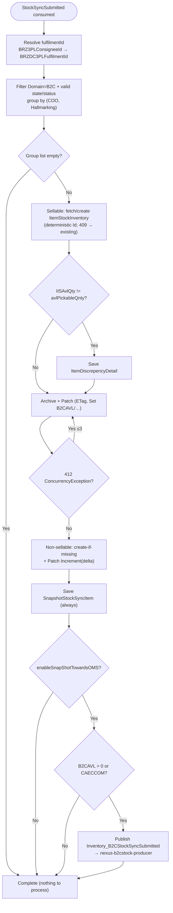

# inventory.StockSyncSubmitted - Technical Documentation

## 1. Overview

### Purpose
`inventory.StockSyncSubmitted` is a Kafka event that keeps the IIS WMS inventory
synchronized with real-time stock levels reported by 3PL fulfilment centers
(CAECCOM, BRZ3PL) and OMS. It reconciles reported quantities against current
inventory, records discrepancies, persists an audit snapshot of each sync, and
propagates a B2C stock snapshot to OMS via Nexus.

### Business Objective
- Maintain accurate inventory across fulfilment centers (CAECCOM, BRZ3PL).
- Separate sellable (B2C) from non-sellable (extended-state) inventory.
- **Detect and record stock discrepancies** between IIS and the source system.
- **Save an inventory snapshot** of every sync for audit and reconciliation.
- Publish a B2C stock snapshot to OMS for order-fulfilment decisions.

### Scope
- Consumes `inventory.StockSyncSubmitted` from Kafka, relays it to Azure Service
  Bus, and processes it on a session-enabled Service Bus consumer.
- Handles updates at the item / location / hallmark / country / state / status
  level for CA (Canada) and BR (Brazil) markets.
- Manages state/status combinations: AVAILABLE→PREPARED, AVAILABLE→PICKABLE,
  INSPECTION→PICKABLE, AVAILABLETOSELL→PICKABLE, AVAILABLE→HELD.
- Persists inventory to Cosmos DB via ETag-guarded **Patch** operations.
- Publishes the B2C stock snapshot to the `nexus-b2cstock-producer` queue.

### High-Level Architecture

Matches the platform data flow in
[integration-resiliency.instructions.md](../ai/integration-resiliency.instructions.md):
a Kafka-to-Service-Bus relay hosted service, then a session-enabled Service Bus
consumer that calls the Application layer, which persists through the Cosmos DB
repository and archives through Blob Storage.

```
Kafka topic `inventory-events` (Type header: StockSyncSubmitted)
                    ↓
   KafkaConsumerHostedServiceBase
     - correlation id / dedup id / type headers read + logged
     - schema + dynamic validation
     - cold-tier request audit (unconditional)
                    ↓
   Azure Service Bus queue `stock-sync-submitted`
   (session-enabled: SessionId = {FulfilmentId}:{ItemCode};
    deterministic message ID from the Kafka key — never a fresh GUID)
                    ↓
   StockSyncSubmittedServiceBusHostedService
       (ServiceBusConsumerHostedService<StockSyncSubmittedEvent>)
     - envelope + payload deserialize, dynamic validation, cold-tier audit
                    ↓
          IStockSyncSubmittedHandler.HandleAsync
                    ↓
    ┌───────────────────┬───────────────────┬──────────────────┐
    ↓                   ↓                   ↓                  ↓
Sellable (B2C)     Non-Sellable        Discrepancy        OMS Snapshot
segmentation       (extended state)    detection          (B2C stock)
    ↓                   ↓                   ↓                  ↓
IItemStockInventoryService → Cosmos DB (ETag-guarded Patch, re-read-and-reapply
on 412) + snapshot save + MessageArchive (Cosmos, optional Blob cold-tier mirror)
                    ↓
        nexus-b2cstock-producer queue (Service Bus) via cached ServiceBusSender
```

Business logic never touches `CosmosClient`/`Container`/`ServiceBusSender`
directly — it goes through `IItemStockInventoryService` → the Cosmos repository
and through the application-layer publish abstraction (see
[shared/service-bus-publishing.md](shared/service-bus-publishing.md)).

### Key Dependencies
- **`ItemStockInventoryRepository`** — core inventory (Cosmos, multi-container
  per fulfilment code incl. CAECOM/BRZ3PL, ETag-guarded; cosmos §5a/§9).
- **`ItemStockInventoryExtendedRepository`** — non-sellable/extended-state
  tracking (Cosmos).
- **`SnapshotStockSyncItemRepository`** — inventory-sync snapshot persistence.
- **`ItemDiscrepencyDetailRepository`** — discrepancy logging (Cosmos).
- **`ItemRepository`** — item master data (auto-create missing items).
- **`MessageArchiveRepository`** — before/after archival (Cosmos + optional Blob).
- **`CountryRepository`** — market/country resolution (Cosmos, read-only).
- **Cached `ServiceBusSender`** — outbound B2C stock snapshot to Nexus.
- Shared helpers: [b2c-extension-calculation](shared/b2c-extension-calculation.md),
  [inventory-formulas](shared/inventory-formulas.md),
  [icr-snapshot](shared/icr-snapshot.md),
  [country-code-lookup](shared/country-code-lookup.md),
  [archive-audit](shared/archive-audit.md),
  [cosmos-idempotent-write](shared/cosmos-idempotent-write.md),
  [service-bus-publishing](shared/service-bus-publishing.md).

### Assumptions
1. Incoming messages are valid `inventory.StockSyncSubmitted` objects deserialized
   to `StockSyncSubmittedEvent`.
2. `BRZ3PLConsigneeId` maps internally to `BRZDC3PLFulfilmentId`.
3. Items may be missing from IIS master data; missing items are auto-created.
4. Inventory is unique by (ItemCode, Hallmark, FulfilmentCode, CountryOfOrigin,
   State, Status).
5. Negative quantities are normalized to `0` per
   [inventory-formulas](shared/inventory-formulas.md) (never negative in final
   state).
6. Snapshots are saved regardless of whether the inventory quantity changed.
7. **Processing is idempotent** — a deterministic document `Id` plus ETag-guarded
   Patch make redelivery a no-op, not a duplicate/double-count (see
   [cosmos-idempotent-write](shared/cosmos-idempotent-write.md)).

---

## 2. End-to-End Flow

```
1. MESSAGE RECEPTION (Kafka consumer)
   ├─ StockSyncSubmitted deserialized → StockSyncSubmittedEvent
   │    ProductId, Location {Id,Name,Entity}, QuantityDetails[],
   │    SyncDate, CountryOfOrigin, Hallmarking
   ├─ correlation/dedup/type headers logged; schema + dynamic validation
   ├─ cold-tier request audit (unconditional)
   └─ relay to Service Bus queue `stock-sync-submitted`
        · SessionId = {FulfilmentId}:{ItemCode}
        · deterministic message ID from Kafka key (never a fresh GUID)

2. SERVICE BUS CONSUMPTION
   ├─ envelope + payload deserialize, dynamic validation, cold-tier audit
   └─ IStockSyncSubmittedHandler.HandleAsync(StockSyncSubmittedEvent)

3. FULFILMENT RESOLUTION & FILTERING
   ├─ fulfilmentId = (Location.Id == BRZ3PLConsigneeId) ? BRZDC3PLFulfilmentId
   │                                                    : Location.Id
   ├─ filter QuantityDetails to Domain == B2C and the valid state/status set
   └─ group by (CountryOfOrigin, Hallmarking); one pass per group

   4. SELLABLE INVENTORY (AVAILABLE→PICKABLE / AVAILABLE→PREPARED)
      ├─ extract avlPickableQnty, b2BPreparedQty, b2CAvailableToSell (BR only);
      │  normalize negatives to 0 (inventory-formulas.md)
      ├─ fetch/create ItemStockInventory (deterministic Id; 409 → existing)
      ├─ DISCREPANCY DETECTION: IISAvlQty (B2CAVL) != avlPickableQnty
      │     → SaveItemDiscrepencyDetailAsync (IIS vs reported)
      ├─ archive before/after (archive-audit.md)
      └─ PERSIST via ETag-guarded Patch (Set B2CAVL/B2CPrepared/B2CAvailableToSell),
         412 → ConcurrencyException → §2 re-read/reapply loop (≤3)

   4b. NON-SELLABLE / EXTENDED STATE (AVAILABLE→HELD, INSPECTION→PICKABLE)
      ├─ per item: fetch/create ItemStockInventoryExtended
      ├─ create-if-missing (409-as-applied) then Patch Increment(delta)
      ├─ archive before/after
      └─ on per-item failure: log + continue (line skipped, message not failed)

   4c. SNAPSHOT SAVE (always)
      └─ SaveSnapshotDetails: SnapshotStockSyncItem per state/status
         QuantityType = "{Domain}.{State}_{Status}" (e.g. B2C.PICKABLE)

   5. OMS SNAPSHOT (enableSnapShotTowardsOMS) — icr-snapshot.md + service-bus-publishing.md
      ├─ enableSnapShotTowardsOMS = !(fulfilmentId == BRZDC3PLFulfilmentId
      │                                AND !ENABLE_SNAPSHOT_TOWARDS_OMS_BRZ3PL)
      ├─ market = (fulfilmentId == BRZDC3PLFulfilmentId) ? BR : CA (country-code-lookup.md)
      ├─ validate B2CAVL > 0 OR Location.Id == CAECCOM (exemption)
      └─ publish Inventory_B2CStockSyncSubmitted → nexus-b2cstock-producer

6. OUTCOME
   └─ no exception → Completed; ConcurrencyException/OperationCanceled → Abandoned;
      any other → DeadLettered (see cosmos-idempotent-write.md)
```

### Data Flow Through Layers
`Kafka → KafkaConsumerHostedServiceBase → Service Bus (stock-sync-submitted) →
ServiceBusConsumerHostedService → IStockSyncSubmittedHandler → helpers →
IItemStockInventoryService → Cosmos repository (Patch/ETag) + snapshot + archive →
ServiceBusSender (nexus-b2cstock-producer)`.

### Input Validation

| Field | Rule | Handling |
|---|---|---|
| payload | not null / schema-valid | poison → DeadLettered |
| `ProductId` | non-empty string | checked in master data; auto-created if missing |
| `Location.Id` | resolvable fulfilment id | maps BRZ3PLConsigneeId → BRZDC3PLFulfilmentId |
| `QuantityDetails` | array (may be empty) | filtered by Domain=B2C + valid state/status; empty → skip |
| `Quantity` | integer | negative normalized to 0 (inventory-formulas.md) |
| `State`/`Status` | valid enum | reject invalid at deserialize |

---

## 3. Detailed Business Logic

### 3.1 Fulfilment Resolution & State/Status Filtering
Only `Domain == B2C` details in the valid state/status set are processed; B2B and
unknown combinations are skipped silently.

- **Sellable set:** `(AVAILABLE,PREPARED)`, `(AVAILABLE,PICKABLE)`,
  `(INSPECTION,PICKABLE)`, `(AVAILABLETOSELL,PICKABLE)`.
- **Non-sellable/extended set:** `(AVAILABLE,HELD)`, `(INSPECTION,PICKABLE)`.
- `fulfilmentId` = `BRZDC3PLFulfilmentId` when `Location.Id == BRZ3PLConsigneeId`,
  else `Location.Id`. Grouping is by `(CountryOfOrigin, Hallmarking)`.

### 3.2 Sellable Inventory & Discrepancy Detection *(unique to this event)*
For each group, extract per-status quantities (Calculation 4.2), fetch/create the
`ItemStockInventory` aggregate, then:

- **Discrepancy check:** `IISAvlQty (current B2CAVL) != avlPickableQnty`.
  When they differ, write an `ItemDiscrepencyDetail` record (IIS vs reported,
  with `MasterDataExists`) — this is the operational signal for stock loss / sync
  failure and is **logged but never fatal**.
- **Persist:** archive before/after, then Patch `Set` of `B2CAVL`,
  `B2CPrepared`, and (BR only) `B2CAvailableToSell` under `IfMatchEtag`. Quantity
  fields are never last-write-wins; concurrency is handled by the §2 loop
  ([cosmos-idempotent-write.md](shared/cosmos-idempotent-write.md)).

### 3.3 Non-Sellable / Extended-State Inventory
HELD and INSPECTION→PICKABLE quantities are tracked per state/status in
`ItemStockInventoryExtended`:
- **Create-if-missing** (deterministic Id, 409-as-applied) then Patch
  `Increment(delta)` where `delta = newQty − previousQty` (previous = 0 when new).
- Master data validated; a missing item is auto-created with a warning.
- A per-item failure is logged and processing continues with the next item — one
  bad line does not fail the whole message.

### 3.4 Inventory Snapshot Save *(unique to this event)*
Every processed state/status yields a `SnapshotStockSyncItem` record via
`SaveSnapshotDetails`, saved **regardless of whether the quantity changed**.
`QuantityType` is `"{Domain}.{State}_{Status}"` (e.g. `B2C.PICKABLE`,
`B2C.PREPARED`, `OMNI.INSPECTION_PICKABLE`). Snapshots are the reconciliation
trail feeding ICR.

### 3.5 OMS B2C Stock Snapshot
See [icr-snapshot.md](shared/icr-snapshot.md) for the snapshot builder and
[service-bus-publishing.md](shared/service-bus-publishing.md) for the publish
mechanism. Event-specific rules:
- **Feature gate:** `enableSnapShotTowardsOMS = false` only when
  `fulfilmentId == BRZDC3PLFulfilmentId AND !ENABLE_SNAPSHOT_TOWARDS_OMS_BRZ3PL`;
  otherwise `true`. CAECCOM always publishes.
- **Market:** `BRZDC3PLFulfilmentId → BR`, else `CA`
  ([country-code-lookup.md](shared/country-code-lookup.md)).
- **Availability gate:** publish only when `B2CAVL > 0` **or**
  `Location.Id == CAECCOM` (exemption); otherwise skip silently.
- **Location round-trip:** the reported `Location.Id` is reverse-mapped
  `BRZDC3PLFulfilmentId → BRZ3PLConsigneeId` in the outgoing report.
- Publishes `Inventory_B2CStockSyncSubmitted` to `nexus-b2cstock-producer` via the
  cached `ServiceBusSender`, **after** the Cosmos write is durably committed.

---

## 4. Calculation Logic

All quantity math is centralized in
[inventory-formulas.md](shared/inventory-formulas.md) and
[b2c-extension-calculation.md](shared/b2c-extension-calculation.md).

### 4.1 Quantity Delta (extended state)
`delta = NewQuantity − PreviousQuantity` (PreviousQuantity = 0 when new). Applied
via `PatchOperation.Increment`, never read-modify-write-replace.

| Reported | Previous | Delta | Meaning |
|---|---|---|---|
| 100 | 0 (new) | +100 | 100 units created |
| 150 | 100 | +50 | increase of 50 |
| 75 | 100 | −25 | decrease of 25 |
| −50 → **0** (normalized) | 100 | −100 | zeroed (negative normalized first) |

### 4.2 Per-Status Quantity Extraction
```
avlPickableQnty   = StateLevelQtyList.Where(Status == PICKABLE).Select(Quantity).FirstOrDefault()
b2BPreparedQty    = StateLevelQtyList.Where(Status == PREPARED).Select(Quantity).FirstOrDefault()
b2CAvailableToSell = (BR only) Where(State == AVAILABLETOSELL).Select(Quantity).FirstOrDefault()
```
`FirstOrDefault()` on no match yields `0`. All values pass negative normalization
(`Quantity < 0 ? 0 : Quantity`) before use.

**Worked example (BRZ with AvailableToSell):** input
`[{PICKABLE:75}]`, `B2CAvailableToSell = 25` →
`avlPickableQnty = 75`, `b2BPreparedQty = 0`, `b2CAvailableToSell = 25`.

### 4.3 Negative Quantity Normalization
`normalizedQty = Quantity < 0 ? 0 : Quantity`, applied universally to every
extracted quantity before comparison, discrepancy detection, and storage. No
business exemptions; inventory never goes negative.

---

## 5. Database Documentation

All Cosmos access follows [cosmos-db.instructions.md](../ai/cosmos-db.instructions.md)
and [cosmos-idempotent-write.md](shared/cosmos-idempotent-write.md).

### 5.1 ItemStockInventory (Cosmos, multi-container per fulfilment code)
- **Partition key** `Category` = composite
  `FulfilmentId:ItemCode:Hallmark:CountryOfOrigin`.
- **Read:** `GetAsync(id, category)` — point read within one partition.
- **Create (first write):** deterministic `Id`; `409 Conflict` → return existing
  (redelivery no-op).
- **Update:** **`PatchAsync`** with `IfMatchEtag`, `PatchOperation.Set` for
  `B2CAVL`, `B2CPrepared`, `B2CAvailableToSell` (BR) and `ModifiedUtc`, **≤10 ops**.
  `412` → `ConcurrencyException` → §2 re-read/reapply loop (max 3).
- **No last-write-wins** on any quantity field.

### 5.2 ItemStockInventoryExtended (Cosmos)
Composite key incl. State/Status. Create-if-missing then Patch
`Increment(delta)` for HELD / INSPECTION→PICKABLE quantities.

### 5.3 SnapshotStockSyncItem (Cosmos, write-only)
One record per processed state/status via `SaveSnapshotDetails`: `ItemCode`,
`CountryOfOriginCode`, `FulfilmentUnit`, `Hallmark`, `Quantity`, `QuantityType`
(`"{Domain}.{State}_{Status}"`). Saved whether or not the quantity changed.

### 5.4 ItemDiscrepencyDetail (Cosmos, write-only)
Written when `IISAvlQty != avlPickableQnty`: `ItemCode`, `CountryOfOrigin`,
`Hallmark`, `IISAvlQty` (pre-update B2CAVL), `ReflexAvlQty` (reported),
`MasterDataExists`, `FulfilmentCode`.

### 5.5 Archive
Before/after snapshots via [archive-audit.md](shared/archive-audit.md)
(best-effort; failure does not fail the message).

### 5.6 Transaction Flow & Concurrency
Cosmos has no multi-document transactions here; correctness comes from
per-document ETag Patch + the §2 retry loop, not distributed transactions. A
redelivered message re-reads current state and reapplies deterministically — it
does not double-count.

---

## 6. State Changes & State Machine

```
StockSyncSubmittedEvent
   ↓  resolve fulfilmentId (BRZ3PLConsigneeId → BRZDC3PLFulfilmentId)
   ↓  filter Domain=B2C + valid state/status; group by (COO, Hallmark)
For each group:
   ├─ SELLABLE: fetch/create ItemStockInventory (deterministic Id; 409 → existing)
   │     ↓  discrepancy? (IISAvlQty != avlPickableQnty) → ItemDiscrepencyDetail
   │     ↓  archive previous
   │     Patch (ETag, Set B2CAVL/…)  ── 412 ─▶ re-read + reapply (≤3)
   │     ↓  archive new
   ├─ NON-SELLABLE: create-if-missing + Patch Increment(delta) per state/status
   └─ SNAPSHOT: SnapshotStockSyncItem saved (always)
   ↓
OMS snapshot: gate + availability check → publish B2CStockSyncSubmitted
              (nexus-b2cstock-producer) after durable commit
   ↓
Final: inventory updated exactly once; snapshot + discrepancy recorded
```



**Critical invariants:** no quantity goes negative; extended state never
decremented below zero; a redelivered message produces no additional mutation;
snapshot and discrepancy records are audit-only side effects.

---

## 7. API Documentation

### Kafka message contract
Topic `inventory-events`, `Type` header `StockSyncSubmitted`, mapped to
`StockSyncSubmittedEvent`:

```json
{
  "productId": "SKU-12345",
  "location": { "id": "CAECCOM", "name": "CA E-Commerce Fulfillment", "entity": "IIS" },
  "quantityDetails": [
    { "domain": "B2C", "state": { "state": "AVAILABLE", "status": "PICKABLE" },
      "quantity": 150, "countryOfOrigin": "IN", "hallmarking": "HALLMARK-001" },
    { "domain": "B2C", "state": { "state": "AVAILABLE", "status": "HELD" },
      "quantity": 10, "countryOfOrigin": "IN", "hallmarking": "HALLMARK-001" }
  ],
  "syncDate": "2026-07-30T14:30:00Z",
  "entity": "IIS"
}
```

### Service Bus message contract
Queue `stock-sync-submitted`, `ServiceBusRelayEnvelope` wrapping the event;
`SessionId = {FulfilmentId}:{ItemCode}`; deterministic `MessageId`; correlation
headers per [service-bus-publishing.md](shared/service-bus-publishing.md).

### Outbound contract
Queue `nexus-b2cstock-producer` (old `NEXUS_B2CSTOCK_PRODUCER_QUEUE_NAME`),
`Inventory_B2CStockSyncSubmitted` — the B2C stock snapshot (ProductId,
reverse-mapped Location, Market CA/BR, QuantityDetails with B2CAVL as PICKABLE).

### Validation

| Field | Rule | Handling |
|---|---|---|
| `productId` | non-empty string | auto-create item in master if missing (warn) |
| `location.id` | resolvable | maps BRZ3PLConsigneeId → BRZDC3PLFulfilmentId |
| `quantityDetails` | array (may be empty) | empty filtered result → skip, complete |
| `quantity` | integer | negative normalized to 0 |
| `state.state` / `state.status` | valid enum | invalid → DeadLettered at deserialize |

### Sample request 2 — BRZ3PL update
```json
{
  "productId": "SKU-12345",
  "location": { "id": "BRZ3PLConsigneeId", "name": "Brazil 3PL", "entity": "IIS" },
  "quantityDetails": [
    { "domain": "B2C", "state": { "state": "AVAILABLE", "status": "PICKABLE" },
      "quantity": 200, "countryOfOrigin": "IN", "hallmarking": "HALLMARK-001" }
  ],
  "syncDate": "2026-07-30T14:40:00Z",
  "entity": "IIS"
}
```
Behaviour: location mapped to `BRZDC3PLFulfilmentId`; inventory Patched to
`B2CAVL = 200`; snapshot saved; OMS notified when
`ENABLE_SNAPSHOT_TOWARDS_OMS_BRZ3PL` is enabled (market = BR).

---

## 8. Error Handling & Retry Mechanisms

The old retry-with-orchestration is replaced by three mechanisms working
together: **Service Bus `MaxDeliveryCount` redelivery**, the **Cosmos §2
re-read/reapply loop**, and the **Polly `service-bus-publish` pipeline** for
outbound sends.

- **Validation / poison payload** → DeadLettered (hot-tier dead-letter container).
- **Cosmos 412 (ETag)** → `ConcurrencyException` → §2 re-read/reapply loop (≤3);
  if exhausted → Abandoned (redelivered up to `MaxDeliveryCount`).
- **Cosmos 429** → Cosmos SDK retry (`MaxRetryAttemptsOnRateLimitedRequests`).
- **Service Bus publish transient** → `service-bus-publish` Polly pipeline
  (retry on transient `ServiceBusException`, exponential backoff + jitter).
- **Non-sellable per-item failure** → logged; that line is skipped without
  failing the whole message.
- **`OperationCanceledException`** → Abandoned.
- **Any other exception** → DeadLettered (`Reason` = type, `Description` =
  `ex.ToString()`).

Discrepancy detection and archival are best-effort side effects: a discrepancy or
archive write failure is logged but does not by itself fail the message. Outcome
mapping is the definitive table in
[cosmos-idempotent-write.md](shared/cosmos-idempotent-write.md):

| Result | Service Bus action |
|---|---|
| No exception | Completed |
| `ConcurrencyException` | Abandoned (retried to `MaxDeliveryCount`) |
| `OperationCanceledException` | Abandoned |
| Any other exception | DeadLettered |

---

## 9. Security & Configuration

### Authentication
- Cosmos DB and Service Bus use **connection strings** sourced from Azure Key
  Vault and delivered as a **Kubernetes Secret**; local dev uses the emulator /
  user-secrets. This is the deliberate documented standard (cosmos §1/§14,
  engineering-standards §6) — **not** Managed Identity / Workload Identity.

### Feature flags
| Flag | Default | Purpose |
|---|---|---|
| ENABLE_SNAPSHOT_TOWARDS_OMS_BRZ3PL | false | OMS B2C snapshot for BRZ3PL (CAECCOM always publishes) |

### Queue names (kebab-case, config-resolved)
| Queue | Old constant | Direction |
|---|---|---|
| `stock-sync-submitted` | STOCK_SYNC_SUBMITTED_REFLEX_QUEUE_NAME | inbound (relay) |
| `nexus-b2cstock-producer` | NEXUS_B2CSTOCK_PRODUCER_QUEUE_NAME | outbound |

### Other configuration
- `PRODUCT_UNITS` — product-unit label carried in the OMS report.

### Data protection
TLS in transit; encryption at rest; no secrets/keys logged. Archived payloads
carry business data only.

---

## 10. Known Limitations & Future Improvements

### Current Limitations
- Integer quantities only (no fractional units).
- Country/market and (future) segmentation lookups read per group; may be cached.
- Extended-state decrement with insufficient quantity is skipped with a warning
  rather than reconciled (no negative extended qty).
- Partial success across groups is possible; because sends occur only after the
  durable commit and message IDs are deterministic, a redelivery reconciles
  rather than double-applies.

### Potential Improvements
- Cache country codes / segmentation rules per process to cut Cosmos reads.
- Batch snapshot saves per message to reduce write count.
- Evaluate bounded parallel group processing, preserving per-aggregate ordering
  via the session.

> The previous version listed a standalone "Todos" section headed by
> "implement the OMS Nexus Producer send (currently stubbed)" and "add
> idempotency to prevent duplicate processing / concurrent-update loss". **Both
> are now resolved by design and folded into the implemented flow:** the OMS B2C
> stock snapshot is an implemented publish through the cached `ServiceBusSender`
> to `nexus-b2cstock-producer` (§3.5, §9), and redelivery/concurrency are handled
> by deterministic Id + ETag Patch + the §2 loop (§5) — this is the fix for the
> duplicate-entry / doubled-quantity problem, replacing the old last-write-wins
> behaviour. Remaining TODOs (structured logging, discrepancy-rate alerting,
> caching, broader unit tests) are tracked as improvements above, not as gaps in
> the core mechanism.

---

## 11. Summary

`inventory.StockSyncSubmitted` synchronizes IIS inventory with 3PL/OMS-reported
stock on the AKS pipeline: it consumes from Kafka, relays to the
`stock-sync-submitted` Service Bus queue, reconciles sellable and non-sellable
inventory per (CountryOfOrigin, Hallmarking) group, and publishes a B2C stock
snapshot to `nexus-b2cstock-producer`.

**Key business logic:** BRZ3PLConsigneeId → BRZDC3PLFulfilmentId mapping;
Domain=B2C state/status filtering; **stock discrepancy detection** (IIS vs
reported → `ItemDiscrepencyDetail`); **inventory snapshot save on every sync**;
negative-quantity normalization; OMS snapshot gated by feature flag +
availability, with CAECCOM exemption.

**Database updates:** ETag-guarded **Patch** (`Set` on `ItemStockInventory`,
`Increment` on `ItemStockInventoryExtended`, ≤10 ops) with deterministic Id +
409-as-applied and the §2 412 re-read/reapply loop — the fix for the
duplicate-entry / doubled-quantity problem; snapshots and discrepancy records are
audit-only side effects.

**Risks & recommendations:** concurrency conflicts should be rare once sessions
are in place; monitor dead-letter counts, Cosmos 429 rates, and discrepancy rate;
cache rarely-changing lookups.

---

**Document Version:** 2.0 (AKS / k8s)
**Status:** Regenerated
